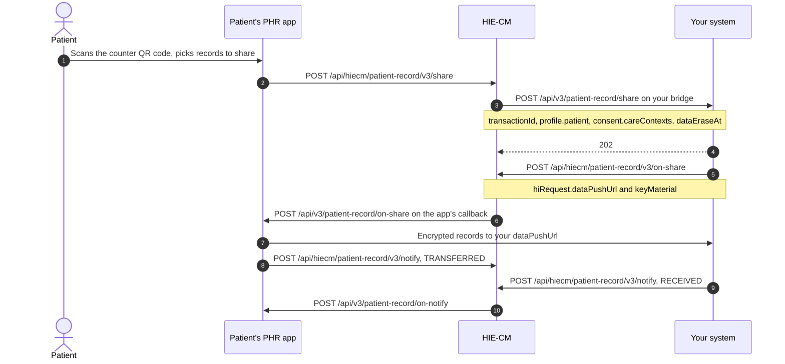

# Patient record share

Receive health records that a patient chooses to push to you from their [PHR](/docs/pr-20/docs/hiecm/v3/getting-started/glossary#phr) app. This use case belongs to [M3 Health Information User](/docs/pr-20/docs/hiecm/v3/milestones/m3): your system is the [HIU](/docs/pr-20/docs/hiecm/v3/getting-started/glossary#hiu), but the patient starts the share, so there is no consent request and no consent artefact.

Your facility prints a QR code at each counter. It carries your HIU id and a counter id. The patient scans it in their PHR app, picks the care contexts to share, and the [HIE-CM](/docs/pr-20/docs/hiecm/v3/getting-started/glossary#hie-cm) tells your bridge a share is coming. You answer with a data push URL and an encryption key, the records arrive on that URL, and both sides report what was delivered.

## In short

- The patient starts it. You never raise a consent request.
- Two callbacks land on your bridge: the share, then the transfer status.
- You reply once, with a data push URL and an ECDH key, the same key material M3 uses for a consented fetch.
- Records arrive encrypted on your data push URL. Decrypt, store, then notify.
- `consent.dataEraseAt` is the date the patient set. Erase the records by then.

## The calls

Every call carries `REQUEST-ID`, `TIMESTAMP`, the gateway `Authorization` token, `X-CM-ID` and `X-HIU-ID`. The base URL is `https://dev.abdm.gov.in` in sandbox and `https://apis.abdm.gov.in` in production.

| Step     | Who calls                     | Path                                             | Carries                                                                                           |
| -------- | ----------------------------- | ------------------------------------------------ | ------------------------------------------------------------------------------------------------- |
| 1        | PHR app to HIE-CM             | `POST /api/hiecm/patient-record/v3/share`        | `metaData.hiuId`, `metaData.counterId`, `profile.patient`, `sharedRecordCount`, `consent`         |
| 2        | HIE-CM to your bridge         | `POST /api/v3/patient-record/share`              | The same body plus `transactionId`                                                                |
| 3        | You to HIE-CM                 | `POST /api/hiecm/patient-record/v3/on-share`     | `hiRequest.transactionId`, `hiRequest.dataPushUrl`, `hiRequest.keyMaterial`, `response.requestId` |
| 4        | PHR app to your `dataPushUrl` | `POST`                                           | The encrypted records                                                                             |
| 5        | Both sides to HIE-CM          | `POST /api/hiecm/patient-record/v3/notify`       | `notification.transactionId`, `sessionStatus`, one `hiStatus` per care context                    |
| 6        | HIE-CM to both callbacks      | `POST /api/v3/patient-record/on-notify`          | The other side's status                                                                           |
| Any time | PHR app to HIE-CM             | `GET /api/hiecm/patient-record/v3/audit-history` | Every share for the signed-in address, with `limit`, `offset`, `startDate` and `endDate`          |

Step 2 is a callback on the URL registered for your bridge, not a call you make. Answer it with a 202 at once, then send step 3. The `response.requestId` in step 3 is the `REQUEST-ID` header you received in step 2.

`keyMaterial` is ECDH on curve25519, with your ephemeral public key, its expiry and a nonce. It is the same shape M3 sends in a health information request, so reuse that code. The key exchange is explained under [ECDH](/docs/pr-20/docs/hiecm/v3/getting-started/glossary#ecdh).

## What each status means

The PHR app reports the send, and you report the receipt. Send your notify once, after the transfer is complete.

| Sender                   | `sessionStatus`                                | `hiStatus` per care context              |
| ------------------------ | ---------------------------------------------- | ---------------------------------------- |
| PHR app or health locker | `TRANSFERRED`, `PARTIAL_TRANSFERRED`, `FAILED` | `DELIVERED`, `ERRORED`                   |
| You, the HIU             | `RECEIVED`, `PARTIAL_RECEIVED`, `FAILED`       | `VALID`, `CORRUPTED`, `BLANK`, `ERRORED` |

Report `FAILED` when nothing arrived or what arrived did not decrypt.

## What you see when it works

Your bridge receives step 2 with a `transactionId`, your step 3 returns 202, records arrive on your `dataPushUrl`, and step 6 brings the app's `TRANSFERRED` status against the same `transactionId`.

## When it goes wrong

- No records after step 3: check that `dataPushUrl` is reachable from the internet and that `keyMaterial.dhPublicKey.expiry` is in the future.
- Records that do not decrypt: report `CORRUPTED` for that care context in step 5, so the patient sees it in their app.
- The share arrives for a counter you do not know: `metaData.counterId` is the value printed in your QR code. Reject with `FAILED` rather than guess.

The request and response bodies, with every field, are on the [Patient scan and record share API reference](/docs/pr-20/docs/hiecm/v3/api/record-share). NHA has published no swagger for these calls: the reference is built from the API document and Postman collection NHA issued, and no call has been run against sandbox.

## Next

- The milestone this belongs to: [M3 Health Information User](/docs/pr-20/docs/hiecm/v3/milestones/m3).
- The profile-only version of the same scan: [Scan and Register](/docs/pr-20/docs/hiecm/v3/use-cases/scan-and-register).
- The patient's side of the share: [P3 Consent and records](/docs/pr-20/docs/hiecm/v3/milestones/p3).
