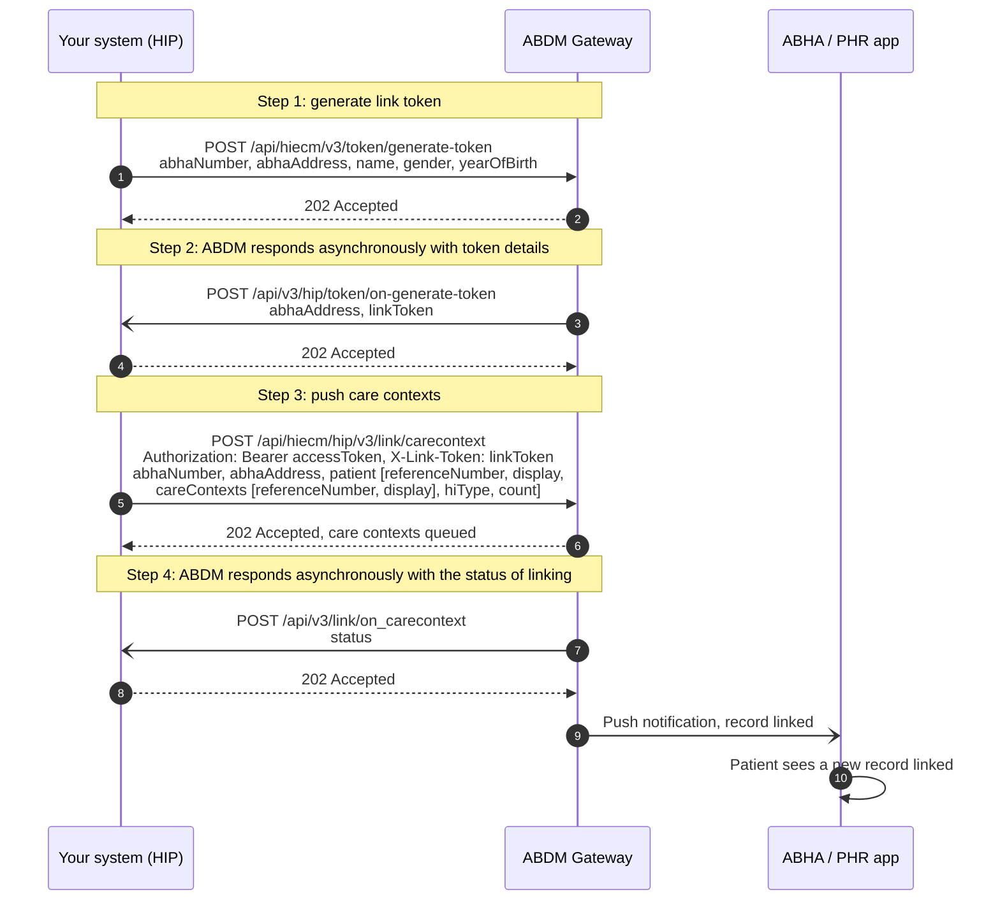
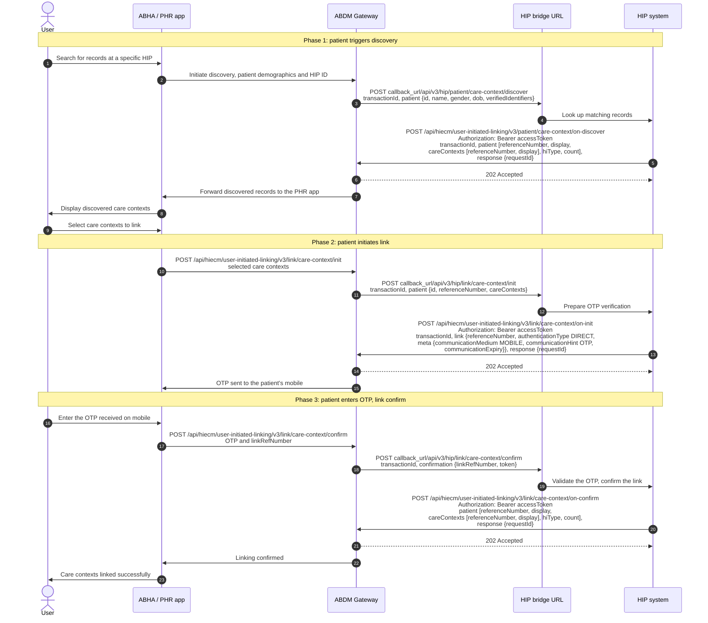
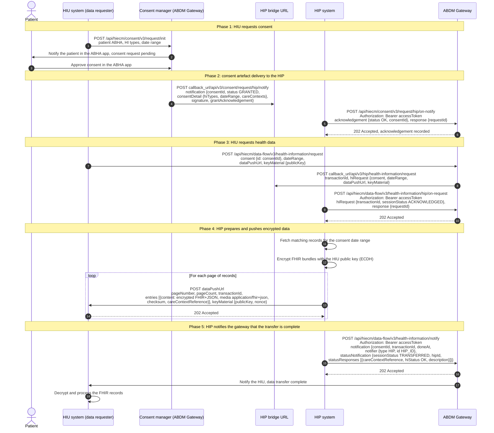

# M2 Health Information Provider: Create and link records

Milestone 2 enables a [Health Information Provider](/docs/pr-29/docs/hiecm/v3/getting-started/glossary#hip) (HIP) to create digital health records and link them with a patient's [ABHA Address](/docs/pr-29/docs/hiecm/v3/getting-started/glossary#abha-address), facilitate record [discovery](/docs/pr-29/docs/hiecm/v3/getting-started/glossary#discovery) through a Personal Health Record ([PHR](/docs/pr-29/docs/hiecm/v3/getting-started/glossary#phr)) application, and securely share encrypted health information across the ABDM ecosystem.

## In short

Health Information Provider (HIP) links a patient's health records with the patient's ABHA Address and makes such records available within the ABDM ecosystem. The linkage of records may be carried out through either HIP-Initiated Linking or User-Initiated Linking.

## M2 functionalities

**Care Context:** A [Care Context](/docs/pr-29/docs/hiecm/v3/concepts/care-context) represents a patient's visit to a healthcare facility and contains the health records generated during that visit. The healthcare facility links the Care Context with the patient's ABHA Address.

The records may be linked through either HIP-Initiated Linking or User-Initiated Linking.

**HIP-Initiated Linking:** In this workflow, an ABDM-enabled healthcare facility generates a link token to authenticate the patient and links the care contexts with the patient's ABHA Address. The linked care contexts are subsequently made available in the patient's [PHR application](/docs/pr-29/docs/hiecm/v3/concepts/participants/phr).

**User-Initiated Linking:** This flow allows a patient to find and link health records created earlier without an ABHA Address. The records are stored in the [HMIS](/docs/pr-29/docs/hiecm/v3/getting-started/glossary#hmis) using the patient's registered details. When the patient selects the fetch option in the [PHR application](/docs/pr-29/docs/hiecm/v3/concepts/participants/phr), the healthcare facility matches the respective demographic details and shows the available records for linking with the patient's ABHA Address.

**Data Transfer:** In this flow, each health record is converted into the prescribed [FHIR](/docs/pr-29/docs/hiecm/v3/getting-started/glossary#fhir) format, packaged as a FHIR bundle, encrypted, and securely transmitted through the ABDM ecosystem.

## Prerequisites

Before implementing Milestone 2 (M2), ensure that the following prerequisites are fulfilled:

1. The healthcare facility must be registered in the Health Facility Registry ([HFR](/docs/pr-29/docs/hiecm/v3/getting-started/glossary#hfr)) and have a valid HFR ID (facility ID).
2. The HIP ID (Facility ID) must be linked to the corresponding Client ID to receive callbacks through the NHPR Portal or [M4](/docs/pr-29/docs/hiecm/v3/milestones/m4) APIs using software linkage.
3. A valid callback URL must be configured for the Client ID using the [Update Bridge API](/docs/pr-29/docs/hiecm/v3/api/gateway/endpoints/gateway-abdm-gateway/03-gateway-patch-gateway-v3-bridge-url).

## FHIR-based health records

In the ABDM ecosystem, every health record is created and shared in a standardized format called FHIR (Fast Healthcare Interoperability Resources) to enable secure and interoperable exchange of health information.

FHIR is a globally recognized standard for structuring and exchanging digital health records.

FHIR Implementation Guide (ABDM): [nrces.in/ndhm/fhir/r4](https://nrces.in/ndhm/fhir/r4/index.html)

### Health information types

ABDM has defined 08 Health Information (HI) Types, comprising 07 Clinical and 01 Billing artefact.

| Name                                                                                                    | Definition                                                                                                                                                                                                                                                                                          |
| ------------------------------------------------------------------------------------------------------- | --------------------------------------------------------------------------------------------------------------------------------------------------------------------------------------------------------------------------------------------------------------------------------------------------- |
| [DiagnosticReportRecord](https://nrces.in/ndhm/fhir/r4/StructureDefinition-DiagnosticReportRecord.html) | The Clinical Artifact represents diagnostic reports including Radiology and Laboratory reports that can be shared across the health ecosystem.                                                                                                                                                      |
| [DischargeSummaryRecord](https://nrces.in/ndhm/fhir/r4/StructureDefinition-DischargeSummaryRecord.html) | Clinical document used to represent the discharge summary record for ABDM HDE data set.                                                                                                                                                                                                             |
| [HealthDocumentRecord](https://nrces.in/ndhm/fhir/r4/StructureDefinition-HealthDocumentRecord.html)     | The Clinical Artifact represents the unstructured historical health records as a single of multiple Health Record Documents generally uploaded by the patients through the Health Locker and can be shared across the health ecosystem.                                                             |
| [ImmunizationRecord](https://nrces.in/ndhm/fhir/r4/StructureDefinition-ImmunizationRecord.html)         | The Clinical Artifact represents the Immunization records with any additional documents such as vaccine certificate, the next immunization recommendations, etc. This can be further shared across the health ecosystem.                                                                            |
| [OPConsultRecord](https://nrces.in/ndhm/fhir/r4/StructureDefinition-OPConsultRecord.html)               | The Clinical Artifact represents the outpatient visit consultation note which may include clinical information on any OP examinations, procedures along with medication administered, and advice that can be shared across the health ecosystem.                                                    |
| [PrescriptionRecord](https://nrces.in/ndhm/fhir/r4/StructureDefinition-PrescriptionRecord.html)         | The Clinical Artifact represents the medication advice to the patient in compliance with the Pharmacy Council of India (PCI) guidelines, which can be shared across the health ecosystem.                                                                                                           |
| [WellnessRecord](https://nrces.in/ndhm/fhir/r4/StructureDefinition-WellnessRecord.html)                 | The Clinical Artifact represents regular wellness information of patients typically through the Patient Health Record (PHR) application covering clinical information such as vitals, physical examination, general wellness, women wellness, etc., that can be shared across the health ecosystem. |
| [InvoiceRecord](https://nrces.in/ndhm/fhir/r4/StructureDefinition-InvoiceRecord.html)                   | The billing artifact represents the invoice details such as pharmacy invoice, consultation invoice etc. along with the support for scanned documents attached for the patient which can be shared across the health ecosystem.                                                                      |

**Note:** Each applicable Health Information Type is represented as a FHIR Document Bundle in accordance with ABDM standards.

## Build M2 with an AI coding assistant

The M2 skill gives an AI coding assistant this milestone as one file: every M2 call and callback, its error codes and its test cases. Install it, or open it in your assistant in one click.

M2 agent skill

Every M2 call and callback, its error codes and its certification cases in one file: 31 operations, 120 codes, 46 cases.

[SKILL.md](/docs/pr-29/skills/abdm-m2/SKILL.md "The router. Use the command below to take the references with it.")

- ScaffoldThe loop that builds the module flow by flow against the sandbox, ending on an observed result rather than on a call returning 200.
- Design
- Integrate24 operations, with their hosts and headers.
- Debug120 error codes, each with what to do about it.

`mkdir -p .claude/skills/abdm-m2/references && curl -fsSL https://nha-in.github.io/docs/pr-29/skills/abdm-m2/SKILL.md -o .claude/skills/abdm-m2/SKILL.md && for f in scaffold design integrate debug; do curl -fsSL https://nha-in.github.io/docs/pr-29/skills/abdm-m2/references/$f.md -o .claude/skills/abdm-m2/references/$f.md; done`

[Open in Claude](claude://code/new?q=Install%20the%20ABDM%20M2%20agent%20skill%20into%20this%20project%2C%20then%20help%20me%20use%20it.%0A%0ARun%20this%3A%0Amkdir%20-p%20.claude%2Fskills%2Fabdm-m2%2Freferences%20%26%26%20curl%20-fsSL%20https%3A%2F%2Fnha-in.github.io%2Fdocs%2Fpr-29%2Fskills%2Fabdm-m2%2FSKILL.md%20-o%20.claude%2Fskills%2Fabdm-m2%2FSKILL.md%20%26%26%20for%20f%20in%20scaffold%20design%20integrate%20debug%3B%20do%20curl%20-fsSL%20https%3A%2F%2Fnha-in.github.io%2Fdocs%2Fpr-29%2Fskills%2Fabdm-m2%2Freferences%2F%24f.md%20-o%20.claude%2Fskills%2Fabdm-m2%2Freferences%2F%24f.md%3B%20done%0A%0AIf%20this%20session%20did%20not%20open%20in%20the%20repository%20I%20am%20integrating%20ABDM%20into%2C%20ask%20me%20for%20the%20path%20before%20you%20write%20anything.)

Drops the skill into this project. Claude loads it when a task matches.

How to use it

1. Run the command above in the repository you are integrating.
2. Ask your agent for the job in your own words. "Link a care context for this patient", "why am I getting ABDM-1000". The skill loads when the task matches it.
3. Check what it writes against these pages. The skill carries the facts, not the sandbox: nothing in it has been run against ABDM.
4. Open in Claude needs that app installed. It fills the composer and waits: nothing runs until you read it and press Enter.

## Workflow overview

This section explains the key Milestone 2 (M2) workflows using sequence diagrams. These diagrams provide a high-level view of how different systems interact before the detailed API specifications are discussed.

## Journey 1: HIP initiated linking

The HIP generates a linking token using the patient's ABHA address and demographic details for authentication. After successful verification, a linking token valid for 6 months is created, and the patient's care context is linked to the ABHA Address.

The steps, as drawn:

1. Your system calls `POST /api/hiecm/v3/token/generate-token` with the patient's ABHA number or ABHA address, name, gender and year of birth.
2. The gateway answers 202 Accepted.
3. The gateway calls `POST /api/v3/hip/token/on-generate-token` on your bridge with the ABHA address and the link token.
4. Your system answers 202 Accepted and stores the link token against the patient.
5. Your system calls `POST /api/hiecm/hip/v3/link/carecontext` with the gateway access token, the link token in `X-Link-Token`, and the patient's care contexts: for each, a reference number and a display name, the HI type and the count of records.
6. The gateway answers 202 Accepted and queues the care contexts.
7. The gateway calls `POST /api/v3/link/on_carecontext` on your bridge with the status of the linking.
8. Your system answers 202 Accepted.
9. The gateway pushes a notification to the patient's ABHA or PHR app that a record is linked.
10. The patient sees the new record linked in the app.

## Journey 2: user initiated linking

ABDM enables users to discover their health records from healthcare facilities they have visited through a PHR application. The discovery request is sent by the HIE-CM to the respective HRP/HIP, which searches for and returns the user's available care contexts.

If matching records are found, all relevant care contexts are shared with the user. The user can then select and link these care contexts to their ABHA Address.

The steps, as drawn:

1. The user searches for records at a specific HIP in the PHR app.
2. The PHR app initiates discovery with the patient's demographics and the HIP ID.
3. The gateway calls `POST /api/v3/hip/patient/care-context/discover` on your bridge with the transaction ID and the patient's id, name, gender, date of birth and verified identifiers.
4. Your system looks up the matching records.
5. Your system calls `POST /api/hiecm/user-initiated-linking/v3/patient/care-context/on-discover` with the transaction ID, the matching care contexts and the request ID it answers.
6. The gateway answers 202 Accepted.
7. The gateway forwards the discovered records to the PHR app.
8. The PHR app displays the discovered care contexts.
9. The user selects the care contexts to link.
10. The PHR app calls `POST /api/hiecm/user-initiated-linking/v3/link/care-context/init` with the selected care contexts.
11. The gateway calls `POST /api/v3/hip/link/care-context/init` on your bridge with the transaction ID, the patient's id and reference number, and the care contexts.
12. Your system prepares OTP verification.
13. Your system calls `POST /api/hiecm/user-initiated-linking/v3/link/care-context/on-init` with the transaction ID, a link reference number, authentication type DIRECT, and the communication medium, hint and expiry.
14. The gateway answers 202 Accepted.
15. An OTP is sent to the patient's mobile.
16. The user enters the OTP received on the mobile.
17. The PHR app calls `POST /api/hiecm/user-initiated-linking/v3/link/care-context/confirm` with the OTP and the link reference number.
18. The gateway calls `POST /api/v3/hip/link/care-context/confirm` on your bridge with the transaction ID, the link reference number and the token.
19. Your system validates the OTP and confirms the link.
20. Your system calls `POST /api/hiecm/user-initiated-linking/v3/link/care-context/on-confirm` with the linked care contexts and the request ID it answers.
21. The gateway answers 202 Accepted.
22. The gateway tells the PHR app the linking is confirmed.
23. The PHR app shows the user that the care contexts are linked.

## Journey 3: data transfer flow

The HIP sends structured and unstructured health information types in accordance with the NRCES FHIR standards. The FHIR bundle is encrypted and securely exchanged through the ABDM ecosystem.

The steps, as drawn:

1. The HIU calls `POST /api/hiecm/consent/v3/request/init` with the patient's ABHA address, the HI types and the date range.
2. The consent manager notifies the patient in the ABHA app that a consent request is pending.
3. The patient approves the consent in the ABHA app.
4. The consent manager calls `POST /api/v3/consent/request/hip/notify` on your bridge with the consent ID, status GRANTED, the consent detail (HI types, date range, care contexts), the signature and the grant acknowledgement.
5. Your system calls `POST /api/hiecm/consent/v3/request/hip/on-notify` with the acknowledgement (status OK, consent ID) and the request ID it answers.
6. The gateway answers 202 Accepted and records the acknowledgement.
7. The HIU calls `POST /api/hiecm/data-flow/v3/health-information/request` with the consent ID, the date range, its data push URL and its key material.
8. The gateway calls `POST /api/v3/hip/health-information/request` on your bridge with the transaction ID and the request: consent, date range, data push URL and key material.
9. Your system calls `POST /api/hiecm/data-flow/v3/health-information/hip/on-request` with the transaction ID, session status ACKNOWLEDGED and the request ID it answers.
10. The gateway answers 202 Accepted.
11. Your system fetches the matching records for the consent date range.
12. Your system encrypts the FHIR bundles with the HIU's public key ([ECDH](/docs/pr-29/docs/hiecm/v3/getting-started/glossary#ecdh)).
13. For each page of records, your system posts to the HIU's data push URL: the page number and count, the transaction ID, the entries (encrypted FHIR+JSON content, media type application/fhir+json, checksum, care context reference) and your key material (public key, nonce).
14. The HIU answers 202 Accepted for each page.
15. Your system calls `POST /api/hiecm/data-flow/v3/health-information/notify` with the consent ID, the transaction ID, the completion time, the notifier (type HIP, your HIP ID), session status TRANSFERRED and a status response per care context.
16. The gateway answers 202 Accepted.
17. The gateway notifies the HIU that the data transfer is complete.
18. The HIU decrypts and processes the FHIR records.

## Error codes

The codes an M2 integration may meet across discovery, linking, consent, encryption and data exchange are listed in one place: [M2 error codes](/docs/pr-29/docs/hiecm/v3/api/m2/errors).

## Next

- The calls, callbacks and error codes: [M2 API reference](/docs/pr-29/docs/hiecm/v3/api/m2).
- The next milestone: [M3 Health Information User](/docs/pr-29/docs/hiecm/v3/milestones/m3).
