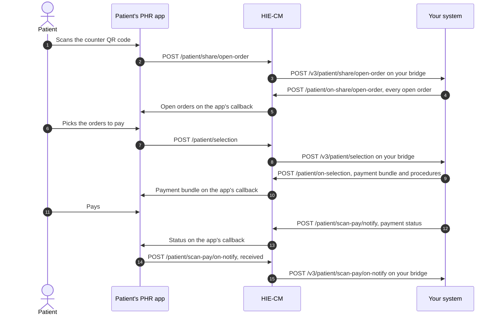

# Scan and Pay

Let a patient pay for their open orders from their [PHR](/docs/pr-29/docs/hiecm/v3/getting-started/glossary#phr) app after scanning the QR code at your counter. Your system is the [HIP](/docs/pr-29/docs/hiecm/v3/getting-started/glossary#hip) that holds the orders. The app is the [HIU](/docs/pr-29/docs/hiecm/v3/getting-started/glossary#hiu) that shows them, takes the selection and the payment, and reports back. The calls run through the [HIE-CM](/docs/pr-29/docs/hiecm/v3/getting-started/glossary#hie-cm) and land on the bridge you register for [M2](/docs/pr-29/docs/hiecm/v3/milestones/m2).

## In short

- Same counter QR code as [Scan and Register](/docs/pr-29/docs/hiecm/v3/use-cases/scan-and-register). The app sends the patient's payment details instead of a profile.
- You answer with the patient's open orders. The app sends back the ones the patient picked, and you answer with the payment bundle and its procedures.
- Payment status flows from you to the app, and the app confirms it received it. Either side can ask for the order status later.
- Every callback is a POST on your bridge. Answer 202 at once, then send the matching reply.

Paths are under `/api/hiecm/scan-gateway/v3` on the gateway, and under `/v3` on your bridge. Every call carries `REQUEST-ID`, `TIMESTAMP`, the gateway `Authorization` token and `X-CM-ID`.

## The calls

| Step     | Who calls             | Path                                                        | Carries                                |
| -------- | --------------------- | ----------------------------------------------------------- | -------------------------------------- |
| 1        | PHR app to HIE-CM     | `POST /patient/share/open-order`                            | The patient's payment details          |
| 2        | HIE-CM to your bridge | `POST /v3/patient/share/open-order`                         | The same, with a transaction id        |
| 3        | You to HIE-CM         | `POST /patient/on-share/open-order`                         | Every open order for the patient       |
| 4        | PHR app to HIE-CM     | `POST /patient/selection`                                   | The open orders the patient picked     |
| 5        | HIE-CM to your bridge | `POST /v3/patient/selection`                                | The selection                          |
| 6        | You to HIE-CM         | `POST /patient/on-selection`                                | The payment bundle with its procedures |
| 7        | You to HIE-CM         | `POST /patient/scan-pay/notify`                             | The payment status                     |
| 8        | PHR app to HIE-CM     | `POST /patient/scan-pay/on-notify`                          | Confirmation that the status arrived   |
| Later    | Either side           | `POST /patient/scan-pay/order-status` and `on-order-status` | A status check and its answer          |
| Any time | PHR app to HIE-CM     | `GET /patient/scan-pay/details`                             | Everything held for the patient        |

The request and response bodies, with every field, are on the [Scan and Pay API reference](/docs/pr-29/docs/hiecm/v3/api/scan-and-pay/endpoints/scan-and-pay-abdm-scan-pay-hip/01-scan-and-pay-post-v3-patient-share-open-order). No call on this page has been run against sandbox.

## What you see when it works

Step 2 arrives on your bridge, your step 3 and step 6 return 202, and step 8 comes back on your bridge with the same transaction id after you send the payment status.

## When it goes wrong

- No selection after step 3: the patient may not have picked anything yet. Your system is waiting on a person, not on a network call.
- No step 8 after step 7: check the status callback URL is registered for your bridge, then use the order status pair to ask.
- A share for a counter you do not know: reject it rather than guess.

## Next

- The profile-only version of the same scan: [Scan and Register](/docs/pr-29/docs/hiecm/v3/use-cases/scan-and-register).
- The bridge these callbacks land on: [M2 Health Information Provider](/docs/pr-29/docs/hiecm/v3/milestones/m2).
- The app's side: [P2 Linking and records](/docs/pr-29/docs/hiecm/v3/milestones/p2).
