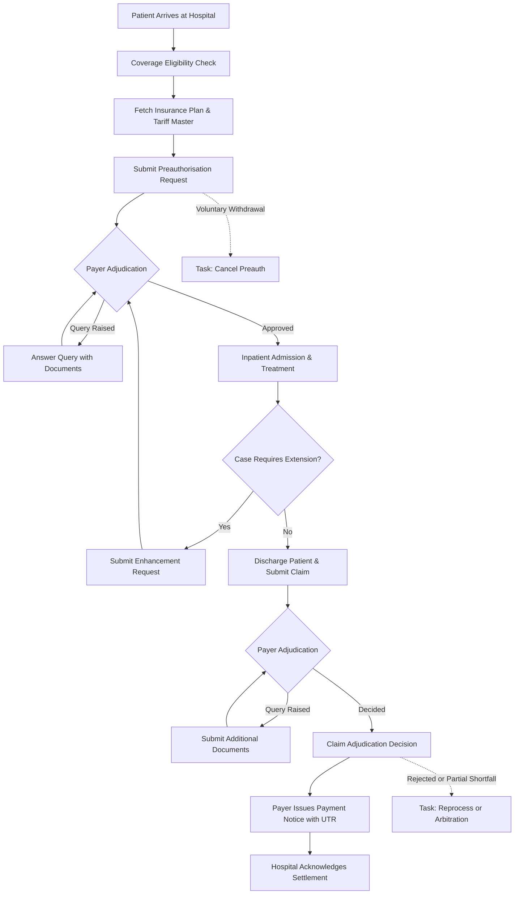
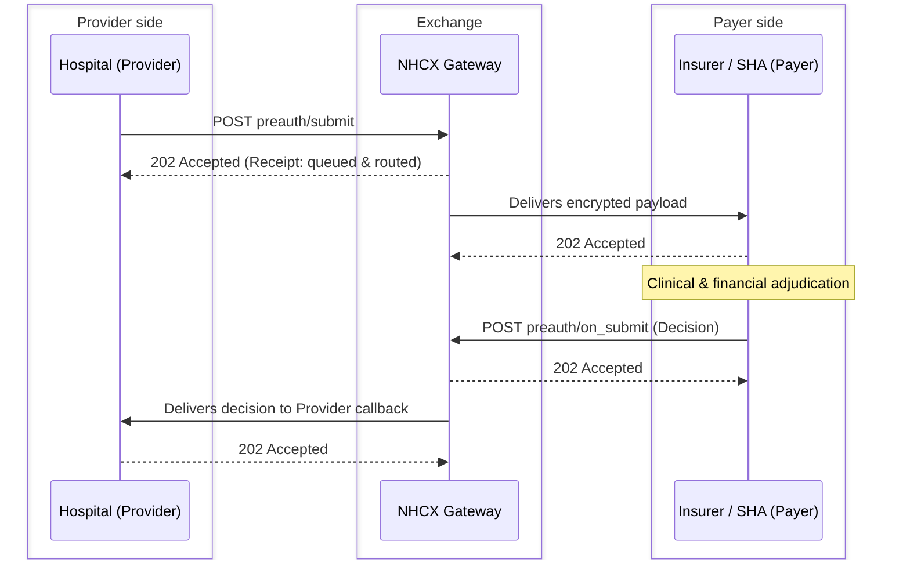

# Claim Settlement

Claim settlement is the end-to-end process by which an insurer or State Health Agency (SHA) evaluates, approves, and pays a request for medical expenses raised by a policyholder or treating hospital. Three participants are involved. The Provider is the treating hospital and its HMIS. The Payer is the insurance company, SHA, or TPA that adjudicates and settles the claim.

### What is Health Insurance?

Health insurance or an Insurance Policy is a contract between an individual and a promisor where the latter pledges to pay her/ his medical bills up to a set limit in case of any ailments of the individual. The individual is commonly known as a policyholder or beneficiary whereas the promisor can be an insurance company acting by itself or on behalf of Government or any organisation or Corporate entity. It protects one’s personal savings from being drained by unexpected hospital stays, surgeries, and medicines.

### What is an Insurance Claim?

A health insurance claim is a formal request by a policyholder or by the treating hospital to an insurance company acting by itself or on behalf of Government or any organisation or Corporate entity, asking to pay or refund money for medical care.

### Types of Health Insurance Claim

- **Cashless** - A patient who is a beneficiary of a policy can avail treatment in a hospital without having to pay any amount out of one’s pocket if the hospital is under a “Preferred Network” for the Insurance Company with some existing agreement executed between them or “Empaneled” under a specific scheme governing the policy. However, the amount of expenses incurred during treatment is capped either by “Sum Assured” under the policy or some mutually agreed upon “Package Rates” earmarked for a specific medical or surgical procedure.
- **Reimbursement** - Here a patient is required to pay the bills directly to the treating hospital and later get such an amount reimbursed by Insurance Company upon submission of all relevant documents. This is a common practice if the treating hospital is not a part of “Preferred Network” for that Insurance Company, but this model is not considered in the current scope.

### Who is a Provider?

A Provider is the treating hospital “providing” the healthcare services to a patient, who is a beneficiary under a policy. And the HMIS software that the Provider hospital is using is known as the Provider Application. In common parlance this Provider Application is called just the “Provider”.

### Who is a Payer?

A Payer is the Insurance Company who has issued the policy and is liable to make payments for medical expenses incurred for treatment of the policyholder. In some cases independent TPAs act on behalf of an Insurance Company to settle such medical bills and thereby assume the role of a Payer. On a similar note as above the software used by a Payer is called the Payer Application or simply “Payer”.

### Claim Settlement Process

This is a two-way communication between the Hospital and the Insurance Company, that is, between the Provider and the Payer, concerning the policy, the treatment rendered to the policyholder patient, and finally the payment of hospital bills after proper scrutiny of all relevant documents. It starts with the treating hospital informing the Insurance Company of an imminent claim for a patient who is to be admitted for treatment, and it ends with the realisation of payment from the Insurance Company for all expenses incurred while treating the patient. The entire journey of claim settlement can be broken down into the following distinct flows or use cases.

## The 10 Steps of Claim Settlement on NHCX

The traditional ten stages of claim settlement map directly onto NHCX exchanges.

#### Step 1: Intimation

The hospital informs the insurance company that a patient holding one of its policies is going to be treated for the diagnosed ailments.

#### Step 2: Policy verification by the hospital

The hospital checks that the patient to be treated holds a valid policy from that insurance company and that the ailments to be treated are covered under the policy.

#### Step 3: Beneficiary and tie-up verification by the payer

The insurance company checks that a bona fide policyholder has come for treatment and that a proper tie-up is in place with the hospital for providing such cashless treatment.

#### Step 4: Treatment plan intimation

The hospital sends the insurance company an initial intimation of the treatment plan, any procedures to be carried out, and the expected length of stay needed for treatment.

#### Step 5: Preauthorisation

Once satisfied with the genuineness of the case, the insurance company sends a preliminary approval, commonly known as Preauthorisation or "PreAuth". This authorises the hospital to go ahead with treatment for the policyholder patient, and the patient is then admitted.

#### Step 6: Enhancement

During the course of treatment, the hospital may approach the insurance company again to notify it that additional procedures may be required or that an extension of stay is needed. This is commonly known as "Enhancement".

#### Step 7: Discharge and document submission

The patient is discharged, and the hospital submits all necessary documents to the insurance company, including consultation and clinical notes, diagnostic reports, medication details, the discharge summary and all bills.

#### Step 8: Payer query and resolution

At this stage, the insurance company may ask for further explanation or for documents it considers necessary to substantiate the claim and support its adjudication. Such a communication from the insurance company to the hospital is called a "Query".

#### Step 9: Claim adjudication

The insurance company carries out the final adjudication and conveys the outcome to the hospital, stating whether the claimed amount is "Granted", "Denied" or "Partially Granted", along with the reasons.

#### Step 10: Payment and reconciliation

The insurance company pays the hospital the granted amount for the claim. It also notifies the hospital of the bank transaction details along with other details such as applicable tax or deductions.

#### End-to-End Claim Lifecycle Flow

## NHCX Platform

### What is NHCX?

In order to iron out the challenges depicted above the National Health Claims Exchange (NHCX) is developed under the Ayushman Bharat Digital Mission (ABDM) by the National Health Authority (NHA) in consultation with Insurance Regulatory and Development Authority of India (IRDAI). The idea is to introduce a platform of exchange to the Providers and Payers so that both can transfer digitised health records and other pertinent information directly in a machine readable format to its counterpart.

### What NHCX aims to achieve?

The primary objective of NHCX is to streamline and standardise the processing of health insurance claims across the country, ensuring absolute interoperability across diverse systems. This implies in spite of Provider and Payer applications operating on completely different technology stacks one system can seamlessly remit health information to the other in a comprehensive digitised machine readable format to the other and still have the very exact interpretation at both ends. It is achieved by leveraging the Fast Healthcare Interoperability Resources (FHIR) standard protocols and using international coding practices, wiping out even the slightest ambiguity in the understanding.

### NHCX Operating Framework

Just like we have exchanges like NSE & BSE for trading in securities where anyone can buy or sell independently by merely getting connected to the platform, the entire idea of NHCX is to connect Providers and Payers on either side. Once Providers and Payers become compliant to the NHCX protocols like using prescribed FHIR bundles and implementing universally accepted coding practices they can independently connect to one another using NHCX as a medium of exchange. The protocols and standards ensure that a health information does not lose any of its essence during the transfer.

### Benefits of using NHCX

- It is imperative that in the present day context almost every healthcare provider or hospital is generating digitised health records. But there is no point if the hospital has to convert that data into a “pdf” or a “jpg” file and transmit the same to the insurance company in a human readable format. NHCX is the only solution to this widespread problem
- Let us consider a diagnostic report of a patient like “Lipid Profile” that has some 10 parameter values, all very important to understand the criticality of the case. It would be very helpful for the insurance company to have those 10 different values for the individual parameters of Lipid Profile in adjudication of the case. Using NHCX such values for each of these parameters under Lipid Profile can be passed on from Provider to Payer
- Since any standard hospital HMIS already captures data pertaining to a patient like medical history, allergies, medication, line of treatment, etc. it would be apt to convey those same details to the insurance company instead of taking a printout and scanning them again for email attachments or uploads, thereby ensuring chastity of data
- Data precision is also safeguarded as the intervention of data entry operators is only limited to the first level entry into HMIS, rendering this to be the only source of truth. Eventually this translates to lesser queries and rejection of claims on flimsy grounds
- NHCX enables maximum data transfer in the digitised format, thus allowing a Payer run AI tools and conduct automated adjudication to the maximum possible extent
- With Government social security schemes like Ayushman Bharat gaining momentum and IRDAI advocating “Cashless Everywhere” more and more healthcare providers are entering the arena and adoption of such universal model like NHCX can only support this extent of scalability

### The Asynchronous Request and Callback Pattern

Claim decisions can't be made instantly. A pre-authorisation review may take minutes to hours, and a complex claim review may take days. So NHCX handles every major action in two separate steps.

#### Request

The sender calls an action endpoint, such as `preauth/submit`. NHCX checks the message headers, confirms who sent it, and immediately replies with an HTTP 202 Accepted receipt. This receipt only confirms that the message was received. It is not a decision on the case.

#### Response

The receiver opens the message, makes its decision, and sends the result later to the matching callback endpoint, such as `preauth/on_submit`. NHCX forwards this response to the sender's registered webhook, which replies with its own HTTP 202 receipt.
