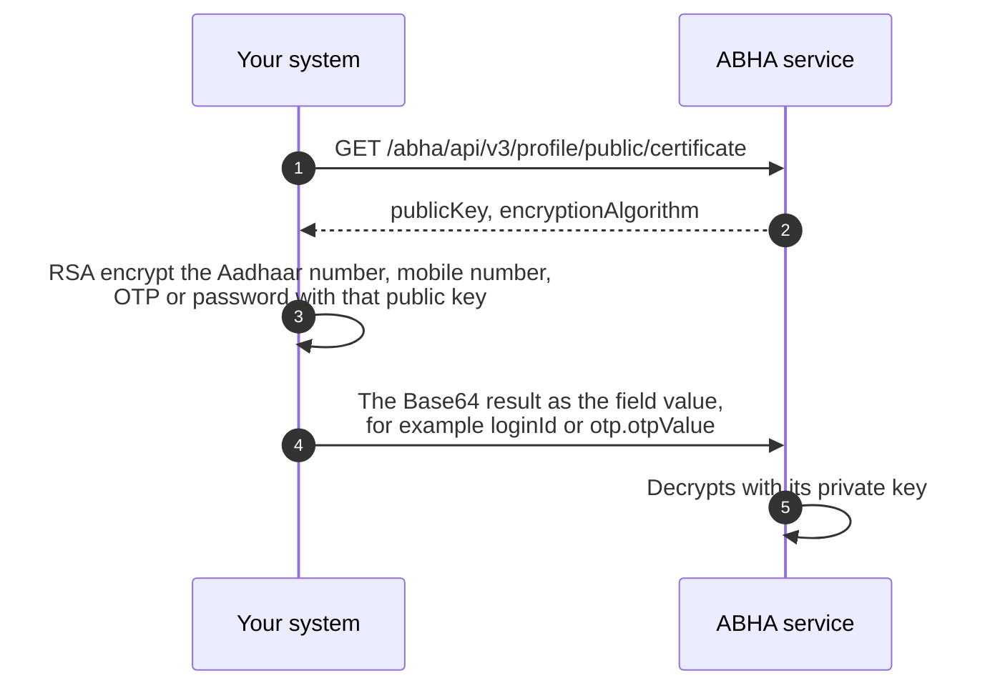

# Encryption

Several fields in [M1](/docs/pr-30/docs/hiecm/v3/api/m1) do not carry the value you started with. They carry that value encrypted against the ABDM public key. When an API page shows a placeholder such as `{{encrypted aadhaar number}}`, the field name tells you what the value is and the placeholder tells you it must already be encrypted.

## In short

- Encrypt the Aadhaar number, mobile number, OTP and password with RSA against the published public key, and send the base64 ciphertext.
- M1 calls use the ABHA service's key. PHR calls use the PHR key, which is a different key at a different URL.
- Your system never holds a secret for this: only the current public certificate.

## What must be encrypted

Six kinds of value never travel raw in an M1 request body.

| Value                                                                                   | Where it appears                     |
| --------------------------------------------------------------------------------------- | ------------------------------------ |
| Aadhaar number                                                                          | Enrolment and login by Aadhaar       |
| ABHA number                                                                             | Login and search by ABHA number      |
| Mobile number                                                                           | Login, search and mobile update      |
| Email address                                                                           | Email verification                   |
| One time password ([OTP](/docs/pr-30/docs/hiecm/v3/getting-started/glossary#otp)) value | Every call that verifies a challenge |
| Password                                                                                | Password based login                 |

Each is encrypted with RSA using the ABDM public certificate, and the base64 of the ciphertext goes in the field.

## What shape the plaintext must be

The service validates the plaintext after it decrypts, so the shape you encrypt matters and a wrong shape is rejected as though the value were wrong.

| Value          | Plaintext shape                                                      | Example             |
| -------------- | -------------------------------------------------------------------- | ------------------- |
| ABHA number    | 14 digits with dashes, `NN-NNNN-NNNN-NNNN`                           | `91-1234-5678-9015` |
| Aadhaar number | 12 digits, no spaces                                                 | `999999990019`      |
| Mobile number  | 10 digits, first digit 1 to 9, optionally prefixed with `+91` or `0` | `9876543210`        |
| OTP value      | Exactly 6 digits                                                     | `123456`            |

The ABHA number is the one that catches people, because the number is printed and stored both ways. Encrypting the 14 bare digits is rejected: a login OTP request sent that way on the sandbox on 11 September 2026 returned `400 {"loginId": "LoginId is invalid"}`, and the same number encrypted as `91-1234-5678-9015` passed validation and went on to look the account up. Strip the dashes for display if you like, but put them back before you encrypt.

Aadhaar, mobile and OTP values follow the validation patterns given on each call in the [M1 API reference](/docs/pr-30/docs/hiecm/v3/api/m1).

## How the model works

We publish the public half of a key pair. You encrypt with it. Only our private half can decrypt. Your system never holds a secret to do this, only the current certificate.

There is nothing ABDM specific in the mechanics. Your platform's standard RSA library does the work. Both keys use `RSA/ECB/OAEPWithSHA-1AndMGF1Padding`. The one thing to confirm is which key you are using.

## Where to do it

**Encrypt inside your own system, against the published ABDM public key.** This is the production path.

## Fetching the public key

A [PHR](/docs/pr-30/docs/hiecm/v3/getting-started/glossary#phr) application fetches its own key from `GET /abha/api/v3/phr/app/login/public/certificate`, the first call in [P1](/docs/pr-30/docs/hiecm/v3/api/p1/endpoints/p1-certificate-and-session/01-p1-get-v3-phr-app-login-public-certificate). It is a different key from the ABHA service's, so never encrypt a PHR call with the M1 certificate.

M1 has a `public/certificate` API for fetching the public key. Its URL, headers and response shape are on [the certificate call](/docs/pr-30/docs/hiecm/v3/api/m1/endpoints/m1-access-tokens-encryption/02-m1-get-v3-profile-public-certificate).

## Where to go next

- [Gateway](/docs/pr-30/docs/hiecm/v3/concepts/gateway) for the session token every call needs.
- [M1 user journeys](/docs/pr-30/docs/hiecm/v3/milestones/m1), where the encrypted identifier appears in the search and login steps.
