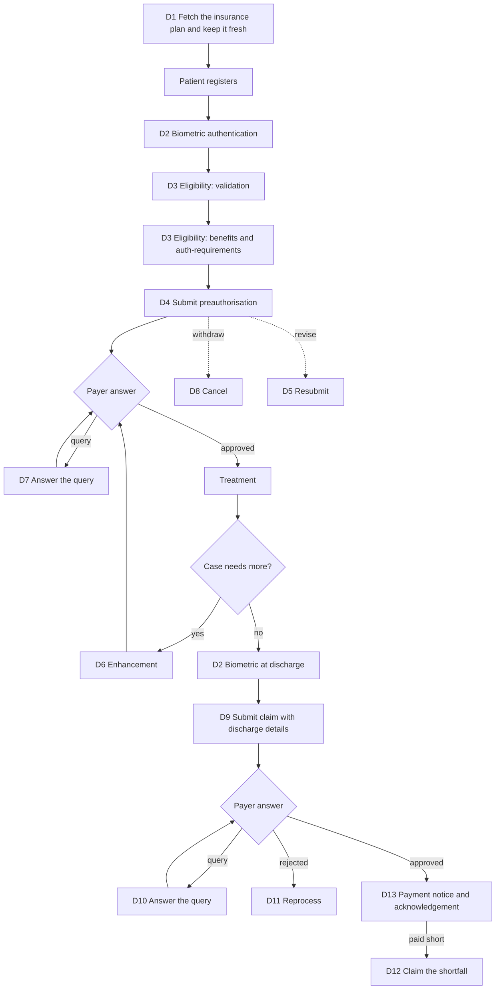
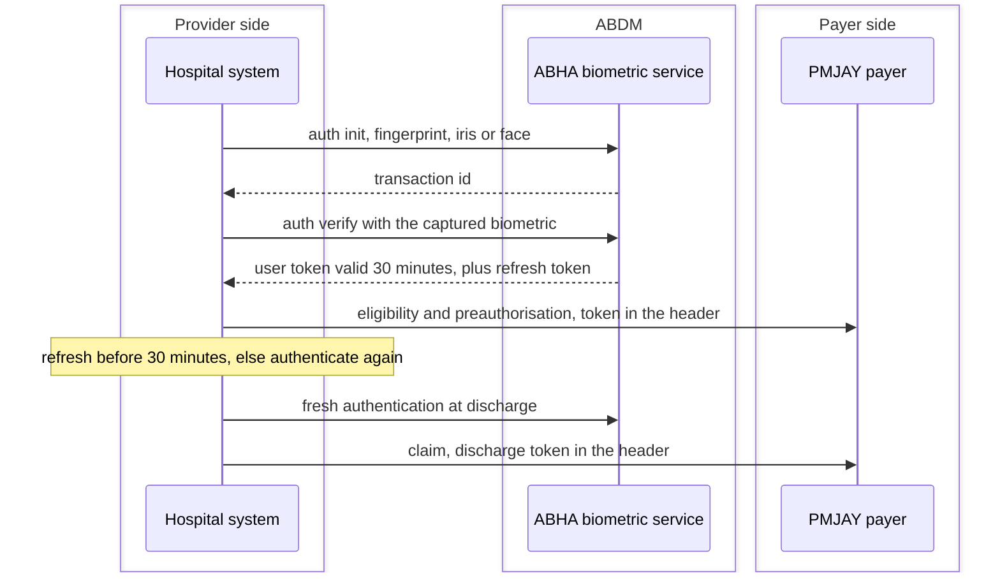
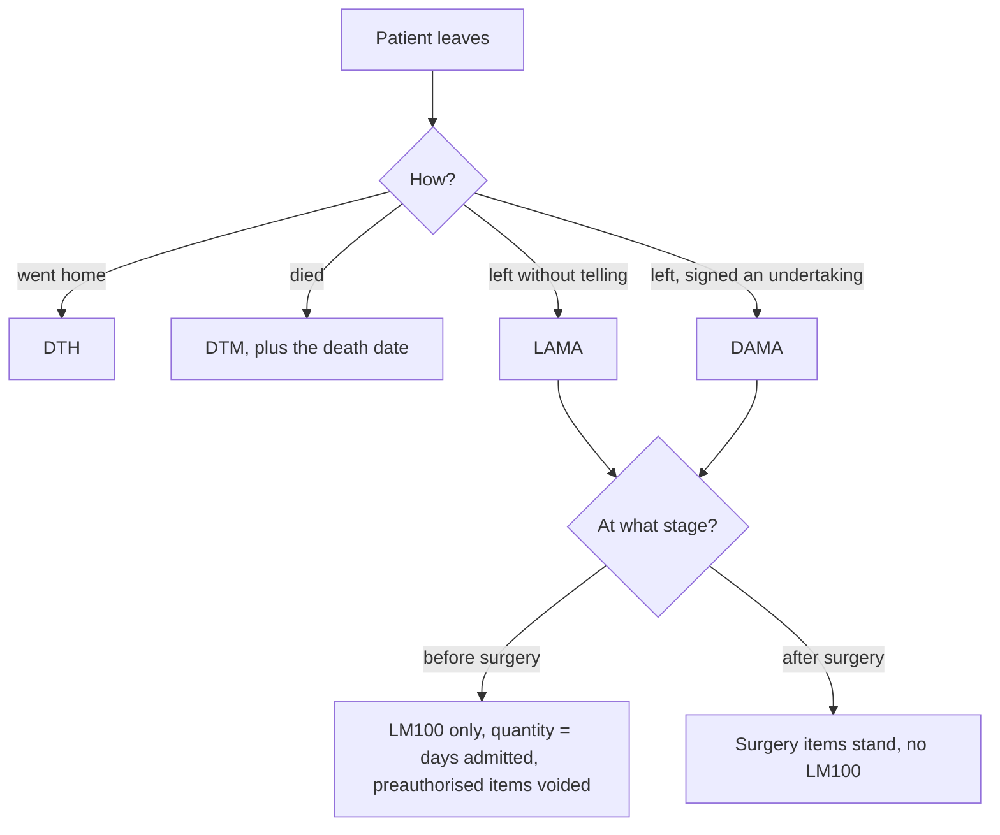
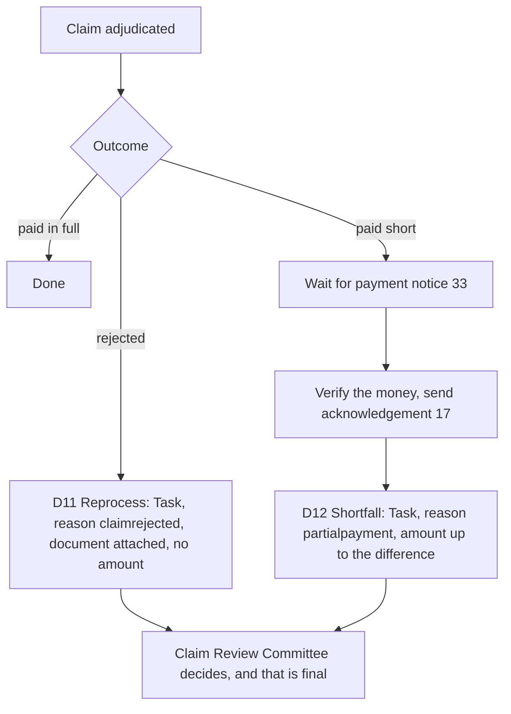
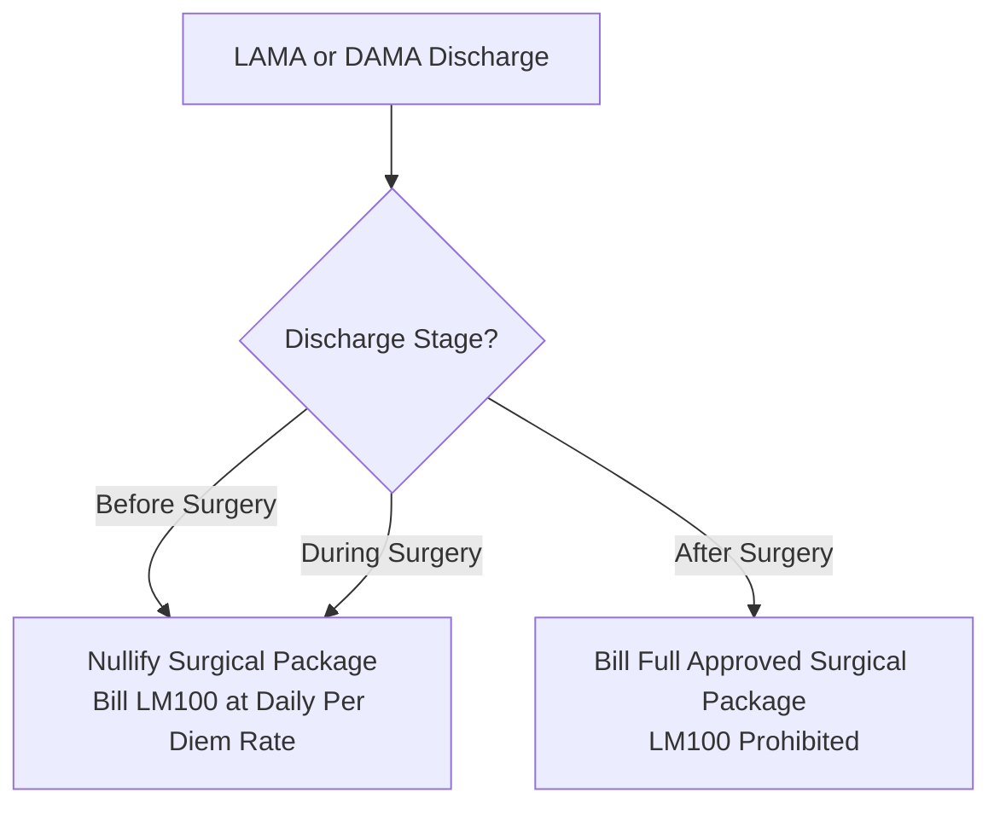

# PMJAY use cases

The endpoints a PMJAY integration calls are the same ones listed in the NHCX Use Cases chapter. What changes is the behaviour around them: what must be fetched first, what must be proved before a request is accepted, how supporting information is packaged, and how a query is answered. The shared use cases apply unchanged, and so do Get Policy and Get Status.

The exchanges below are the D-series. Where a use case is distinguished by a workflow code rather than by a separate endpoint, that code is given with it. The scheme rules that change how a submission is built, for discharge, leaving against medical advice, death, cyclic and unspecified cases, are in [Scheme rules the HMIS must implement](#scheme-rules-the-hmis-must-implement) below. A PMJAY integration is as much about those rules as about the calls.

## Scheme setup and identity

### D1: fetch insurance plan

**API Called:** `/v1/insuranceplan/request` **Callback API:** `/v1/insuranceplan/on_request` **Payload:** encrypted TaskBundle on the request, InsurancePlanBundle on the response

The InsurancePlan is the structured representation of the policy under which a patient is covered. PMJAY is strictly package-based, with bundled costs for each service. Referencing the correct plan is what keeps the claim to admissible services, avoids rejections for non-compliance with scheme guidelines, and gives both sides an auditable record.

The request is keyed on Provider ID, Policy Code and Participant ID. The response is scoped to that provider. It returns the specialties relevant to it, the covered services and their limits, and the mandatory documents for both preauthorisation and claim, at policy level and per benefit. It also carries the Standard Treatment Guidelines and clinical protocols, and the policy conditions, exclusions and renewal information.

**How the plan is built.** Each specialty holds packages. Each package has a rate. Over and above the rate, the plan can attach add-ons that the payer allows for that package: an implant, a higher-cost bed category (called stratification), a high-end medicine or investigation. The plan also carries flags per package that change how a claim is built: whether it is an unspecified procedure, a cyclic one, or one that applies to a LAMA or DAMA discharge. The scheme rules section below explains each.

**Size and storage.** The plan object sometimes exceeds 20 MB. The system must accept a payload that large and store it in a structured, queryable form linked to the policy record.

**Freshness and versioning.** Refresh the plan regularly, and immediately whenever a policy is renewed or amended. The FRD says weekly; the scenario sheet says once in fifteen days. Version control on tariffs and packages is not optional: an outdated tariff version causes a rate mismatch and automatic claim rejection on suspicion of tampering. Keep audit logs of every fetch, refresh and version update, and of the version used in each preauth or claim.

**Driving the forms.** The stored plan populates the preauth and claim forms with benefits and limits, and supplies the STG checklist, which must be rendered dynamically against the treatment plan selected. The questionnaire URL received in the plan is what gets sent back in the questionnaire response.

### D2: biometric authentication of the beneficiary

**API Called:** ABHA biometric auth init, then auth verify, with a refresh token endpoint **Callback API:** none **Note:** this is not an NHCX API. It was built specifically for the PMJAY payer.

The scheme mandates biometric verification of the beneficiary at registration, during treatment and at discharge, to establish physical presence.

**All three methods must be built.** Fingerprint, iris and face authentication are each mandatory to implement, because any of them may be the one that works for a given patient. A preauthorisation raised with a fingerprint can be followed by a claim raised with face authentication; the methods do not have to match. Fingerprint and iris follow an init-then-verify pair. Face authentication is a different flow. Initiate, show the patient a QR code to scan in the ABHA app, and poll until the capture is complete. Then verify with the Aadhaar number encrypted using the public key the portal supplies.

On success the system receives a User Token, which must be passed as a header on every subsequent PMJAY claim event that requires proof of presence, including the coverage eligibility check and the preauthorisation submission. The payer validates this token before treating the request as legitimate. Discharge requires a fresh authentication, and that token is passed on the claim submission.

**Token lifetime.** The User Token is valid for 30 minutes. Systems must refresh it automatically for the duration of a transaction cycle, and if it expires, start a fresh biometric authentication.

**Applicability.** This applies only to beneficiaries whose ABHA number is linked to their PMJAY card. Beneficiaries without that linkage follow the existing PMJAY-approved KYC protocols.

**Exemption.** Where biometric or Aadhaar authentication is not feasible, the provider obtains an Aadhaar exemption consent document signed by both the patient and a hospital representative. Store it digitally and link it to the beneficiary record. A preauthorisation or claim may then be raised on the consent form instead. The one exception is a cyclic procedure, where live biometrics are required at every step. Biometric authentication or a valid exemption is mandatory before a claim can be submitted.

## Eligibility

### D3: check coverage eligibility

**API Called:** `/v1/coverageeligibility/check` **Callback API:** `/v1/coverageeligibility/on_check` **Payload:** encrypted CoverageEligibilityRequestBundle

The check verifies a patient's eligibility and available benefits before registration or treatment. It is served with four purposes, and the purpose determines what comes back.

- **Validation.** Confirms the specified coverages are in force, and returns the wallet balance. The benefit component carries one entry per wallet applicable to the beneficiary, with the allowed balance and the amount consumed. Called after registration.
- **Discovery.** Asks the insurer to report any coverages it knows of beyond those specified, giving the list of all active coverages for the beneficiary.
- **Benefits.** Returns the plan benefits, and optionally the benefits already consumed, for the listed or discovered coverages. Called before raising a preauthorisation or enhancement.
- **Auth requirements.** Returns the prior authorisation requirements for the given categories of service or billing codes, procedure by procedure, and the documents needed at each stage. This is where the documents and questionnaires mandatory for preauthorisation come from. Called on the preauthorisation page before submission.

Validation, discovery and benefits require the Beneficiary ID, Coverage or Plan Code, Payer ID and Provider ID. Auth requirements and benefits additionally require the procedure or package codes.

Register the patient only after coverage is validated, and alert both provider and patient where coverage is insufficient, including the case where a family's shared limit is exhausted. Call this check again, as a validation, every time an additional treatment is added, so the limit is confirmed before a preauthorisation goes out.

## Preauthorisation

All five preauthorisation exchanges share the same endpoints and the same bundle structure. The workflow code is what distinguishes them. Each follow-up, whether a query answer, an enhancement or a resubmission, is a new request carrying the original reference and a fresh correlation ID.

**API Called:** `/v1/preauth/submit` **Callback API:** `/v1/preauth/on_submit` **Payload:** encrypted ClaimBundle, answered with a ClaimResponseBundle

The documents and questionnaires required come from the coverage eligibility response with purpose auth-requirements. Procedure components must match the values returned by the InsurancePlan. The preauthorisation amount may not exceed the balance remaining on the beneficiary's coverage. Two dates are mandatory, each sent as a timing (date or period) or as a string value, adhering to NRCeS standards.

| Field             | Category | Code   | Display                         |
| ----------------- | -------- | ------ | ------------------------------- |
| Registration date | `OTH`    | `EDT`  | EncounterDateTime               |
| Admission date    | `ONS`    | `ADDD` | Admission date - Discharge date |

See the note under D9 on where these codes come from and where the source documents disagree.

A preauthorisation cannot be raised more than one day in advance, and D2 must be completed before submission.

### D4: submit preauthorisation

**Workflow ID:** 12

The first preauthorisation for a case. It is auto-approved only if it is the first preauth for that case and every requested procedure is eligible for auto-approval. Separately, where the policy is eligible for turnaround-time approval and no action is taken within the defined window, the case is approved automatically. Everything else is adjudicated manually by the payer.

### D5: resubmit preauthorisation

**Workflow ID:** 121

Raised once a base preauth already exists, for example to revise an approved or rejected case for a higher amount or a different package. A resubmission nullifies all previous instances, and the payer treats it as the new base request.

### D6: raise enhancement

**Workflow ID:** 13, with 131 for a response to an enhancement query

Raised against an already approved preauth to extend a procedure or add new ones. Unlimited enhancements are allowed until discharge, within the limit, but each can only be sent after the previous request has closed. Check the plan's rules for the package before raising one. The bundle carries the enhancement workflow ID, the already approved treatments, and the treatments now sought.

### D7: respond to preauthorisation query

**Workflow ID:** 19

A query arrives in the item-wise adjudication field of the preauth response bundle. The provider reads it and answers with a preauth query response, not a resubmission. The bundle structure is unchanged.

### D8: cancel preauthorisation

**Workflow ID:** PC01 **Payload:** Task bundle

Cancels the whole preauthorisation. It can be raised at any point until the claim is raised, against an active preauth or one still pending decision at the payer end. The Task carries the code `cancel`, the case number as its input (the FRD calls this the intimation number, the scenario sheet the claim number), a reason, and any remarks in the disposition.

Reasons the payer recognises: `treatmentplanchanged`, `patientrequest`, `financialconstraints`, `alternativetreatment`, `duplicateclaim`, `administrativeerror`, and `other` with a free-text explanation.

## Claim

The claim exchanges share endpoints and bundle structure in the same way.

**API Called:** `/v1/claim/submit` **Callback API:** `/v1/claim/on_submit` **Payload:** encrypted ClaimBundle, answered with a ClaimResponseBundle

The documents and questionnaires for the claim come from the InsurancePlan response. Coverage eligibility with purpose auth-requirements supplies only those needed at preauthorisation; the remainder are mandatory at claim. The claim amount may not exceed the preauthorisation's approved amount. A claim cannot be cancelled.

### D9: submit claim

**Workflow ID:** 15

**PMJAY has no separate discharge workflow.** Raising a claim implicitly asserts that the patient has been discharged, so discharge details form part of the claim request itself. Once the preauthorisation is approved and treatment is complete, the patient is discharged and the claim submitted, carrying a fresh D2 token.

Four dates and the discharge status are mandatory. Each date is sent as a timing (date or period) or as a string value, adhering to NRCeS standards.

| Field             | Category                          | Code                              | Display                         |
| ----------------- | --------------------------------- | --------------------------------- | ------------------------------- |
| Registration date | `OTH`                             | `EDT`                             | EncounterDateTime               |
| Admission date    | `ONS`                             | `ADDD`                            | Admission date - Discharge date |
| Surgery date      | `ONS`, or `SURD` in every sample  | `PSP`, or `ADDD` in every sample  | PatientSurgeryPerformed         |
| Discharge date    | `ONS`, or `DSCHD` in every sample | `DSDE`, or `ADDD` in every sample | Discharge Date                  |

The discharge status itself goes under category `DIS`, with the code carrying the type of discharge. All four types from the hospital workflow are represented. There is no "referred to another hospital" type; a patient is discharged as one of these four before being admitted elsewhere.

| Code   | Display             | Discharge type                                                  |
| ------ | ------------------- | --------------------------------------------------------------- |
| `DTH`  | DischargeToHome     | Normal discharge                                                |
| `DTM`  | DischargetoMortuary | Death                                                           |
| `LAMA` | Discharge with LAMA | Left against medical advice, without telling the hospital       |
| `DAMA` | Discharge with DAMA | Discharged against medical advice, having signed an undertaking |

The value against the `DIS` entry is not a date. It is a string carrying the discharge stage: **Before Surgery**, **During Surgery** or **After Surgery**. It is sent for medical cases as well as surgical ones. Each discharge type has a matching questionnaire in the plan (Death, Life, LAMA, DAMA), found by title.

A death is the one case that needs a fifth date. Where the discharge type is `DTM`, send the death date as an additional entry under category `ONS` with the same `DTM` code, alongside the four dates above.

**LAMA and DAMA claims carry a special procedure code.** Under LAMA or DAMA, procedure code `LM100` may be the only code the payer accepts on the claim. Every item approved on the earlier preauthorisation is disqualified and only the stay is paid. The `LM100` line carries the number of days admitted as its quantity, and a LAMA discharge also sends the bed category with its duration. `LM100` is never valid on a preauthorisation.

Which discharge stages trigger it is stated four ways across the sources: before surgery only, before or during, before or after, and after or during in the payer's own error message. Establish the rule with the payer before building; it decides whether an approved package is paid or voided.

**A note on the codes above.** These combinations are taken from the NHCX gateway validation messages, which reject a claim naming the exact category and code expected. The Functional Requirement Document gives a different set for three of these fields, listing the admission, surgery and discharge dates under categories `ADMD`, `SURD` and `DSCHD` with code `ADDD` throughout. Those three categories do not appear in the supporting info category value set. Confirm against the current NRCeS value sets before building.

Claims are adjudicated manually, approved or rejected case by case.

### D10: respond to claim query

**Workflow ID:** 161. The payer refuses 151, 19 and 16 with `PAYR-1321`.

As with D7, the provider answers a payer query with a claim query response using the same Claim Bundle structure.

### D11: reprocess a rejected claim

**API Called:** `/v1/task/submit` **Callback API:** `/v1/task/on_submit` **Workflow ID:** 36 **Payload:** Task bundle, with a supporting document attached

When a claim is rejected outright and the hospital disputes it, it asks for a re-evaluation. This is an appeal, not a resubmission: the claim itself is not sent again.

The Task carries the code `reprocess` and the reason `claimrejected`. It names the case by its claim number, which under PMJAY is the preauthorisation number the hospital generated. No amount is sent, because the whole claim is in dispute. A supporting document is mandatory; without one there is no ground for the appeal. It can be raised as soon as the rejection arrives, with no dependency on any payment notice.

The request goes to the Claim Review Committee, whose decision is final. A claim can be reprocessed once. The original claim number carries forward; no new case is created.

### D12: claim a shortfall (erroneous claim)

**API Called:** `/v1/task/submit` **Callback API:** `/v1/task/on_submit` **Workflow ID:** 36 **Payload:** Task bundle, with a supporting document attached

When a claim is approved and paid, but for less than was claimed, the hospital can ask for the difference. This uses the same Task as a reprocess with one change: the reason is `partialpayment`, and an amount is sent.

The amount is capped at the shortfall. A claim raised for 10,000 and paid at 6,000 can ask for up to 4,000, with justification, and never more. The request can only be raised once the payment cycle is complete: after the payment notice with workflow 33 has arrived and the hospital has verified the money and sent its acknowledgement, code 17. As with a reprocess, it can be raised once, and a supporting document is mandatory.

The two mechanisms do not chain. If a reprocess results in a partial approval, no shortfall claim can follow, because the Committee's decision is final.

## Payment

### D13: acknowledge payment notice

**API Called:** `/v1/paymentnotice/on_request` **Callback API:** `/v1/paymentnotice/request` **Workflow ID:** 17

Once a claim is approved and payment made, the payer sends a payment notice, which the provider system must be able to accept and acknowledge. Three notices may arrive in sequence: 30 when the payer initiates the transfer, 31 when the bank processes it, and 33 when it settles and the UTR number is available. The notice gives a consolidated status. **Cleared** where the amount has been initiated, **Paid** where it has been received, **Rejected** where it was initiated but failed on a server issue, **Adjusted** where a balance is being adjusted. Payment reconciliation gives the breakup for the case, including TDS and other deductions. Keep the UTR; it is the reference for any later dispute.

## Scheme rules the HMIS must implement

The Pradhan Mantri Jan Arogya Yojana (PMJAY) operates under strict operational, clinical, and financial guidelines that diverge significantly from commercial, fee-for-service insurance exchanges. This chapter details the scheme-specific business rules, calculation models, and clinical workflows that a Hospital Management Information System (HMIS) must implement.

---

### 1. Core Principles of PMJAY Adjudication

1. **Strictly Package-Based**: PMJAY does not reimburse fee-for-service line items. All admissions are governed by Health Benefit Packages (HBP) with bundled tariffs covering registration, bed charges, nursing, consultations, procedures, medicines, consumables, and standard post-discharge follow-up.
2. **100% Cashless Mandate**: Empanelled healthcare providers cannot collect out-of-pocket co-payments from beneficiaries for covered procedures (`adjudication.copay` = ₹0).
3. **Pre-Authorization Gating**: Pre-authorization is mandatory for all secondary and tertiary surgical interventions. Final claims must reference the approved pre-authorisation number (`preAuthRef`).
4. **Mandatory Biometric Verification**: Live biometric capture (Fingerprint, Iris, or Face) is required at registration/admission, pre-authorisation, every cyclic treatment visit, and discharge.

---

### 2. Discharge Types and Stages

Under PMJAY, a hospital cannot record an open-ended "referral" or "transfer" discharge. Every patient episode must terminate in one of four standardized discharge types, qualified by the surgical timing stage:

| Discharge Type Code | Display                           | Criteria & Adjudication Rule                                                                   |
| ------------------- | --------------------------------- | ---------------------------------------------------------------------------------------------- |
| `DTH`               | Discharge to Home                 | Patient successfully completes inpatient care. Standard package adjudication applies.          |
| `DTM`               | Discharge to Mortuary             | In-hospital mortality. Claim carries death date (`ONS`/`DTM`) and death summary questionnaire. |
| `LAMA`              | Left Against Medical Advice       | Patient absconds or departs against clinical counsel without formal documentation.             |
| `DAMA`              | Discharged Against Medical Advice | Patient or attendant executes an informed refusal undertaking.                                 |

#### The Discharge Stage Qualification

Every claim records the clinical timing stage under `supportingInfo` category `DIS` ("Discharge status"):

- `Before Surgery`
- `During Surgery`
- `After Surgery`

---

### 3. Package LM100 and LAMA/DAMA Billing Rules

When a patient departs under `LAMA` or `DAMA`, the scheme strictly prohibits billing the full surgical package if the surgical intervention was not completed:

#### 1. Before or During Surgery

- **Nullification**: Submitting a LAMA/DAMA claim before or during surgery immediately **nullifies all prior approved surgical pre-authorisation packages**.
- **Item Code `LM100`**: The claim replaces all surgical line items with a single item: procedure code `LM100` (Conservative / Per Diem Inpatient Care).
- **Daily Quantity Multiplier & `LengthOfStay` Bound**: The quantity on `LM100` is set to the exact number of days the patient was admitted (`Discharge Date - Admission Date`). This quantity is strictly bounded by the `LengthOfStay` (Maximum Length of Stay) attribute declared in the scheme package master (`InsurancePlan`). Admitted days billed cannot exceed `LengthOfStay` without prior clinical justification; stays extending beyond standard procedure limits in ordinary admissions require an approved pre-authorisation enhancement request (workflow 13).
- **Stratification Tariffs**: Procedure `LM100` is stratified by bed tier in the PMJAY master: Routine Ward (₹1,800/day, `STRAT006a`), High Dependency Unit HDU (₹2,700/day, `STRAT006b`), ICU Without Ventilator (₹3,600/day, `STRAT006c`), and ICU With Ventilator (₹4,500/day, `STRAT006d`).
- **Error Safeguard**: Submitting a surgical package code alongside LAMA/DAMA before or during surgery triggers automated rejection with error `PAYR-1362`.
- **Pre-Auth Prohibition**: `LM100` is strictly a claim-time adjudication code. Submitting `LM100` in a pre-authorisation request triggers error `PAYR-1270`.

#### 2. After Surgery

- If surgery was successfully performed and the patient subsequently leaves against medical advice during post-operative recovery:

  - The approved surgical package remains valid.
  - `LM100` is **not** used.
  - The discharge stage is recorded as `After Surgery`, and the hospital is reimbursed for the surgical package.

---

### 4. In-Hospital Death Claims (`DTM`)

If a patient expires during hospitalisation:

1. The discharge code is set to `DTM` (Discharge to Mortuary).
2. The claim retains the package appropriate to the clinical management provided up to the point of death.
3. The claim **must** include the date and time of death under `supportingInfo` category `ONS` with code `DTM`. Omitting the death timestamp causes rejection with error `PAYR-1096`.
4. The hospital must complete and attach the PMJAY Death Summary Questionnaire defined in the InsurancePlan.

---

### 5. Cyclic Procedures (Dialysis, Chemotherapy)

Cyclic treatments represent recurring therapy requiring multiple sessions under a single overarching pre-authorisation:

- **Plan Identification**: Packages flag cyclic eligibility with `CyclicProcedure = Y` and `MaximumCyclesAllowed` in the `InsurancePlan`.
- **Pre-Auth Booking**: Pre-authorisation is requested and approved for the entire block of sessions (e.g., 10 cycles).
- **The Rolling 24-Hour Rule**: Two cycles of the same procedure cannot occur within a **rolling 24-hour window** (measured strictly from biometric timestamp to biometric timestamp, not calendar days). Submitting cycles within 24 hours triggers rejection with error `PAYR-1369`.
- **Biometric Enforcement**: Live biometric capture is mandatory at pre-auth, at **every individual treatment visit**, and at final discharge.
- **Payment Settlement**: The claim is submitted once after all sessions conclude. Payment is released exclusively for sessions backed by a verified biometric capture. (E.g., 10 sessions approved, 8 biometric captures recorded = 8 sessions paid).
- **Clinical Mapping**: Each cycle is recorded under `supportingInfo` category `CD` (Clinical document) with code `TD` (Treatment detail), carrying exact start and end timestamps matching the biometric verification log.

---

### 6. Unspecified Surgical and Medical Procedures

When a patient requires a clinically necessary surgical intervention not present in the PMJAY Health Benefit Package master:

1. **Strictly Planned**: Unspecified procedures are permitted **only for elective/planned admissions**; emergency cases cannot utilize unspecified package codes.

2. **Specialty Alignment**: Must be booked under the patient’s treating specialty.

3. **Coding Convention**:

   - In live PMJAY plans, the procedure code is constructed as the **Specialty Prefix + `U100`** (e.g., `SGU100` for General Surgery, `SMU100` for Oral & Maxillofacial Surgery).
   - Some earlier NHA documentation referenced `Specialty + 215` (e.g., `SG215`). Systems must echo the exact code returned in the hospital’s dynamic `InsurancePlan`.

4. **Free-Text Specification**: The procedure name, clinical description, and requested tariff are entered by the hospital staff rather than selected from fixed master lists.

5. **Wallet Validation**: The entered amount cannot exceed the beneficiary’s available wallet balance. HMIS systems must validate this balance server-side before submission.

6. **Standalone Requirement**: An unspecified procedure must be a solitary line item; it cannot be clubbed with standard packages, implants, or stratified ICU addons.

---

### 7. Biometric Authentication and Aadhaar Exemption

The captures these rules call for, at registration, preauthorisation, every cyclic visit and discharge, are made through ABDM's biometric APIs, not over NHCX. Biometric Authentication, in Building a Provider, gives the calls: fingerprint and iris on one host, face on another, the user token they return and its refresh, the `K-547` device error, and the Aadhaar exemption consent and questionnaire that stand in where a capture is not possible.

## Structured data exchange

This requirement applies to every preauthorisation and claim bundle, D4 through D10, and is what separates a PMJAY submission from an ordinary one. The Task bundles in D8, D11 and D12 carry their document as a plain attachment instead.

Supporting clinical information travels through the `SupportingInfo` to `DocumentReference` resource. Inside `DocumentReference.content.attachment`, the `attachment.data` field carries a Base64-encoded FHIR Bundle holding the relevant structured resources, for example DiagnosticReport, DischargeSummary or WellnessRecord. This is the difference from an unstructured submission, where the same field would carry a Base64-encoded PDF or JPG. For structured submissions the content type is set to `application/json` or `application/fhir+json`.

The category code decides which of the two applies. Structured data uses a supporting info category among DIA, HDS, CD and INF, with the value sent as a reference. Unstructured data uses a category among POI, POA, DOB, DEF, FIR and ATT, with the value sent as an attachment. Questionnaire responses are configured under supporting info with category INF, code AT, and a reference value.

Each document is limited to 2 MB, against a whole-bundle maximum of 20 MB, and only one document can be linked per item, so multiple documents for a single item must be merged.

## Workflow codes

The full code list, provider-initiated and payer response, is in the Workflow Codes chapter. The codes are the same under PMJAY, and each D-series entry above carries the one that applies to it.

Three points are specific to PMJAY. Because the scheme does not use the Communication API for document queries, the query codes 19 and 161 travel on the preauthorisation and claim endpoints. That is what allows D7 and D10 to reuse the original bundle structure unchanged. The Communication API is still used, with its own reason codes, for turnaround-time alerts, grievances, wallet and policy changes, and arbitration acknowledgements, so a hospital system must still host it. And codes 14 and 141 for discharge have no counterpart here, because PMJAY folds discharge into the claim rather than treating it as a submission of its own.

## Error handling and validation

Envelope errors, receipts, retries and the error endpoint are the same as on any NHCX integration and are covered in [The JWE message format](/docs/pr-33/docs/nhcx/v1/getting-started/jwe-message-format). Two things are specific here. Every callback must accept the answer in two forms, decided by the `type` field. A sealed bundle when the payer processed the request, or a protocol response when it could not be opened or failed validation. And the PMJAY payer's own error codes, the `PAYR-12xx` set for preauthorisation and `PAYR-13xx` for claims, name the exact field or rule that failed; surface them to the user as they are.

## Before you build

Three things on the portal shorten the first week.

- **Sample bundles.** Twenty-two worked FHIR bundles, in eleven request-and-response pairs. They cover every eligibility purpose, preauthorisation with its query, enhancement and cancellation, claim with its query, and payment notice with its acknowledgement. One is an insurance plan response of 21 MB, which shows what the storage requirement means in practice.
- **Test cases.** A matrix from TC-ABHA-01 onward, each with preconditions, inputs and expected output. The scenario list beside it includes registration, wallet update, preauthorisation with implant, discharge in multiple modes, and the Claim Review Committee path.
- **The dummy payer.** Described in the NHCX Use Cases chapter, it answers the exchanges listed in the NHCX Use Cases chapter, which does not include the Task exchanges or biometrics.
