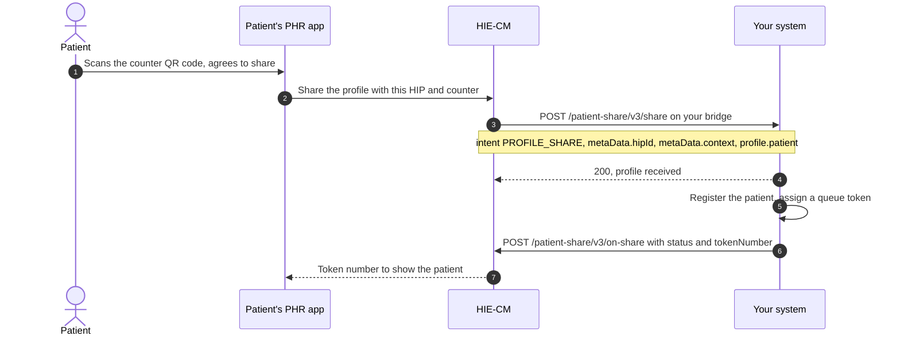

# Scan and Register

Support patient registration through QR-based workflows and generate service or queue identifiers in accordance with organization-specific processes. This use case belongs to [M1 Identity](/docs/pr-44/docs/hiecm/v3/milestones/m1): it uses the ABHA the person already holds.

Your facility prints a QR code at each counter. It holds a URL with two parameters: your HIP id and a counter context such as `OPD1`. The patient scans it in their [PHR](/docs/pr-44/docs/hiecm/v3/getting-started/glossary#phr) app, agrees to share, and their profile arrives on your bridge. Nobody types a name at the desk, and every record from that visit links to the right ABHA address from the start.

Step 3 is a callback on the URL registered for your bridge, not a call you make. Answer it with a 200 at once and do the registration afterwards. Step 7 is your reply: `acknowledgement.status` is `SUCCESS` with `profile.tokenNumber` and the same `context`, or `FAILURE` with an `error` code and message.

The patient's app holds its screen open for 30 seconds. Send the acknowledgement inside that window or the patient sees no token.

`profile.patient` carries the ABHA number, the ABHA address, name, gender, date of birth, mobile number, address and a KYC photo. Match on the ABHA address. The counter context is yours to define: up to 20 alphanumeric characters, and never the facility id, the HIP id or the HIP name.

The two calls: [receive a patient's shared profile](/docs/pr-44/docs/hiecm/v3/api/scan-and-register/endpoints/scan-and-register-abdm-patient-share-hip/01-scan-and-register-post-v3-hip-patient-share) and [send the share acknowledgement](/docs/pr-44/docs/hiecm/v3/api/scan-and-register/endpoints/scan-and-register-abdm-patient-share-hip/02-scan-and-register-post-patient-share-v3-on-share). The patient's side is [P2 Linking and records](/docs/pr-44/docs/hiecm/v3/milestones/p2#scan-and-share-at-a-facility).
