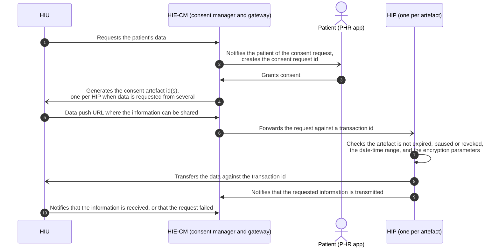
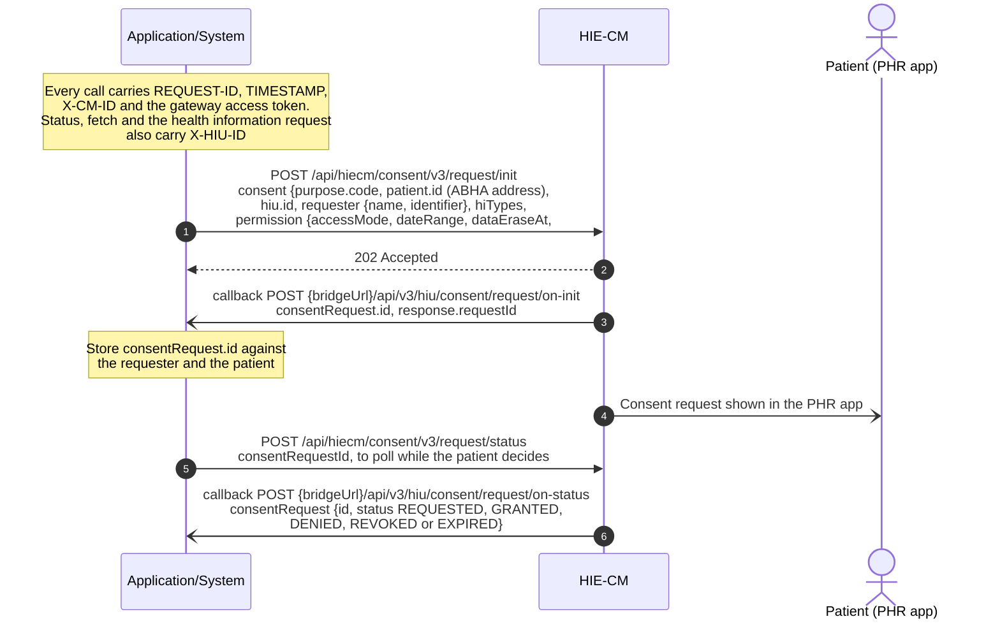
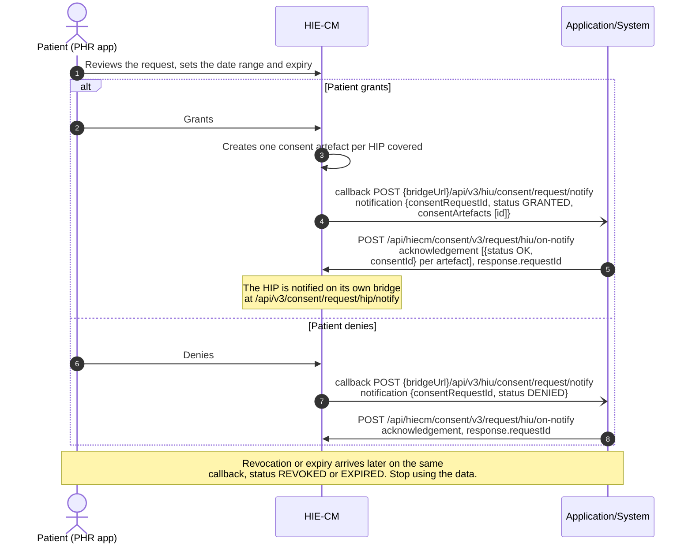
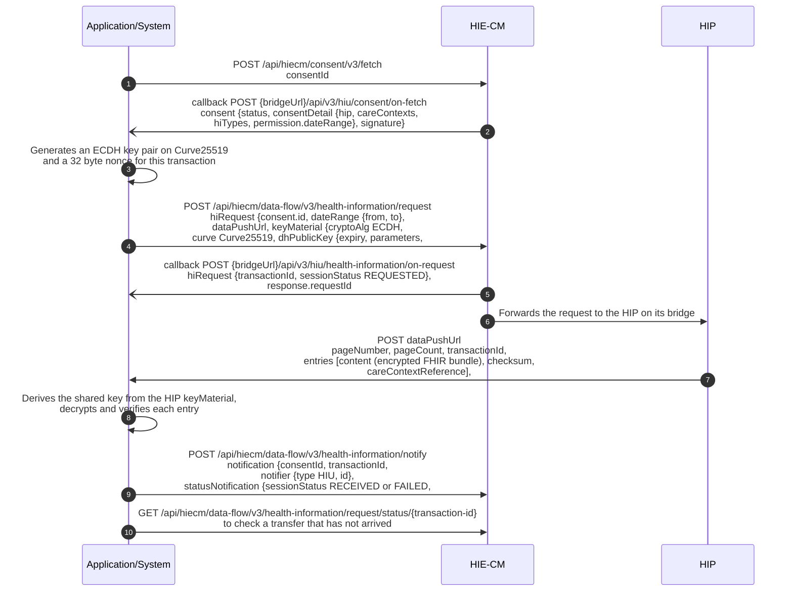

# M3 Health Information User: Fetch data with consent

Milestone 3 (M3) enables a [Health Information User](/docs/pr-48/docs/hiecm/v3/getting-started/glossary#hiu) (HIU) to request, receive and view a patient's health records from [Health Information Providers](/docs/pr-48/docs/hiecm/v3/getting-started/glossary#hip) (HIPs) in a secure and consent-based manner. The HIU initiates a consent request, and upon approval by the patient, the requested health records are securely transferred in the prescribed [FHIR](/docs/pr-48/docs/hiecm/v3/getting-started/glossary#fhir) format for access by the authorised healthcare professional.

## In short

The HIU initiates a consent request using the patient's [ABHA Address](/docs/pr-48/docs/hiecm/v3/getting-started/glossary#abha-address). The [HIE-CM](/docs/pr-48/docs/hiecm/v3/getting-started/glossary#hie-cm) notifies the patient and communicates the consent status to the HIU through the ABDM Gateway. Upon approval, the HIU fetches the generated [consent artefact](/docs/pr-48/docs/hiecm/v3/getting-started/glossary#consent-artefact)(s) and initiates a request for the authorised health information. The concerned HIP validates the request, encrypts the authorised health information and transfers it to the data-push URL specified by the HIU. The HIU receives and decrypts the information and submits the prescribed receipt-status notification.

## M3 functionality

- **Consent Request:** Enables the HIU to initiate a consent request using the patient's ABHA Address. The patient may approve or deny the request through the [PHR](/docs/pr-48/docs/hiecm/v3/getting-started/glossary#phr) application.
- **Status of Consent:** Enables the HIU to track the consent status as Requested, Granted, Denied, Revoked or Expired and fetch the consent artefact(s) generated upon approval.
- **Request Data:** Enables the HIU to request health information against a valid consent artefact, receive and decrypt the FHIR bundle, and display the authorised records in a readable format.

## Use cases

| Use case                                                                         | What it does                                                                                                                                                                                                                   |
| -------------------------------------------------------------------------------- | ------------------------------------------------------------------------------------------------------------------------------------------------------------------------------------------------------------------------------ |
| [Patient record share](/docs/pr-48/docs/hiecm/v3/use-cases/patient-record-share) | A patient scans the QR code at your counter and pushes chosen records from their PHR app to your system. You raise no consent request: you reply with a data push URL and a key, receive the records, and report what arrived. |

All use cases, and the milestone each belongs to: [Use cases](/docs/pr-48/docs/hiecm/v3/use-cases).

## Applicable for

Milestone 3 applies to entities or applications performing the Health Information User (HIU) role and requiring access to health information held by one or more Health Information Providers. These may include healthcare facilities, insurers, referral-service providers, clinical decision-support applications and [PHR](/docs/pr-48/docs/hiecm/v3/getting-started/glossary#phr) applications acting on behalf of the patient.

## Prerequisites

Before implementing Milestone 3, the healthcare facility must complete [Milestone 1](/docs/pr-48/docs/hiecm/v3/milestones/m1) requirements and should be registered as an HIU.

## Consent management flow

The Consent Management Flow facilitates the secure and consent-based exchange of a patient's health information between the HIU and the concerned HIP through the HIE-CM.

- **Health-Information Request:** The HIU initiates a request for the patient's health information through the HIE-CM.
- **Patient Notification:** The HIE-CM generates a Consent Request ID and notifies the patient regarding the consent request through the PHR application.
- **Consent Approval:** The patient grants consent through the PHR application.
- **Consent Artefact Generation:** The HIE-CM generates the consent artefact ID(s) and communicates them to the HIU. Separate consent artefacts are generated where data is requested from multiple HIPs.
- **Data-Push URL:** A data-push URL is generated for receiving the requested health information.
- **Request Validation:** The concerned HIP validates the consent status, applicable date-time range and encryption parameters.
- **Data Transfer:** The requested health information is transferred to the HIU against the Transaction ID assigned by the HIE-CM.
- **Transfer and Receipt Notification:** Upon completion of the transfer, the HIP notifies the HIE-CM that the requested information has been transmitted, and the HIU notifies the HIE-CM regarding successful receipt or failure of the request.

## Build M3 with an AI coding assistant

The M3 skill gives an AI coding assistant this milestone as one file: every M3 call and callback with its error codes. Install it, or open it in your assistant in one click.

M3 agent skill

Every M3 call and callback in one file: 16 operations.

[SKILL.md](/docs/pr-48/skills/abdm-m3/SKILL.md "The router. Use the command below to take the references with it.")

- ScaffoldThe loop that builds the module flow by flow against the sandbox, ending on an observed result rather than on a call returning 200.
- DesignWhat the journey around the calls has to do, and what a screen is forbidden to claim.
- Integrate16 operations, with their hosts and headers.
- DebugNo error code is recorded yet.

`mkdir -p .claude/skills/abdm-m3/references && curl -fsSL https://nha-in.github.io/docs/pr-48/skills/abdm-m3/SKILL.md -o .claude/skills/abdm-m3/SKILL.md && for f in scaffold design integrate debug; do curl -fsSL https://nha-in.github.io/docs/pr-48/skills/abdm-m3/references/$f.md -o .claude/skills/abdm-m3/references/$f.md; done`

[Open in Claude](claude://code/new?q=Install%20the%20ABDM%20M3%20agent%20skill%20into%20this%20project%2C%20then%20help%20me%20use%20it.%0A%0ARun%20this%3A%0Amkdir%20-p%20.claude%2Fskills%2Fabdm-m3%2Freferences%20%26%26%20curl%20-fsSL%20https%3A%2F%2Fnha-in.github.io%2Fdocs%2Fpr-48%2Fskills%2Fabdm-m3%2FSKILL.md%20-o%20.claude%2Fskills%2Fabdm-m3%2FSKILL.md%20%26%26%20for%20f%20in%20scaffold%20design%20integrate%20debug%3B%20do%20curl%20-fsSL%20https%3A%2F%2Fnha-in.github.io%2Fdocs%2Fpr-48%2Fskills%2Fabdm-m3%2Freferences%2F%24f.md%20-o%20.claude%2Fskills%2Fabdm-m3%2Freferences%2F%24f.md%3B%20done%0A%0AIf%20this%20session%20did%20not%20open%20in%20the%20repository%20I%20am%20integrating%20ABDM%20into%2C%20ask%20me%20for%20the%20path%20before%20you%20write%20anything.)

Drops the skill into this project. Claude loads it when a task matches.

How to use it

1. Run the command above in the repository you are integrating.
2. Ask your agent for the job in your own words. "Raise a consent request and fetch the records it covers". The skill loads when the task matches it.
3. Check what it writes against these pages. The skill carries the facts, not the sandbox: nothing in it has been run against ABDM.
4. Open in Claude needs that app installed. It fills the composer and waits: nothing runs until you read it and press Enter.

## Journey 1: raising a consent request

- An HIU requests access to a patient's health data by sending a consent request with the patient's ABHA address via the HIE-CM.
- The HIE-CM acknowledges the request and returns a Consent Request ID through the Gateway.
- The patient is notified by the HIE-CM and can review, approve, or deny the consent request.
- The HIE-CM then communicates the patient's consent status back to the HIU through the Gateway.

The consent request ID is the handle for everything that follows. Store it against the requester and the patient.

## Journey 2: the patient grants or denies

- If the request is approved, the HIE-CM shares the consent artefact IDs generated for that request with the HIU.
- If the request is denied, the HIE-CM notifies the HIU that the consent request has been rejected.

* A consent grant is valid for a specific period decided by the patient.
* One consent grant may generate multiple consent artefacts, so all consent artefact IDs should be stored.
* If the patient revokes consent or it expires, access to the health information must be stopped.

## Journey 3: fetching the records

Using the consent artefact ID, the HIU fetches the consent artefact and requests the health information covered under that consent. The requested health data is then securely delivered to the data push URL provided by the HIU.

## Next

- The calls, callbacks and error codes: [M3 API reference](/docs/pr-48/docs/hiecm/v3/api/m3).
- The cases M3 is tested against: the certification pack NHA issues. Certification runs once, for the whole integration: [Go live](/docs/pr-48/docs/hiecm/v3/getting-started/going-live).
- Receive records a patient pushes from their app: [Patient record share](/docs/pr-48/docs/hiecm/v3/use-cases/patient-record-share).
- The next milestone: [M4 Registry Integration](/docs/pr-48/docs/hiecm/v3/milestones/m4).
