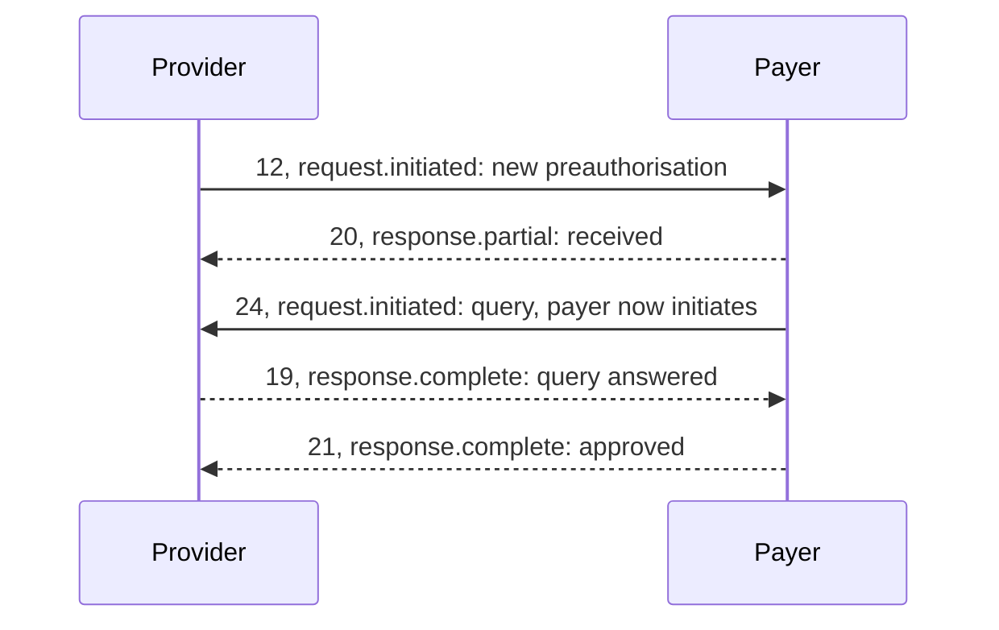

# The JWE message format

Every NHCX message is a JSON Web Encryption (JWE) token: a readable protected header and an encrypted FHIR bundle. This page lists every part, every header field and every value you set or receive. [JWE Secure Messaging](/docs/pr-48/docs/nhcx/v1/concepts/jwe-status-and-errors) explains the model in plain terms. [Building and sending a JWE](/docs/pr-48/docs/nhcx/v1/getting-started/building-and-sending-a-jwe) walks through the first send.

## In short

- Seal with `RSA-OAEP-256` and `A256GCM`, in the compact serialisation of five parts.
- Encrypt with the recipient's public certificate, never your own.
- `api_call_id` is fresh on every message. `correlation_id` threads the conversation and is retired after a failure.
- Answer every delivery with `202` and a receipt within 30 seconds, and host `/v1/error`.

## The five parts

A JWE in compact serialisation is five base64url strings joined by dots.

| Part                     | What it holds                                                           | Readable by the exchange |
| ------------------------ | ----------------------------------------------------------------------- | ------------------------ |
| 1. Protected header      | The envelope: algorithms and every `x-hcx-` field                       | Yes                      |
| 2. Encrypted key         | The one-time content key, encrypted with the recipient's RSA public key | No                       |
| 3. Initialisation vector | A random value for AES-GCM, new per message                             | Not useful alone         |
| 4. Ciphertext            | The FHIR bundle, encrypted with the content key                         | No                       |
| 5. Authentication tag    | The GCM tag over the ciphertext and the protected header                | Not useful alone         |

The request body is a JSON object with one field.

```json
{ "payload": "<header>.<encrypted key>.<iv>.<ciphertext>.<tag>" }
```

## Algorithms

| Setting                   | Send                                                 | Note                                                                                                              |
| ------------------------- | ---------------------------------------------------- | ----------------------------------------------------------------------------------------------------------------- |
| Key wrapping, `alg`       | `RSA-OAEP-256`                                       | The handbook, samples and Postman collection agree. One protocol page says `RSA-OAEP`; it is outnumbered          |
| Content encryption, `enc` | `A256GCM`                                            | Uncontested in the samples                                                                                        |
| Serialisation             | Compact, five parts                                  | The message-security page says flattened JSON. The FAQ, the handbook and every sample use compact                 |
| Recipient key             | The recipient's public certificate from the registry | See [Fetching a recipient certificate](/docs/pr-48/docs/nhcx/v1/getting-started/fetching-a-recipient-certificate) |

### Sealing, step by step

1. Serialise the FHIR bundle as JSON.
2. Build the protected header and base64url encode it.
3. Generate a random 256-bit content key and a 96-bit initialisation vector.
4. Encrypt the content key with the recipient's public key using RSA-OAEP with SHA-256.
5. Encrypt the bundle with AES-256-GCM, using the encoded header as additional authenticated data.
6. Join header, encrypted key, IV, ciphertext and tag with dots.

### Opening, step by step

1. Split the token on the dots and decode the header.
2. Confirm `x-hcx-recipient_code` is your participant code.
3. Decrypt the encrypted key with your private key to recover the content key.
4. Decrypt the ciphertext with AES-256-GCM. A tag mismatch means the header or body changed, and the message must be refused.
5. Parse and validate the FHIR bundle.

A JOSE library does all of this: `jose` on Node, `jwcrypto` on Python, Nimbus on Java, `jose-jwt` on .NET. Do not implement the steps by hand.

## Protected header fields

Every NHCX header name starts with `x-hcx-`. A full header for a new preauthorisation:

```json
{  "alg": "RSA-OAEP-256",  "enc": "A256GCM",  "x-hcx-sender_code": "1000004446@hcx",  "x-hcx-recipient_code": "1000003538@hcx",  "x-hcx-api_call_id": "a1b2c3d4-e5f6-4890-abcd-ef1234567890",  "x-hcx-request_id": "f0e1d2c3-b4a5-4978-8fed-cba987654321",  "x-hcx-correlation_id": "a1b2c3d4-e5f6-4890-abcd-ef1234567890",  "x-hcx-workflow_id": "12",  "x-hcx-timestamp": "2026-09-04T11:46:34+05:30",  "x-hcx-status": "request.initiated",  "x-hcx-ben-abha-id": "91123456781234",  "x-hcx-use_case": "New"}
```

| Field                  | Type        | Obligation | What it carries                                                                                                                    |
| ---------------------- | ----------- | ---------- | ---------------------------------------------------------------------------------------------------------------------------------- |
| `alg`                  | String      | Mandatory  | Key wrapping. `RSA-OAEP-256`                                                                                                       |
| `enc`                  | String      | Mandatory  | Content encryption. `A256GCM`                                                                                                      |
| `x-hcx-sender_code`    | String      | Mandatory  | Your participant code                                                                                                              |
| `x-hcx-recipient_code` | String      | Mandatory  | The recipient's code. For a provider, the processor code from the policy lookup, not the insurer's                                 |
| `x-hcx-api_call_id`    | UUID        | Mandatory  | Fresh on every message, including responses                                                                                        |
| `x-hcx-request_id`     | UUID        | Optional   | One per originating request. Send it anyway, as a fresh UUID per originating request                                               |
| `x-hcx-correlation_id` | UUID        | Mandatory  | The conversation thread. See the rule below                                                                                        |
| `x-hcx-workflow_id`    | String      | Optional   | The step code, for example `12` for a new preauthorisation. See [Workflow codes](/docs/pr-48/docs/nhcx/v1/concepts/workflow-codes) |
| `x-hcx-timestamp`      | datetime    | Mandatory  | When the message was sent. See the format below                                                                                    |
| `x-hcx-status`         | String      | Mandatory  | Where this message stands. Values below                                                                                            |
| `x-hcx-ben-abha-id`    | String      | Optional   | The beneficiary's ABHA number, when the beneficiary has one                                                                        |
| `x-hcx-use_case`       | String      | Optional   | `New`, `Enhancement` or `Resubmit` on preauth and status. `New` or `Resubmit` on claim                                             |
| `x-hcx-error_details`  | JSON object | Optional   | `code`, `message`, `trace`. Mandatory on a protocol response                                                                       |
| `x-hcx-debug_details`  | JSON object | Optional   | The same shape, for debugging                                                                                                      |
| `x-hcx-debug_flag`     | Enum        | Optional   | The specification lists `Error`, `Info` and `Debug`; the samples send `INFO`. A server may ignore it                               |

Three field rules catch people out.

- **Request ID.** `x-hcx-request_id` is optional here and mandatory on the Open Protocol page. Send it on every message, as a fresh UUID per originating request: it is cheap and satisfies both readings until NHA rules on which one stands.
- **ABHA number format.** Inside the bundle it is 14 digits without hyphens. The published header sample also sends 14 digits, but the gateway's refusal `NHCX-1018` asks for `XX-XXXX-XXXX-XXXX`. Store the digits once and format them where you build the header.
- **Workflow code.** Send the step code where the Workflow Status Sheet gives one. Leave it out where it does not, for example on eligibility, insurance plan, search and status.

[Envelope fields](/docs/pr-48/docs/nhcx/v1/reference/envelope-fields) records where each obligation comes from and where sources disagree.

### Domain headers

A few facts may be written on the envelope for the exchange's audit trail. The format is `x-hcx-<use_case_name>-<parameter_name>`. The use case name is under 16 characters and the parameter name under 32. Named examples in use:

- `x-hcx-amount_submitted`
- `x-hcx-benefit-category_type`
- `x-hcx-benefit_code`
- `x-hcx-action`

The eObjects page adds a `Usage` header on the Claim carrying `preauthorization` or `claim`. An insurance marketplace must carry the beneficiary's consent in a domain header before it may receive individual claim data. Send none to a payer that has not asked for one.

## Identifiers and the correlation rule

Three identifiers are UUIDs.

| Identifier       | Scope                                                        |
| ---------------- | ------------------------------------------------------------ |
| `api_call_id`    | New on every message, request or response                    |
| `request_id`     | New per originating request                                  |
| `correlation_id` | One per conversation, shared by the request and every answer |

| On a                         | Set `correlation_id` to                                            |
| ---------------------------- | ------------------------------------------------------------------ |
| Request                      | This message's own `api_call_id`                                   |
| Response                     | The `correlation_id` of the request being answered                 |
| Status enquiry, `/v1/status` | The `api_call_id` of the message whose status you are asking about |

- On a response, `api_call_id` and `correlation_id` are different values.
- A correlation ID that failed at the exchange, or whose delivery stopped, is retired. A retry needs a fresh `api_call_id` and a fresh `correlation_id`. Reusing one earns `NHCX-1006`, duplicate request, or is silently dropped.

## Timestamp

Send ISO 8601 with `+05:30`, as every sample bundle does. Accept a Unix epoch on the way in.

The sources disagree on this field:

- The workbook types it as a Unix timestamp, with `1706308383` as its example.
- The handbook says Indian time, and that UTC fails validation.
- The FAQ says UTC with a trailing `Z`.

The reference payer refuses a timestamp more than 24 hours behind the current time, with `PAYR-1005`. The ABDM session call is separate: its `TIMESTAMP` header is UTC with a trailing `Z` and milliseconds.

## Status values



| Value                | Sent by       | Meaning                                                         |
| -------------------- | ------------- | --------------------------------------------------------------- |
| `request.initiated`  | The initiator | Starting a request cycle                                        |
| `request.queued`     | The exchange  | Passed header validation and waiting in the dispatch queue      |
| `request.dispatched` | The exchange  | Delivered to the recipient's callback                           |
| `request.stopped`    | The exchange  | Delivery abandoned after retries. The correlation ID is retired |
| `response.partial`   | The responder | Received and working on it, or an interim answer                |
| `response.complete`  | The responder | The final answer, closing the cycle                             |
| `response.error`     | The responder | The message was refused                                         |

The status pairs with the workflow code: the code says which step, the status says where that step stands. A preauthorisation's life:

| Who sends | Workflow code | Status              | Meaning                                      |
| --------- | ------------- | ------------------- | -------------------------------------------- |
| Provider  | 12            | `request.initiated` | New preauthorisation                         |
| Payer     | 20            | `response.partial`  | Received, under review                       |
| Payer     | 24            | `request.initiated` | Query raised. The payer is now the initiator |
| Provider  | 19            | `response.complete` | Query answered                               |
| Payer     | 21            | `response.complete` | Approved                                     |

The Open Protocol page lists a different set: `request.initiate`, `request.retry`, `response.success`, `response.fail`, `response.sender_not_supported`, `response.unhandled` and `response.request_retry`. None appears in the workflow sheet, any sample or the gateway's validation. It is a superseded draft; do not build against it.

## The receipt

Whoever receives a message, the exchange or your callback, answers at once with `202 Accepted` and this receipt.

```json
{  "timestamp": "04/09/2026 11:46:35:120",  "api_call_id": "a1b2c3d4-e5f6-4890-abcd-ef1234567890",  "correlation_id": "a1b2c3d4-e5f6-4890-abcd-ef1234567890",  "result": {    "sender_code": "1000004446@hcx",    "recipient_code": "1000003538@hcx",    "entity_type": "preauth",    "protocol_status": "request.queued"  },  "error": { "code": "", "message": "" }}
```

- `protocol_status` is `request.queued`, `request.dispatched` or `request.error`.
- `entity_type` comes from the path: the second to last segment, or the last where that is `v1`, with `on_` stripped.
- The receipt's `timestamp` is written day first, as `DD/MM/YYYY HH:mm:ss:SSS`. That form belongs to the receipt only. The `x-hcx-timestamp` header still takes ISO 8601 with `+05:30`, as [Timestamp](#timestamp) sets out.
- Your callback must return exactly this receipt within 30 seconds. Anything else, including a slow `200`, counts as a failed delivery.

The receipt is not the decision. It says only that the message was taken in.

## Errors

| Where it fails                                                                                   | Who refuses   | How the sender hears                                                     |
| ------------------------------------------------------------------------------------------------ | ------------- | ------------------------------------------------------------------------ |
| Envelope: missing header, unknown recipient, expired token, bad status                           | The exchange  | At once: `400` for validation, `401` for the token                       |
| Letter: cannot decrypt, or the bundle fails validation                                           | The recipient | Later, as a protocol response on the callback                            |
| Delivery: the callback never returned a valid receipt                                            | The exchange  | On the sender's `/v1/error` endpoint                                     |
| Business: not covered, an active preauthorisation already open, balance too low, duplicate claim | The payer     | Later, inside a sealed answer on the callback, usually as a `PAYR-` code |

A **protocol response** carries the same envelope fields with `x-hcx-status` set to `response.error` and a `code`, `message` and `trace` in `x-hcx-error_details`. The exchange logs its header for audit. Business refusals, such as "not covered", travel inside a sealed answer instead.

**Retries.** If a callback does not return a proper receipt, the exchange tries five times, moves the message to `request.stopped` and retires the correlation ID. It then reports the failure on `/v1/error`, which every participant must host.

`NHCX-1010`, *no data with given correlation id for call back request*, is what a payer hears when it answers a submission too late. Acknowledge a submission at once with a `ClaimResponse` whose `outcome` is `queued`, then send the decision later on the same correlation ID.

### Codes met live

Several payer codes mean something other than their message suggests. From the September 2026 sandbox run:

| Code                     | The message                                                                                       | Cause                                                                                                                                                                      | What to do                                                                                                                                                                                                    |
| ------------------------ | ------------------------------------------------------------------------------------------------- | -------------------------------------------------------------------------------------------------------------------------------------------------------------------------- | ------------------------------------------------------------------------------------------------------------------------------------------------------------------------------------------------------------- |
| `PAYR-1027`              | Invalid item id found for item in claim component                                                 | `Claim.item` has no FHIR element `id` (`Item/1`). Nothing to do with the package code                                                                                      | Give every `Claim.item` an element `id`, then send again. `PAYR-1028` (item sequence) and `PAYR-1029` (bundle id) are the same kind of fault                                                                  |
| `PAYR-1083`              | No HPR details found for the practitioner … category code as HPIN                                 | The `Practitioner` carries no identifier typed `HPIN`                                                                                                                      | Add the HPR id as an identifier typed `HPIN` from the NRCeS `ndhm-identifier-type-code` system. [PMJAY sandbox run](/docs/pr-48/docs/nhcx/v1/roles/provider/pmjay-sandbox-run) shows the full identifier list |
| `PAYR-1238`              | Beneficiary is having an active preauthorization request at this hospital with reference number … | Scheme rule, not a bundle fault: one live preauthorisation per beneficiary per hospital. The reference number ends in the SHA's case id                                    | Cancel the open preauthorisation with a cancel Task on workflow `PC01` from the hospital that raised it, or raise the claim that goes with it                                                                 |
| `PAYR-1401`              | Policy not allowed for the hospital                                                               | The plan was asked for under a policy the hospital is not empanelled under                                                                                                 | Ask again under the beneficiary's policy code from the eligibility answer                                                                                                                                     |
| `PAYR-1019`              | Invalid sequence received in supporting info element                                              | A `supportingInfo` entry with no `sequence`, typically one appended after the rest were numbered                                                                           | Number the whole list once it is assembled                                                                                                                                                                    |
| `PAYR-1256`, `PAYR-1363` | Response for Authentication Consent Questionnaire is missing                                      | The plan's consent questionnaire, unanswered, where no biometric token was taken. `PAYR-1256` is at the preauthorisation, `PAYR-1363` at the claim                         | Answer the questionnaire named in the package master as a `QuestionnaireResponse`, referenced from a supporting-info entry of category `INF`, code `ODN`                                                      |
| `PAYR-1008`              | Invalid content type … / Invalid input, code and reason code …                                    | Two of fifteen uncoded texts all sent as `PAYR-1008`: a document outside pdf, jpg, jpeg, png and fhir+json, or a Task code paired with a reason the scheme does not accept | Attach only those five content types, and pair each Task code with a reason the scheme accepts. [Reading error codes](/docs/pr-48/docs/nhcx/v1/reference/error-code-guide) lists all fifteen                  |
| `PAYR-1245`              | Only one conservative procedure can be booked for a case                                          | The master's `ProcedureType`: the enhancement added a second `Conservative` package                                                                                        | Add a `Medical` package or an enhanceable add-on instead                                                                                                                                                      |
| `ERR-PYR-CLM-007`        | No prior preauthorization or claim record found for case number                                   | The claim was sent under a case number of its own instead of the preauthorisation's                                                                                        | Send the claim under the preauthorisation's case number, in the `Claim` identifier. If no preauthorisation exists, submit one first. Resend with a fresh correlation ID                                       |
| `PAYR-1322`              | Active instance found for case number                                                             | A request is already open on that case; the scheme takes one at a time                                                                                                     | Wait for the decision on the open request before sending the next                                                                                                                                             |

A refusal in the `PAYR-102x` block is structural, so check ids and sequences before values. The SHA validates the bundle before applying scheme rules, so `PAYR-1238` is the first sign the bundle itself is right. Every code is in [Error codes](/docs/pr-48/docs/nhcx/v1/reference/error-codes).

## Common mistakes

1. Wrong status value for the leg of the message.
2. No `/v1/error` endpoint, so failures go unnoticed.
3. Answering a callback with something other than `202` and the receipt.
4. Missing or malformed envelope headers.
5. In production, the wrong registry ID: providers send the HFR ID, payers the IRDAI ID without leading zeros.
6. Forgetting the `Accept: application/json` header.
7. Addressing the insurer's code instead of the processor's.
8. Reusing a correlation ID, especially after an error.
9. Retrying on a `401` with the same expired token instead of fetching a new one.
10. Trying to de-link a policy from a participant that did not link it.
11. Sealing with your own certificate, or a stale one, instead of the recipient's.
