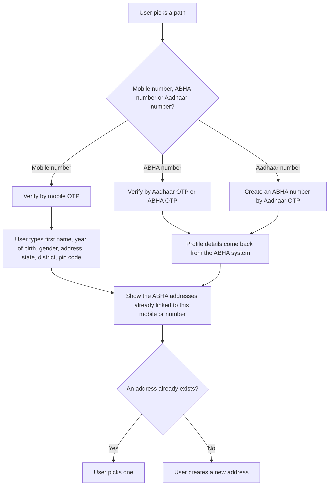

# P1 Registration and login

P1 is the patient side of [M1 Identity](/docs/pr-66/docs/hiecm/v3/milestones/m1). M1 is how a hospital system creates an [ABHA](/docs/pr-66/docs/hiecm/v3/getting-started/glossary#abha). P1 is how the patient's own [PHR](/docs/pr-66/docs/hiecm/v3/getting-started/glossary#phr) app does it, and how it maintains the account afterwards.

## In short

- Every user needs an ABHA address, `username@abdm`. Consent, notifications and record sharing all hang off it.
- Build all three creation paths: by mobile number, by an existing 14 digit ABHA number, and by Aadhaar number for someone with no ABHA number yet.
- Every login route is mandatory.
- Fetch the PHR public key first. It is not the ABHA service's key.
- A user can hold several ABHA addresses but only one ABHA number.

## What you build

Registration and login. The profile the patient reads and edits is [P2](/docs/pr-66/docs/hiecm/v3/milestones/p2).

## Creating an ABHA address

A person does not need an [ABHA number](/docs/pr-66/docs/hiecm/v3/getting-started/glossary#abha-number), and does not need Aadhaar, to get an ABHA address here. A mobile number and the OTP sent to it are enough. What that buys is a Self-Declared profile: an address the network can route to, with no [KYC](/docs/pr-66/docs/hiecm/v3/getting-started/glossary#kyc) behind it and no ABHA number until the person links one later.

| Path                                    | Validated by                                                         | Profile details             | Result                                                                          |
| --------------------------------------- | -------------------------------------------------------------------- | --------------------------- | ------------------------------------------------------------------------------- |
| Mobile number                           | Mobile [OTP](/docs/pr-66/docs/hiecm/v3/getting-started/glossary#otp) | The user types them         | Self-Declared, no [KYC](/docs/pr-66/docs/hiecm/v3/getting-started/glossary#kyc) |
| 14 digit ABHA number                    | Aadhaar OTP or ABHA OTP                                              | Returned by the ABHA system | KYC Verified                                                                    |
| Aadhaar number, with no ABHA number yet | Aadhaar OTP, which creates the ABHA number first                     | Returned by the ABHA system | KYC Verified                                                                    |

After validation on any path, show the ABHA addresses already linked to that mobile number or ABHA number. The user then picks one instead of creating a duplicate.

A Self-Declared profile needs a "Link ABHA number" action. The user enters the 14 digit number and validates by Aadhaar OTP or ABHA OTP. Profile details then follow the ABHA number, and the status changes to KYC Verified.

Notes for AI agents

**Before you start.** A gateway session token, the PHR certificate from `GET /abha/api/v3/phr/app/login/public/certificate`, and secure storage for the refresh token, because login follows at once.

**What happens.** Request the OTP at `/abha/api/v3/phr/app/enrollment/request/otp`, with scope `abha-address-enroll` and `mobile-verify` on the mobile path, and verify it at `/abha/api/v3/phr/app/enrollment/verify`. List the addresses already linked and let the person pick one. Only when there is none, offer suggestions from `/abha/api/v3/phr/app/enrollment/suggestion`, check the choice with `/abha/api/v3/phr/app/enrollment/isExists`, and create it with `/abha/api/v3/phr/app/enrollment/enrol`.

**How you know it worked.** The person holds an address such as `name@abdm`, the profile shows Self-Declared or KYC Verified by the path taken, and listing the addresses on that mobile or ABHA number now returns it.

**When it goes wrong.** A duplicate address, because the existing addresses were not shown first. A mandatory field missing on the mobile path, refused as validation: first name, year of birth, gender, address, state, district and pin code are the mandatory set, and day and month of birth are not in it. An expired OTP: resend unlocks after 60 seconds, so say so on the screen.

## Login

Sign a user in to a PHR application by any of these routes. Every route is mandatory.

| Route                          | Validated by                                                     |
| ------------------------------ | ---------------------------------------------------------------- |
| Mobile number                  | Mobile OTP                                                       |
| An address such as `name@abdm` | Password or mobile OTP, by the auth methods the address supports |
| The 14 digit ABHA number       | ABHA OTP or Aadhaar OTP                                          |
| The Aadhaar number             | Aadhaar OTP                                                      |

Every OTP route returns the ABHA addresses linked to that identifier. The user picks the one to sign in as, and you confirm the choice with the verify user call.

Resend OTP unlocks after 60 seconds in every flow. You also need a reset password screen behind login, secure storage of the refresh token, and more than one user profile per install with sign in and sign out.

Notes for AI agents

**Before you start.** The person holds an ABHA address, and you hold a gateway session token and the PHR certificate.

**What happens.** For an address, read the auth methods it supports with `/abha/api/v3/phr/app/login/search` and offer only those. Request the OTP at `/abha/api/v3/phr/app/login/request/otp` and verify at `/abha/api/v3/phr/app/login/verify`; the scope and login hint say which route a call belongs to. When the verify response lists addresses, let the person choose and confirm with `/abha/api/v3/phr/app/login/verify/user`. Store the refresh token securely.

**How you know it worked.** The app holds a session for one named ABHA address, and signing out and back in returns the person to that address without repeating the choice.

**When it goes wrong.** A password is asked of an address that has none, because the auth methods were not read. A mobile carrying several addresses signs the person in as the wrong one, because no chooser was shown. Resend offered before 60 seconds, or with no word that the wait is deliberate.

## Tokens and base URLs

| Token or URL                          | Value                                              |
| ------------------------------------- | -------------------------------------------------- |
| Gateway session token                 | Valid for 20 minutes                               |
| User token from login                 | Valid for 30 minutes                               |
| Refresh token                         | Valid for 15 days                                  |
| PHR APIs, sandbox                     | `https://abhasbx.abdm.gov.in/abha/api/v3/phr/app/` |
| PHR APIs, production                  | `https://apis.abdm.gov.in/phr/api/phr/app/v3/`     |
| ABHA address verification, sandbox    | `https://abhasbx.abdm.gov.in/abha/api/v3/phr/web`  |
| ABHA address verification, production | `https://phr.abdm.gov.in/api/phr/web/v3`           |

Encrypt the Aadhaar number, mobile number, OTP and password with the PHR public key from `GET /abha/api/v3/phr/app/login/public/certificate`. It is a different key from the ABHA service's, so fetch it before any other PHR call.

## Next

- The calls and base URLs: [P1 API reference](/docs/pr-66/reference/hiecm-p1).
- The next milestone: [P2 Consents Management](/docs/pr-66/docs/hiecm/v3/milestones/p2).

