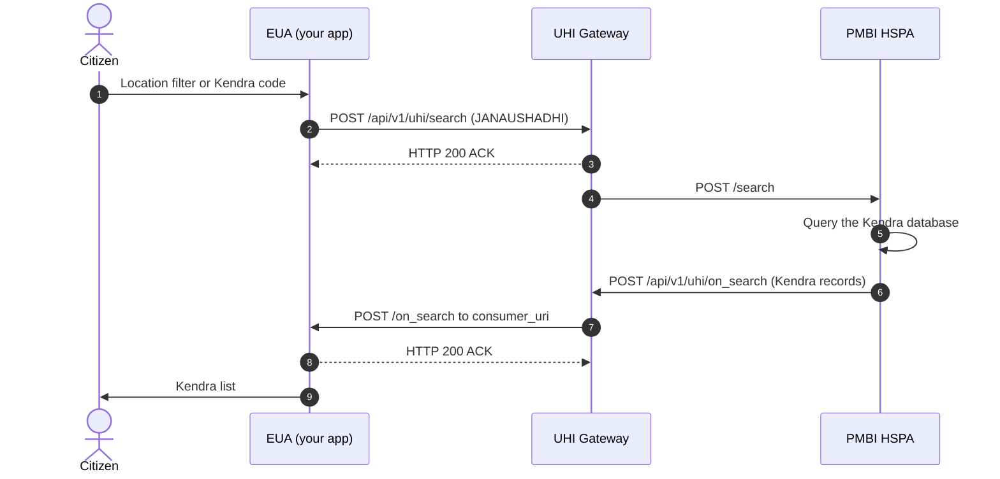
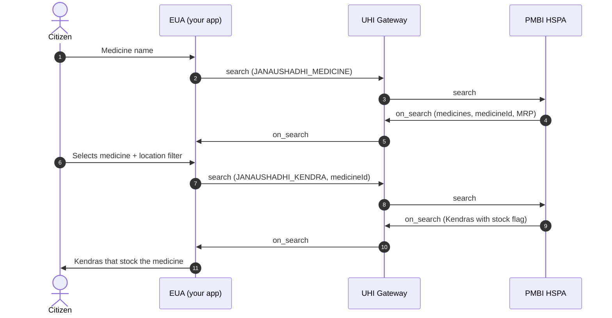

# Jan Aushadhi: Find Kendras and generic medicines

Jan Aushadhi on [UHI](/docs/pr-73/docs/uhi/v1/getting-started/glossary#uhi) helps a citizen find a Jan Aushadhi Kendra near them. It also finds which Kendras stock a specific generic medicine. The Pharmaceuticals and Medical Devices Bureau of India (PMBI) runs the single [HSPA](/docs/pr-73/docs/uhi/v1/getting-started/glossary#hspa), backed by its Kendra and medicine database. You build the [EUA](/docs/pr-73/docs/uhi/v1/getting-started/glossary#eua).

## In short

- **One domain, three fulfillment types.** Get `fulfillment.type` wrong and the HSPA returns the wrong kind of catalog, or nothing.
- **Every call is `search` and `on_search` through the UHI Gateway.** There is no booking or ordering.
- **No mandatory location.** State is not required. Each filter works alone or combined.
- **Medicine search is a two step chain.** Flow B turns a name into a `medicineId`. Flow C uses that ID to find stock nearby.
- **Stock is a flag.** In flow C, `items[].descriptor.flag` is `true` for in stock and `false` for out of stock.

## Jan Aushadhi functionalities

The service is discovery: `search` and `on_search`. The three flows differ only by `fulfillment.type` and what goes in `item.descriptor`.

| Flow                                   | `fulfillment.type`     | You send                                                           | You get back                                                       |
| -------------------------------------- | ---------------------- | ------------------------------------------------------------------ | ------------------------------------------------------------------ |
| A. Find a Kendra                       | `JANAUSHADHI`          | Location filters or a Kendra code                                  | Kendras with address, GPS, contact, ownership and enrolment date   |
| B. Find a medicine                     | `JANAUSHADHI_MEDICINE` | Medicine name                                                      | Matching medicines with `medicineId`, item code, MRP and pack unit |
| C. Find Kendras stocking that medicine | `JANAUSHADHI_KENDRA`   | `medicineId` from flow B, plus the same location filters as flow A | Kendras with the medicine's stock status                           |

| In scope                                                  | Out of scope |
| --------------------------------------------------------- | ------------ |
| Kendra search by code, state and district, pincode or GPS | Booking      |
| Generic medicine search by name, with MRP and pack unit   | Ordering     |
| Kendras that stock a selected medicine, with a stock flag |              |

## Prerequisites

1. Your app has completed [HIE-CM](/docs/pr-73/docs/uhi/v1/getting-started/glossary#hie-cm) [Milestone 2](/docs/pr-73/docs/hiecm/v3/milestones/m2). An app without M2 cannot be onboarded onto any UHI service.
2. You have a public HTTPS callback URL. It is your `consumer_uri`, and `on_search` arrives there.
3. You have an Ed25519 key pair and sign every call. See [Signing](/docs/pr-73/docs/uhi/v1/concepts/signing).
4. Your code accepts an ACK now and the answer later, matched by `transaction_id`. See [Messages](/docs/pr-73/docs/uhi/v1/concepts/messages).
5. You hold a subscriber ID from sandbox registration. See [Get your sandbox credentials](/docs/pr-73/docs/uhi/v1/getting-started/sandbox).

## Service identity

| Field                         | Flow A          | Flow B                   | Flow C                   |
| ----------------------------- | --------------- | ------------------------ | ------------------------ |
| `context.domain`              | `nic2008:47721` | `nic2008:47721`          | `nic2008:47721`          |
| `context.core_version`        | `0.7.1`         | `0.7.1`                  | `0.7.1`                  |
| `intent.fulfillment.type`     | `JANAUSHADHI`   | `JANAUSHADHI_MEDICINE`   | `JANAUSHADHI_KENDRA`     |
| `intent.item.descriptor.code` | `JANAUSHADHI`   | Medicine name, no spaces | `medicineId` from flow B |
| `intent.item.descriptor.name` | `JANAUSHADHI`   | Medicine name            | `medicineId` from flow B |

| HSPA             | Value                                                  |
| ---------------- | ------------------------------------------------------ |
| Provider ID      | `pmbi.hspa`                                            |
| Sandbox URL      | `https://staging-nha-pmbi.pmbi.co.in/api/store`        |
| Public key ID    | `pmbi.hspapid.jak`, for checking the HSPA's signatures |
| Gateway endpoint | `POST /api/v1/uhi/search`                              |

## Search variants

### Location filters, flows A and C

| Search             | Fields                                                                                                                            |
| ------------------ | --------------------------------------------------------------------------------------------------------------------------------- |
| Kendra code        | `category.descriptor.code` and `.name`, both set to the Kendra code itself, for example `PMBJK02129`                              |
| State and district | `location.state.name` and `.code`, for example Telangana, `36`. `location.district.name` and `.code`, for example KHAMMAM, `509`. |
| Pincode            | `address.area_code`, 6 digits, a sibling of `location`                                                                            |
| GPS and radius     | `location.gps`, `radius.type: CONSTANT`, `radius.value` such as `5`, `radius.unit: km`                                            |
| Combined           | State, district and pincode together, for the narrowest result                                                                    |

### Medicine name, flow B

Put the medicine name in `item.descriptor.name`, and the same name without spaces in `item.descriptor.code`. For example, `Paracetamol` in both.

### Kendra ownership codes

A Kendra's `descriptor.code` in flows A and C is its ownership type.

| Code | Ownership             |
| ---- | --------------------- |
| `PP` | Private-Private       |
| `PG` | Private-Government    |
| `GG` | Government-Government |

The list is not closed. Display an unrecognised code as sent.

### Sample search, flow A by Kendra code

Use a fresh `message_id` and `transaction_id` for each search.

```json
{  "context": {    "domain": "nic2008:47721",    "country": "IND",    "city": "std:011",    "action": "search",    "core_version": "0.7.1",    "consumer_id": "<YOUR_SUBSCRIBER_ID_FROM_REGISTRATION>",    "consumer_uri": "<YOUR_PUBLIC_HTTPS_CALLBACK_URL>",    "message_id": "e9a19230-f951-11ec-b135-53aea776f66b",    "timestamp": "2026-06-09T18:24:35",    "transaction_id": "e9a19230-f951-11ec-b135-53aea776f66b"  },  "message": {    "intent": {      "category": {        "descriptor": { "code": "PMBJK02129", "name": "PMBJK02129" }      },      "fulfillment": {        "type": "JANAUSHADHI",        "start": { "time": { "timestamp": "2026-06-19T00:00:00" } },        "end": { "time": { "timestamp": "2026-06-19T23:59:59" } }      },      "item": {        "descriptor": { "code": "JANAUSHADHI", "name": "JANAUSHADHI" }      }    }  }}
```

### Sample search, flow B by medicine name

The `context` block is the same.

```json
{  "intent": {    "fulfillment": {      "type": "JANAUSHADHI_MEDICINE",      "start": { "time": { "timestamp": "2026-06-09T00:00:00" } },      "end": { "time": { "timestamp": "2026-06-09T23:59:59" } }    },    "item": {      "descriptor": { "code": "Paracetamol", "name": "Paracetamol" }    }  }}
```

### Sample search, flow C for a selected medicine

The `context` block is the same, with a new `transaction_id`. `76476` is a `medicineId` from flow B.

```json
{  "intent": {    "fulfillment": {      "type": "JANAUSHADHI_KENDRA",      "start": { "time": { "timestamp": "2026-06-19T00:00:00" } },      "end": { "time": { "timestamp": "2026-06-19T23:59:59" } }    },    "item": {      "descriptor": { "code": "76476", "name": "76476" }    },    "location": {      "district": { "code": "507", "name": "HYDERABAD" },      "state": { "code": "36", "name": "Telangana" }    }  }}
```

## Journey 1: find a Kendra

A citizen searches for Jan Aushadhi Kendras.

The first call in the reference is [search](/docs/pr-73/docs/uhi/v1/api/network/endpoints/uhi-jan-aushadhi-kendra-search/01-uhi-network-gateway-search).

Notes for AI agents

**Before you start.** The EUA has a public HTTPS `consumer_uri` and signs every call. Set `nic2008:47721`, and `JANAUSHADHI` as both the fulfillment type and the item code and name. Every location filter is optional.

**What happens.** The EUA sends `POST /api/v1/uhi/search` with a location filter, or with a Kendra code in `category.descriptor.code` and `.name`. The Gateway answers HTTP 200 ACK and forwards it to `pmbi.hspa`. Its `on_search` reaches your `consumer_uri` through the Gateway.

**How you know it worked.** An `on_search` arrives with your `transaction_id`. Each `providers[]` record is one Kendra, and its `id` is the Kendra code.

**When it goes wrong.** A wrong `fulfillment.type` returns the wrong kind of catalog, or nothing. Empty city, email, `short_desc` or `long_desc` are not errors. Display an unrecognised ownership code as sent. Check the HSPA's signature with key ID `pmbi.hspapid.jak`.

## Journey 2: find a medicine, then a Kendra that stocks it

A citizen looks up a generic medicine by name, then searches for Kendras that stock it. Gateway ACKs are left out of this diagram.

The two searches are separate transactions. Only `medicineId` carries across from step 5 to step 7.

The first call of each search in the reference: [medicine search](/docs/pr-73/docs/uhi/v1/api/network/endpoints/uhi-jan-aushadhi-medicine-search/01-uhi-network-gateway-search) and [Kendras for a selected medicine](/docs/pr-73/docs/uhi/v1/api/network/endpoints/uhi-jan-aushadhi-medicine-stock/01-uhi-network-gateway-search).

Notes for AI agents

**Before you start.** The EUA has a public HTTPS `consumer_uri` and signs every call, with `context.domain` set to `nic2008:47721`. The citizen has typed a medicine name.

**What happens.** The first search uses `JANAUSHADHI_MEDICINE`, with the name in `item.descriptor.name` and the name without spaces in `item.descriptor.code`. Its `on_search` lists medicines, and each `providers[].id` is a `medicineId`. After the citizen picks one, the second search uses a new `transaction_id` and `JANAUSHADHI_KENDRA`. It carries the `medicineId` in `item.descriptor.code` and `.name`, plus any location filter.

**How you know it worked.** The second `on_search` lists Kendras. Each carries the medicine in `items[]`, where `descriptor.flag` is `true` for in stock and `false` for out of stock.

**When it goes wrong.** Never send a medicine name in the second search. Name matching is not fixed, so show every medicine returned and let the citizen choose. Render stock from `descriptor.flag`, and show a count from `quantity.measure.value` only when one arrives. `location.radius` carries a distance only when the search sent GPS.

## What comes back

The meaning of `providers[]` changes by flow. In flows A and C, a provider is a Kendra. In flow B, a provider is a medicine.

| Flow | Key fields in each `providers[]` record                                                                                                                                                                                                                                    |
| ---- | -------------------------------------------------------------------------------------------------------------------------------------------------------------------------------------------------------------------------------------------------------------------------- |
| A    | `id` is the Kendra code, for example `PMBJK10844`. `descriptor.code` is ownership. `descriptor.symbol` is a serial number. `fulfillments[]` of type `contact` carries the contact person and enrolment date. `location` and `contact` carry address, GPS, phone and email. |
| B    | `id` is the `medicineId`, for example `77041`. `descriptor.name` is the generic name. `descriptor.code` is the item code. `items[].price.value` is the MRP in INR. `items[].quantity.measure.unit` is the pack unit, for example `10's`.                                   |
| C    | The Kendra fields of flow A, plus `items[]` for the medicine with `descriptor.flag` as the stock status                                                                                                                                                                    |

### Sample on\_search, flow A

Trimmed to one Kendra.

```json
{  "context": {    "domain": "nic2008:47721",    "country": "IND",    "city": "std:011",    "action": "on_search",    "core_version": "0.7.1",    "consumer_id": "nha.eua",    "consumer_uri": "https://uhieuasandbox.abdm.gov.in/api/v1/euaService",    "provider_id": "pmbi.hspa",    "provider_uri": "https://staging-nha-pmbi.pmbi.co.in/api/store",    "message_id": "e9a19230-f951-11ec-b135-53aea776f66b",    "timestamp": "2026-06-09T18:24:35",    "transaction_id": "e9a19230-f951-11ec-b135-53aea776f66b"  },  "message": {    "catalog": {      "descriptor": {        "name": "JAN AUSHADHI KENDRA HSPA",        "images": "https://janaushadhi.gov.in/img/bhartiya_janaushadhi_priyojna_2.svg",        "short_desc": "",        "long_desc": ""      },      "providers": [        {          "id": "PMBJK08762",          "descriptor": { "name": "Jan Aushadhi Kendra", "code": "PP", "symbol": "2", "short_desc": "", "long_desc": "" },          "fulfillments": [            { "id": "0", "type": "contact", "agent": { "name": "<NAME>" }, "start": { "time": { "timestamp": "2021-07-29T00:00:00" } } }          ],          "location": {            "id": "1",            "descriptor": { "name": "Jan Aushadhi Kendra" },            "city": { "name": "", "code": "" },            "district": { "name": "PUNE", "code": "490" },            "state": { "name": "Maharashtra", "code": "27" },            "country": { "name": "INDIA", "code": "+91" },            "gps": "18.51787100000001,73.86446748220898",            "address": "<ADDRESS>",            "radius": { "type": "CONSTANT", "value": "1.54", "unit": "km" }          },          "contact": { "phone": "<MOBILE_NUMBER>", "email": "<EMAIL>" }        }      ]    }  }}
```

### Sample on\_search, flow B

The `context` matches flow A. Trimmed to one medicine.

```json
{  "catalog": {    "descriptor": { "name": "JAN AUSHADHI KENDRA HSPA" },    "providers": [      {        "id": "76476",        "descriptor": {          "name": "Aceclofenac 100mg and Paracetamol 325mg Tablets",          "code": "1",          "symbol": "",          "short_desc": "",          "long_desc": ""        },        "items": [          {            "id": "0",            "price": { "currency": "INR", "value": "10.320" },            "quantity": { "measure": { "unit": "10's" } }          }        ]      }    ]  }}
```

### Sample on\_search, flow C

Each Kendra carries the flow A fields plus the medicine in `items[]`.

```json
{  "items": [    {      "id": "76476",      "descriptor": {        "name": "Aceclofenac 100mg and Paracetamol 325mg Tablets",        "code": "1",        "symbol": "",        "short_desc": "",        "flag": false      }    }  ]}
```

## Concepts explored

- **`fulfillment.type` as the switch.** The domain, Gateway and HSPA are the same across the three flows. The type alone says whether you want Kendras, medicines or stock.
- **Chaining by `medicineId`.** Never send a medicine name in flow C. Take `providers[].id` from flow B and put it in `item.descriptor.code` and `.name`.
- **Contact is a fulfillment.** The Kendra contact person and enrolment date sit in `fulfillments[]` with `type: contact`. The `contact` block holds only phone and email.
- **Distance only when you send GPS.** `location.radius` in a Kendra record is the distance from the user to the Kendra. It carries a value only when the request carried GPS.
- **Sparse fields.** City, email, `short_desc` and `long_desc` can be empty. Do not treat empty as an error.
- **Stock count is optional.** A count in `quantity.measure.value` may be sent in flow C. Do not depend on it.

## Field reference

### search: context

All fields are mandatory.

| Field            | Type     | Value                                                              |
| ---------------- | -------- | ------------------------------------------------------------------ |
| `domain`         | string   | `nic2008:47721`, fixed                                             |
| `country`        | string   | `IND`, fixed                                                       |
| `city`           | string   | STD code, for example `std:011`                                    |
| `action`         | string   | `search`, fixed                                                    |
| `core_version`   | string   | `0.7.1`                                                            |
| `consumer_id`    | string   | Your registered EUA identifier                                     |
| `consumer_uri`   | string   | Your HTTPS callback URL for `on_search`                            |
| `message_id`     | UUID     | Unique per call. Never reuse it.                                   |
| `transaction_id` | UUID     | Unique per search session. The `on_search` carries the same value. |
| `timestamp`      | ISO 8601 | Request time, for example `2026-06-09T18:24:35`                    |

### search: message.intent, flows A and C

| Field path                         | Type            | Mandatory                | Description                                                   |
| ---------------------------------- | --------------- | ------------------------ | ------------------------------------------------------------- |
| `fulfillment.type`                 | string          | Yes                      | `JANAUSHADHI` in flow A, `JANAUSHADHI_KENDRA` in flow C       |
| `fulfillment.start.time.timestamp` | datetime        | Yes                      | Start of the search window, for example `2026-06-09T00:00:00` |
| `fulfillment.end.time.timestamp`   | datetime        | Yes                      | End of the search window, for example `2026-06-09T23:59:59`   |
| `item.descriptor.code`             | string          | Yes                      | `JANAUSHADHI` in flow A. The `medicineId` in flow C.          |
| `item.descriptor.name`             | string          | Yes                      | `JANAUSHADHI` in flow A. The `medicineId` in flow C.          |
| `category.descriptor.code`         | string          | For a Kendra code search | The Kendra code, for example `PMBJK02129`                     |
| `category.descriptor.name`         | string          | For a Kendra code search | The Kendra code, for example `PMBJK02129`                     |
| `location.state.name`              | string          | No                       | State name, for example `Maharashtra`                         |
| `location.state.code`              | string          | No                       | Numeric state code, for example `27`                          |
| `location.district.name`           | string          | No                       | District name, for example `Ahmednagar`                       |
| `location.district.code`           | string          | No                       | Numeric district code, for example `466`                      |
| `location.gps`                     | string          | No                       | `lat,long`, for example `19.7126974,74.4833288`               |
| `location.radius.type`             | string          | With GPS                 | `CONSTANT`                                                    |
| `location.radius.value`            | string or float | With GPS                 | Radius in km, for example `5`                                 |
| `location.radius.unit`             | string          | With GPS                 | `km`                                                          |
| `address.area_code`                | string          | No                       | 6 digit pincode, for example `413736`                         |

### search: message.intent, flow B

| Field path                         | Type     | Mandatory | Description                  |
| ---------------------------------- | -------- | --------- | ---------------------------- |
| `fulfillment.type`                 | string   | Yes       | `JANAUSHADHI_MEDICINE`       |
| `fulfillment.start.time.timestamp` | datetime | Yes       | Start of the search window   |
| `fulfillment.end.time.timestamp`   | datetime | Yes       | End of the search window     |
| `item.descriptor.code`             | string   | Yes       | Medicine name without spaces |
| `item.descriptor.name`             | string   | Yes       | Medicine name                |

### on\_search: context

| Field            | Description                                                |
| ---------------- | ---------------------------------------------------------- |
| `domain`         | `nic2008:47721`, the same as the search                    |
| `action`         | `on_search`, fixed                                         |
| `consumer_uri`   | Your callback URL, the endpoint that receives the response |
| `provider_id`    | `pmbi.hspa`                                                |
| `provider_uri`   | The PMBI HSPA endpoint                                     |
| `transaction_id` | The `transaction_id` of the originating search             |

### on\_search: Kendra records, flows A and C

| Field path                                                | Type     | Description                                                            |
| --------------------------------------------------------- | -------- | ---------------------------------------------------------------------- |
| `catalog.providers[].id`                                  | string   | Kendra code, for example `PMBJK01460`                                  |
| `catalog.providers[].descriptor.name`                     | string   | Kendra name                                                            |
| `catalog.providers[].descriptor.code`                     | string   | Ownership type. See [Kendra ownership codes](#kendra-ownership-codes). |
| `catalog.providers[].descriptor.symbol`                   | string   | Serial number assigned by PMBI                                         |
| `catalog.providers[].descriptor.short_desc`               | string   | Short description. May be empty.                                       |
| `catalog.providers[].descriptor.long_desc`                | string   | Long description. May be empty.                                        |
| `catalog.providers[].fulfillments[].type`                 | string   | `contact`: this block holds contact person details                     |
| `catalog.providers[].fulfillments[].agent.name`           | string   | Contact person for the Kendra                                          |
| `catalog.providers[].fulfillments[].start.time.timestamp` | datetime | Kendra enrolment date, for example `2022-06-09T10:00:00`               |
| `catalog.providers[].location.gps`                        | string   | `lat,long` of the Kendra                                               |
| `catalog.providers[].location.address`                    | string   | Full street address                                                    |
| `catalog.providers[].location.city.name`                  | string   | City name. May be empty.                                               |
| `catalog.providers[].location.city.code`                  | string   | City code. May be empty.                                               |
| `catalog.providers[].location.district.name`              | string   | District name                                                          |
| `catalog.providers[].location.district.code`              | string   | District code                                                          |
| `catalog.providers[].location.state.name`                 | string   | State name                                                             |
| `catalog.providers[].location.state.code`                 | string   | State code                                                             |
| `catalog.providers[].location.country.name`               | string   | `INDIA`, fixed                                                         |
| `catalog.providers[].location.country.code`               | string   | `+91`, fixed                                                           |
| `catalog.providers[].location.radius`                     | object   | Distance from the user, when the search sent GPS                       |
| `catalog.providers[].contact.phone`                       | string   | Kendra phone number                                                    |
| `catalog.providers[].contact.email`                       | string   | Kendra email. May be empty.                                            |
| `catalog.providers[].items[].id`                          | string   | Flow C only. The `medicineId`.                                         |
| `catalog.providers[].items[].descriptor.name`             | string   | Flow C only. Generic name.                                             |
| `catalog.providers[].items[].descriptor.code`             | string   | Flow C only. Item code.                                                |
| `catalog.providers[].items[].descriptor.flag`             | boolean  | Flow C only. `true` in stock, `false` out of stock.                    |

### on\_search: medicine records, flow B

| Field path                                           | Type   | Description                       |
| ---------------------------------------------------- | ------ | --------------------------------- |
| `catalog.providers[].id`                             | string | `medicineId`, for example `77041` |
| `catalog.providers[].descriptor.name`                | string | Generic name                      |
| `catalog.providers[].descriptor.code`                | string | Item code                         |
| `catalog.providers[].items[].price.currency`         | string | `INR`                             |
| `catalog.providers[].items[].price.value`            | string | MRP                               |
| `catalog.providers[].items[].quantity.measure.unit`  | string | Pack unit, for example `10's`     |
| `catalog.providers[].items[].quantity.measure.value` | number | Pack size. May be absent.         |

## Confirm at onboarding

- **A stock count in flow C.** A count in `quantity.measure.value` may arrive, and is often absent. Render stock from `descriptor.flag`, and show a count only when one arrives.
- **How the medicine name is matched.** Case handling and partial matching of the name are not fixed. Show every medicine that comes back and let the user choose one.

## Error codes

Both `search` and `on_search` can be answered with a NACK instead of an ACK. The error object it carries, and what to log, are on [Errors on UHI](/docs/pr-73/docs/uhi/v1/concepts/errors).

## Certification

The test cases for this service are on [Jan Aushadhi test cases](/docs/pr-73/docs/uhi/v1/resources/jan-aushadhi).

## Next

- The other services on the network: [Services](/docs/pr-73/docs/uhi/v1/services).
- Signing each call: [Signing](/docs/pr-73/docs/uhi/v1/concepts/signing).
- When every test case passes: [record a demo and request sign-off](/docs/pr-73/docs/uhi/v1/getting-started/going-live#2-record-a-demo-and-request-sign-off).




