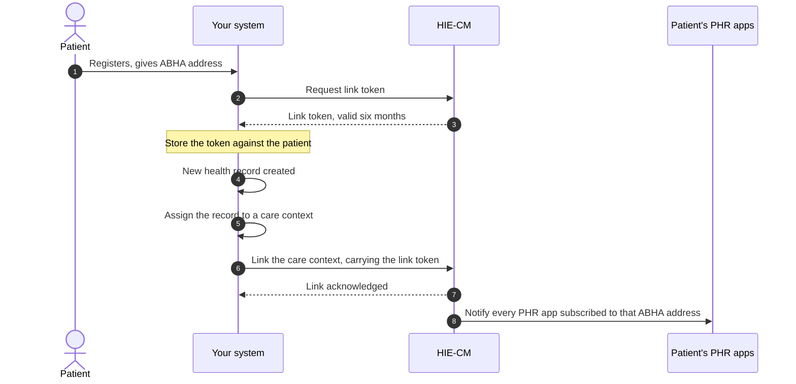
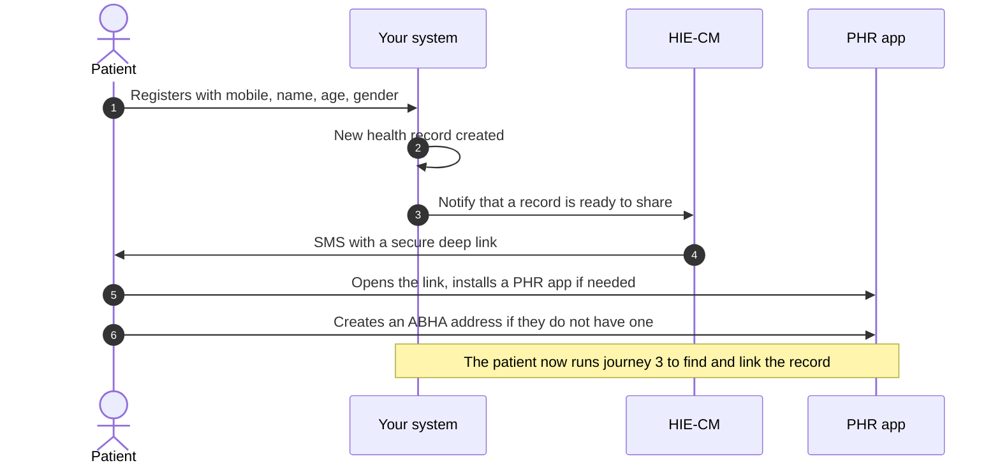
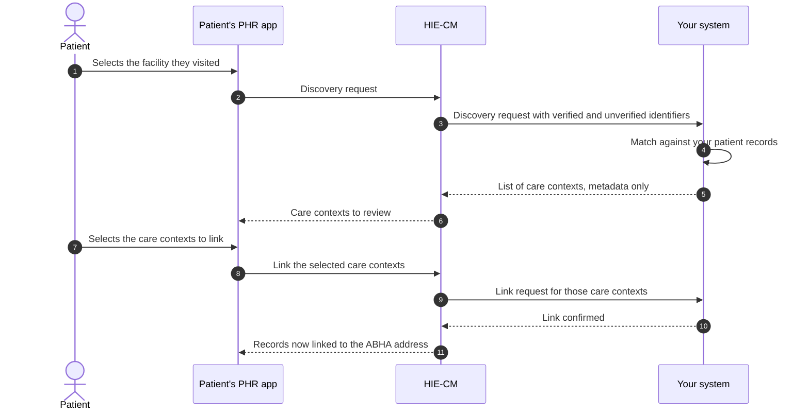
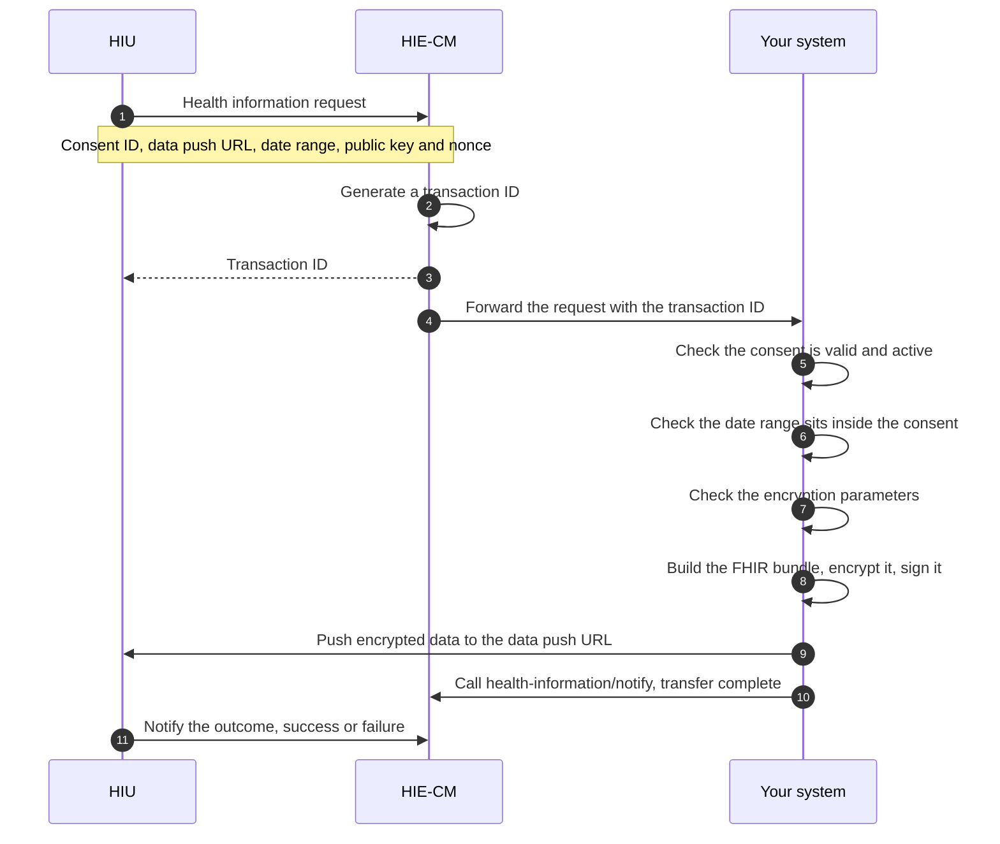

# M2 user journeys

Milestone 2 (M2) of [ABDM](/docs/abdm/v3/glossary#abdm) has four flows. This page draws each one, so you can see the round trips before you read the detail.

[NHA](/docs/abdm/v3/glossary#nha)'s document carries its own API sequence diagrams as images, which did not survive the conversion to text. The diagrams below come from its numbered process steps. The step order is NHA's, the drawing is ours. Steps given only in prose are drawn in words, not guessed at.

"Your system" is your [HMIS](/docs/abdm/v3/glossary#hmis) or [LMIS](/docs/abdm/v3/glossary#lmis) acting as a [HIP](/docs/abdm/v3/glossary#hip). "HIE-CM" is NHA's [Health Information Exchange and Consent Manager](/docs/abdm/v3/glossary#hie-cm) gateway.

## Journey 1: HIP initiated linking

The patient gave you their [ABHA address](/docs/abdm/v3/glossary#abha-address) at registration. Link the [care context](/docs/abdm/v3/glossary#care-context) as soon as the record is ready: linking is what makes it reachable from [PHR](/docs/abdm/v3/glossary#phr) apps.

- **No valid [link token](/docs/abdm/v3/glossary#link-token).** Validate the stored token before use, with a tool such as jwt.io. If it is expired or missing, regenerate it through demographic authentication.
- **An existing care context gains new records.** The step 8 notification fires for that too, not only for a new context.

## Journey 2: Notification to mobile

You hold a mobile number, a name, an age and a gender, but no ABHA address. You cannot link, so you ask NHA to tell the patient a record is waiting.

## Journey 3: Discovery and link

The patient starts [discovery](/docs/abdm/v3/glossary#discovery) from a PHR app and picks the facility they visited. Your system matches them on the identifiers NHA passes you and answers with care contexts.

Step 3 hands you two groups of identifiers.

- **Verified.** ABHA address, mobile number, name, gender, year of birth. NHA says to weight these higher.
- **Unverified, user declared.** Facility issued identifiers such as a medical registration number or patient ID.

Step 5 has a hard rule: care context metadata only. No diagnosis, no test result, no report content.

Steps 8 to 11 are drawn in words: NHA describes them in prose and shows the payloads as images. Its error code list names them init, confirm, on-init and on-confirm, so the shape is a gateway request and a callback from you. The fields are not given.

## Journey 4: Health record request and data transfer

An [HIU](/docs/abdm/v3/glossary#hiu), a PHR app or another facility, asks for records under a [consent artefact](/docs/abdm/v3/glossary#consent-artefact) the patient granted.

Four NHA constraints on step 9, the push.

- The HIU supplies the data push URL. It can differ from its registered gateway URL, which keeps the requester harder to identify.
- The push has a 20 minute window from the start of the request. Past that, expect failure or timeout.
- Large datasets such as CT or MRI images may be split across multiple parts.
- For very large files NHA recommends streaming over one whole payload.

Encryption uses [ECDH](/docs/abdm/v3/glossary#ecdh), Elliptic Curve Diffie Hellman, over Curve25519. Mechanics: [use cases](/docs/abdm/v3/api/m2/sequence). Call order: [API sequence](/docs/abdm/v3/api/m2/sequence).
