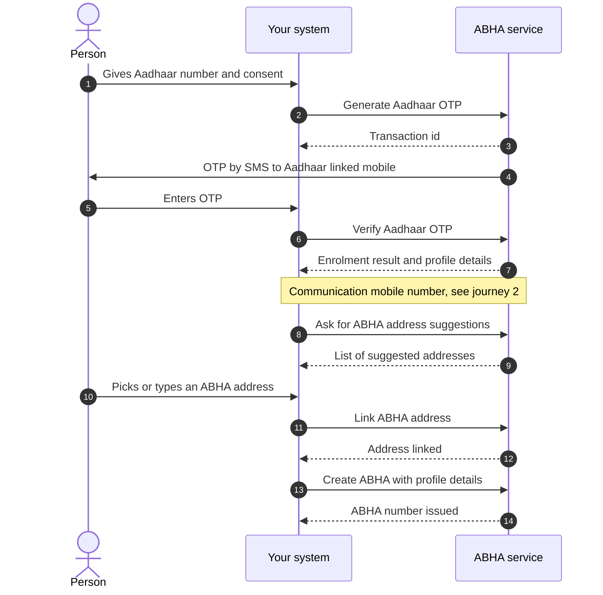
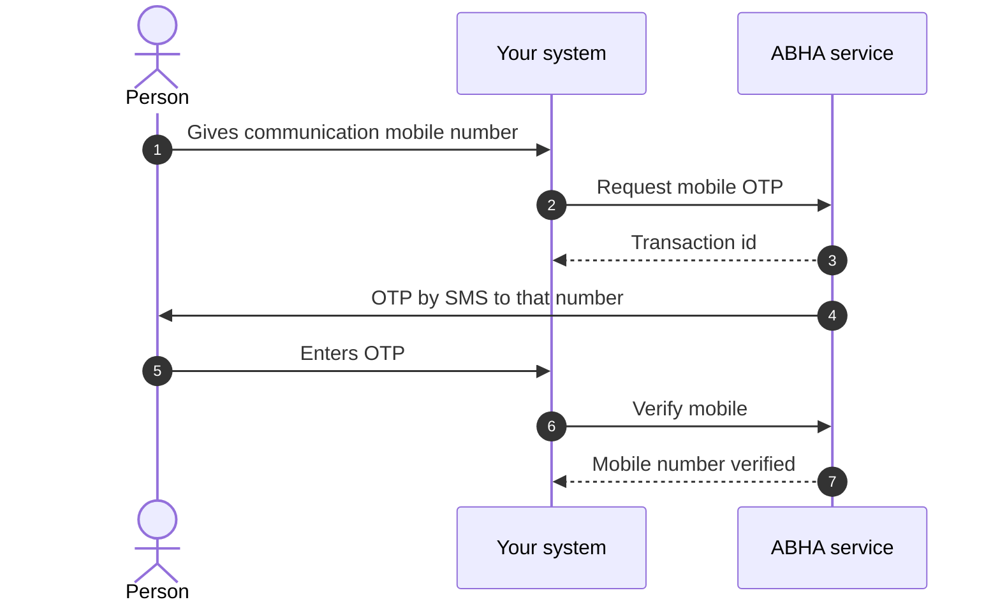
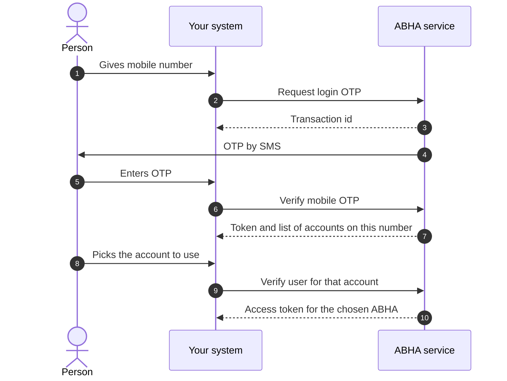
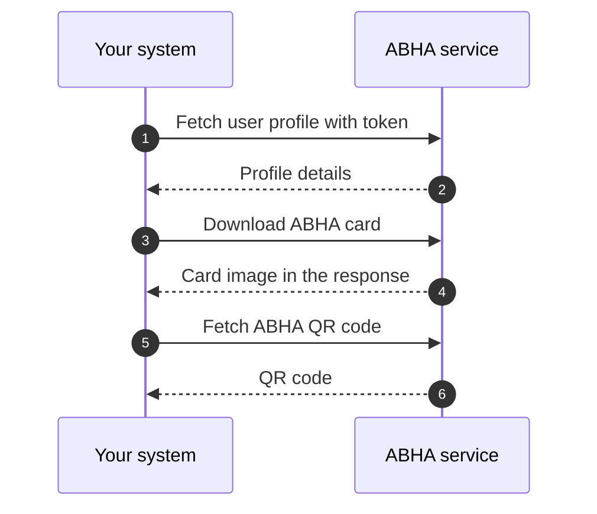

# M1 user journeys

Milestone 1 (M1) of [ABDM](/docs/overview/glossary#abdm) has four flows a first day developer needs to picture. Creating an [ABHA](/docs/overview/glossary#abha), attaching a communication mobile number to it, logging an existing holder in, and reading the profile. This page draws each one. It stops at the level of steps, so you can see the order of the round trips before you read the [API sequence](/docs/api/hie-cm/m1/api-sequence).

:::note[Documented, not verified]
This page follows NHA's published document for Proposed Simplified Milestone 1. Nothing here has been
run against the ABDM sandbox from this repository, so treat request and
response shapes as unconfirmed.
:::

NHA's document carries its own sequence diagrams as images. Those images did not survive the conversion to text, so the diagrams below are drawn from the ordered lists of steps in the same document. The step order is NHA's. The drawing is ours.

In every diagram, "ABHA service" is NHA's ABHA API at the base URL on the [M1 overview](/docs/api/hie-cm/m1). Your system never calls Aadhaar. NHA's service does that for you.

## Journey 1: ABHA creation by Aadhaar OTP

The person gives you their Aadhaar number. NHA sends a one time password ([OTP](/docs/overview/glossary#otp)) to the mobile number registered against that Aadhaar. Once the OTP checks out, the person picks a mobile number for health communication, picks an ABHA address, and the ABHA number is issued.

Email verification sits between the mobile step and the address step. NHA marks it optional, so it is not drawn here.

## Journey 2: Communication mobile number after enrolment

The mobile number linked to Aadhaar is not always the number the person wants health messages on. This flow sets the communication number. NHA's document places it after enrolment in all three creation routes: Aadhaar OTP, face authentication and biometrics.

NHA's reference screens cover the case where the person gives the same number that is already linked to their Aadhaar, and show them moving on to the next screen. Those screens are images that did not convert, so whether a second OTP is sent in that case is not stated in the text we have.

## Journey 3: ABHA login by mobile number

An existing ABHA holder signs in. One mobile number can hold more than one ABHA, so this flow has a third step where the person says which account they mean.

Login by Aadhaar number, by ABHA number and by ABHA address follow the same two beats: request a challenge, then verify it. The challenge can be an Aadhaar OTP, a mobile OTP, a fingerprint or IRIS capture, or a face authentication scan. [Use cases](/docs/api/hie-cm/m1/use-cases) lists which routes NHA marks mandatory.

## Journey 4: Profile, ABHA card and quick response (QR) code

Once you hold a token for a person, the profile reads are plain calls. NHA groups get profile, QR code and card download as one set of profile actions.

NHA's document says the card is displayed in the response rather than fetched from a separate link. It shows the response as a screenshot, so the content type and the encoding are not transcribed. The QR code response is not transcribed either. Neither shape is on the [APIs](/docs/api/hie-cm/m1/apis) page, so treat both as unconfirmed until you call them.

## Next

Read [use cases](/docs/api/hie-cm/m1/use-cases) to see which of these journeys you are obliged to build, then [implementation methodology](/docs/api/hie-cm/m1/implementation) for the order to build them in.
