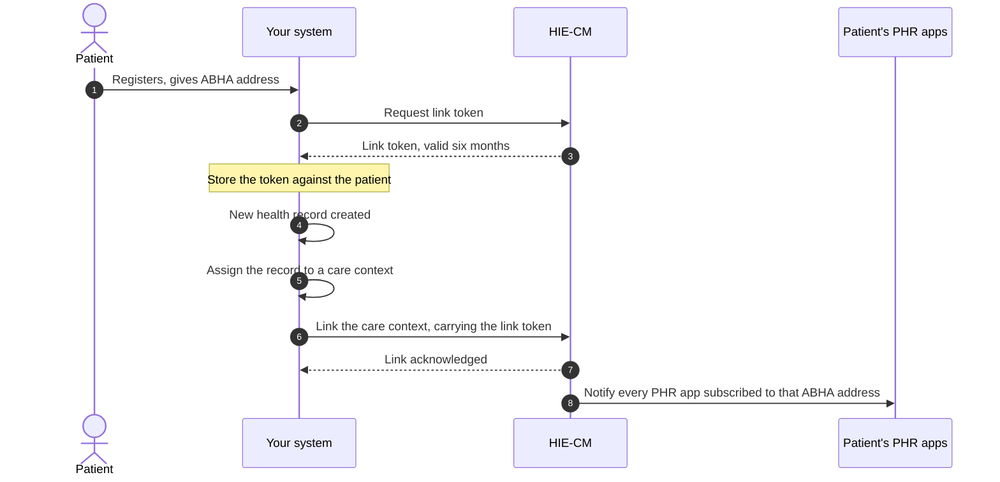
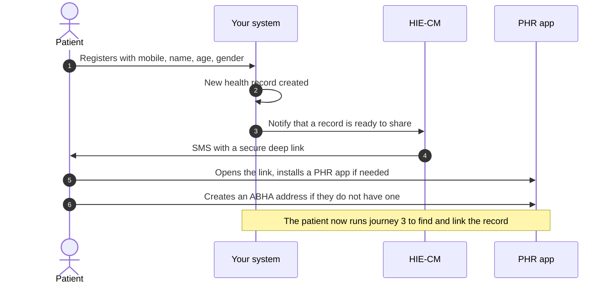
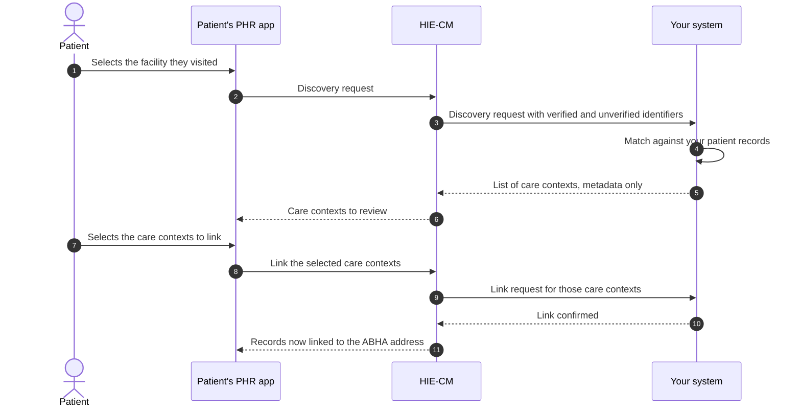
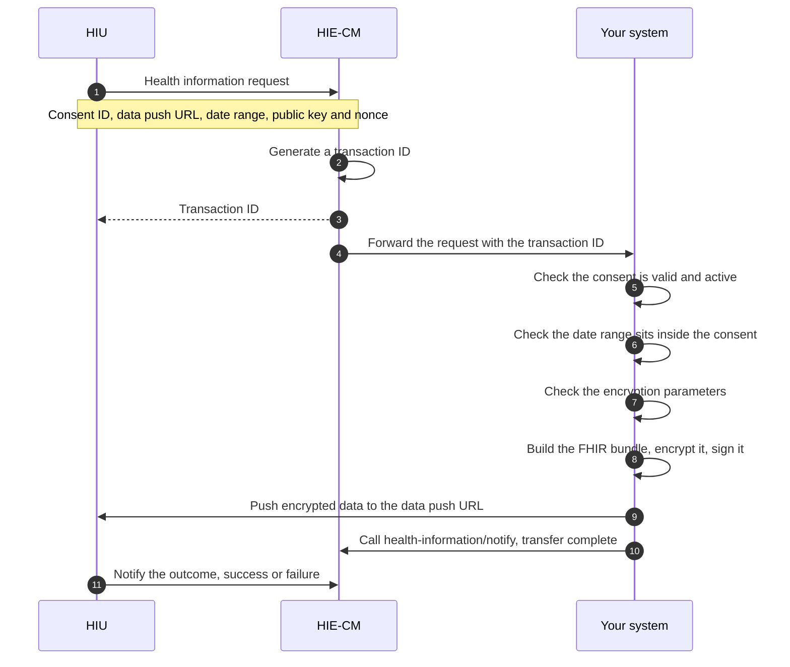

# M2 user journeys

Milestone 2 (M2) of [ABDM](/docs/overview/glossary#abdm) has four flows worth picturing before you write code. Linking a [care context](/docs/overview/glossary#care-context) when you already know the patient's [ABHA address](/docs/overview/glossary#abha-address), making a record findable when you do not, answering a [discovery](/docs/overview/glossary#discovery) request from a [PHR](/docs/overview/glossary#phr) app, and sending records out when a consented request arrives. Each one is drawn below.

:::note[Documented, not verified]
This page follows NHA's published document for Proposed Simplified Milestone 2. Nothing here has been
run against the ABDM sandbox from this repository, so treat request and
response shapes as unconfirmed.
:::

[NHA](/docs/overview/glossary#nha)'s document carries its own API sequence diagrams as images. Those images did not survive the conversion to text, so the diagrams below are drawn from the numbered process steps in the same document. The step order is NHA's. The drawing is ours. Where the document names an endpoint in prose, the diagram names it too. Where it did not, the step is described in words rather than guessed at.

In every diagram, "Your system" is your [HMIS](/docs/overview/glossary#hmis) or [LMIS](/docs/overview/glossary#lmis) acting as a [HIP](/docs/overview/glossary#hip). "HIE-CM" is NHA's [Health Information Exchange and Consent Manager](/docs/overview/glossary#hie-cm) gateway.

## Journey 1: HIP initiated linking

This is the flow when the patient gave you their ABHA address at registration. You link the care context as soon as the record is ready to share. NHA's document is explicit that linking is what makes the record reachable from PHR applications.

Two branches matter here.

- **No valid [link token](/docs/overview/glossary#link-token).** Validate the stored token before you use it. NHA's document suggests checking it with a tool such as jwt.io. If it is expired or missing, regenerate it through demographic authentication.
- **An existing care context gains new records.** The notification in step 8 fires for that too, not only for a newly linked context.

## Journey 2: Notification to mobile

This is the flow when the patient did not give you an ABHA address. You hold a mobile number, a name, an age and a gender. You cannot link, so you ask NHA to tell the patient a record is waiting.

The deep link opens the patient's PHR app if one is installed, and otherwise sends them to install one. From there the patient discovers the record and links it themselves.

## Journey 3: Discovery and link

The patient starts this one from a PHR app. They pick the facility they visited. Your system has to recognise them from the identifiers NHA passes you and answer with a list of care contexts.

What NHA hands you in step 3 splits into two groups.

- **Verified identifiers.** ABHA address, mobile number, name, gender, year of birth. NHA's document says to weight these higher.
- **Unverified, user declared information.** Facility issued identifiers such as a medical registration number or patient ID.

Step 5 has a hard rule. The response carries care context metadata and nothing else. No diagnosis, no test result, no report content.

Steps 8 to 11 are drawn in words because NHA's document describes them in prose and shows the payloads as images. NHA's error code list names these steps init, confirm, on-init and on-confirm, which tells you the shape is a request from the gateway and a callback from you. It does not tell you the fields.

## Journey 4: Health record request and data transfer

An [HIU](/docs/overview/glossary#hiu), which can be a PHR app or another facility, asks for records under a [consent artefact](/docs/overview/glossary#consent-artefact) the patient granted. NHA's document splits this into three stages: the request, your validation and transfer, and the notifications that close it out.

Four constraints from NHA's document apply to step 9, the push.

- The data push URL is supplied by the HIU. It can differ from the HIU's registered gateway URL, which is deliberate: it keeps the requester harder to identify.
- The push has a 20 minute window from the start of the request. Past that, expect the request to fail or time out.
- Large datasets such as CT or MRI images may be split across multiple parts.
- For very large files NHA's document recommends streaming rather than sending the whole payload at once.

Encryption uses [ECDH](/docs/overview/glossary#ecdh), Elliptic Curve Diffie Hellman, over Curve25519. The mechanics are on the [use cases](/docs/api/hie-cm/m2/use-cases) page. The call order is on the [API sequence](/docs/api/hie-cm/m2/api-sequence) page.
