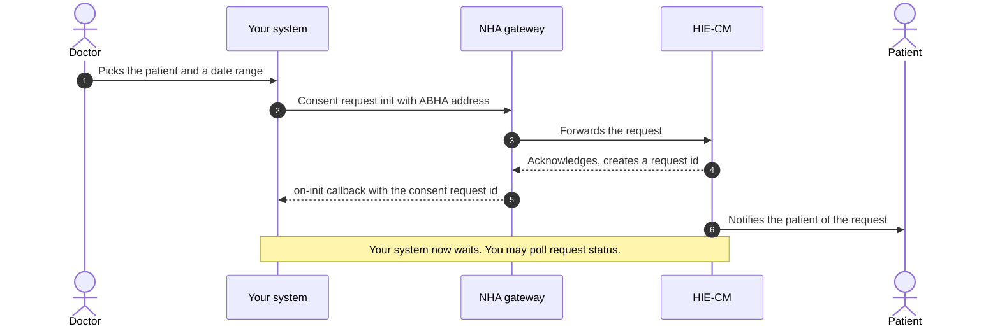
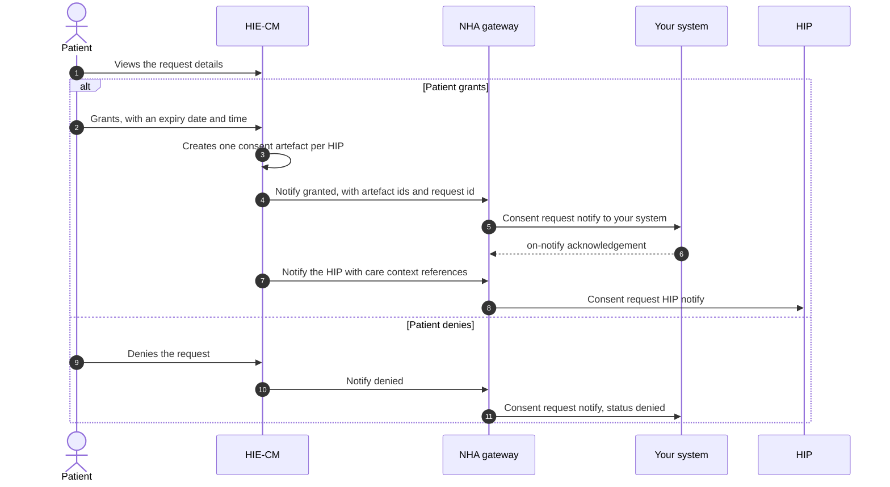
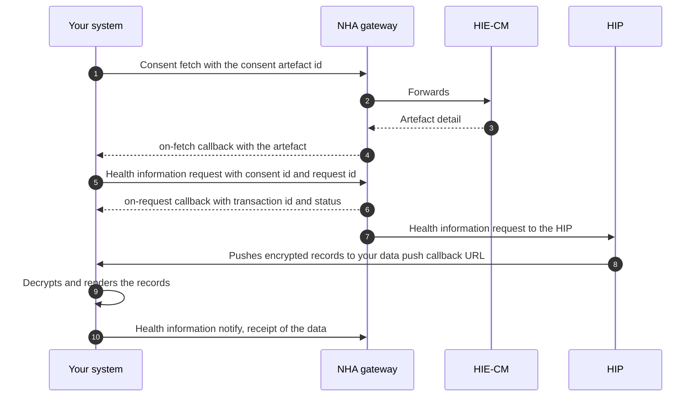

# M3 user journeys

Milestone 3 (M3) of [ABDM](/docs/overview/glossary#abdm) has one story told in three parts. A doctor asks for a patient's past records. The patient says yes or no. If yes, the records travel. This page draws each part so you can see the round trips before you read the [API sequence](/docs/api/hie-cm/m3/api-sequence).

:::note[Documented, not verified]
This page follows NHA's published document for Proposed Simplified Milestone 3. Nothing here has been
run against the ABDM sandbox from this repository, so treat request and
response shapes as unconfirmed.
:::

[NHA](/docs/overview/glossary#nha)'s document carries its own diagrams and screen sequences as images. Those images did not survive the conversion to text. The diagrams below are drawn from the ordered prose of the same document. The step order is NHA's. The drawing is ours.

Five parties appear across the three diagrams.

| In the diagram | What it is |
|---|---|
| Patient | The person whose records these are. They act in their [PHR](/docs/overview/glossary#phr) app. |
| Your system | The [HIU](/docs/overview/glossary#hiu). The hospital or app that wants to read the records. |
| NHA gateway | NHA's [gateway](/docs/overview/glossary#gateway), which routes every call and every callback. |
| HIE-CM | The [HIE-CM](/docs/overview/glossary#hie-cm), which holds consent and asks the patient. |
| HIP | The [HIP](/docs/overview/glossary#hip) that holds the records. It appears in journeys 2 and 3. |

## Journey 1: raising a consent request

A doctor wants the patient's earlier records for a date range. Your system sends the request with the patient's [ABHA](/docs/overview/glossary#abha) address. Nothing is returned inline. You get a request id on a callback, and then you wait for the patient.

The request id is the handle for everything that follows. Store it against the doctor and the patient before you move on.

## Journey 2: the patient grants or denies

The patient sees who is asking, what they want, why they want it and for how long. They choose. The HIE-CM then tells both sides what was chosen.

Three points worth holding on to.

- A grant carries an expiry. The patient sets when the permission runs out.
- A grant can produce more than one consent artefact, because the patient's records sit in more than one hospital.
- The patient can revoke a granted consent at any time afterwards. Your access ends when they do.

## Journey 3: fetching the records

You have an artefact id. Now you fetch the artefact itself, then ask for the data it covers, then wait for the data to arrive on your callback URL.

The records arrive at the same callback URL you supplied as the data push URL in the health information request. They arrive encrypted. Decryption is your side of the work, and NHA's document states it plainly: convert the data back to its original form, then present it in a readable format.

The encryption scheme itself is not described in the M3 document. It is [ECDH](/docs/overview/glossary#ecdh) key exchange, specified on the [HIP](/docs/overview/glossary#hip) side in NHA's M2 document. See [M2](/docs/api/hie-cm/m2).

## What the patient sees

NHA's document includes a screen sequence and a set of expiry screens for the patient's side of this. Both are screenshots. Nothing readable converted, so the screens are not reproduced here. What the prose does state is on the [use cases](/docs/api/hie-cm/m3/use-cases) page under patient rights.
