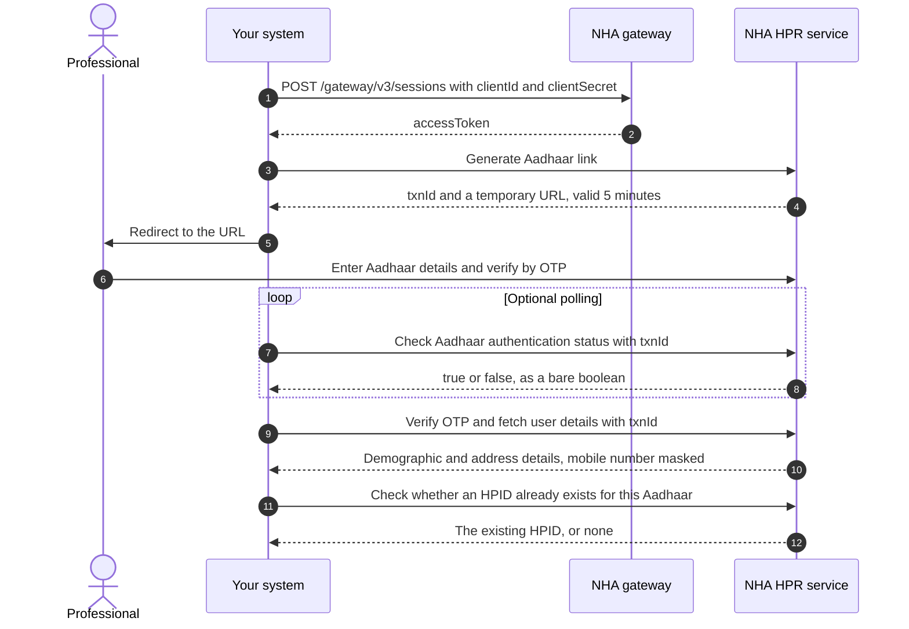
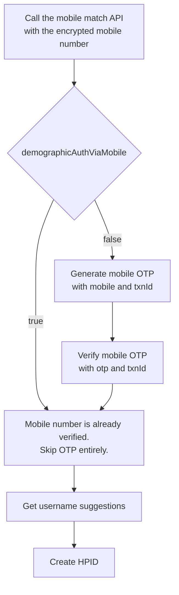
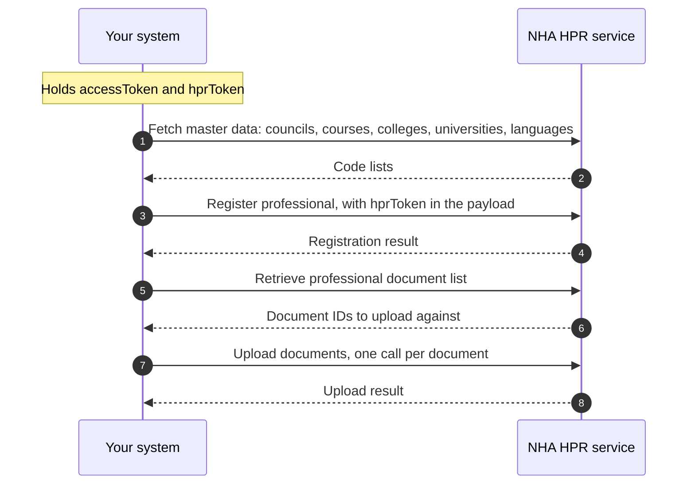
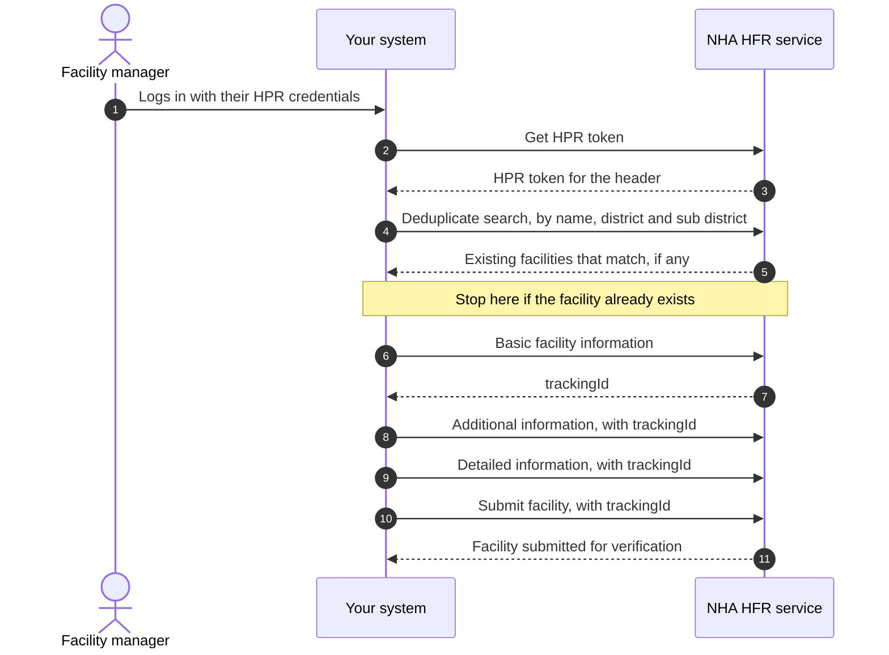
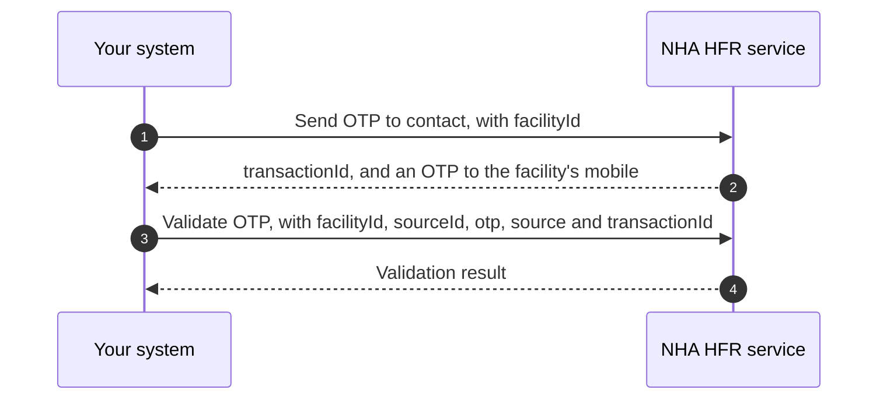
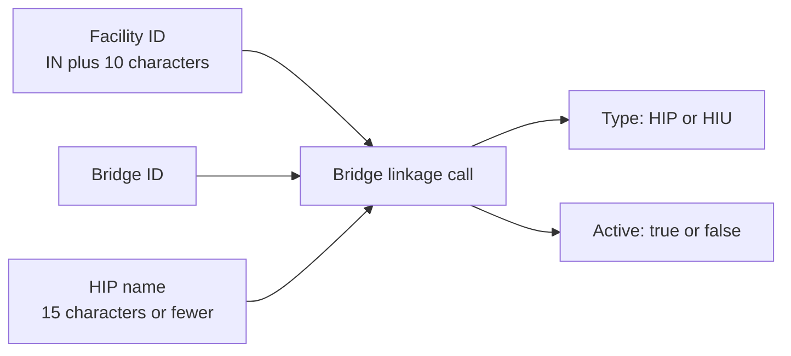

# M4 user journeys

Milestone 4 of [ABDM](/docs/overview/glossary#abdm) has three journeys. A professional gets an [HPID](/docs/overview/glossary#hpid) and fills in their [HPR](/docs/overview/glossary#hpr) profile. A facility manager onboards a facility to the [HFR](/docs/overview/glossary#hfr). A facility links its bridges so that its software can act as a [HIP](/docs/overview/glossary#hip) or an [HIU](/docs/overview/glossary#hiu). This page shows the order of calls in each. Field lists are on the [APIs](/docs/api/hie-cm/m4/apis) page.

:::caution[Phase 2 on this site]
M4 is Phase 2 for this portal. These diagrams follow the order of steps NHA's document sets out. They are a map, not a tested runbook.
:::

:::note[Documented, not verified]
This page follows NHA's published document for Proposed Simplified Milestone 4 (NHPR). Nothing here has been
run against the ABDM sandbox from this repository, so treat request and
response shapes as unconfirmed.
:::

## Journey 1: a professional gets an HPID

The professional authenticates against Aadhaar on a page NHA hosts. Your system never handles the Aadhaar number or the Aadhaar [OTP](/docs/overview/glossary#otp). It handles the transaction ID, and it redirects the professional to a URL NHA returns.

The redirect URL is valid for five minutes. After that you call generate Aadhaar link again for a fresh one.

### Then the mobile number

The professional's mobile number has to be confirmed before the HPID is created. There is a fast path and a slow path.

NHA's document says to send the mobile number encrypted. Fetch NHA's public certificate from `/v4/int/api/v1/auth/cert`, encrypt with `RSA/ECB/PKCS1Padding`, and send the encrypted value.

The create HPID call returns an `hprToken`. Hold on to it. The register professional call needs it.

### Then the profile

Creating the HPID gives the professional an identity. It does not give them a profile. Registering the professional adds their qualifications, their council registration and their current work.

Two documents are mandatory: the degree certificate and the registration certificate. If the professional works for government, or for both government and private, a proof of work certificate is mandatory too.

The register professional call takes codes, not names. Council, course, college, university, state, district and language are all fetched from the master APIs first.

## Journey 2: a facility onboards to the HFR

Onboarding is one search, three writes and a submit. Each write adds a layer of detail. Nothing is visible to ABDM until you call submit. A facility that stops before the submit call stays in draft.

The basic facility information call is the first write, and it returns a tracking ID. That tracking ID is the facility's identity through the rest of the sequence. It is what you pass as the facility ID on every later update.

### What each of the four write calls carries

| Call | What it captures |
|---|---|
| Basic facility information | Name, ownership, system of medicine, facility type and subtype, address with LGD codes, contact details, board and building photographs, opening hours |
| Additional information | Whether the facility has a pharmacy, blood bank, dialysis centre, cath lab, diagnostic lab or imaging centre, and existing scheme identifiers such as ABPMJAY, Rohini, ECHS and CGHS |
| Detailed information | Specialities per system of medicine, bed and ventilator counts, and the sections for pharmacy, blood bank, diagnostic and imaging services that apply to this facility type |
| Submit facility | The tracking ID and an optional source of information. This is what moves the facility out of draft |

Which fields are mandatory in the detailed information call depends on the facility type, the type of service and the system of medicine. For example a diagnostic laboratory, imaging centre, blood bank or pharmacy does not send medical infrastructure counts at all.

### A facility can also verify by OTP

NHA's document names a second, shorter path used by government programmes. You send an OTP to the contact number registered against a facility ID, then validate it.

## Journey 3: linking bridges to a facility

A facility ID by itself does not make records flow. The facility has to be linked to a bridge, and each link is marked HIP or HIU. NHA's document says one facility can have several bridges linked to it.

The HIP name matters more than it looks. It is the name a patient sees in their [ABHA](/docs/overview/glossary#abha) or [PHR](/docs/overview/glossary#phr) app when they search for this hospital. NHA's document sets three rules for it: 15 characters or fewer, no special characters, and unique for every bridge on a facility. Its example builds the name from the hospital name plus the bridge name.

## Where the journeys meet the rest of ABDM

Once a facility has a facility ID and a linked HIP bridge, it can do the [M2](/docs/api/hie-cm/m2) work: link care contexts and share records. Once it has a linked HIU bridge, it can do the [M3](/docs/api/hie-cm/m3) work: request consent and fetch records. M4 is the registration step in front of running either flow outside sandbox.

Next: [the APIs](/docs/api/hie-cm/m4/apis).
