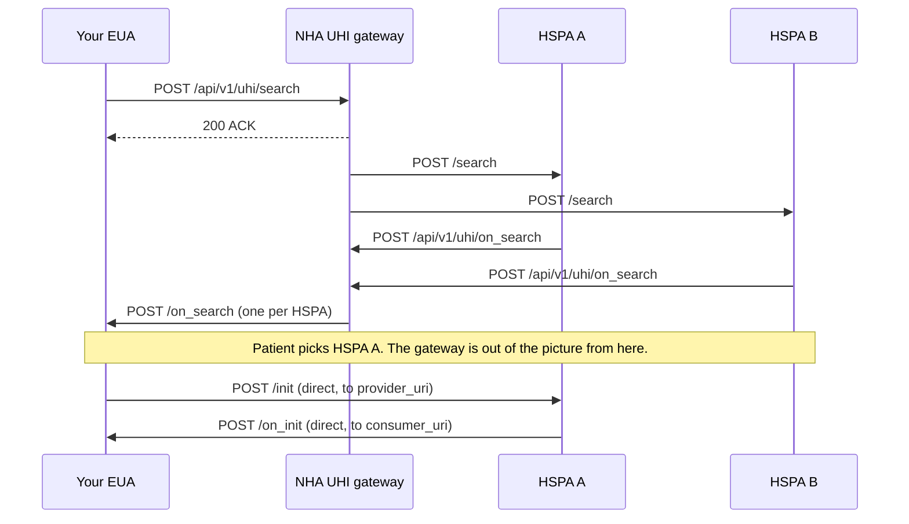

# UHI services

[UHI](/docs/overview/glossary#uhi) is the Unified Health Interface, [ABDM](/docs/overview/glossary#abdm)'s open network for finding and booking a health service. It is not a records network. [HIE-CM](/docs/overview/glossary#hie-cm) moves records that already exist; UHI helps a patient find a doctor, an ambulance or a unit of blood before any record exists. Every service on UHI speaks the same message pattern, so once you have built one, the next one is mostly a different domain code and a different set of fields.

:::note[Documented, not verified]
This page follows NHA's published documents for the UHI physical consultation,
ambulance booking and blood bank services. Nothing here has been run against
the ABDM sandbox from this repository, so treat request and response shapes as
unconfirmed.
:::

:::note[Phase 2]
UHI is Phase 2 for this portal. These pages are orientation, not a certified
integration path. Read them to understand the network and the shape of each
service. For the current field-level truth, work from NHA's Swagger spec and
your onboarding contact.
:::

One gate applies before any of this. Your application must have completed ABDM M2 with HIE-CM. See [prerequisite](#prerequisite) below.

## Two roles

Pick your role before you read anything else. It decides which endpoints you call and which you expose.

| Role | Full name | What it does |
| --- | --- | --- |
| [EUA](/docs/overview/glossary#eua) | End User Application | The patient facing app. It searches, shows results, books, and displays status. |
| [HSPA](/docs/overview/glossary#hspa) | Health Service Provider Application | The provider side platform. It holds availability, answers searches, and drives the booking through its lifecycle. |

Two more names appear in NHA's documents. The HSP is the actual hospital, clinic, doctor, ambulance operator or blood bank. The HSPA is its digital interface. The [gateway](/docs/overview/glossary#gateway) is the routing layer that [NHA](/docs/overview/glossary#nha) runs.

Some services accept both roles. Others are open to EUAs only. Each service page says which.

## One network, many services

A UHI service is identified by fixed values inside the call, not by a different endpoint. The domain code is the main one.

| Service | Domain code | Page |
| --- | --- | --- |
| Physical consultation | `nic2004:85111` | [Physical consultation](/docs/api/uhi/physical-consultation) |
| Ambulance booking | `nic2008:86909` | [Ambulance booking](/docs/api/uhi/ambulance-booking) |
| Blood bank discovery | `nic2008:86906` | [Blood bank](/docs/api/uhi/blood-bank) |

Other services on the network have their own codes and their own pages: [Jan Aushadhi Kendra](/docs/api/uhi/jan-aushadhi-kendra), [Jan Aushadhi medicine search](/docs/api/uhi/jan-aushadhi-medicine-search), [AMRIT pharmacy](/docs/api/uhi/amrit-pharmacy) and [PMJAY HEM](/docs/api/uhi/pmjay-hem).

All three of the documents behind this page use `core_version` `0.7.1`.

## The message pattern

Every UHI interaction is a pair. You send an action, and the answer arrives later as a separate call to your callback URL, named `on_` plus the action.

| You send | The answer arrives as | What it does |
| --- | --- | --- |
| `search` | `on_search` | Find what is available |
| `init` | `on_init` | Start an order and get a quote and terms |
| `confirm` | `on_confirm` | Lock the booking |
| `status` | `on_status` | Ask for the current state of an order |
| `cancel` | `on_cancel` | Cancel an order |
| `on_update` | none | Push a state change to the other side |
| `on_message` | none | Send a chat message or a file |

Not every service implements the whole set. See [how far each service goes](#how-far-each-service-goes) below.

The synchronous reply to any of these is an acknowledgement, not the answer:

```json
{
  "message": {
    "ack": {
      "status": "ACK"
    }
  },
  "error": {}
}
```

Your system must handle the real response arriving separately at your callback URL. Do not block waiting for it.

## Two transports in one flow

This catches people out, and NHA's physical consultation document flags it as the critical architectural point.

- **Discovery goes through the gateway.** Your EUA sends one `search` to the gateway. The gateway broadcasts it to every registered HSPA in that domain. Each HSPA that matches answers, so you receive several `on_search` calls for one search.
- **Everything after discovery is direct.** `init` onwards is point to point between your EUA and the one HSPA the patient chose. There is no central UHI API for those stages. Both sides expose their own endpoints for the other to call.



The `provider_uri` you use for those direct calls comes from the context of the `on_search` response. You do not know it before discovery, so store it.

## The context block

Every UHI call carries a `context` block. These fields are the same shape across services; the values differ.

| Field | Type | Required | What it is |
| --- | --- | --- | --- |
| `domain` | string | Yes | The service code, for example `nic2004:85111` |
| `country` | string | Yes | ISO 3166-1 code. Always `IND` |
| `city` | string | Yes | STD code prefixed with `std:`, for example `std:011` |
| `action` | string | Yes | The action name. Must match the endpoint being called |
| `core_version` | string | Yes | UHI specification version. `0.7.1` today |
| `consumer_id` | string | Yes | Your EUA identifier, as registered with NHA |
| `consumer_uri` | string (URI) | Yes | Your HTTPS callback URL. Must share a domain with `consumer_id` |
| `provider_id` | string | Conditional | The HSPA identifier. Required from `init` onwards, not in the first `search` |
| `provider_uri` | string (URI) | Conditional | The HSPA base URL. Required from `init` onwards. Taken from the `on_search` context |
| `transaction_id` | string (UUID) | Yes | Constant for the whole booking lifecycle |
| `message_id` | string (UUID) | Yes | A new UUID for each individual call |
| `timestamp` | string (ISO 8601) | Yes | When the request was generated |
| `key` | string | No | Sender's encryption public key |
| `ttl` | string (ISO 8601) | No | How long the message stays valid, for example `PT30S` |

`transaction_id` is how you correlate. Several HSPAs answer one search, and the only thing tying their responses to your request is the shared `transaction_id`. Keep it identical across every call in one booking.

`message_id` is different. It changes per call.

## Signing

Every UHI call is signed. NHA specifies Ed25519 signatures over a BLAKE-512 hash of the request body.

| Component | Detail |
| --- | --- |
| Body hash | BLAKE-512 |
| Signature | Ed25519 |
| Your header | `Authorization: {"headers":"(created) (expires) digest","algorithm":"ed25519","keyId":"<YOUR_EUA_ID_FROM_NHA_ONBOARDING>\|<YOUR_KEY_ID>\|ed25519","created":"<EPOCH_SECONDS>","expires":"<EPOCH_SECONDS>","signature":"<BASE64_SIGNATURE>"}` |
| Gateway header on calls to you | `X-Gateway-Authorization`, same structure, with `keyId` prefixed `gateway-nha` |

NHA publishes a header generator for this. Clone [github.com/NHA-ABDM/UHI](https://github.com/NHA-ABDM/UHI/tree/main/header_generator_utility) and run `Generator.java` with option 1. NHA's document describes the outcome as an Ed25519 key pair generated and headers produced. Send NHA the public key only. Keep the private key out of your repository.

Before a signed point to point call, either side can look up the other's registered public key:

```http
POST https://uhigatewaysandbox.abdm.gov.in/api/v1/networkregistry/lookup
```

```json
{
  "subscriber_id": "nha.eua",
  "type": "EUA",
  "domain": "nic2004:85111",
  "country": "IND",
  "city": "std:08752",
  "pub_key_id": "nha.eua.k1"
}
```

`type` is one of `EUA`, `HSPA` or `gateway`.

## Prerequisite

NHA states this as a hard requirement in all three documents. An application must have completed ABDM [M2](/docs/api/hie-cm/m2) with HIE-CM before it can be onboarded to any UHI service. If M2 is not done, UHI onboarding does not start.

UHI is not an alternative to HIE-CM. It sits on top of it.

## Sandbox environment

From NHA's physical consultation document:

```text
Gateway base URI   https://uhigatewaysandbox.abdm.gov.in
Reference EUA      http://uhieuasandbox.abdm.gov.in/api/v1/euaService
Reference HSPA     https://hspasbx.abdm.gov.in/api/v1/hspa
```

The Swagger spec sits at [uhigatewaysandbox.abdm.gov.in/swagger-ui](https://uhigatewaysandbox.abdm.gov.in/swagger-ui/index.html?urls.primaryName=v2.0.2#/).

## How far each service goes

The three services documented here stop at different points. This is the single biggest difference between them.

| Service | Discovery | Order and quote | Booking and lifecycle |
| --- | --- | --- | --- |
| [Physical consultation](/docs/api/uhi/physical-consultation) | `search`, `on_search` | `init`, `on_init` | `confirm`, `on_confirm`, `status`, `on_status`, `on_update`, `cancel`, `on_cancel`, `on_message` |
| [Ambulance booking](/docs/api/uhi/ambulance-booking) | `search`, `on_search` | `init`, `on_init` | Not in the current phase |
| [Blood bank](/docs/api/uhi/blood-bank) | `search`, `on_search` | Not in scope | Not in scope |

## Onboarding

All three documents describe the same route.

1. Tell NHA you want to integrate. Reply to your onboarding contact.
2. Complete ABDM M2 with HIE-CM. This is the hard prerequisite.
3. Fill the onboarding form at [sandbox.abdm.gov.in](https://sandbox.abdm.gov.in/sandbox/v3/sandbox-registration) with your organisation details, your role, your HTTPS sandbox callback URL and your public key.
4. Generate your Ed25519 key pair with NHA's utility. Send the public key only.
5. Receive sandbox credentials from NHA, then build and test.
6. Pass NHA's test cases, get written sign-off, then move your identifiers and callback URLs to production.

## Next

- [Physical consultation](/docs/api/uhi/physical-consultation), the fullest of the three
- [Ambulance booking](/docs/api/uhi/ambulance-booking)
- [Blood bank](/docs/api/uhi/blood-bank)
- [UHI as a building block](/docs/overview/building-blocks/uhi), for the concepts without the field tables
- [Support](/docs/support)
