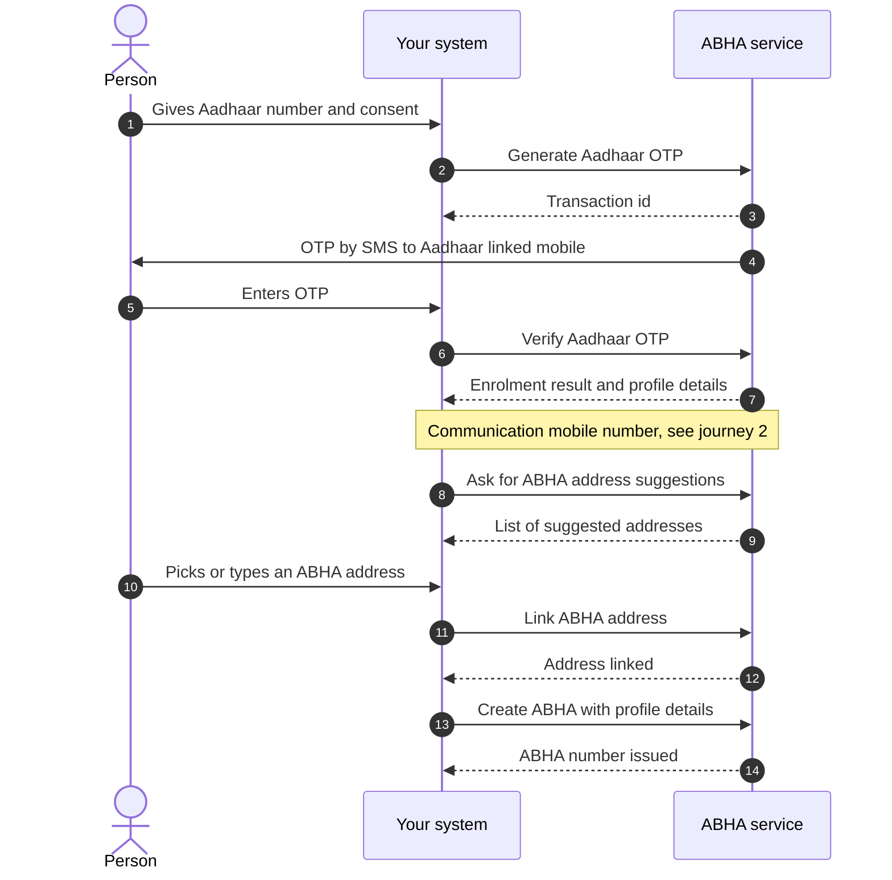
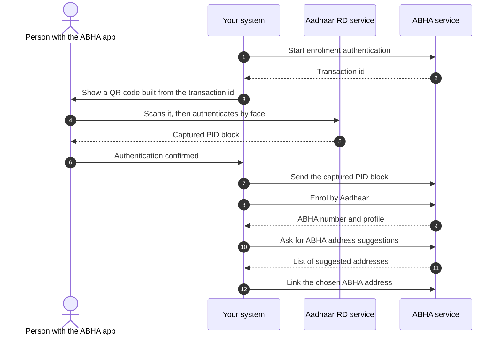
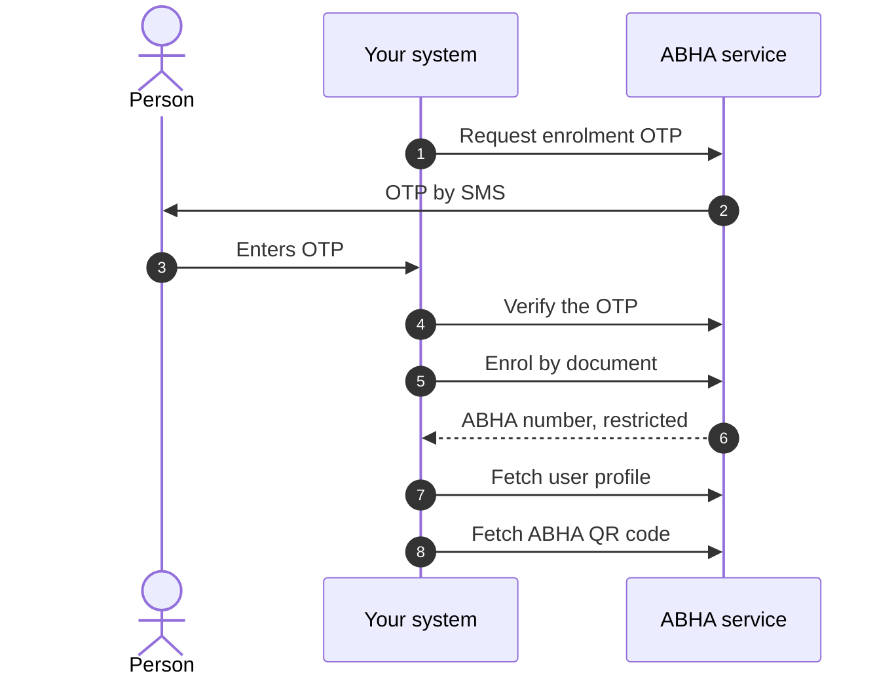
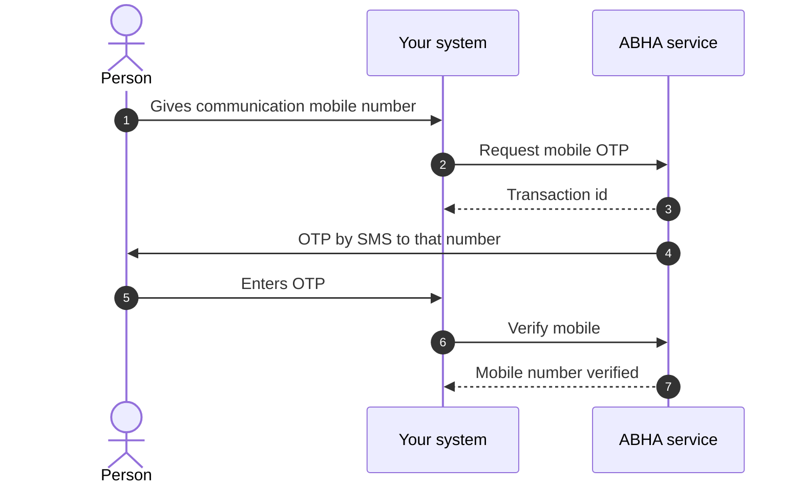
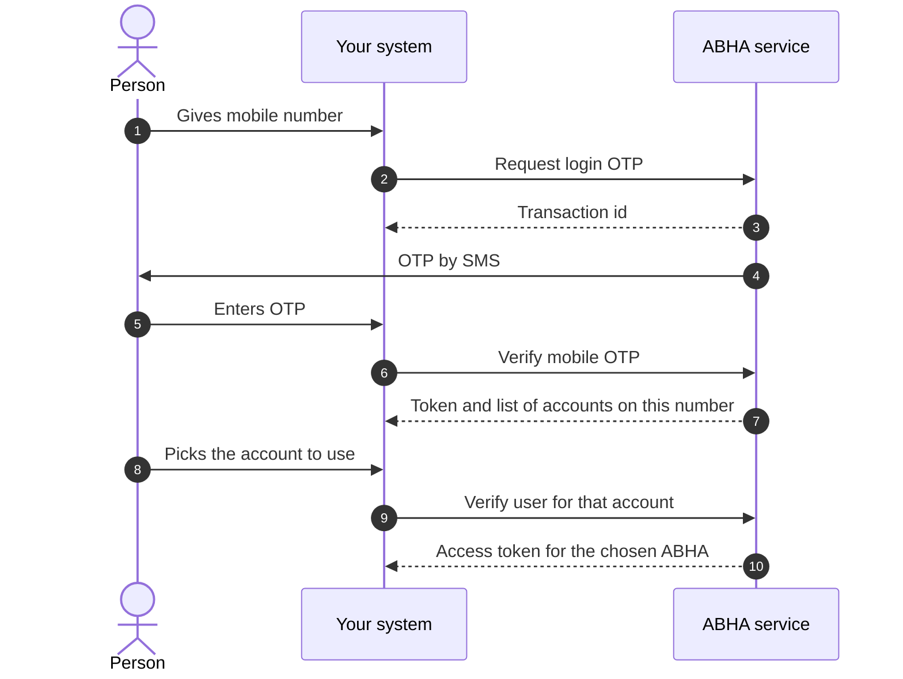
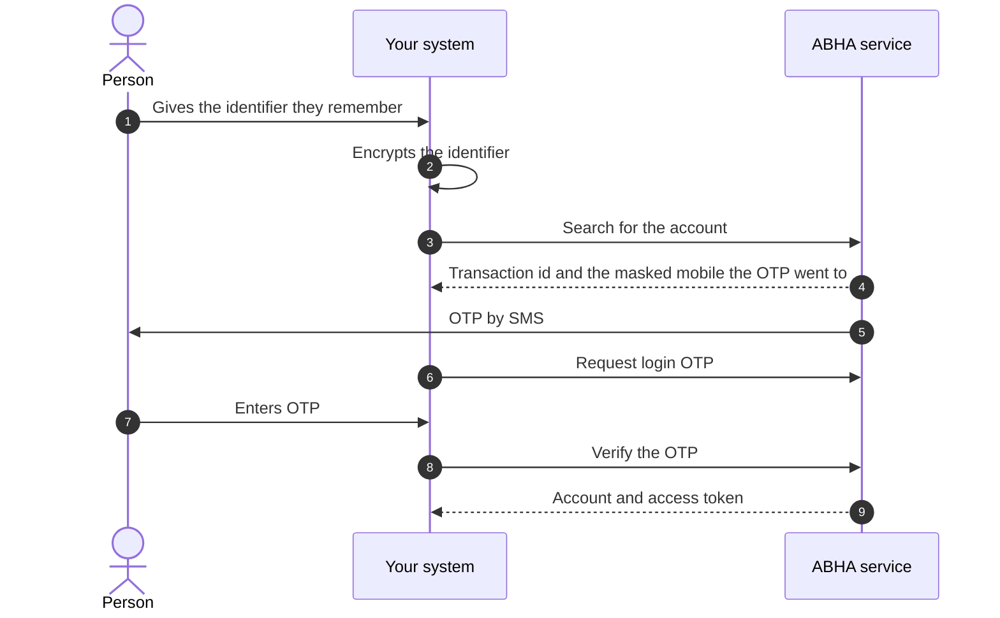
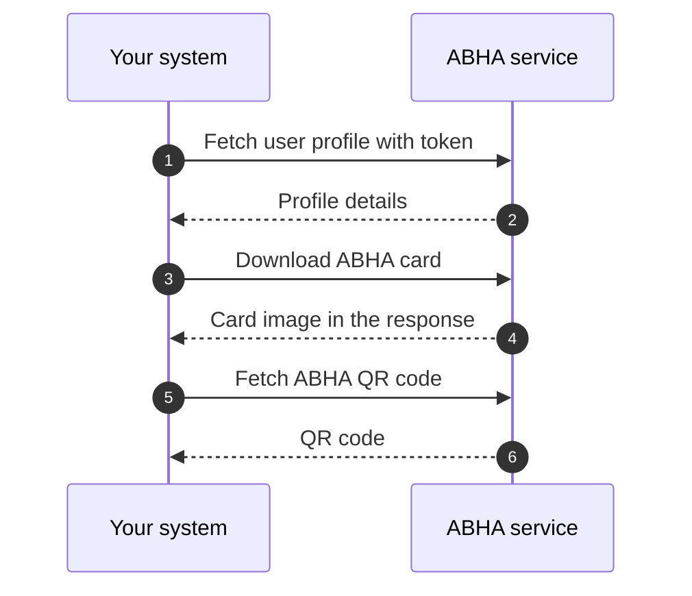

# M1 user journeys

Milestone 1 (M1) of [ABDM](/docs/hiecm/v3/getting-started/glossary#abdm) has seven journeys. Three of them create an [ABHA](/docs/hiecm/v3/getting-started/glossary#abha), by Aadhaar OTP, by face authentication or from an identity document. The other four attach a communication mobile number, log an existing holder in, find an ABHA the person has forgotten, and read the profile. Each is drawn below at step level, so you see the round trips before you read the [API reference](/reference/hiecm-m1).

NHA's document carries its own sequence diagrams as images, and those images did not survive the conversion to text. The diagrams below are drawn from the ordered lists of steps in the same document. The step order is NHA's; the drawing is ours.

"ABHA service" is NHA's ABHA API at the base URL on the [M1 overview](/docs/hiecm/v3/api/m1). Your system never calls Aadhaar. NHA's service does that for you.

## Journey 1: ABHA creation by Aadhaar OTP

The person gives their Aadhaar number. NHA sends a one time password ([OTP](/docs/hiecm/v3/getting-started/glossary#otp)) to the mobile registered against that Aadhaar. Once it checks out, the person picks a communication mobile number and an ABHA address, and the ABHA number is issued.

Email verification sits between the mobile step and the address step. NHA marks it optional, so it is not drawn.

## Journey 2: ABHA creation by face authentication

Some people cannot use the OTP route, usually because the mobile registered against their Aadhaar is no longer theirs. Face authentication is NHA's optional alternative. The person authenticates their face through the Aadhaar registered device (RD) service on their own phone, which is how the transaction moves from your screen to theirs.

The middle of this journey happens on someone else's device, so your system is waiting on a person rather than on a network call. Show that state clearly instead of a spinner.

The PID block is encrypted by the capture device and it expires. Send it as soon as you receive it rather than storing it.

## Journey 3: ABHA creation from an identity document

When neither an Aadhaar OTP nor a face capture is possible, NHA allows enrolment from an identity document. NHA's own collection uses a driving licence.

The account this produces is restricted until it is upgraded through Aadhaar know your customer (KYC) verification. Tell the person that when the account is created, rather than letting them find out when something later fails.

## Journey 4: Communication mobile number after enrolment

The Aadhaar linked number is not always the number the person wants health messages on. NHA places this flow after enrolment in all three creation routes: Aadhaar OTP, face authentication and biometrics.

NHA's reference screens cover the person giving the number already linked to their Aadhaar. Those screens are images that did not convert, so whether a second OTP is sent in that case is not stated in the text we have.

## Journey 5: ABHA login by mobile number

One mobile number can hold more than one ABHA, so this flow has a third step where the person says which account they mean.

Login by Aadhaar number, by ABHA number and by ABHA address follow the same two beats: request a challenge, then verify it. The challenge can be an Aadhaar OTP, a mobile OTP, a fingerprint or IRIS capture, or a face authentication scan. [API reference](/reference/hiecm-m1) lists which routes NHA marks mandatory.

## Journey 6: Finding an ABHA the person has forgotten

People forget their ABHA. This journey finds it from something they do remember, usually a mobile number, then makes them prove the account is theirs before anything is handed over. The proof step is the point, because a search on its own only tells you that an account exists.

The search response names the masked mobile the OTP was sent to, for example one ending `0161`. Show that to the person so they can confirm the number is theirs before they sit waiting for a message that will not arrive.

Encrypt the identifier inside your own system. NHA's collection performs this step by calling a remote encryption helper, and in some variants a third party website, which sends a patient identifier to a party that has no reason to hold it. See [encryption](/docs/hiecm/v3/concepts/encryption) for how to do it locally.

## Journey 7: Profile, ABHA card and quick response (QR) code

Once you hold a token for a person, the profile reads are plain calls. NHA groups get profile, QR code and card download as one set.

NHA says the card is displayed in the response rather than fetched from a separate link, but shows that response as a screenshot, so the content type and encoding are not transcribed. The QR code response is not transcribed either. Neither shape is on the [APIs](/docs/hiecm/v3/api/m1/apis) page, so treat both as unconfirmed until you call them.

Next: [use cases](/reference/hiecm-m1) for which journeys you must build, then [API reference](/reference/hiecm-m1) for the calls in order.

