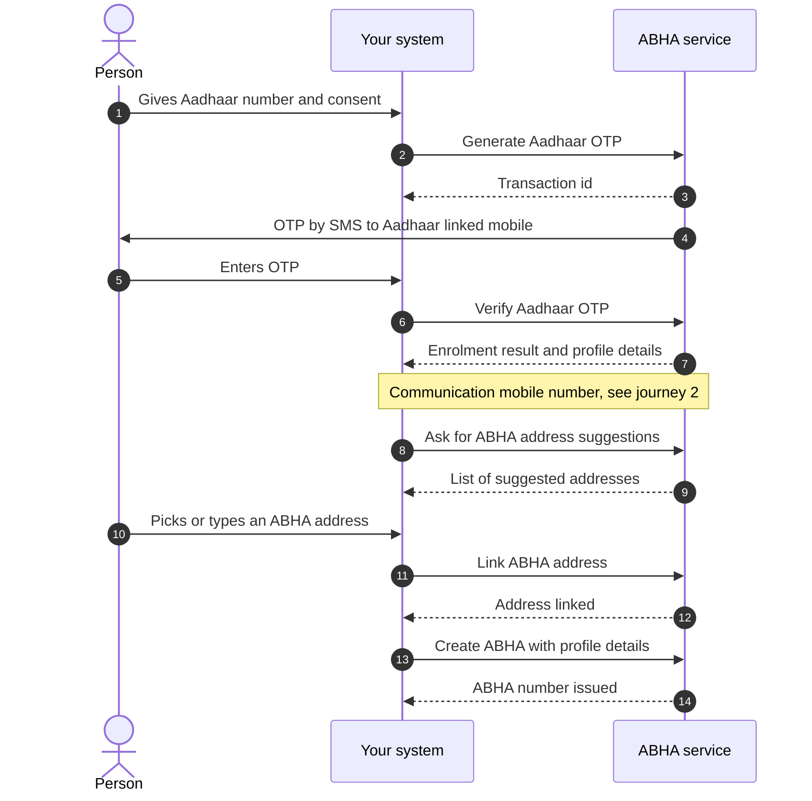
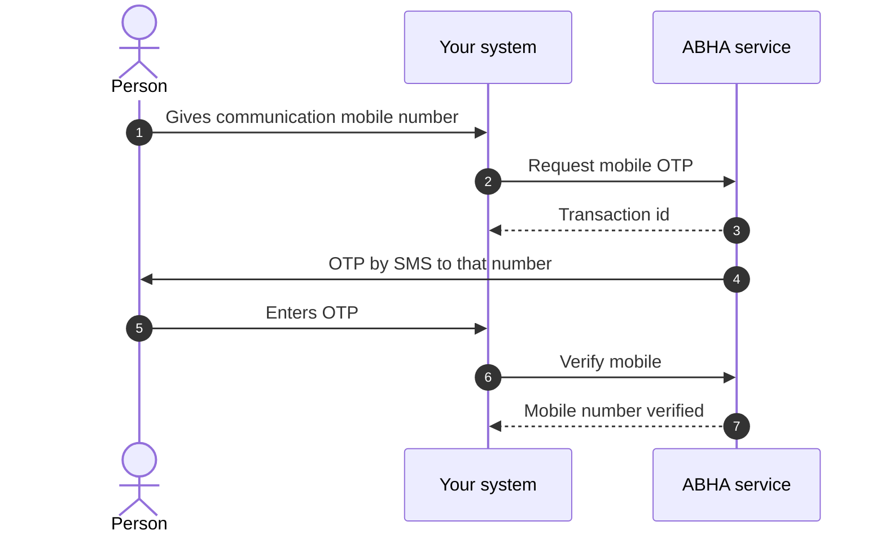
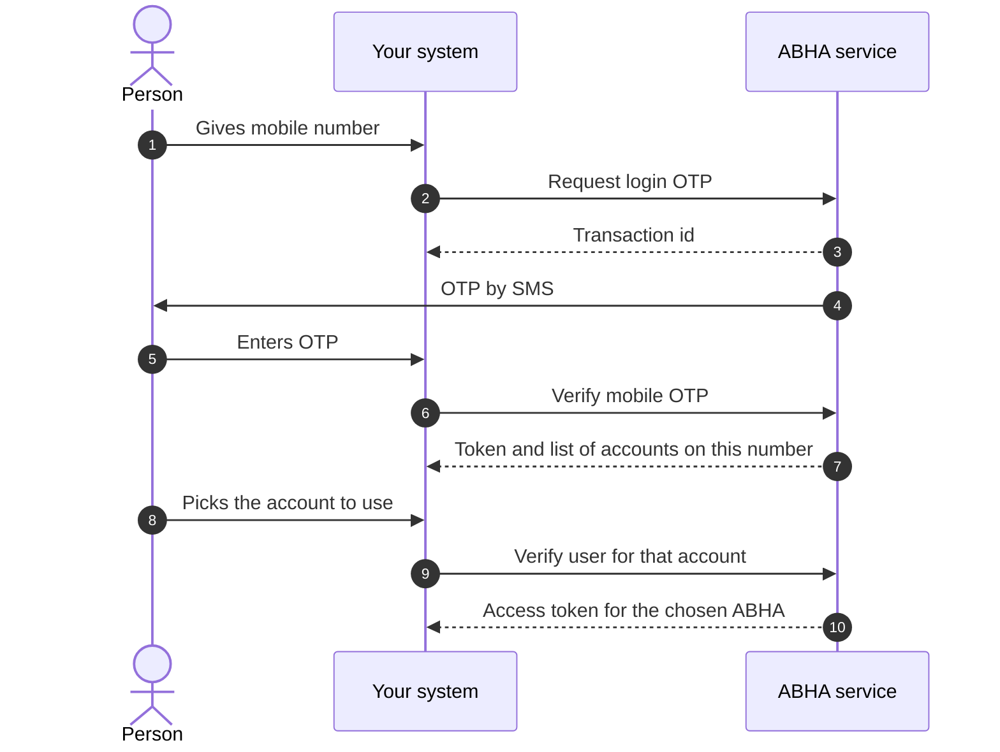
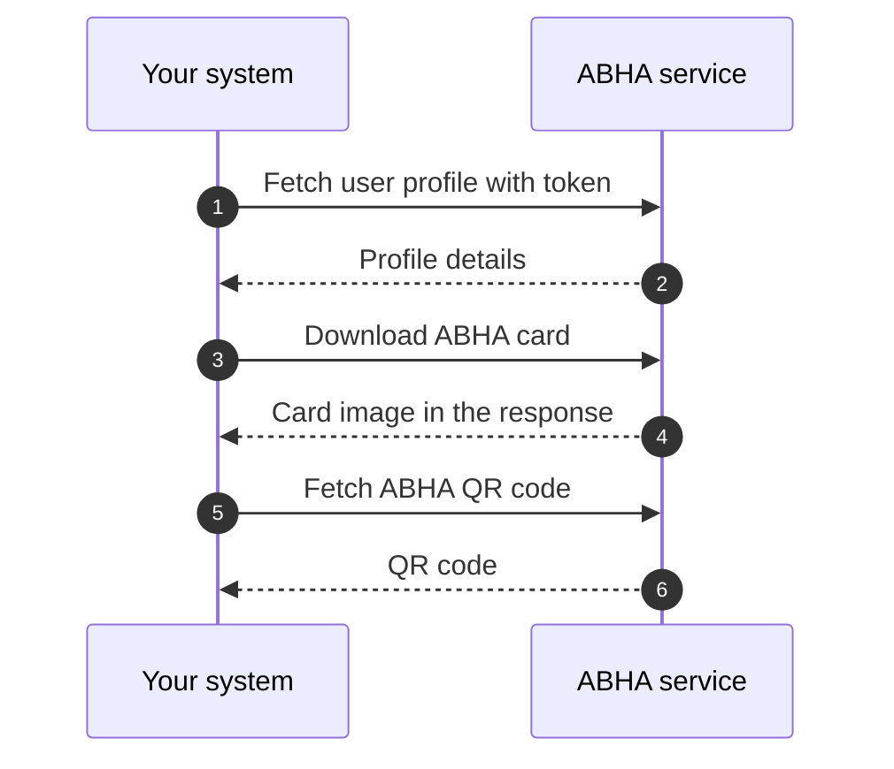

# M1 user journeys

Milestone 1 (M1) of [ABDM](/docs/hiecm/v3/getting-started/glossary#abdm) has four flows: creating an [ABHA](/docs/hiecm/v3/getting-started/glossary#abha), attaching a communication mobile number, logging an existing holder in, and reading the profile. Each is drawn below at step level, so you see the round trips before you read the [API sequence](/docs/hiecm/v3/api/m1/sequence).

NHA's document carries its own sequence diagrams as images, and those images did not survive the conversion to text. The diagrams below are drawn from the ordered lists of steps in the same document. The step order is NHA's; the drawing is ours.

"ABHA service" is NHA's ABHA API at the base URL on the [M1 overview](/docs/hiecm/v3/api/m1). Your system never calls Aadhaar. NHA's service does that for you.

## Journey 1: ABHA creation by Aadhaar OTP

The person gives their Aadhaar number. NHA sends a one time password ([OTP](/docs/hiecm/v3/getting-started/glossary#otp)) to the mobile registered against that Aadhaar. Once it checks out, the person picks a communication mobile number and an ABHA address, and the ABHA number is issued.

Email verification sits between the mobile step and the address step. NHA marks it optional, so it is not drawn.

## Journey 2: Communication mobile number after enrolment

The Aadhaar linked number is not always the number the person wants health messages on. NHA places this flow after enrolment in all three creation routes: Aadhaar OTP, face authentication and biometrics.

NHA's reference screens cover the person giving the number already linked to their Aadhaar. Those screens are images that did not convert, so whether a second OTP is sent in that case is not stated in the text we have.

## Journey 3: ABHA login by mobile number

One mobile number can hold more than one ABHA, so this flow has a third step where the person says which account they mean.

Login by Aadhaar number, by ABHA number and by ABHA address follow the same two beats: request a challenge, then verify it. The challenge can be an Aadhaar OTP, a mobile OTP, a fingerprint or IRIS capture, or a face authentication scan. [Use cases](/docs/hiecm/v3/api/m1/sequence) lists which routes NHA marks mandatory.

## Journey 4: Profile, ABHA card and quick response (QR) code

Once you hold a token for a person, the profile reads are plain calls. NHA groups get profile, QR code and card download as one set.

NHA says the card is displayed in the response rather than fetched from a separate link, but shows that response as a screenshot, so the content type and encoding are not transcribed. The QR code response is not transcribed either. Neither shape is on the [APIs](/docs/hiecm/v3/api/m1/apis) page, so treat both as unconfirmed until you call them.

Next: [use cases](/docs/hiecm/v3/api/m1/sequence) for which journeys you must build, then [API sequence](/docs/hiecm/v3/api/m1/sequence) for the calls in order.

