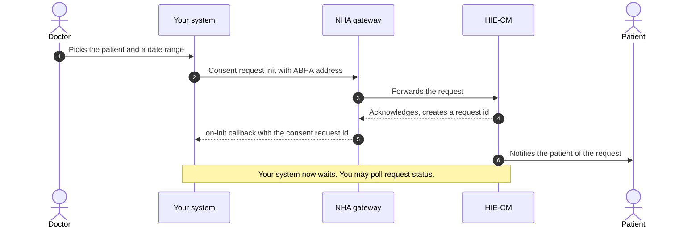
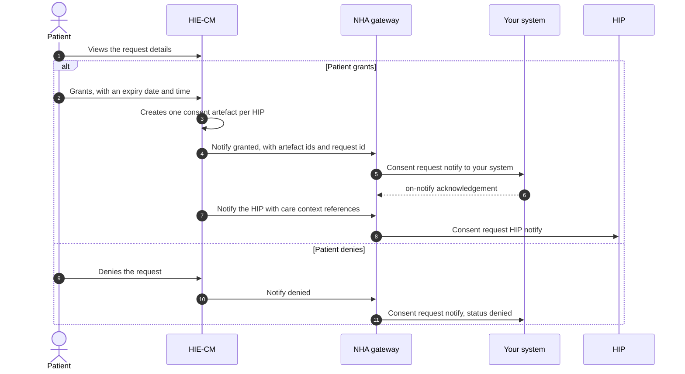
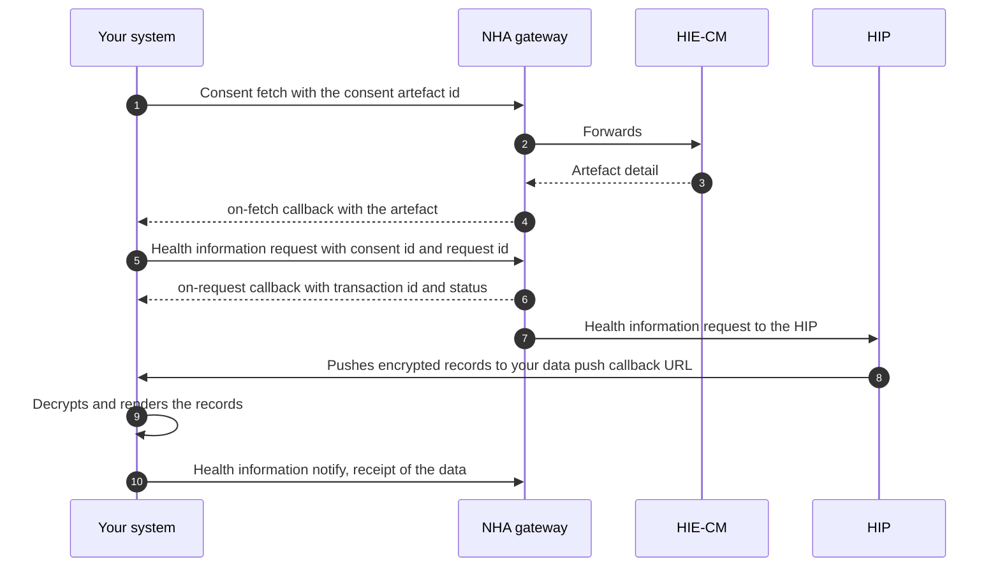

# M3 user journeys

Milestone 3 (M3) of [ABDM](/docs/hiecm/v3/getting-started/glossary#abdm) is one story in three parts: a doctor asks for a patient's past records, the patient says yes or no, and if yes the records travel. Each part is drawn below, so you can see the round trips before you read the [API reference](/reference/hiecm-m3).

[NHA](/docs/hiecm/v3/getting-started/glossary#nha)'s document carries its own diagrams and screen sequences as images, which did not survive the conversion to text. The diagrams below come from the ordered prose of the same document. The step order is NHA's, the drawing is ours.

| In the diagram | What it is |
|---|---|
| Patient | The person whose records these are, acting in their [PHR](/docs/hiecm/v3/getting-started/glossary#phr) app |
| Your system | The [HIU](/docs/hiecm/v3/getting-started/glossary#hiu): the hospital or app that wants to read the records |
| NHA gateway | NHA's [gateway](/docs/hiecm/v3/getting-started/glossary#gateway), which routes every call and callback |
| HIE-CM | The [HIE-CM](/docs/hiecm/v3/getting-started/glossary#hie-cm), which holds consent and asks the patient |
| HIP | The [HIP](/docs/hiecm/v3/getting-started/glossary#hip) that holds the records, in journeys 2 and 3 |

## Journey 1: raising a consent request

A doctor wants the patient's earlier records for a date range. Your system sends the request with the patient's [ABHA](/docs/hiecm/v3/getting-started/glossary#abha) address. Nothing comes back inline: you get a request id on a callback, then wait for the patient.

The request id is the handle for everything that follows. Store it against the doctor and the patient.

## Journey 2: the patient grants or denies

The patient sees who is asking, what they want, why, and for how long. The HIE-CM tells both sides what they chose.

- A grant carries an expiry. The patient sets when the permission runs out.
- A grant can produce more than one consent artefact, because the patient's records sit in more than one hospital.
- The patient can revoke a granted consent at any time. Your access ends when they do.

## Journey 3: fetching the records

With an artefact id you fetch the artefact, ask for the data it covers, and wait for that data on your callback URL.

The records arrive encrypted, at the same callback URL you supplied as the data push URL. NHA states your side plainly: convert the data back to its original form, then present it in a readable format.

The M3 document does not describe the encryption scheme. It is [ECDH](/docs/hiecm/v3/getting-started/glossary#ecdh) key exchange, specified on the [HIP](/docs/hiecm/v3/getting-started/glossary#hip) side in NHA's M2 document. See [M2](/docs/hiecm/v3/api/m2).

## What the patient sees

NHA's document includes a screen sequence and a set of expiry screens for the patient's side. Both are screenshots, and nothing readable converted, so they are not reproduced here. What the prose does state is on the [use cases](/reference/hiecm-m3) page under patient rights.
