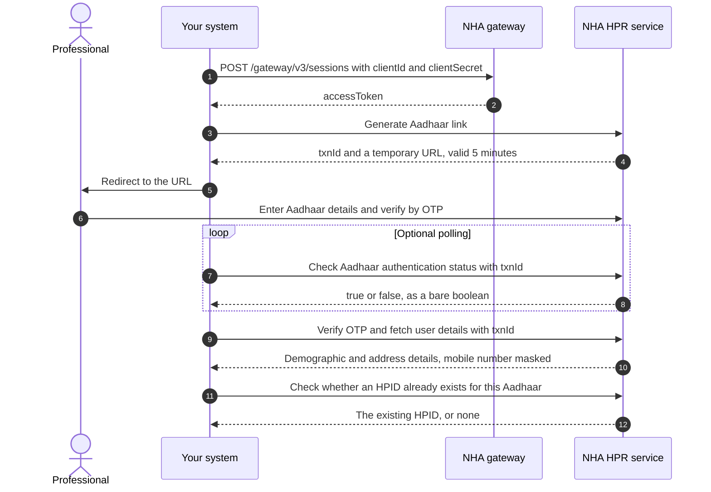
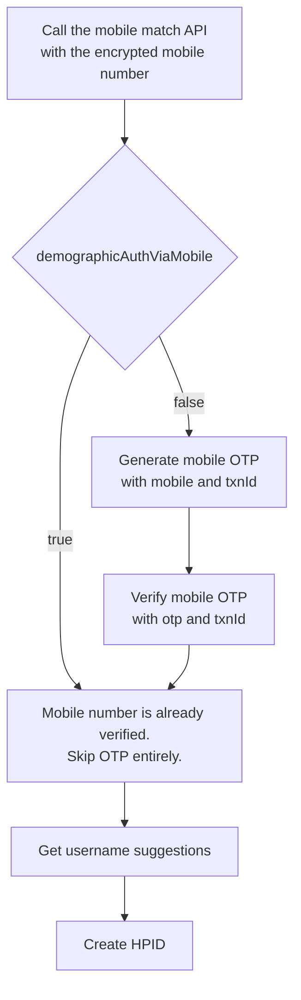
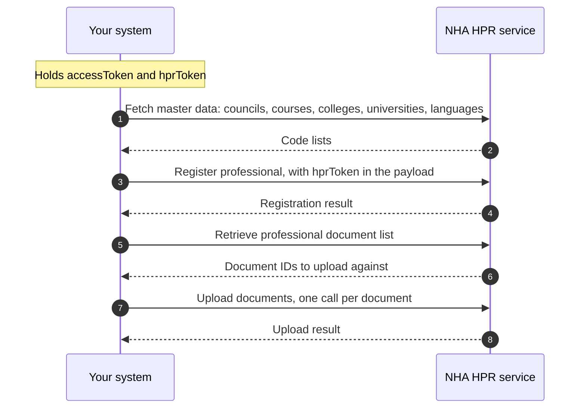
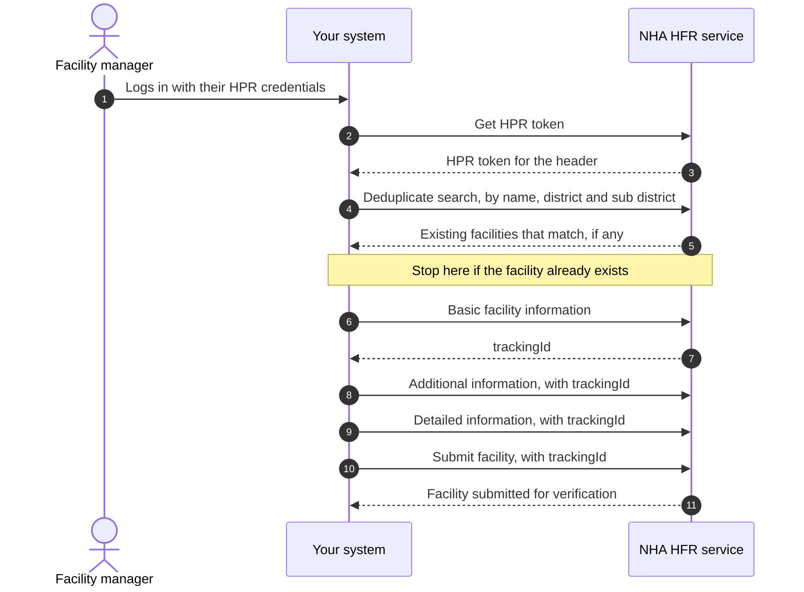
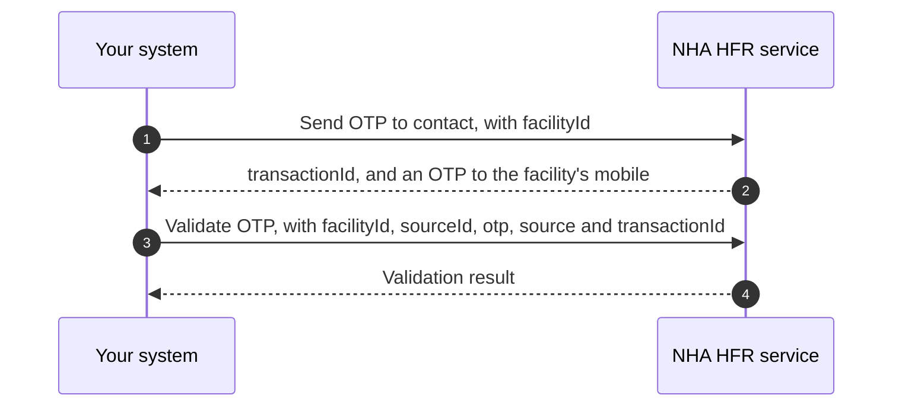
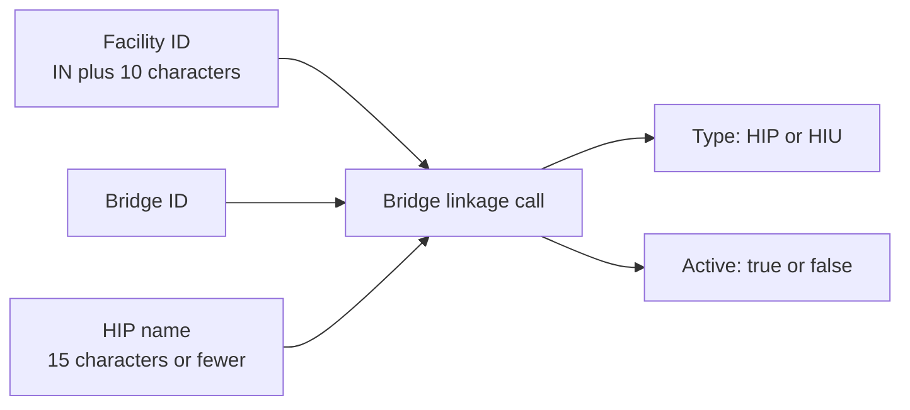

# M4 user journeys

Milestone 4 of [ABDM](/docs/hiecm/v3/getting-started/glossary#abdm) has three journeys:

- A professional gets an [HPID](/docs/hiecm/v3/getting-started/glossary#hpid) and an [HPR](/docs/hiecm/v3/getting-started/glossary#hpr) profile.
- A facility manager onboards a facility to the [HFR](/docs/hiecm/v3/getting-started/glossary#hfr).
- A facility links its bridges, so its software can act as a [HIP](/docs/hiecm/v3/getting-started/glossary#hip) or an [HIU](/docs/hiecm/v3/getting-started/glossary#hiu).

This page shows the order of calls in each. Field lists are on the [what NHA documents without a path](/docs/hiecm/v3/api/m4/undocumented) page.

:::caution[A map, not a runbook]
These diagrams follow the order of steps NHA's document sets out. They are a map, not a tested runbook.
:::

## Journey 1: a professional gets an HPID

The professional authenticates against Aadhaar on a page NHA hosts. Your system never handles the Aadhaar number or [OTP](/docs/hiecm/v3/getting-started/glossary#otp): it handles the transaction ID and redirects to a URL NHA returns, valid for five minutes. After that, call generate Aadhaar link again.

### Then the mobile number

The mobile number is confirmed before the HPID is created, by a fast path or a slow one. Send it encrypted: fetch NHA's public certificate from `/v4/int/api/v1/auth/cert`, encrypt with `RSA/ECB/PKCS1Padding`, send the encrypted value.

Create HPID returns an `hprToken`. Keep it: the register professional call needs it.

### Then the profile

The HPID is an identity, not a profile. Registering the professional adds qualifications, council registration and current work.

Two documents are mandatory, the degree certificate and the registration certificate. A proof of work certificate is mandatory too when the professional works for government, or for both government and private.

Register professional takes codes, not names. Fetch council, course, college, university, state, district and language from the master APIs first.

## Journey 2: a facility onboards to the HFR

Onboarding is one search, three writes and a submit, each write adding a layer of detail. Stop before submit and the facility stays in draft, invisible to ABDM.

The first write, basic facility information, returns a tracking ID. That is the facility's identity for the rest of the sequence, and what you pass as the facility ID on every later update.

### What each write call carries

| Call | What it captures |
|---|---|
| Basic facility information | Name, ownership, system of medicine, facility type and subtype, address with LGD codes, contact details, board and building photographs, opening hours |
| Additional information | Whether it has a pharmacy, blood bank, dialysis centre, cath lab, diagnostic lab or imaging centre, plus scheme identifiers such as ABPMJAY, Rohini, ECHS and CGHS |
| Detailed information | Specialities per system of medicine, bed and ventilator counts, and the pharmacy, blood bank, diagnostic and imaging sections that apply to this facility type |
| Submit facility | The tracking ID and an optional source of information. Moves the facility out of draft |

Which fields are mandatory in detailed information depends on the facility type, the type of service and the system of medicine. A diagnostic laboratory, imaging centre, blood bank or pharmacy sends no medical infrastructure counts at all.

### A facility can also verify by OTP

NHA names a second, shorter path used by government programmes: send an OTP to the contact number registered against a facility ID, then validate it.

## Journey 3: linking bridges to a facility

A facility ID alone does not make records flow. The facility has to be linked to a bridge, each link marked HIP or HIU. One facility can have several.

The HIP name is what a patient sees in their [ABHA](/docs/hiecm/v3/getting-started/glossary#abha) or [PHR](/docs/hiecm/v3/getting-started/glossary#phr) app when they search for this hospital. NHA sets three rules: 15 characters or fewer, no special characters, unique for every bridge on a facility. Its example builds the name from the hospital name plus the bridge name.

A facility with a facility ID and a linked HIP bridge can do the [M2](/docs/hiecm/v3/api/m2) work, linking care contexts and sharing records. With a linked HIU bridge it can do the [M3](/docs/hiecm/v3/api/m3) work, requesting consent and fetching records. M4 is the registration step in front of either flow outside sandbox.

Next: [what NHA documents without a path](/docs/hiecm/v3/api/m4/undocumented).
