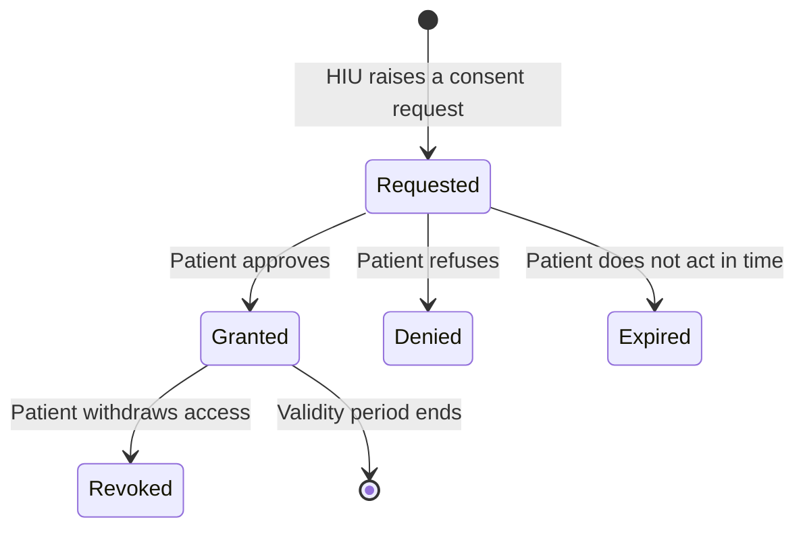

# Consent

Consent is the permission layer of [ABDM](/docs/hiecm/v3/getting-started/glossary#abdm): a record moves because a patient said yes to a named system, for a named reason, over a date range, for a fixed length of time. The calls that create and read it are in the [M3 guide](/docs/hiecm/v3/api/m3).

## Two objects, not one

| Object | What it is | Who creates it | Identifier |
| --- | --- | --- | --- |
| Consent request | The ask. It names the patient by [ABHA](/docs/hiecm/v3/getting-started/glossary#abha) address, the reason, the record types wanted, and the date range wanted. | The [HIU](/docs/hiecm/v3/getting-started/glossary#hiu), through the gateway | Consent request id |
| [Consent artefact](/docs/hiecm/v3/getting-started/glossary#consent-artefact) | The permission itself, created only if the patient grants the request. It is what a record holder checks before sending anything. | The [HIE-CM](/docs/hiecm/v3/getting-started/glossary#hie-cm), on the patient's decision | Consent artefact id |

One request can produce more than one artefact. A granted request returns the ids of the consent artefacts created against it, plural. Store the request id and every artefact id.

## Who holds what

- **The patient holds the decision**, in their [PHR](/docs/hiecm/v3/getting-started/glossary#phr) app.
- **The HIE-CM holds the artefact.** As [consent manager](/docs/hiecm/v3/getting-started/glossary#consent-manager) it asks the patient, records the answer, and tells requester and record holder.
- **The HIU holds an id, not a right.** It can stop working at any time.
- **The [HIP](/docs/hiecm/v3/getting-started/glossary#hip) holds the check.** Before sending a record it validates that the artefact is active and that the dates asked for sit inside the dates it allows.

## The states a consent moves through

There are five states: Requested, Granted, Denied, Expired and Revoked.

| State | What it means | What your system does |
| --- | --- | --- |
| Requested | The patient has not acted yet. | Wait. Poll the request status if you need to show progress. |
| Granted | The patient approved, and set how long the access lasts. | Fetch the artefact ids, then request the data. |
| Denied | The patient refused. | Stop. There is no partial result and no retry that changes the answer. |
| Expired | The request expired before the patient acted. | Raise a new request if the clinical need is still there. |
| Revoked | The patient withdrew a consent they had already granted. | Stop fetching under that artefact from that moment. |

The **consent validity period** is how long access lasts once granted, carried as the date and time at which the consent expires. It is not the **date range**, which says which records are in scope by when the care happened: a consent granted today can cover records from 2019.

## What the patient sees, and can change

A consent request carries the requesting HIU, the purpose of data access, the data types requested, the date range, the consent validity period and the request status. The patient approves with their preferred data access parameters, so they may modify four of those before approving: access duration, record date range, data categories and validity period. The consent you get back can be narrower than the one you asked for, so read the artefact.

## The five things a PHR app must let a person do

Consent is granted by a person, and the PHR app is where they do it. The
consent APIs give it five capabilities, and an app missing one leaves a person
able to give access they cannot inspect, change or withdraw.

1. **See the request**, with the HIU asking, the purpose, the record types,
   the date range of records, how long the consent would last, and its status.
2. **Change it before allowing it**, where the request permits: the access
   duration, the record date range, the categories shared, and the validity
   period. This is the one most often left out, and the one that turns a
   consent screen into a negotiation rather than a demand.
3. **Allow or refuse it.** A request has three outcomes, not two:
   grant, deny, or let it expire. The interface has to show the expired
   state.
4. **See what is already allowed**, so the person can tell which
   organisations hold access right now. A list of past decisions is not the
   same thing.
5. **Take it back** at any time, which revokes a previously approved
   consent.

## Purpose of use codes

Why you want the records. See [purpose of use](/docs/hiecm/v3/getting-started/glossary#purpose-of-use).

| Code | Display |
| --- | --- |
| `CAREMGT` | Care Management |
| `BTG` | Break the Glass |
| `PUBHLTH` | Public Health |
| `HPAYMT` | Healthcare Payment |
| `DSRCH` | Disease Specific Healthcare Research |
| `PATRQT` | Self Requested |

There are six codes.

## Health information types

What kind of record you are asking for. See [HI type](/docs/hiecm/v3/getting-started/glossary#hi-type). M3 accepts these types:

| Code |
| --- |
| `Prescription` |
| `DiagnosticReport` |
| `OPConsultation` |
| `DischargeSummary` |
| `ImmunizationRecord` |
| `HealthDocumentRecord` |
| `WellnessRecord` |
| `Invoice` |

What each type carries as a [FHIR](/docs/hiecm/v3/getting-started/glossary#fhir) bundle is on [FHIR and health record formats](/docs/hiecm/v3/concepts/fhir).

## Expiry and revocation

**Expiry is predictable.** The artefact carries an end, so you can fetch before it arrives.

**Revocation is not.** The patient can withdraw at any time, including after you have read the data.

So treat every fetch as a fresh permission check, and handle a mid flow revocation. A consent that was live when you sent the health information request can be dead when the record holder validates it. Decide your retention policy for data you already hold.

## Consent without a person tapping approve

An auto approval policy works like this: the patient authorises the app once, the app registers the policy with the HIE-CM, and later requests under that policy are granted immediately. The patient can disable it, after which each record needs its own request again. This changes who taps the button, not the model. An artefact is still created, still carries an expiry, and can still be revoked. Detail is on [PHR applications](/docs/hiecm/v3/concepts/phr).

## Where this is implemented

- [Hospital, lab and pharmacy systems](/docs/hiecm/v3/concepts/hip-hiu), the facility taking each role.
- [The ABDM gateway](/docs/hiecm/v3/concepts/gateway), which holds every artefact here.
- [M3 Retrieve, Health Information User Services](/docs/hiecm/v3/api/m3), the requesting side.
- [M2 Attach, Health Information Provider Services](/docs/hiecm/v3/api/m2), what a record holder validates.
- [How a record travels](/docs/hiecm/v3/concepts/data-flow), what happens next.
