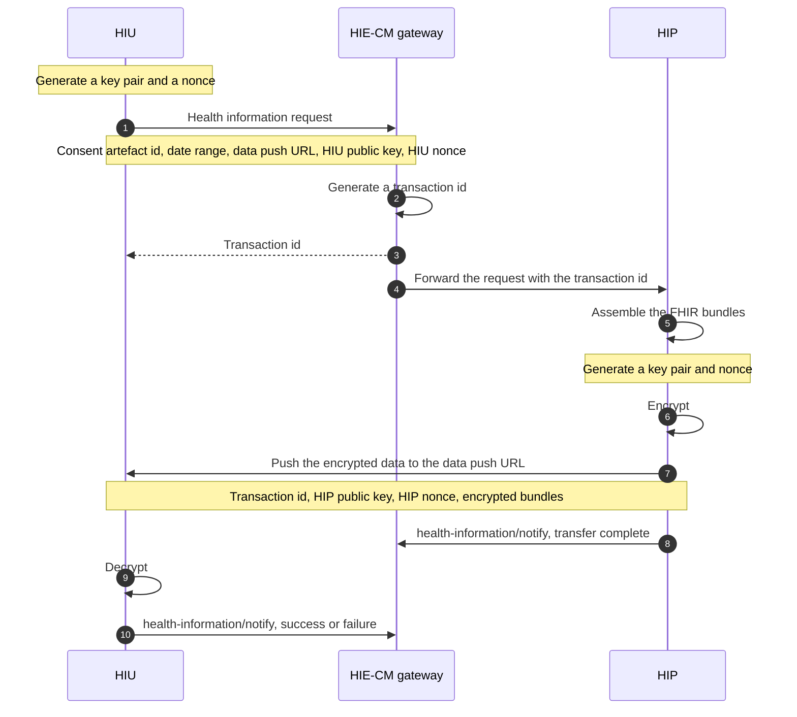

# How a record travels

In [ABDM](/docs/hiecm/v3/getting-started/glossary#abdm) the request goes through the [gateway](/docs/hiecm/v3/getting-started/glossary#gateway) and the [HIE-CM](/docs/hiecm/v3/getting-started/glossary#hie-cm), because that is where consent is checked and routing lives. The record itself goes straight from the system that holds it to a URL the requester nominated, encrypted so only the requester can open it.

## The two sides

| Role | Who takes it | What it does here | Milestone |
| --- | --- | --- | --- |
| [HIU](/docs/hiecm/v3/getting-started/glossary#hiu) | The organisation or citizen asking | Holds a granted [consent artefact](/docs/hiecm/v3/getting-started/glossary#consent-artefact), asks for the records it covers, receives them and decrypts them | [M3](/docs/hiecm/v3/api/m3) |
| [HIP](/docs/hiecm/v3/getting-started/glossary#hip) | The citizen or facility holding the record | Holds the records, packages, encrypts and pushes | [M2](/docs/hiecm/v3/api/m2) |

The HIE-CM sits between them for the request and the notifications, and never sees a record.

## The whole path

## Stage 1: the request

The HIU sends a health information request through the gateway, quoting a consent artefact the patient granted. It carries four things.

- **The consent id**, the artefact that authorises the request.
- **The data push URL**, where the HIP sends the records.
- **The date and time range** of records wanted.
- **The encryption parameters**: the HIU's public key and its nonce.

The HIE-CM generates a transaction id and gives it to both sides, which is how you correlate a push arriving later with a request you sent earlier.

## Stage 2: validation, then transfer

The HIE-CM validates the request against the consent id before it forwards the request to the HIP.

The HIP then packages the records as [FHIR](/docs/hiecm/v3/getting-started/glossary#fhir) bundles, encrypts them, and sends them with the transaction id to the data push URL.

## Stage 3: the notifications that close it

Both sides call `health-information/notify`: the HIP to say the data was transmitted, the HIU to report success or failure on its side. Neither carries the record. They carry the fact that a transfer happened, which is what makes the exchange auditable for the patient.

## Timing and size

| Constraint | Rule |
| --- | --- |
| Large datasets | Split across pages, numbered with `pageNumber` out of `pageCount` |

Treat retrieval and encryption as a background job, not work inside a web request.

## The encryption

The scheme is [Elliptic Curve Diffie-Hellman](/docs/hiecm/v3/getting-started/glossary#ecdh) key exchange on Curve25519. Only the HIU holding valid consent can read the data.

### Who holds which key

| Key material | Generated by | Where it goes |
| --- | --- | --- |
| Short term private key, DHSK(U) | HIU | Never leaves the HIU |
| Short term public key, DHPK(U) | HIU | Sent with the request |
| Nonce, RAND(U) | HIU | Sent with the request |
| Short term private key, DHSK(P) | HIP | Never leaves the HIP |
| Short term public key, DHPK(P) | HIP | Sent with the encrypted data |
| Nonce, RAND(P) | HIP | Sent with the encrypted data |
| Shared key, DHK(U,P) | Computed independently by both | Never transmitted |

### What the HIP does, step by step

Four steps, once consent has validated.

1. Generate a key pair, DHSK(P) and DHPK(P), on the curve the HIU specified.
2. Generate a nonce, RAND(P).
3. Compute the shared key DHK(U,P) from the HIU's public key DHPK(U) and the HIP's own private key DHSK(P).
4. Encrypt the data.

The HIP then sends DHPK(P), RAND(P) and the encrypted data. The HIU derives the same shared key from its own private key DHSK(U) and the HIP's public key DHPK(P).

Build the shared key from the HIU's public key and the HIP's private key. That is the pairing that makes the Diffie-Hellman exchange work.

## Where this is implemented

- [Hospital, lab and pharmacy systems](/docs/hiecm/v3/concepts/hip-hiu), which side the facility you act for is on.
- [M2 Attach, Health Information Provider Services](/docs/hiecm/v3/api/m2), the sending side.
- [M3 Retrieve, Health Information User Services](/docs/hiecm/v3/api/m3), the receiving side.
- [Consent](/docs/hiecm/v3/concepts/consent), the artefact this flow depends on.
- [FHIR and health record formats](/docs/hiecm/v3/concepts/fhir), what is inside the payload.
