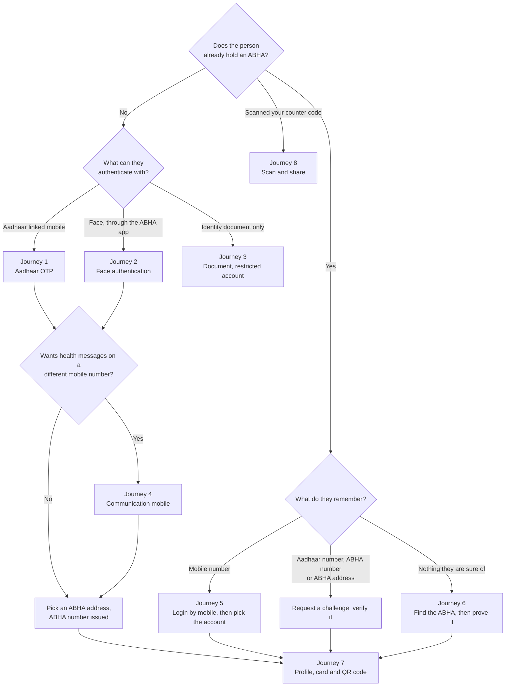
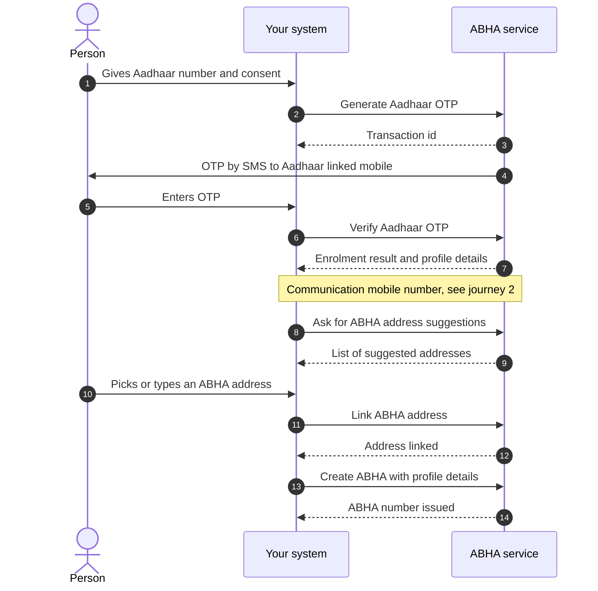
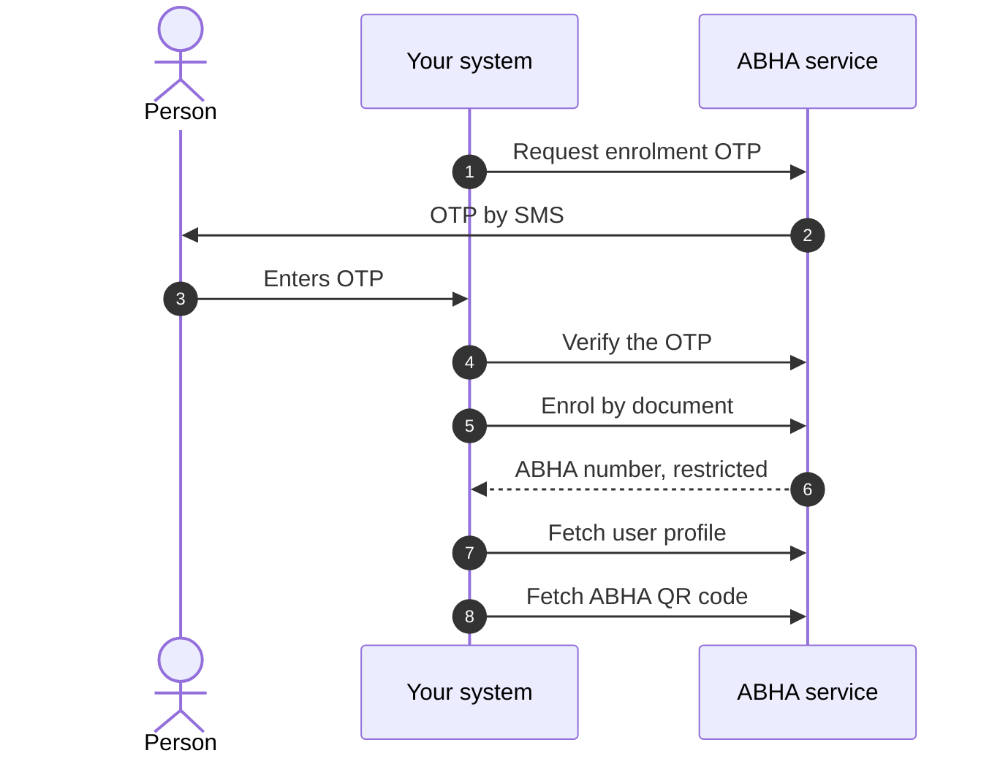
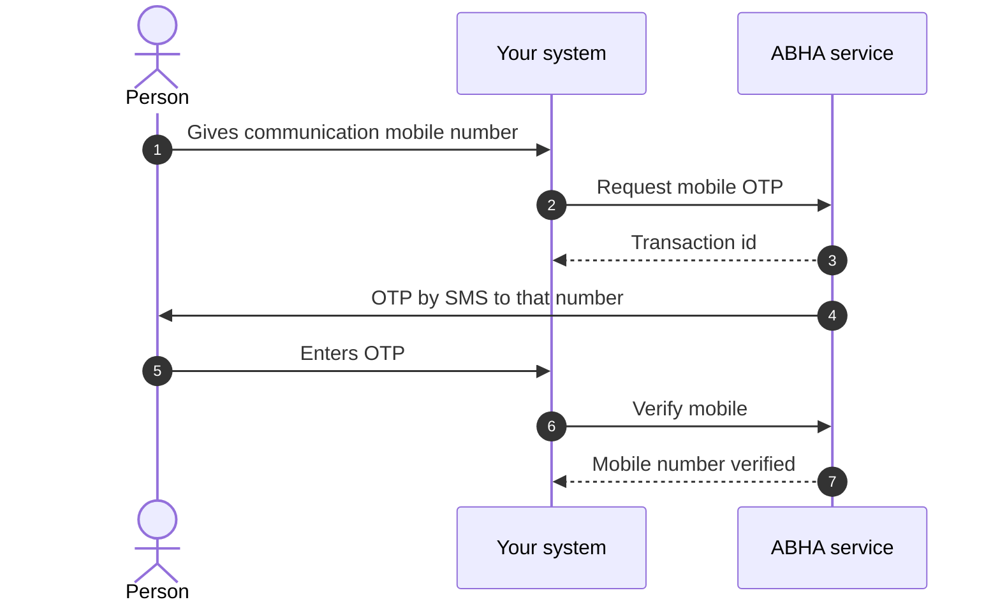
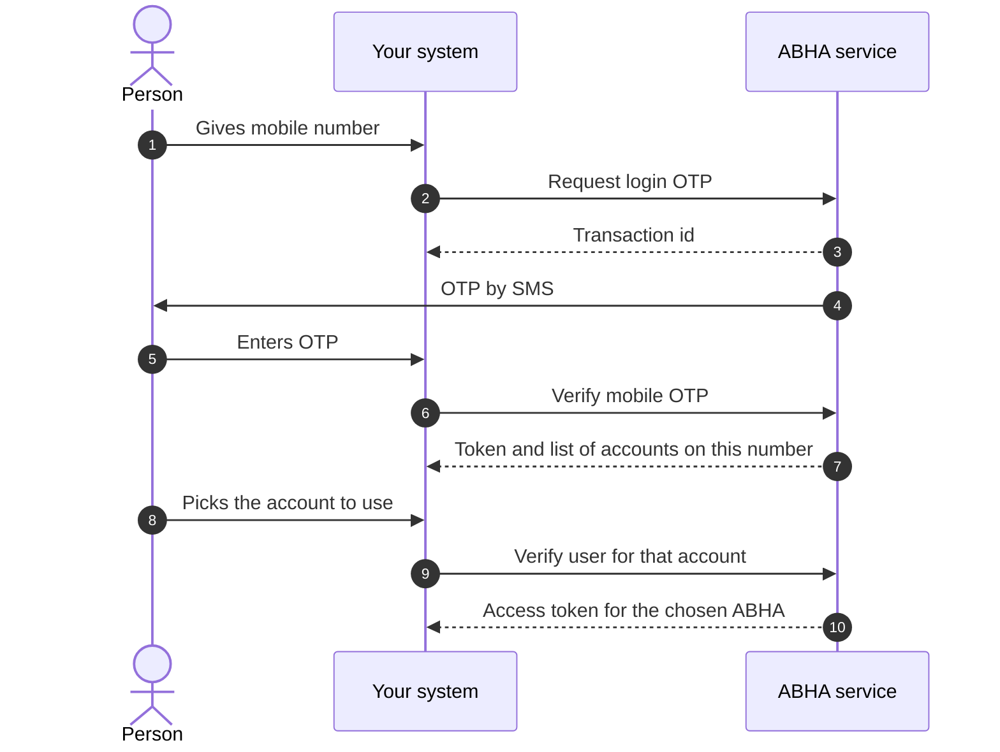
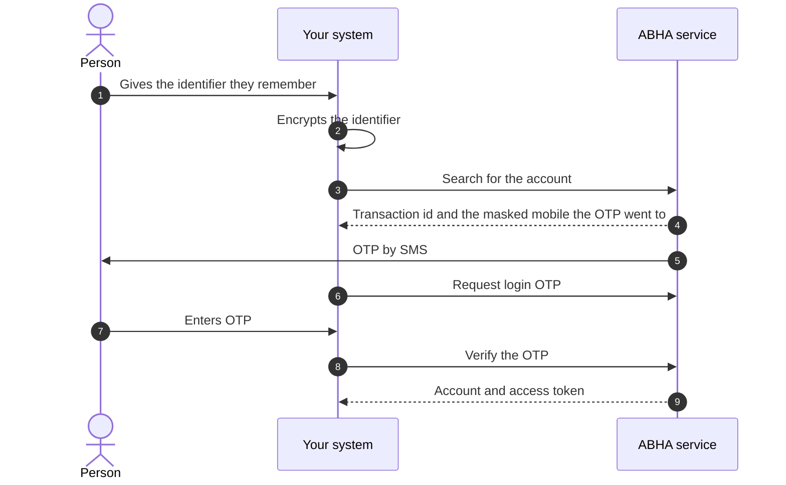
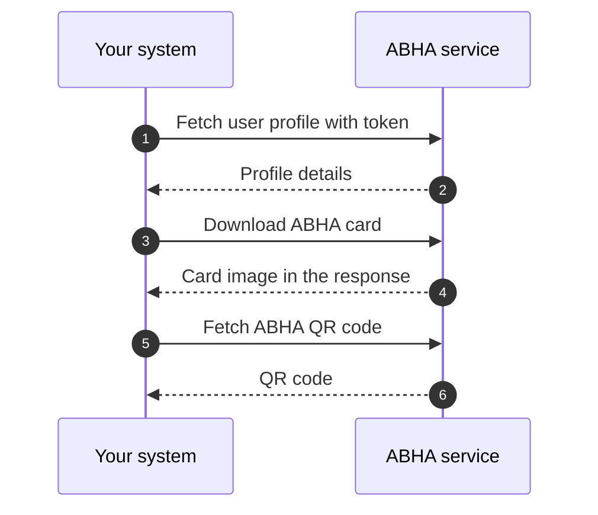
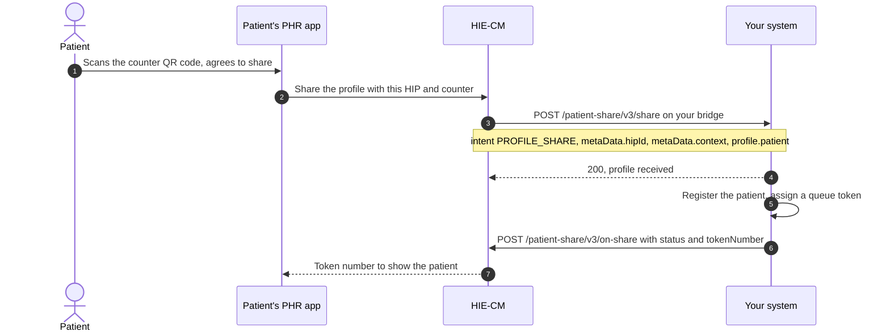

import ApiLinks from '@site/src/components/docs/ApiLinks';
import SkillInstall from '@site/src/components/docs/SkillInstall';

# M1 Create: ABHA identity

Milestone 1 is the identity milestone of
[ABDM](/docs/hiecm/v3/getting-started/glossary#abdm). You create an
[ABHA](/docs/hiecm/v3/getting-started/glossary#abha) for a person, log that
person in, and read or update their profile. An ABHA number is a 14 digit
identifier issued after a [KYC](/docs/hiecm/v3/getting-started/glossary#kyc)
check. Every other ABDM flow assumes the person already has one, so nobody
skips M1.

<ApiLinks module="m1" />

## In short

- M1 is identity only. It creates and authenticates an ABHA. It moves no health
  records.
- Nothing runs until the gateway session call returns an access token.
- Two tokens exist and are not interchangeable: the gateway token in
  `Authorization`, the user token in `X-token`.
- Aadhaar numbers, mobile numbers, [OTP](/docs/hiecm/v3/getting-started/glossary#otp)
  values and passwords travel RSA encrypted.

## What M1 gives you

| Capability | What your system can do |
|---|---|
| Session and tokens | Get an access token, refresh it, fetch the public certificate |
| ABHA creation | Verify the person against Aadhaar, attach a mobile number and an ABHA address |
| ABHA login | Sign in a holder by mobile number, Aadhaar number, ABHA number or ABHA address |
| Profile management | Read the profile, show the ABHA card and QR code, change the mobile number, redo KYC |
| Scan and share | Register a patient who scanned your counter QR code, and hand them a queue token |

M1 moves no health records. [M2 Attach](./m2) links them. [M3
Retrieve](./m3) fetches them with consent.

## Who needs it

Everyone. A facility publishing as the [HIP](/docs/hiecm/v3/getting-started/glossary#hip), an organisation
fetching as the [HIU](/docs/hiecm/v3/getting-started/glossary#hiu), and a citizen using a [PHR](/docs/hiecm/v3/getting-started/glossary#phr) app all
hold the session token M1 issues and key their work to an ABHA address.

## Building blocks you use

- The [ABHA registry](/docs/hiecm/v3/registries), which holds the ABHA number,
  address and profile.
- The [HIE-CM](/docs/hiecm/v3/getting-started/glossary#hie-cm) gateway, which
  issues your session token. See [The ABDM
  gateway](/docs/hiecm/v3/concepts/gateway).

Aadhaar is not an ABDM building block. The ABHA service calls it for you.

## Before you start

1. **Sandbox credentials.** A client ID and secret from [Get
   started](/docs/hiecm/v3/getting-started/sandbox).
2. **An access token.** From the session API, carried on every M1 call.
3. **The public certificate.** The Aadhaar number, the OTP and the mobile
   number travel encrypted, so fetch the certificate before you encrypt
   anything.

## What you build, in order

1. **Session and tokens.** Mandatory. Nothing else in M1 runs until this works.
2. **ABHA creation by Aadhaar OTP.** Mandatory.
3. **ABHA login.** Mandatory, on all four entry points.
4. **User profile and ABHA card.** Mandatory. Plain reads against a token you
   hold.
5. **Demographic authentication.** Mandatory for government integrators, not
   for private ones.

Everything else in M1 is optional for both. Skip all of it and you still
complete the milestone. The mandatory and optional split, capability by
capability, is on the [M1 API reference](/reference/hiecm-m1).

## Build it with an agent

Hand M1 to the agent you already use, as one file it loads once. Install it, or open it there in one click.

<SkillInstall slug="abdm-m1" note="Every M1 call, its error codes and its certification cases in one file: 55 operations, 89 codes, 122 cases." />

## Certification

M1 has no certification step of its own. One exit process covers the whole
integration, run once, after every milestone your role needs works end to end.
See [Going live](/docs/hiecm/v3/getting-started/going-live) for the four steps
and what each one asks of you.

Sandbox test data is in the [data
dictionary](/docs/hiecm/v3/reference/data-dictionary). [Support](/docs/support)
lists the channels. The cases you are certified against are in [M1 testing use
cases](/docs/hiecm/v3/resources/testing/m1).

## The journey, one diagram per flow

Milestone 1 (M1) of [ABDM](/docs/hiecm/v3/getting-started/glossary#abdm) has eight journeys. Three of them create an [ABHA](/docs/hiecm/v3/getting-started/glossary#abha), by Aadhaar OTP, by face authentication or from an identity document. Four more attach a communication mobile number, log an existing holder in, find an ABHA the person has forgotten, and read the profile. The last registers a patient who scanned your counter code. Each is drawn below at step level, so you see the round trips before you read the [API reference](/reference/hiecm-m1).

The diagrams below follow the published step order for each flow.

"ABHA service" is the ABHA API at the base URL on the [M1 overview](/docs/hiecm/v3/api/m1). Your system never calls Aadhaar. The ABHA service does that for you.

### Which journey applies

Start from what the person in front of you has.

## Journey 1: ABHA creation by Aadhaar OTP

The person gives their Aadhaar number. The ABHA service sends a one time password ([OTP](/docs/hiecm/v3/getting-started/glossary#otp)) to the mobile registered against that Aadhaar. Once it checks out, the person picks a communication mobile number and an ABHA address, and the ABHA number is issued.

Email verification sits between the mobile step and the address step. It is optional, so it is not drawn.

## Journey 2: ABHA creation by face authentication

Some people cannot use the OTP route, usually because the mobile registered against their Aadhaar is no longer theirs. Face authentication is the optional alternative. The person authenticates their face through the Aadhaar registered device (RD) service on their own phone, which is how the transaction moves from your screen to theirs.

```mermaid
sequenceDiagram
    autonumber
    actor P as Person with the ABHA app
    participant S as Your system
    participant R as Aadhaar RD service
    participant A as ABHA service
    S->>A: Start enrolment authentication
    A-->>S: Transaction id
    S->>P: Show a QR code built from the transaction id
    P->>R: Scans it, then authenticates by face
    R-->>P: Captured PID block
    P->>S: Authentication confirmed
    S->>A: Send the captured PID block
    S->>A: Enrol by Aadhaar
    A-->>S: ABHA number and profile
    S->>A: Ask for ABHA address suggestions
    A-->>S: List of suggested addresses
    S->>A: Link the chosen ABHA address
```

The middle of this journey happens on someone else's device, so your system is waiting on a person rather than on a network call. Show that state clearly instead of a spinner.

The PID block is encrypted by the capture device and it expires. Send it as soon as you receive it rather than storing it.

## Journey 3: ABHA creation from an identity document

When neither an Aadhaar OTP nor a face capture is possible, enrol the person from an identity document. A driving licence is one such document.

The account this produces is restricted until it is upgraded through Aadhaar know your customer (KYC) verification. Tell the person that when the account is created, rather than letting them find out when something later fails.

## Journey 4: Communication mobile number after enrolment

The Aadhaar linked number is not always the number the person wants health messages on. This flow runs after enrolment in all three creation routes: Aadhaar OTP, face authentication and biometrics.

A person may give the number already linked to their Aadhaar. Whether that path sends a second OTP is not yet published.

## Journey 5: ABHA login by mobile number

One mobile number can hold more than one ABHA, so this flow has a third step where the person says which account they mean.

Login by Aadhaar number, by ABHA number and by ABHA address follow the same two beats: request a challenge, then verify it. The challenge can be an Aadhaar OTP, a mobile OTP, a fingerprint or IRIS capture, or a face authentication scan. [API reference](/reference/hiecm-m1) lists which routes are mandatory.

## Journey 6: Finding an ABHA the person has forgotten

People forget their ABHA. This journey finds it from something they do remember, usually a mobile number, then makes them prove the account is theirs before anything is handed over. The proof step is the point, because a search on its own only tells you that an account exists.

The search response names the masked mobile the OTP was sent to, for example one ending `0161`. Show that to the person so they can confirm the number is theirs before they sit waiting for a message that will not arrive.

Encrypt the identifier inside your own system. Do not send the identifier to a remote encryption helper or a third party site; that hands a patient identifier to a party that has no reason to hold it. See [encryption](/docs/hiecm/v3/concepts/encryption) for how to do it locally.

## Journey 7: Profile, ABHA card and quick response (QR) code

Once you hold a token for a person, the profile reads are plain calls. Get profile, QR code and card download form one set.

The card is returned in the response rather than fetched from a separate link. The content type and encoding of the card and QR code responses are not yet published. See the [APIs](/docs/hiecm/v3/api/m1/apis) page for the fields that are.

## Journey 8: A patient shares their profile at your counter

Your facility prints a QR code at each counter. It holds a URL with two parameters: your HIP id and a counter context such as `OPD1`. The patient scans it in their [PHR](/docs/hiecm/v3/getting-started/glossary#phr) app, agrees to share, and their profile arrives on your bridge. Nobody types a name at the desk, and every record from that visit links to the right ABHA address from the start.

Step 3 is a callback on the URL registered for your bridge, not a call you make. Answer it with a 200 at once and do the registration afterwards. Step 7 is your reply: `acknowledgement.status` is `SUCCESS` with `profile.tokenNumber` and the same `context`, or `FAILURE` with an `error` code and message.

The patient's app holds its screen open for 30 seconds. Send the acknowledgement inside that window or the patient sees no token.

`profile.patient` carries the ABHA number, the ABHA address, name, gender, date of birth, mobile number, address and a KYC photo. Match on the ABHA address. The counter context is yours to define: up to 20 alphanumeric characters, and never the facility id, the HIP id or the HIP name.

The two calls: [receive a patient's shared profile](/docs/hiecm/v3/api/m1/endpoints/m1-receive-patient-share) and [send the share acknowledgement](/docs/hiecm/v3/api/m1/endpoints/m1-on-share-acknowledgement). The patient's side is [P2 Linking and records](./p2#scan-and-share-at-a-facility).

## Creating an ABHA address without an ABHA number

Every journey above issues an [ABHA number](/docs/hiecm/v3/getting-started/glossary#abha-number)
first and attaches an [ABHA address](/docs/hiecm/v3/getting-started/glossary#abha-address)
to it, and each one needs Aadhaar or an identity document. A common question
is whether a mobile number on its own is enough. Through M1 it is not: every
M1 enrolment route starts from Aadhaar or a document.

It is enough on the patient side. A
[PHR](/docs/hiecm/v3/getting-started/glossary#phr) application registers a
person from a mobile number and the OTP sent to it, and the person ends up
with an ABHA address and no ABHA number. That profile is marked
Self-Declared: it carries no [KYC](/docs/hiecm/v3/getting-started/glossary#kyc),
the person types their own demographics, and the ABHA number appears only if
they link one later. The route is
[P1 Identity, creating an ABHA address](/docs/hiecm/v3/milestones/p1#creating-an-abha-address),
and it uses the PHR application endpoints in
[the P1 reference](/docs/hiecm/v3/api/p1), not the M1 enrolment calls above.

Which matters for what you are building. A hospital system registering a
walk-in patient needs the KYC verified identity these seven journeys produce.
An application the person holds themselves can start them on a mobile number
and ask for Aadhaar later, which is a shorter first screen.

## Next

- The flows as diagrams: [the journey below](#the-journey-one-diagram-per-flow).
- The calls, base URLs and error shapes: [M1 API
  reference](/docs/hiecm/v3/api/m1).
- The next milestone: [M2 Attach](./m2).
