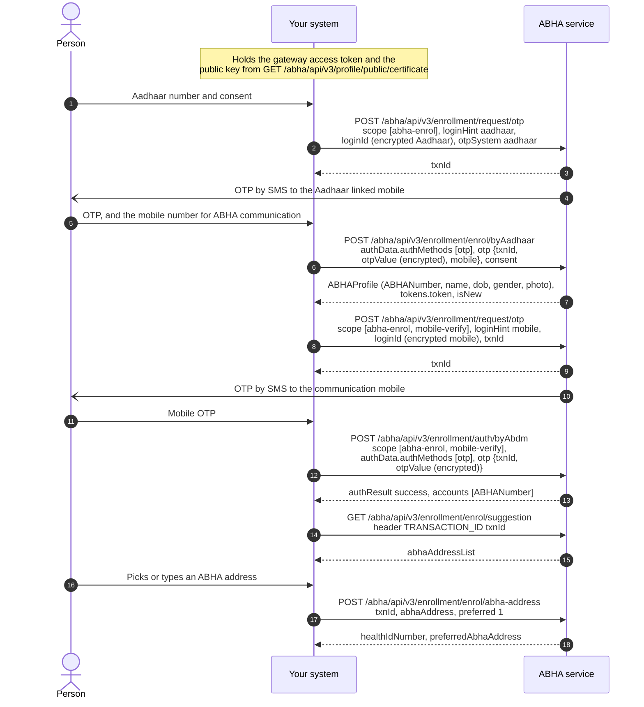
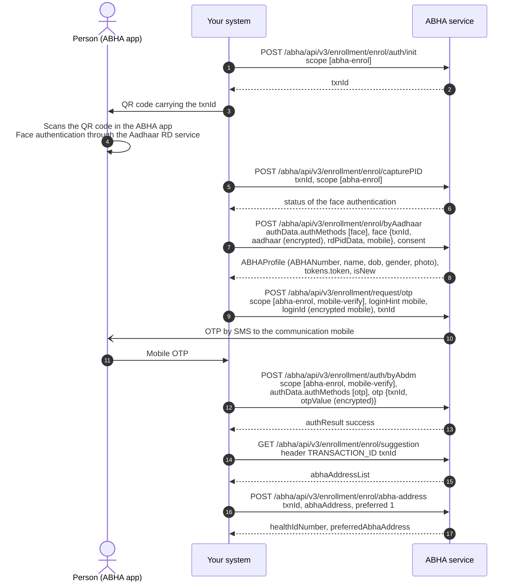
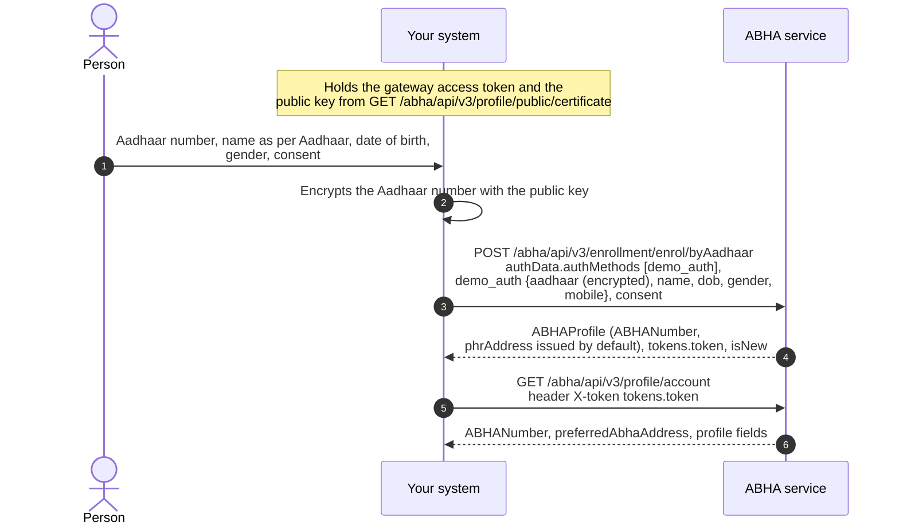
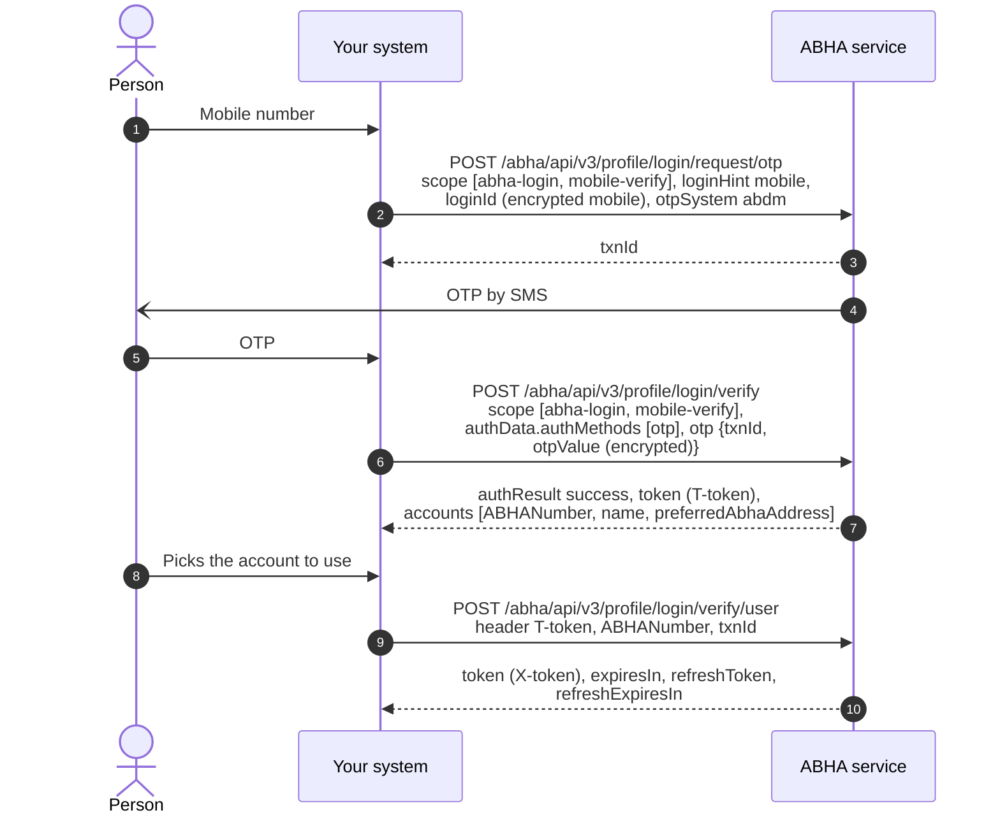
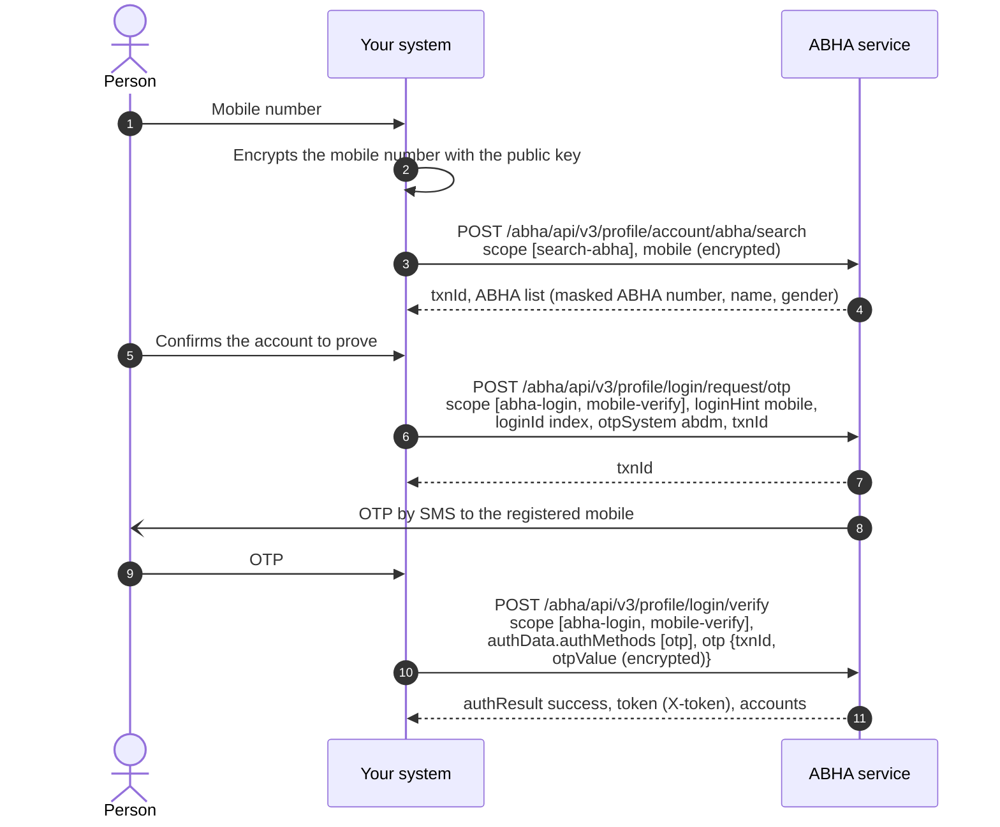
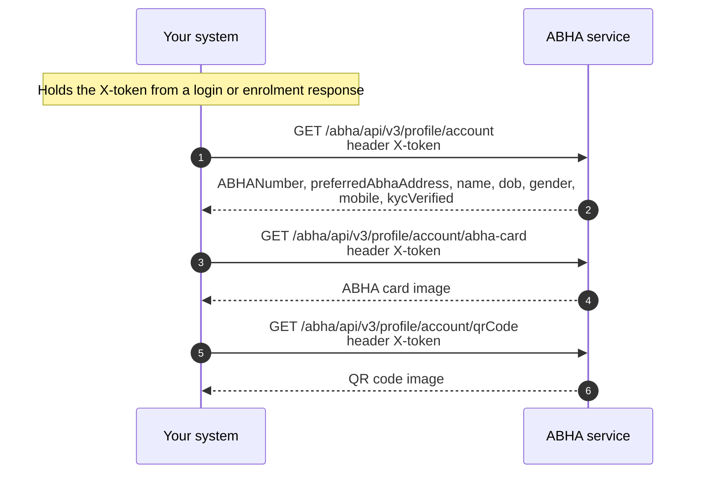

import ApiLinks from '@site/src/components/docs/ApiLinks';
import SkillInstall from '@site/src/components/docs/SkillInstall';
import LegacyAnchor from '@site/src/components/mdx/LegacyAnchor';

# M1 Create: ABHA Creation and Verification

Milestone 1 focuses on the creation and management of
[ABHA](/docs/hiecm/v3/getting-started/glossary#abha), the unique health identifier under
[ABDM](/docs/hiecm/v3/getting-started/glossary#abdm). This milestone enables the creation of ABHA, authentication
of users, and retrieval or updating of ABHA profile information through
ABDM-compliant workflows. ABHA is a 14-digit unique health identifier issued to
an individual upon successful completion of the prescribed verification
process. ABHA serves as a foundational component for several ABDM services and
workflows. Organizations implementing these services may be required to
support ABHA creation and management capabilities, as applicable to their use
case.

<ApiLinks module="m1" />

## In short

Milestone 1 focuses on ABHA creation, authentication, and profile management
functionalities within the ABDM ecosystem. No health information exchange or
health record sharing is performed as part of this milestone.

- ABDM gateway interactions require successful session establishment and the
  receipt of a valid access token before invoking protected APIs.
- The framework uses distinct gateway and user access tokens, each serving a
  specific authentication purpose and requiring usage in accordance with the
  applicable API specifications.
- Applications should use token validity and expiry parameters returned in API
  responses and implement appropriate token refresh mechanisms to ensure
  uninterrupted service continuity.
- Sensitive information, including Aadhaar numbers, mobile numbers,
  [OTPs](/docs/hiecm/v3/getting-started/glossary#otp), and passwords, must be transmitted using RSA encryption in
  accordance with ABDM security and data protection requirements.

## Capabilities enabled under Milestone 1 (M1)

<LegacyAnchor id="what-m1-gives-you" />

| Capability | What it enables |
|---|---|
| Session and tokens | Establish gateway sessions, manage access and refresh tokens, and retrieve public key certificates required for secure ABDM interactions. |
| ABHA creation | Support creation of ABHA and associated identifiers in accordance with ABDM onboarding and verification workflows. |
| ABHA login | Authenticate an ABHA holder using approved identifiers and authentication mechanisms, including mobile number, ABHA number, or ABHA address, as applicable. |
| Profile management | Retrieve and manage ABHA profile information, display ABHA credentials and QR codes, update eligible profile attributes, and support re-verification workflows where applicable. |
| [Scan and Register](./scan-and-register) | Support patient registration through QR-based workflows and generate service or queue identifiers in accordance with organization-specific processes. |

## Building blocks you use

- The [ABHA registry](/docs/hiecm/v3/registries), which holds the ABHA number,
  address and profile.
- The [HIE-CM](/docs/hiecm/v3/getting-started/glossary#hie-cm) gateway, which
  issues your session token. See [The ABDM
  gateway](/docs/hiecm/v3/concepts/gateway).

## Build M1 with an AI coding assistant

<LegacyAnchor id="build-it-with-an-agent" />

The M1 skill gives an AI coding assistant this milestone as one file: every M1
call, its error codes and its test cases. Install it, or open it in your
assistant in one click.

<SkillInstall slug="abdm-m1" note="Every M1 call, its error codes and its certification cases in one file: 55 operations, 89 codes, 122 cases." />

## ABHA creation

<LegacyAnchor id="abha-with-aadhaar" />
<LegacyAnchor id="the-page-map" />

### ABHA creation by an Aadhaar OTP

<LegacyAnchor id="journey-1-abha-creation-by-aadhaar-otp" />

The individual provides their Aadhaar number. The ABHA service sends a one time
password ([OTP](/docs/hiecm/v3/getting-started/glossary#otp)) to the mobile number registered against that Aadhaar.
Upon successful verification, the individual selects an ABHA address, and the
ABHA number is issued.

### ABHA creation by face authentication

<LegacyAnchor id="journey-2-abha-creation-by-face-authentication" />

Individuals who are unable to use OTP-based authentication, including cases
where the mobile number linked to Aadhaar is unavailable or inaccessible, may
use face authentication as an alternative verification mechanism, subject to
ABDM and UIDAI guidelines. Face authentication is performed through authorized
Aadhaar Registered Device (RD) services using approved authentication
workflows.

ABDM documentation references biometric-based ABHA creation workflows,
including face authentication and other supported biometric modalities where
applicable. Organizations should implement authentication methods in accordance
with the officially published specifications and validate any implementation
assumptions through the appropriate NHA guidance and documentation before
proceeding with production deployment.

### ABHA creation by demographic authentication

<LegacyAnchor id="journey-3-abha-creation-by-demographic-authentication" />

This onboarding pathway is intended for eligible government programme
integrations in accordance with ABDM guidelines. Unlike OTP-based or biometric
authentication workflows, demographic authentication relies on validation of
Aadhaar demographic information, including name, date of birth, and gender,
through the prescribed verification process.

The `enrol/byAadhaar` API is invoked with the appropriate authentication method
and encrypted demographic details as specified in the implementation
guidelines. Implementers should account for the response structure defined for
this workflow, including user token handling and ABHA address generation
behaviour. A system-generated ABHA address may be assigned during account
creation, and organizations may provide users with the option to configure a
more user-friendly ABHA address where permitted. Any demographic verification
failures should be handled in accordance with the error codes and response
specifications published by ABDM.

### Create a child ABHA

<LegacyAnchor id="child-abha" />

ABDM supports guardian-based management of ABHA accounts for eligible children
in accordance with applicable policies and implementation guidelines. This
functionality is currently made available only to select government
integrators, subject to approval by the National Health Authority (NHA). The
workflow includes creation of a child ABHA linked to a verified parent or
guardian account, updating child profile information, and retrieval of child
accounts associated with the parent or guardian.

## ABHA login via mobile number

<LegacyAnchor id="abha-login-by-mobile-number" />
<LegacyAnchor id="journey-5-abha-login-by-mobile-number" />

ABHA login using a registered mobile number enables individuals to securely
access their ABHA-linked profile and services through a mobile OTP-based
authentication process. Since a single mobile number may be associated with
multiple ABHA accounts, the user may be required to select the appropriate ABHA
account after successful verification. Upon completion of the authentication
process, authorized access is granted to the individual's ABHA profile and
associated services in accordance with ABDM guidelines.

Login by Aadhaar number, by ABHA number and by ABHA address follow the same two
steps: request a challenge, then verify it. The [M1 API
reference](/docs/hiecm/v3/api/m1) lists which routes are mandatory.

## Find ABHA from mobile number

<LegacyAnchor id="find-an-abha-the-person-has-forgotten" />
<LegacyAnchor id="journey-6-finding-an-abha-the-person-has-forgotten" />

This workflow enables discovery of an existing ABHA using a registered mobile
number when an individual does not readily know their ABHA details. Upon
successful verification of the mobile number, the system may return limited,
non-sensitive information such as the individual's name, gender, and masked
ABHA number, allowing confirmation of whether an ABHA has already been created.

Access to complete profile information and sensitive account details requires
successful authentication through approved mechanisms such as OTP, biometric
authentication, or face authentication. All identifiers and personal
information must be encrypted and processed within the integrating system in
accordance with ABDM security, privacy, and data protection requirements. See
[encryption](/docs/hiecm/v3/concepts/encryption) for how to do it locally.

## ABHA Profile Management

<LegacyAnchor id="profile-abha-card-and-quick-response-qr-code" />
<LegacyAnchor id="journey-7-profile-abha-card-and-quick-response-qr-code" />

This functionality enables retrieval and management of an individual's ABHA
profile following successful authentication. Authorized users can access
profile information, view their ABHA card, and retrieve the associated Quick
Response (QR) code, which serves as a digital representation of the ABHA
identifier for use across ABDM-enabled healthcare services.

The workflow also supports profile updates in accordance with applicable ABDM
guidelines, ensuring that health identity information remains accurate and up
to date while complying with prescribed security, privacy, and authentication
requirements.

## Next

- Register a patient who scanned your counter QR code: [Scan and
  Register](./scan-and-register).
- The calls, base URLs and error shapes: [M1 API
  reference](/docs/hiecm/v3/api/m1).
- Certification runs once, for the whole integration: [Go
  live](/docs/hiecm/v3/getting-started/going-live).
- The next milestone: [M2 Attach](./m2).
