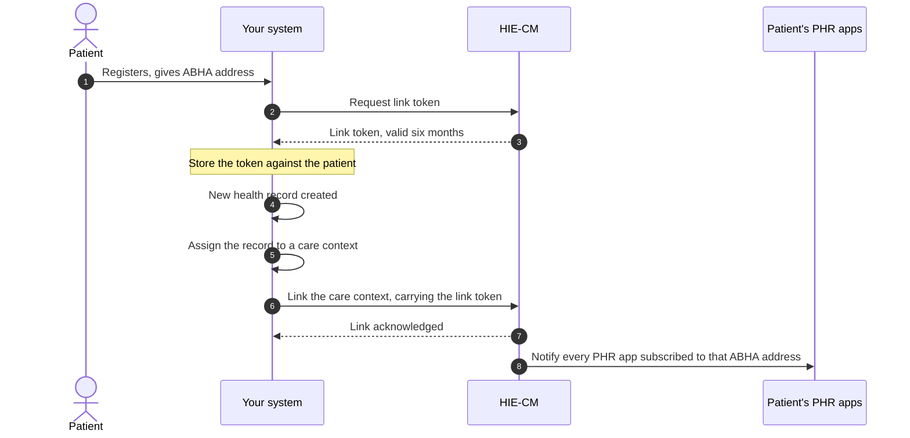
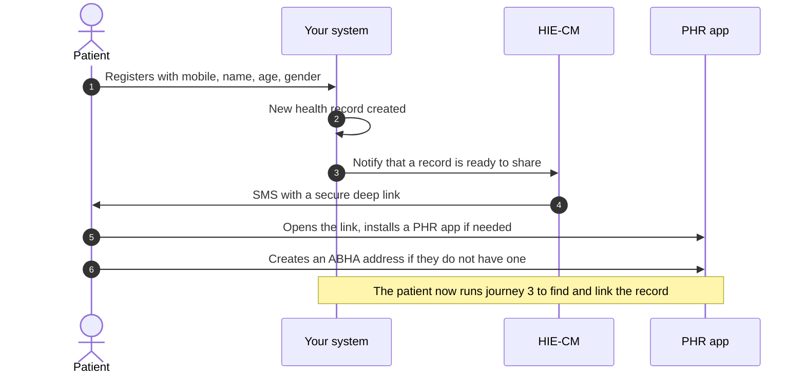
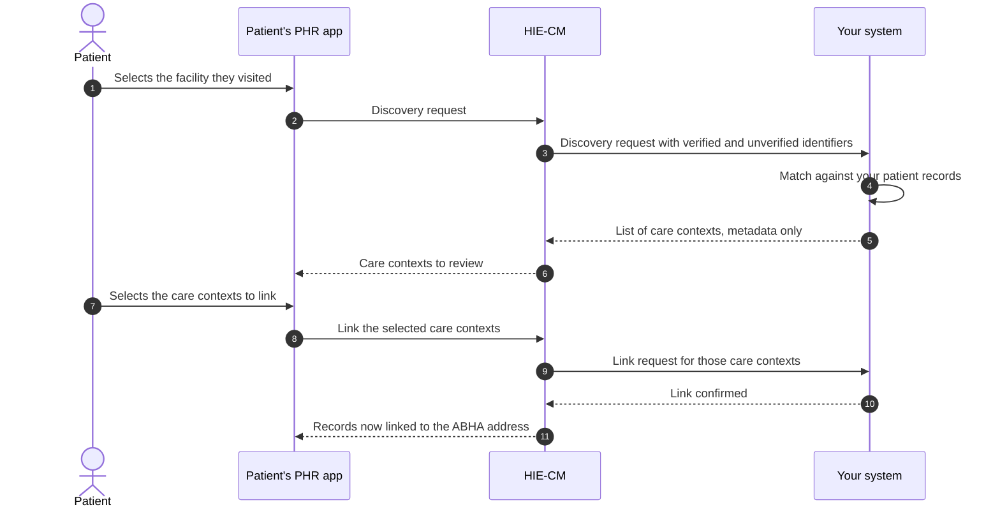
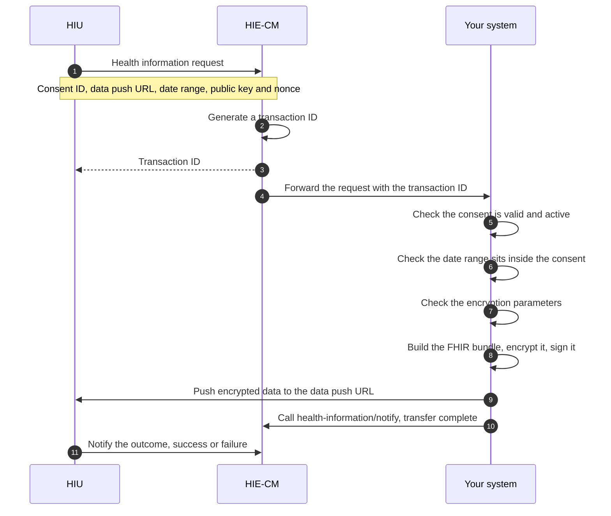

import SandboxAction from '@site/src/components/docs/SandboxAction';

# M2 Attach: linking and sharing

Milestone 2 attaches the health records you hold to a person's [ABHA
address](/docs/hiecm/v3/getting-started/glossary#abha-address). After it you
can group records into [care
contexts](/docs/hiecm/v3/getting-started/glossary#care-context), link them,
answer [discovery](/docs/hiecm/v3/getting-started/glossary#discovery) requests
from [PHR](/docs/hiecm/v3/getting-started/glossary#phr) apps, and push
encrypted records when a consented request arrives.

## In short

- You act as the [HIP](/docs/hiecm/v3/getting-started/glossary#hip). A valid
  facility ID and HIP registration come first, from [M4 Enrol](./m4).
- M2 is keyed to an ABHA address, so [M1 Create](./m1) has to work before M2
  can.
- Hold a [link token](/docs/hiecm/v3/getting-started/glossary#link-token) per
  patient. Its validity is six months.
- Records go out as [FHIR](/docs/hiecm/v3/getting-started/glossary#fhir) R4
  against the ABDM profiles.
- Four callbacks name a path and carry no documented payload. Do not assume a
  body.

## What M2 gives you

| Capability | What your system can do |
|---|---|
| Care contexts | Group each visit or admission into a named unit that can be linked to an ABHA address |
| HIP initiated linking | Link a care context yourself, when the patient gave you their ABHA address at registration |
| Notification to mobile | Make a record findable when you hold only a mobile number, a name, an age and a gender |
| Discovery | Answer a patient's search for their records at your facility, and let them link what you return |
| Data request and transfer | Receive a consented request, package the records, encrypt them, and push them to the requester |

Requesting records from other facilities is [M3 Retrieve](./m3).

## Who needs it

Hospital, lab, pharmacy and imaging systems that generate records. A PHR app
needs the patient side of M2 only, and only if it lets users upload their own
records.

## Prerequisites

1. A valid facility ID and registration in the HIP role. That authorises you to
   create health records and share them with PHR and
   [HIU](/docs/hiecm/v3/getting-started/glossary#hiu) systems. It comes from
   [M4 Enrol](./m4).
2. A working [M1 Create](./m1) integration. Linking is keyed to an ABHA
   address.
3. A link token per patient, stored when the patient registers. Validate it
   before use. If you hold no valid one, regenerate it using demographic
   authentication.
4. FHIR R4 output conforming to the ABDM profiles at
   [nrces.in](https://nrces.in/ndhm/fhir/r4/index.html).

:::note[Callback payloads]
Four callbacks name a path and carry no documented payload: discovery, link
init, link confirm, and consent notify. Do not assume a body for them. The data
notification callback is documented in full.
:::

## Record types you can link

Each type can be a simple bundle wrapping a PDF or image attachment, or a
structured bundle with coded clinical data.

| Record type | What it holds |
|---|---|
| Diagnostic Report Record | Radiology and laboratory reports |
| Discharge Summary Record | The discharge summary for the ABDM health data set |
| Health Document Record | Unstructured historical records, usually uploaded through a health locker |
| Immunization Record | Immunisations, vaccine certificates and next dose recommendations |
| OP Consult Record | Outpatient notes: examinations, procedures, medications and advice |
| Prescription Record | Medication advice, following Pharmacy Council of India guidelines |
| Wellness Record | Vitals, physical examination and general health data captured in PHR apps |
| Invoice Record | Pharmacy invoices, consultation invoices and other billing records |

An [HMIS](/docs/hiecm/v3/getting-started/glossary#hmis) must implement every
[HI type](/docs/hiecm/v3/getting-started/glossary#hi-type).

## Certification

Once M2 works end to end, submit your functional test cases in the sandbox for
review.

<SandboxAction action="milestoneTests">Submit milestone tests in the sandbox</SandboxAction>

Test data is in the [data
dictionary](/docs/hiecm/v3/reference/data-dictionary). [Support](/docs/support)
lists the channels.

## The journey, one diagram per flow

Milestone 2 (M2) of [ABDM](/docs/hiecm/v3/getting-started/glossary#abdm) has four flows. This page draws each one, so you can see the round trips before you read the detail.

[NHA](/docs/hiecm/v3/getting-started/glossary#nha)'s document carries its own API sequence diagrams as images, which did not survive the conversion to text. The diagrams below come from its numbered process steps. The step order is NHA's, the drawing is ours. Steps given only in prose are drawn in words, not guessed at.

"Your system" is your [HMIS](/docs/hiecm/v3/getting-started/glossary#hmis) or [LMIS](/docs/hiecm/v3/getting-started/glossary#lmis) acting as a [HIP](/docs/hiecm/v3/getting-started/glossary#hip). "HIE-CM" is NHA's [Health Information Exchange and Consent Manager](/docs/hiecm/v3/getting-started/glossary#hie-cm) gateway.

## Journey 1: HIP initiated linking

The patient gave you their [ABHA address](/docs/hiecm/v3/getting-started/glossary#abha-address) at registration. Link the [care context](/docs/hiecm/v3/getting-started/glossary#care-context) as soon as the record is ready: linking is what makes it reachable from [PHR](/docs/hiecm/v3/getting-started/glossary#phr) apps.

- **No valid [link token](/docs/hiecm/v3/getting-started/glossary#link-token).** Validate the stored token before use, with a tool such as JWT.io. If it is expired or missing, regenerate it through demographic authentication.
- **An existing care context gains new records.** The step 8 notification fires for that too, not only for a new context.

## Journey 2: Notification to mobile

You hold a mobile number, a name, an age and a gender, but no ABHA address. You cannot link, so you ask NHA to tell the patient a record is waiting.

## Journey 3: Discovery and link

The patient starts [discovery](/docs/hiecm/v3/getting-started/glossary#discovery) from a PHR app and picks the facility they visited. Your system matches them on the identifiers NHA passes you and answers with care contexts.

Step 3 hands you two groups of identifiers.

- **Verified.** ABHA address, mobile number, name, gender, year of birth. Weight these higher.
- **Unverified, user declared.** Facility issued identifiers such as a medical registration number or patient ID.

Step 5 has a hard rule: care context metadata only. No diagnosis, no test result, no report content.

Steps 8 to 11 are drawn in words: NHA describes them in prose and shows the payloads as images. Its error code list names them init, confirm, on-init and on-confirm, so the shape is a gateway request and a callback from you. The fields are not given.

## Journey 4: Health record request and data transfer

An [HIU](/docs/hiecm/v3/getting-started/glossary#hiu), a PHR app or another facility, asks for records under a [consent artefact](/docs/hiecm/v3/getting-started/glossary#consent-artefact) the patient granted.

Four NHA constraints on step 9, the push.

- The HIU supplies the data push URL. It can differ from its registered gateway URL, which keeps the requester harder to identify.
- The push has a 20 minute window from the start of the request. Past that, expect failure or timeout.
- Large datasets such as CT or MRI images may be split across multiple parts.
- For very large files NHA recommends streaming over one whole payload.

Encryption uses [ECDH](/docs/hiecm/v3/getting-started/glossary#ecdh), Elliptic Curve Diffie Hellman, over Curve25519. Mechanics: [use cases](/reference/hiecm-m2). Call order: [API reference](/reference/hiecm-m2).

## Next

- The four flows as diagrams: [the journey below](#the-journey-one-diagram-per-flow).
- The calls, callbacks and error codes: [M2 API
  reference](/docs/hiecm/v3/api/m2).
- The next milestone: [M3 Retrieve](./m3).
