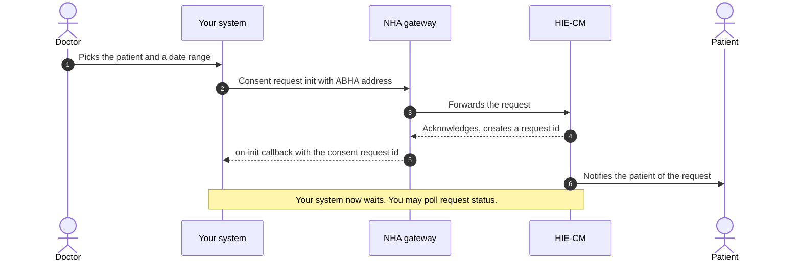
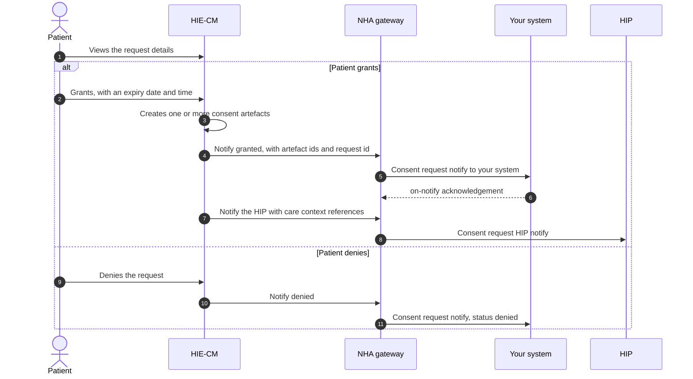
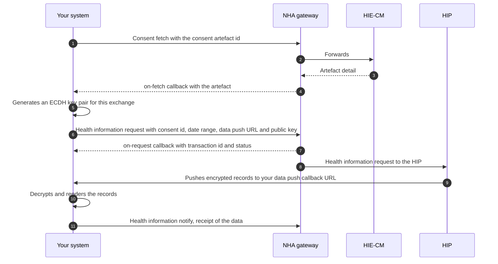

import SandboxAction from '@site/src/components/docs/SandboxAction';

# M3 Retrieve: consent and fetching

In Milestone 3 your system asks a patient for permission to see health records
held elsewhere, then fetches them. You are the
[HIU](/docs/hiecm/v3/getting-started/glossary#hiu). The
[HIE-CM](/docs/hiecm/v3/getting-started/glossary#hie-cm) holds the consent,
asks the patient on your behalf, and on a grant returns a [consent
artefact](/docs/hiecm/v3/getting-started/glossary#consent-artefact) id. No
artefact, no records.

## In short

- The HIE-CM asks the patient. You never ask the patient directly.
- The patient must already be known to you by [ABHA
  address](/docs/hiecm/v3/getting-started/glossary#abha-address).
- One request can produce more than one artefact. Store the request id and
  every artefact id.
- Records arrive encrypted on your callback URL. Decrypt them, then acknowledge
  to the gateway.
- `consentId` and `consentRequestId` are declared as UUIDs but the published
  examples are not. Do not validate them as UUIDs.

## What M3 gives you

| Capability | What your system can do |
|---|---|
| Consent request | Ask a patient, by ABHA address, for named record types over a named date range |
| Status tracking | Check whether a request is pending, granted or denied |
| Consent artefacts | Receive the artefact ids created on a grant, and fetch each artefact |
| Health information request | Ask for the records an artefact covers |
| Data receipt | Receive encrypted records on your callback URL, decrypt them, and acknowledge them |

M3 creates no identities, which is [M1 Create](./m1), and publishes no records,
which is [M2 Attach](./m2). A hospital that shares its own records and reads
records held elsewhere builds both.

## Who needs it

Any system that reads records it does not hold: a hospital pulling a patient's
history, a clinical decision tool, an insurer, and every
[PHR](/docs/hiecm/v3/getting-started/glossary#phr) app.

## Prerequisites

1. A working [M1 Create](./m1) integration, so you hold a session token and an
   ABHA address for the patient.
2. A registered HIU bridge against a facility ID, from [M4 Enrol](./m4).
3. A callback URL the gateway can reach, and a key pair for decryption.

The patient must be known to you by ABHA address first. One concrete route: the
patient scans the health facility QR code at registration, and a doctor raises a
consent request against that address.

:::note[Identifier format]
Do not validate `consentId` or `consentRequestId` as UUIDs. Treat both as
opaque strings.
:::

## What you build, in order

1. **Raise a consent request.** You get a request id on a callback, not inline.
2. **Track its status.** Pending, granted or denied.
3. **Collect the artefacts.** A grant produces one or more artefact ids. Fetch
   each artefact.
4. **Raise a health information request** against an artefact.
5. **Receive, decrypt and acknowledge** the records on your callback URL.

Build for revocation from the start. A consent that worked yesterday can be
withdrawn today, and that is the system working correctly.

## Certification

Once M3 works end to end, submit your functional test cases in the sandbox for
review.

<SandboxAction action="milestoneTests">Submit milestone tests in the sandbox</SandboxAction>

Test data is in the [data
dictionary](/docs/hiecm/v3/reference/data-dictionary). [Support](/docs/support)
lists the channels.

## The journey, one diagram per flow

Milestone 3 (M3) of [ABDM](/docs/hiecm/v3/getting-started/glossary#abdm) is one story in three parts: a doctor asks for a patient's past records, the patient says yes or no, and if yes the records travel. Each part is drawn below, so you can see the round trips before you read the [API reference](/reference/hiecm-m3).

[NHA](/docs/hiecm/v3/getting-started/glossary#nha)'s document carries its own diagrams and screen sequences as images, which did not survive the conversion to text. The diagrams below come from the ordered prose of the same document. The step order is NHA's, the drawing is ours.

| In the diagram | What it is |
|---|---|
| Patient | The person whose records these are, acting in their [PHR](/docs/hiecm/v3/getting-started/glossary#phr) app |
| Your system | The [HIU](/docs/hiecm/v3/getting-started/glossary#hiu): the hospital or app that wants to read the records |
| NHA gateway | NHA's [gateway](/docs/hiecm/v3/getting-started/glossary#gateway), which routes every call and callback |
| HIE-CM | The [HIE-CM](/docs/hiecm/v3/getting-started/glossary#hie-cm), which holds consent and asks the patient |
| HIP | The [HIP](/docs/hiecm/v3/getting-started/glossary#hip) that holds the records, in journeys 2 and 3 |

## Journey 1: raising a consent request

A doctor wants the patient's earlier records for a date range. Your system sends the request with the patient's [ABHA](/docs/hiecm/v3/getting-started/glossary#abha) address. Nothing comes back inline: you get a request id on a callback, then wait for the patient.

The request id is the handle for everything that follows. Store it against the doctor and the patient.

## Journey 2: the patient grants or denies

The patient sees who is asking, what they want, why, and for how long. The HIE-CM tells both sides what they chose.

- A grant carries an expiry. The patient sets when the permission runs out.
- A grant can produce more than one consent artefact. NHA's M3 document allows this without stating why a given grant produces more than one.
- The patient can revoke a granted consent at any time. Your access ends when they do.

## Journey 3: fetching the records

With an artefact id you fetch the artefact, then ask for the data it covers. The data lands on the data push URL you supplied in that request.

The records arrive encrypted, at the data push URL you supplied. Whether that URL must differ from your other registered callback URLs is not documented yet. Your side is simple: decrypt the data, then present it in a readable format.

The M3 document does not describe the encryption scheme. It is [ECDH](/docs/hiecm/v3/getting-started/glossary#ecdh) key exchange, specified on the [HIP](/docs/hiecm/v3/getting-started/glossary#hip) side in NHA's M2 document. See [M2](/docs/hiecm/v3/api/m2).

## What the patient sees

The patient's screens and expiry screens are not reproduced here. What applies to you is on the [use cases](/reference/hiecm-m3) page under patient rights.

## Next

- The request, the decision and the fetch as diagrams: [M3
  journey below](#the-journey-one-diagram-per-flow).
- The calls, callbacks and error codes: [M3 API
  reference](/docs/hiecm/v3/api/m3).
- The next milestone: [M4 Enrol](./m4).
