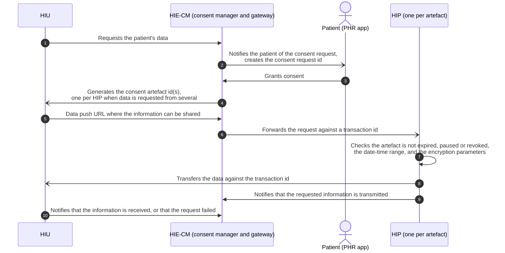
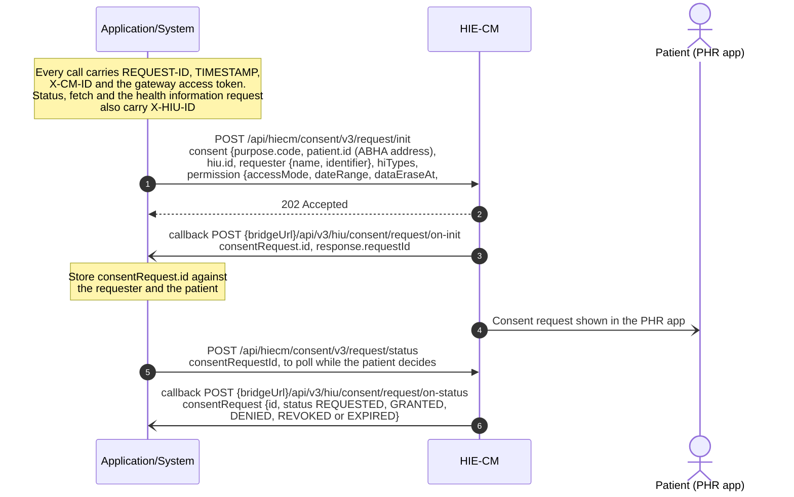
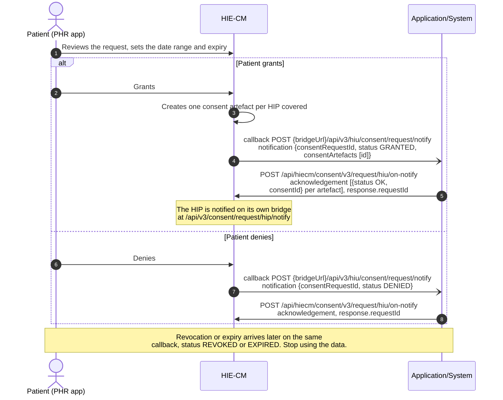
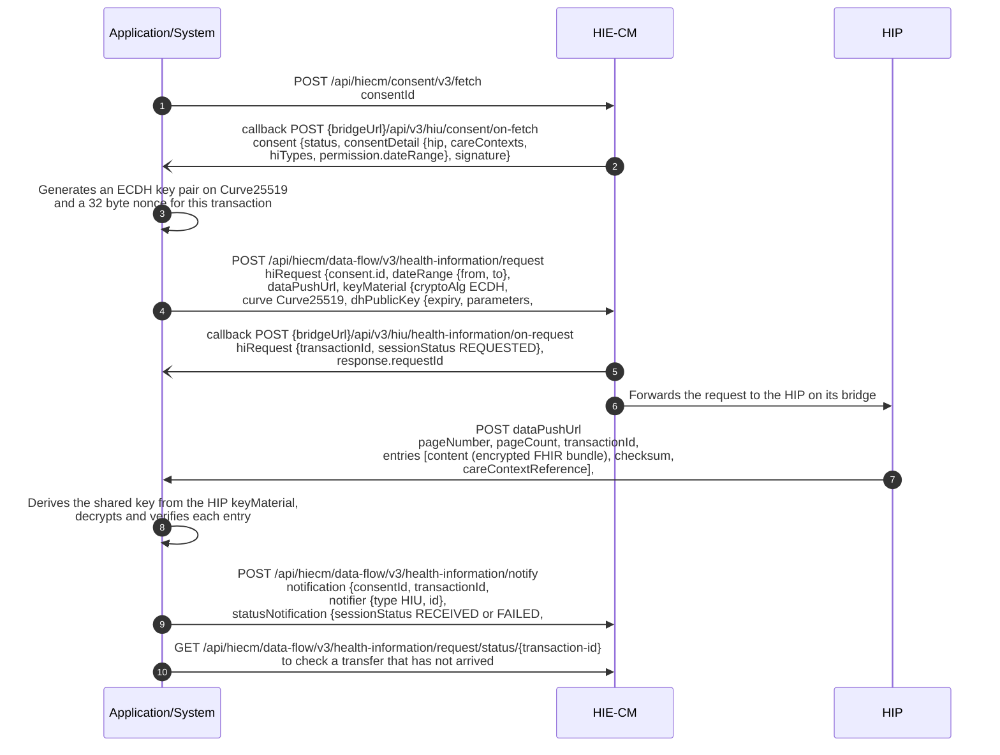

import ApiLinks from '@site/src/components/docs/ApiLinks';
import SkillInstall from '@site/src/components/docs/SkillInstall';
import LegacyAnchor from '@site/src/components/mdx/LegacyAnchor';

# M3 Health Information User: Health Information Exchange with Consent

Milestone 3 (M3) enables a [Health Information User](/docs/hiecm/v3/getting-started/glossary#hiu)
(HIU) to securely request and receive a patient's health record from
[Health Information Providers](/docs/hiecm/v3/getting-started/glossary#hip) (HIPs), based on
the patient's consent. Upon approval of the consent request, the authorised
health record is transferred to the HIU in the prescribed
[FHIR](/docs/hiecm/v3/getting-started/glossary#fhir) format for permitted use.

<ApiLinks module="m3" />

## In short

The HIU initiates a consent request using the patient's
[ABHA Address](/docs/hiecm/v3/getting-started/glossary#abha-address). The patient may approve
or deny the request through the [PHR](/docs/hiecm/v3/getting-started/glossary#phr) application.
Upon approval, the HIU obtains the
[consent artefact](/docs/hiecm/v3/getting-started/glossary#consent-artefact) and initiates the
health-information request. The concerned HIP validates the request and
securely transfers the authorised health information to the HIU, which
acknowledges its receipt.

## Key functionalities

<LegacyAnchor id="m3-functionality" />
<LegacyAnchor id="what-m3-gives-you" />
<LegacyAnchor id="capabilities-under-m3" />

- **Consent Request:** Facilitates initiation of a consent request by the HIU
  using the patient's ABHA Address. The patient may grant or deny consent
  through the PHR application.
- **Consent Status:** Facilitates tracking of the consent request as Granted,
  Denied, Revoked or Expired, and retrieval of the consent artefact generated
  upon approval.
- **Health Information Request:** Facilitates the request, secure receipt and
  decryption of health information against a valid consent artefact, and its
  presentation in a readable format.

## Use case: patient record share

<LegacyAnchor id="use-cases" />

**Patient-Initiated Health Information Sharing:** Enables a patient to scan the
QR code displayed by the healthcare facility and share selected health
information types from the PHR application with the facility. The receiving
system provides the data-push URL and encryption parameters, securely receives
the health information, and communicates the transfer status. See
[Patient record share](/docs/hiecm/v3/use-cases/patient-record-share).

For details of all supported use cases and their corresponding milestones,
refer to the [Use cases](/docs/hiecm/v3/use-cases) section.

## Applicable to

<LegacyAnchor id="applicable-for" />
<LegacyAnchor id="who-needs-it" />

Milestone 3 is applicable to entities or applications performing the Health
Information User (HIU) role and requiring access to health information
maintained by one or more Health Information Providers (HIPs).

Such entities may include healthcare facilities, insurers, referral-service
providers, clinical decision-support applications and
[PHR](/docs/hiecm/v3/getting-started/glossary#phr) applications acting on behalf of the patient.

## Prerequisites

Before implementing Milestone 3, the entity or application shall meet the
following requirements:

- Complete the requirements specified under [Milestone 1](./m1).
- Register the entity or application in NHPR to perform the Health
  Information User (HIU) role.

## Consent management flow

<LegacyAnchor id="what-you-build-in-order" />
<LegacyAnchor id="consent-management" />

The Consent Management Flow facilitates the secure and consent-based exchange
of a patient's health information between the HIU and the concerned HIP
through the HIE-CM.

- **Health-Information Request:** The HIU initiates a request for the
  patient's health information through the HIE-CM.
- **Patient Notification:** The HIE-CM generates a Consent Request ID and
  notifies the patient regarding the consent request through the PHR
  application.
- **Consent Approval:** The patient grants consent through the PHR
  application.
- **Consent Artefact Generation:** The HIE-CM generates the consent artefact
  ID(s) and communicates them to the HIU. Separate consent artefacts are
  generated where data is requested from multiple HIPs.
- **Data-Push URL:** A data-push URL is generated for receiving the requested
  health information.
- **Request Validation:** The concerned HIP validates the consent status,
  applicable date-time range and encryption parameters.
- **Data Transfer:** The requested health information is transferred to the
  HIU against the Transaction ID assigned by the HIE-CM.
- **Transfer and Receipt Notification:** Upon completion of the transfer, the
  HIP notifies the HIE-CM that the requested information has been transmitted,
  and the HIU notifies the HIE-CM regarding successful receipt or failure of
  the request.

```mermaid
sequenceDiagram
    autonumber
    participant H as HIU
    participant CM as HIE-CM (consent manager and gateway)
    actor P as Patient (PHR app)
    participant HIP as HIP (one per artefact)
    H->>CM: Requests the patient's data
    CM-)P: Notifies the patient of the consent request,<br/>creates the consent request id
    P->>CM: Grants consent
    CM-)H: Generates the consent artefact id(s),<br/>one per HIP when data is requested from several
    H->>CM: Data push URL where the information can be shared
    CM-)HIP: Forwards the request against a transaction id
    HIP->>HIP: Checks the artefact is not expired, paused or revoked,<br/>the date-time range, and the encryption parameters
    HIP-)H: Transfers the data against the transaction id
    HIP->>CM: Notifies that the requested information is transmitted
    H->>CM: Notifies that the information is received, or that the request failed
```

## Build M3 with an AI coding assistant

<LegacyAnchor id="build-it-with-an-agent" />

The M3 skill gives an AI coding assistant this milestone as one file: every M3
call and callback with its error codes. Install it, or open it in your assistant
in one click.

<SkillInstall slug="abdm-m3" note="Every M3 call and callback in one file: 16 operations." />

<LegacyAnchor id="workflow-overview" />
<LegacyAnchor id="the-journey-one-diagram-per-flow" />

## Journey 1: raising a consent request {/* #m3-request-consent */}

- An HIU requests access to a patient's health data by sending a consent request
  with the patient's ABHA address via the HIE-CM.
- The HIE-CM acknowledges the request and returns a Consent Request ID through
  the Gateway.
- The patient is notified by the HIE-CM and can review, approve, or deny the
  consent request.
- The HIE-CM then communicates the patient's consent status back to the HIU
  through the Gateway.

```mermaid
sequenceDiagram
    autonumber
    participant S as Application/System
    participant CM as HIE-CM
    actor P as Patient (PHR app)
    Note over S: Every call carries REQUEST-ID, TIMESTAMP,<br/>X-CM-ID and the gateway access token.<br/>Status, fetch and the health information request<br/>also carry X-HIU-ID
    S->>CM: POST /api/hiecm/consent/v3/request/init<br/>consent {purpose.code, patient.id (ABHA address),<br/>hiu.id, requester {name, identifier}, hiTypes,<br/>permission {accessMode, dateRange, dataEraseAt,
    CM-->>S: 202 Accepted
    CM-)S: callback POST {bridgeUrl}/api/v3/hiu/consent/request/on-init<br/>consentRequest.id, response.requestId
    Note over S: Store consentRequest.id against<br/>the requester and the patient
    CM-)P: Consent request shown in the PHR app
    S->>CM: POST /api/hiecm/consent/v3/request/status<br/>consentRequestId, to poll while the patient decides
    CM-)S: callback POST {bridgeUrl}/api/v3/hiu/consent/request/on-status<br/>consentRequest {id, status REQUESTED, GRANTED,<br/>DENIED, REVOKED or EXPIRED}
```

The consent request ID is the handle for everything that follows. Store it against the requester and the patient.

The patient's decision arrives later, on your bridge, as described in Journey 2.

<AgentOnly>
**Before you start.** A gateway session token, a bridge linked with type HIU for your facility, a callback URL reachable over public HTTPS, the patient's ABHA address, and a purpose of use code: an insurer checking a claim uses `HPAYMT`.

**What happens.** Init the request with the ABHA address, the HI types, the date range the records must fall in, the purpose, and the expiry of the request itself, which is how long the patient has to answer. Store `consentRequest.id` from the on-init callback. Poll the status call only to show progress. On the notify callback, store every id in `consentArtefacts`, then acknowledge with `/api/hiecm/consent/v3/request/hiu/on-notify` so delivery stops.

**How you know it worked.** A POST reaches `/api/v3/hiu/consent/request/notify` with status GRANTED and at least one consent artefact id. The window the patient has to act is the one you set on init, not a gateway timeout.

**When it goes wrong.** The request stays in REQUESTED: see [consent stuck in Requested](/docs/hiecm/v3/troubleshooting/consent-stuck-requested). The on-init or notify callback never lands: see [the callback never arrives](/docs/hiecm/v3/troubleshooting/callback-never-arrives). DENIED is an answer, not a fault, and no retry changes it.
</AgentOnly>

## Journey 2: the patient grants or denies

- If the request is approved, the HIE-CM shares the consent artefact IDs
  generated for that request with the HIU.
- If the request is denied, the HIE-CM notifies the HIU that the consent request
  has been rejected.

```mermaid
sequenceDiagram
    autonumber
    actor P as Patient (PHR app)
    participant CM as HIE-CM
    participant S as Application/System
    P->>CM: Reviews the request, sets the date range and expiry
    alt Patient grants
        P->>CM: Grants
        CM->>CM: Creates one consent artefact per HIP covered
        CM-)S: callback POST {bridgeUrl}/api/v3/hiu/consent/request/notify<br/>notification {consentRequestId, status GRANTED,<br/>consentArtefacts [id]}
        S->>CM: POST /api/hiecm/consent/v3/request/hiu/on-notify<br/>acknowledgement [{status OK,<br/>consentId} per artefact], response.requestId
        Note over CM: The HIP is notified on its own bridge<br/>at /api/v3/consent/request/hip/notify
    else Patient denies
        P->>CM: Denies
        CM-)S: callback POST {bridgeUrl}/api/v3/hiu/consent/request/notify<br/>notification {consentRequestId, status DENIED}
        S->>CM: POST /api/hiecm/consent/v3/request/hiu/on-notify<br/>acknowledgement, response.requestId
    end
    Note over P,S: Revocation or expiry arrives later on the same<br/>callback, status REVOKED or EXPIRED. Stop using the data.
```

- A consent grant is valid for a specific period decided by the patient.
- One consent grant may generate multiple consent artefacts, so all consent
  artefact IDs should be stored.
- If the patient revokes consent or it expires, access to the health
  information must be stopped.

## Journey 3: fetching the records {/* #m3-fetch-records */}

Using the consent artefact ID, the HIU fetches the consent artefact and
requests the health information covered under that consent. The requested
health data is then securely delivered to the data push URL provided by the
HIU.

```mermaid
sequenceDiagram
    autonumber
    participant S as Application/System
    participant CM as HIE-CM
    participant H as HIP
    S->>CM: POST /api/hiecm/consent/v3/fetch<br/>consentId
    CM-)S: callback POST {bridgeUrl}/api/v3/hiu/consent/on-fetch<br/>consent {status, consentDetail {hip, careContexts,<br/>hiTypes, permission.dateRange}, signature}
    S->>S: Generates an ECDH key pair on Curve25519<br/>and a 32 byte nonce for this transaction
    S->>CM: POST /api/hiecm/data-flow/v3/health-information/request<br/>hiRequest {consent.id, dateRange {from, to},<br/>dataPushUrl, keyMaterial {cryptoAlg ECDH,<br/>curve Curve25519, dhPublicKey {expiry, parameters,
    CM-)S: callback POST {bridgeUrl}/api/v3/hiu/health-information/on-request<br/>hiRequest {transactionId, sessionStatus REQUESTED},<br/>response.requestId
    CM->>H: Forwards the request to the HIP on its bridge
    H->>S: POST dataPushUrl<br/>pageNumber, pageCount, transactionId,<br/>entries [content (encrypted FHIR bundle), checksum,<br/>careContextReference],
    S->>S: Derives the shared key from the HIP keyMaterial,<br/>decrypts and verifies each entry
    S->>CM: POST /api/hiecm/data-flow/v3/health-information/notify<br/>notification {consentId, transactionId,<br/>notifier {type HIU, id},<br/>statusNotification {sessionStatus RECEIVED or FAILED,
    S->>CM: GET /api/hiecm/data-flow/v3/health-information/request/status/{transaction-id}<br/>to check a transfer that has not arrived
```

A decrypted bundle today is not a standing right to fetch again tomorrow. Every
fetch is a fresh permission check against an artefact the patient can revoke.

<AgentOnly>
**Before you start.** A granted consent request with at least one artefact id, a gateway session token, and a `dataPushUrl` endpoint of your own that accepts the encrypted FHIR bundles. Use a maintained implementation of the key exchange rather than writing it yourself: see [how a record travels](/docs/hiecm/v3/concepts/data-flow).

**What happens.** Fetch the artefact and store what arrives on `/api/v3/hiu/consent/on-fetch`: the care contexts, HI types and date range it allows. Generate an ECDH key pair on `Curve25519` and a nonce for this transaction. Send the health information request with the consent id, a date range inside the artefact's, your `dataPushUrl` and your public key in `keyMaterial`. The on-request callback carries the `transactionId`. The HIP posts the pages to your `dataPushUrl` directly, not through the gateway. Derive the shared key from the HIP's `keyMaterial`, decrypt, then send the notify call.

**How you know it worked.** Every entry for every care context decrypts, and your notify call reports `sessionStatus` `RECEIVED`.

**When it goes wrong.** The chain stops between fetch, request and push: find the missing step on [accepted, then nothing](/docs/hiecm/v3/troubleshooting/accepted-then-nothing), and check the `dataPushUrl` you sent rather than your registered callback URL. `ABDM-1062`, consent not granted: the patient revoked or the grant lapsed mid flow. `ABDM-1112`: the artefact id is invalid or already expired. A transfer that never arrives can be checked with the status call against its `transactionId`.
</AgentOnly>

## Certification

The cases M3 is tested against, each with its id, steps, expected result and the calls it exercises: [M3 test cases](/docs/hiecm/v3/resources/test-cases/m3). Certification runs once, for the whole integration: [Go live](/docs/hiecm/v3/getting-started/going-live).

## Next

- The calls, callbacks and error codes: [M3 API
  reference](/docs/hiecm/v3/api/m3).
- Receive records a patient pushes from their app: [Patient record
  share](/docs/hiecm/v3/use-cases/patient-record-share).
- The next milestone: [M4 Registry Integration](./m4).
