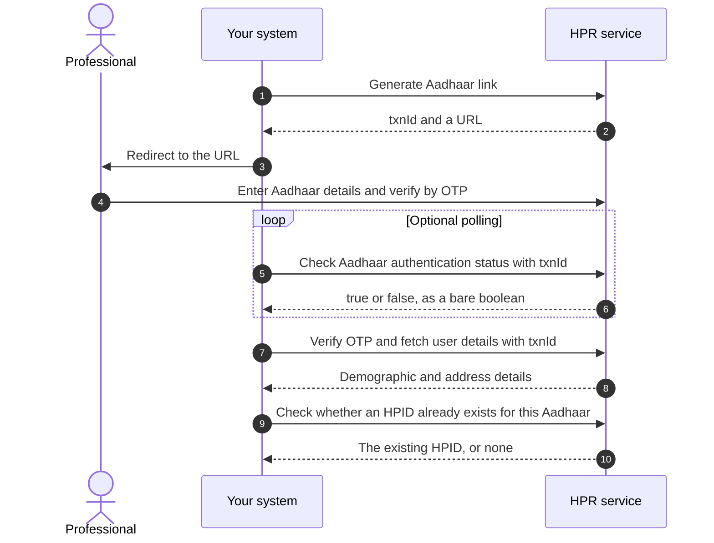
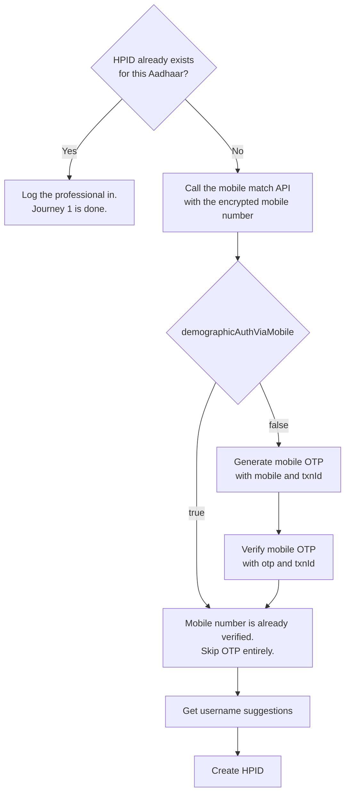
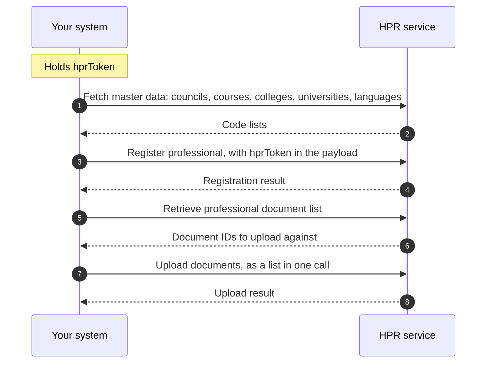
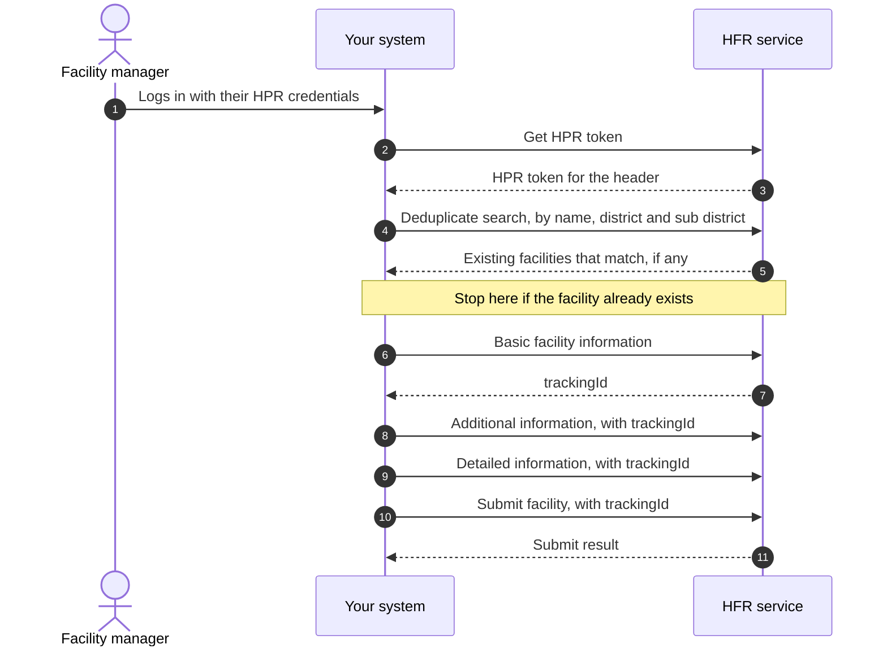
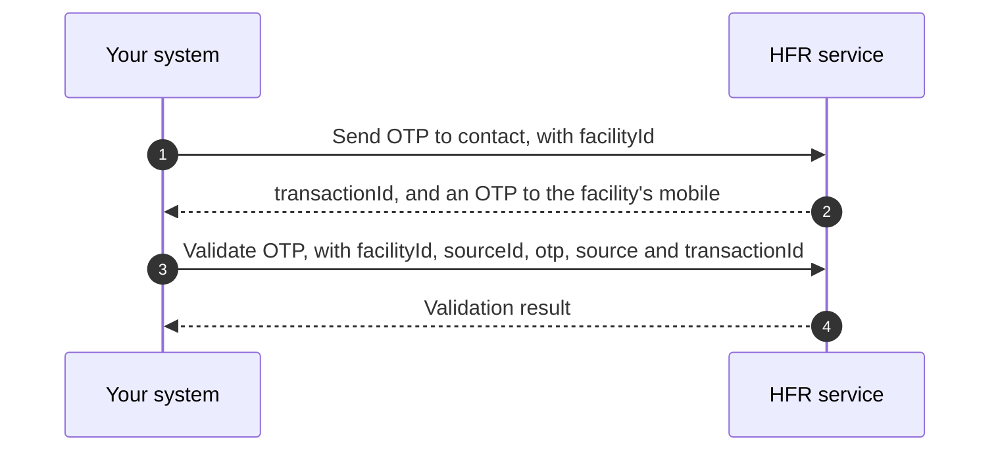
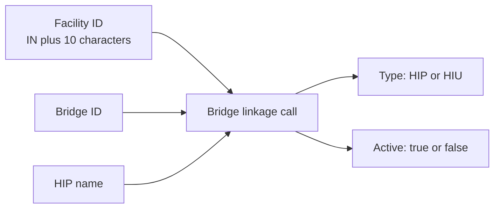

import ApiLinks from '@site/src/components/docs/ApiLinks';
import SkillInstall from '@site/src/components/docs/SkillInstall';

# M4 Enrol: National Healthcare Providers Registry

Milestone 4 is the registries milestone, also called the NHPR. A healthcare
professional registers on the
[HPR](/docs/hiecm/v3/getting-started/glossary#hpr) and is issued an
[HPID](/docs/hiecm/v3/getting-started/glossary#hpid). A health facility onboards
to the [HFR](/docs/hiecm/v3/getting-started/glossary#hfr) and is issued a
facility ID.

Neither registry moves a health record. They establish who the professional is
and what the facility is, so every record flow has a verified provider behind
it.

<ApiLinks module="m4" />

## In short

- The HPR comes first. Facility onboarding needs an HPR token, which needs a
  person with an HPID.
- A facility ID has the form `IN` plus 10 characters. An HPID is 14 digits.

:::caution[Not a step by step guide]
These pages cover the shape of M4 and the endpoints that are named. They are
not yet a step by step guide to building it.
:::

## What M4 covers

| Area | What it produces | Who it is for |
|---|---|---|
| HPID creation | A 14 digit HPID, issued after Aadhaar authentication | A doctor, nurse, pharmacist or facility manager |
| Register professional | A full HPR profile: qualifications, council registration, current work | The same professional, after the HPID exists |
| Facility onboarding | A facility ID on the HFR, in the form `IN` plus 10 characters | A hospital, imaging centre or blood bank |
| Bridge linkage | A link between a facility ID and one or more bridges, each marked [HIP](/docs/hiecm/v3/getting-started/glossary#hip) or [HIU](/docs/hiecm/v3/getting-started/glossary#hiu) | A facility whose software is going live |
| Search and master data | Facility search, nearby search, and the code lists every other call needs | Anyone building either of the above |

## Who needs it

- **Professionals registering.** An HPID is a verified identity in ABDM.
- **Software acting for others.** An
  [HMIS](/docs/hiecm/v3/getting-started/glossary#hmis) or practice management
  product can drive these calls for its own customers.

## How the two halves connect

The HPR comes first, twice over. Creating an HPID returns a `token`, and the
register professional call carries an `hprToken` in its payload. Onboarding a facility
needs an HPR token in the header of the create calls, generated from an HPR ID
and password. So facility onboarding usually starts with a person getting an
HPID.

## Build it with an agent

Hand M4 to the agent you already use, as one file it loads once. Install it, or open it there in one click.

<SkillInstall slug="abdm-m4" note="Every M4 call in one file: 100 operations." />

## Certification

M4 has no certification step of its own. One exit process covers the whole
integration, run once, after every milestone your role needs works end to end.
See [Going live](/docs/hiecm/v3/getting-started/going-live) for the four steps
and what each one asks of you.

## The journey, one diagram per flow

Milestone 4 of [ABDM](/docs/hiecm/v3/getting-started/glossary#abdm) has four journeys:

- A professional gets an [HPID](/docs/hiecm/v3/getting-started/glossary#hpid).
- That professional's [HPR](/docs/hiecm/v3/getting-started/glossary#hpr) profile is registered against the HPID. The identity and the profile are two jobs, not one.
- A facility manager onboards a facility to the [HFR](/docs/hiecm/v3/getting-started/glossary#hfr).
- A facility links its bridges, so it can publish records as the [HIP](/docs/hiecm/v3/getting-started/glossary#hip) and fetch them as the [HIU](/docs/hiecm/v3/getting-started/glossary#hiu) through its software.

This page shows the order of calls in each. Field lists are in the [M4 API reference](/docs/hiecm/v3/api/m4).

:::caution[A map, not a runbook]
These diagrams follow the published order of steps.
:::

<LegacyAnchor id="journey-1-a-professional-gets-an-hpid" />

## Journey 1: create an HPID for a professional

The professional authenticates against Aadhaar on a hosted page. Your system never handles the Aadhaar number or [OTP](/docs/hiecm/v3/getting-started/glossary#otp): it handles the transaction ID and redirects to a URL the HPR service returns.

### Then the mobile number

Step 10 decides what happens next. An existing HPID means the professional is already registered: log them in and skip the rest of this journey. A returning professional can also skip Aadhaar entirely and log in by mobile OTP or by password. Both routes are in [the M4 authentication calls](/docs/hiecm/v3/api/m4/endpoints/m4-authentication/01-m4-post-v1-auth-authpassword).

No HPID means you confirm the mobile number before creating one, by a fast path or a slow one. Send it encrypted: fetch the public certificate from `/v4/int/api/v1/auth/cert`, send the encrypted value.

Create HPID returns a `token`. The register professional call carries an `hprToken` in its payload.

<LegacyAnchor id="then-the-profile" />

## Journey 2: register the professional on the HPR

The HPID is an identity, not a profile. Registering the professional adds qualifications, council registration and current work. It carries an `hprToken` in its payload.

Register professional takes codes, not names. Fetch council, course, college, university, state, district and language from the master APIs first.

<LegacyAnchor id="journey-2-a-facility-onboards-to-the-hfr" />

## Journey 3: a facility onboards to the HFR

Onboarding is one search, three writes and a submit, each write adding a layer of detail. Stop before submit and the facility stays in draft.

The first write, basic facility information, returns a tracking ID. That is the facility's identity for the rest of the sequence, and what you pass as the facility ID on every later update.

### What each write call carries

| Call | What it captures |
|---|---|
| Basic facility information | Name, ownership, system of medicine, facility type and subtype, address with LGD codes, contact details, board and building photographs, opening hours |
| Additional information | Whether it has a pharmacy, blood bank, dialysis centre, cath lab, diagnostic lab or imaging centre, plus scheme identifiers such as ABPMJAY, Rohini, ECHS and CGHS |
| Detailed information | Specialities per system of medicine, bed and ventilator counts, and the pharmacy, blood bank, diagnostic and imaging sections |
| Submit facility | The tracking ID and an optional source of information. Moves the facility out of draft |

### A facility can also verify by OTP

A second, shorter path sends an OTP to the contact number registered against a facility ID, then validates it.

<LegacyAnchor id="journey-3-linking-bridges-to-a-facility" />

## Journey 4: linking bridges to a facility

The bridge linkage call links a facility to a bridge, each link marked HIP or HIU. One facility can have several, and one bridge serves as many facilities as you link to it. What is set once for your integration and what is set per facility is in [one bridge, many facilities](/docs/hiecm/v3/concepts/how-it-fits#one-bridge-many-facilities).

Next: [M4 API reference](/docs/hiecm/v3/api/m4).

## Next

- The registration journeys as diagrams: [the journey below](#the-journey-one-diagram-per-flow).
- The base URLs and the operation list: [M4 API
  reference](/docs/hiecm/v3/api/m4).
- The patient side of all four: [P1 Identity and profile](./p1).
- Take your integration to production: [Go live](/docs/hiecm/v3/getting-started/going-live).
