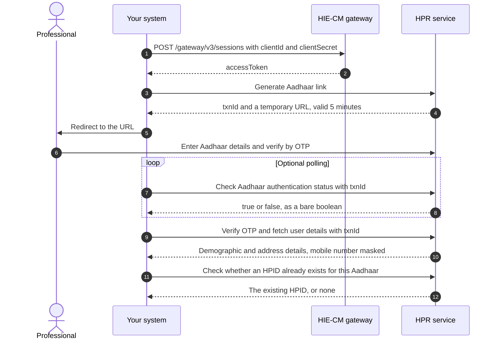
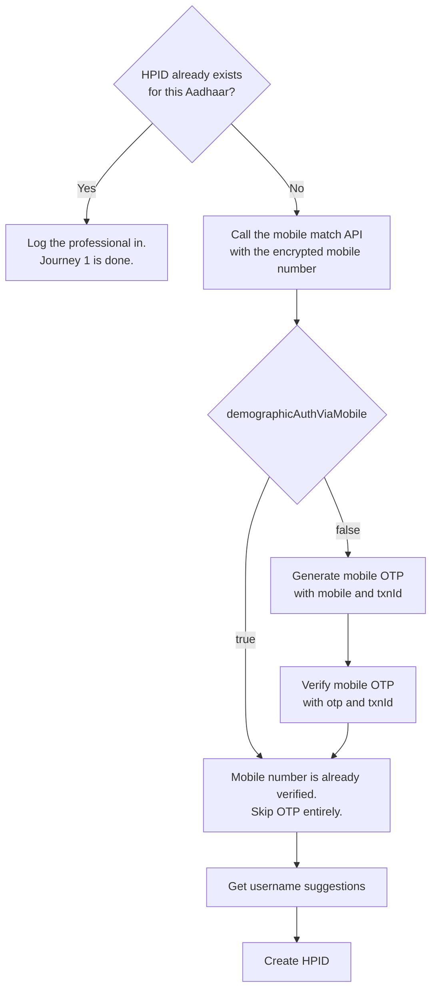
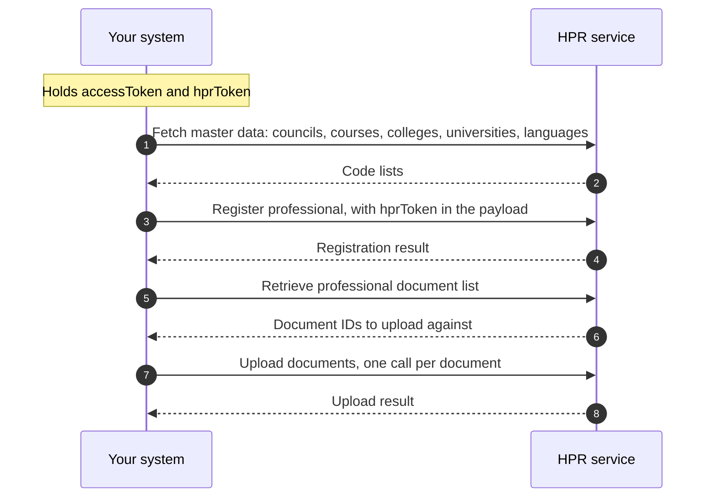
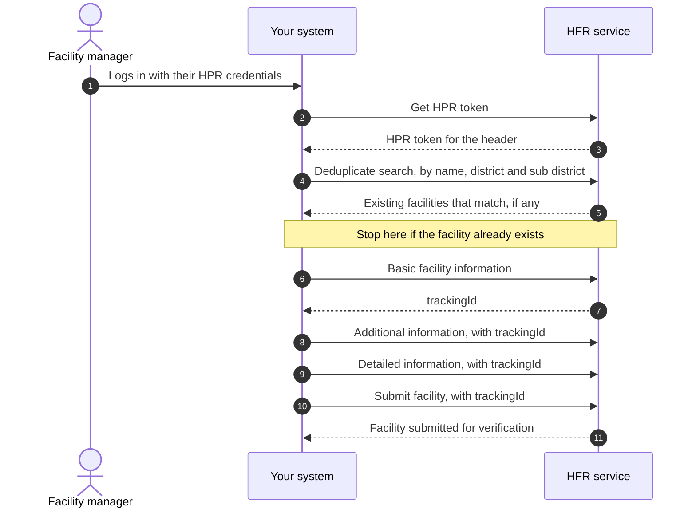
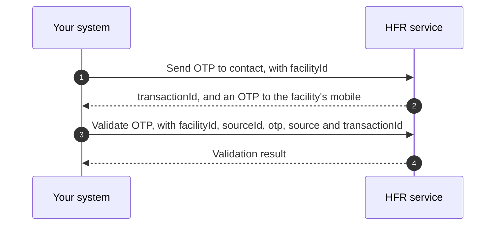
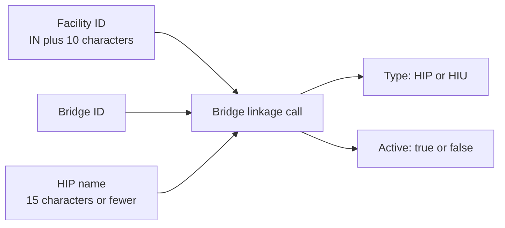

import ApiLinks from '@site/src/components/docs/ApiLinks';
import SkillInstall from '@site/src/components/docs/SkillInstall';
import LegacyAnchor from '@site/src/components/mdx/LegacyAnchor';

# M4 Enrol: Register Healthcare Professionals and Facilities

Milestone 4 is the Registries milestone, commonly referred to as NHPR (National
Healthcare Professionals and Facilities Registry). It establishes the identity
of healthcare professionals and the details of healthcare facilities within the
ABDM ecosystem.

Neither [HPR](/docs/hiecm/v3/getting-started/glossary#hpr) nor [HFR](/docs/hiecm/v3/getting-started/glossary#hfr) is responsible for moving health
records. Instead, these registries establish who the healthcare professional is
and what the healthcare facility is, providing a verified identity and facility
layer for subsequent ABDM transactions and health-record flows.

<ApiLinks module="m4" />

## In short

The Healthcare Professionals Registry (HPR) is a comprehensive repository of
registered and verified healthcare professionals. It includes doctors from
various Systems of Medicine, including Modern Medicine, Dentistry, Ayurveda,
Unani, Siddha, Sowa-Rigpa and Homeopathy, as well as Nurses and Pharmacists
delivering healthcare services across India. A healthcare professional registers
on the Healthcare Professionals Registry (HPR) and is issued a unique
[HPID](/docs/hiecm/v3/getting-started/glossary#hpid).

Health Facility Registry (HFR) is a comprehensive repository of health
facilities across the country, covering both modern and traditional systems of
medicine. It includes public and private health facilities such as hospitals,
clinics, diagnostic laboratories, imaging centres, pharmacies, and other
healthcare establishments. A healthcare facility is onboarded to the Health
Facility Registry (HFR) and is issued a unique Facility ID.

### Relationship with M2 and M3

M2 and M3 require a Facility ID in the production environment. Milestone 4
provides the registry layer through which this Facility ID can be obtained.
There are two primary routes for facility onboarding:

- **NHPR Portal:** Facilities can be registered directly through the NHPR portal.
- **M4 APIs:** Products can integrate with the M4 APIs to register.

### HPR and HFR dependency

The HP-ID registration comes first for the API-based facility onboarding flow.
Facility onboarding requires an HPR token, which is associated with a
healthcare professional having a valid HPID.

Key identifiers include:

- **HPID:** 14-digit identifier issued to a registered healthcare professional.
- **Facility ID:** 12-character identifier beginning with `IN`, issued to a registered healthcare facility.

:::caution[Not a step by step guide]
These pages cover the shape of M4 and the endpoints that are named. They are
not yet a step by step guide to building it.
:::

## M4 scope and capabilities

<LegacyAnchor id="what-m4-covers" />

| Capability | Key output | Target user |
|---|---|---|
| HPID creation | A 14 digit HPID, issued after Aadhaar authentication | Doctors, nurses, pharmacists, and facility managers |
| Register professional | A complete HPR profile, including qualifications, council registration, and current work details | Healthcare professionals after HPID creation |
| Facility onboarding | A 12 character unique Facility ID for registration in the HFR | Hospitals, clinics, laboratories, imaging centres, pharmacies, blood banks, and other health facilities |
| Bridge linkage | A link between a Facility ID and one or more bridges, each identified as a [HIP](/docs/hiecm/v3/getting-started/glossary#hip) or [HIU](/docs/hiecm/v3/getting-started/glossary#hiu) | A facility whose software is going live |
| Search and master data | Facility search and nearby search | Anyone building either of the above |

## Intended users

<LegacyAnchor id="who-needs-it" />

- **Facilities going live.** A facility must be registered in the HFR and have
  a bridge linked to it to share health information as a HIP or retrieve it as
  an HIU. For facilities that have implemented [M2 Attach](./m2) or [M3
  Retrieve](./m3), M4 is the next step towards production readiness.
- **Professionals registering.** An HPR ID provides a verified professional
  identity within ABDM. Currently, registration is available for three
  categories: doctors, nurses and pharmacists.
- **Software acting for others.** An
  [HMIS](/docs/hiecm/v3/getting-started/glossary#hmis) or practice management
  product can drive these calls for its own customers.

## How HPR and HFR work together

HPR and HFR represent two connected parts of the healthcare ecosystem. HPR
enables healthcare professionals to register and maintain their professional
identity and profile, while HFR enables hospitals, clinics, laboratories,
pharmacies, and other healthcare facilities to register and maintain their
facility information.

Once a facility is registered in the HFR, healthcare professionals can link
their professional profile to that facility as their place of work. Similarly,
an HPR-registered professional can declare the HFR facility where they
currently work. This creates a connection between who provides healthcare and
where healthcare is provided, allowing professionals and facilities to be
linked within the ABDM ecosystem.

## Build it with an agent

Hand M4 to the agent you already use, as one file it loads once. Install it, or open it there in one click.

<SkillInstall slug="abdm-m4" note="Every M4 call in one file: 100 operations." />

## Certification

M4 does not have a separate certification process. A single exit process covers
the complete integration and is conducted once all the required milestones for
your role are working end to end.

The [Going live](/docs/hiecm/v3/getting-started/going-live) process outlines
the four steps involved and the requirements for each step. The cases used for
certification are covered under the M4 testing use cases, in [Developer
resources](/docs/hiecm/v3/resources).

## The journey, step by step

<LegacyAnchor id="the-journey-one-diagram-per-flow" />

Milestone 4 (M4) of [ABDM](/docs/hiecm/v3/getting-started/glossary#abdm) covers the following key journeys:

- **HP-ID Creation and Role Selection.** A healthcare professional completes
  Aadhaar authentication and creates an HP-ID ([HPID](/docs/hiecm/v3/getting-started/glossary#hpid)). The
  professional then selects the required role: [HPR](/docs/hiecm/v3/getting-started/glossary#hpr), [HFR](/docs/hiecm/v3/getting-started/glossary#hfr),
  or Both.
- **HPR Registration.** If HPR is selected, the professional completes the
  required details, including personal details, qualification details,
  registration details and work details.
- **HFR Registration.** If HFR is selected, the professional completes the
  Health Facility Registry (HFR) registration form with the required facility
  details.
- **HPR + HFR Registration.** If Both is selected, the professional completes
  the HFR registration followed by the HPR registration.
- **Facility Software Integration.** A registered facility can link its Bridge
  to the Facility ID, enabling it to publish health records as a
  [HIP](/docs/hiecm/v3/getting-started/glossary#hip) and retrieve records as an [HIU](/docs/hiecm/v3/getting-started/glossary#hiu) through its software.

| Journey | Sequence |
|---|---|
| HPR Journey | Aadhaar Authentication → Role Selection → HP-ID Creation → HPR Registration |
| HFR Journey | Aadhaar Authentication → Role Selection → HP-ID Creation → HFR Registration → Facility Software Integration as HIP/HIU, where applicable |
| Both Journey | Aadhaar Authentication → Role Selection → HP-ID Creation → HFR Registration → HPR Registration → Facility Software Integration as HIP/HIU, where applicable |

## Journey 1: creating an HPID for a professional

<LegacyAnchor id="journey-1-create-an-hpid-for-a-professional" />

### Aadhaar authentication

The professional authenticates using Aadhaar. The integrating system does not handle the Aadhaar number or [OTP](/docs/hiecm/v3/getting-started/glossary#otp). Instead, it handles the transaction ID and redirects the user to the URL returned by the HPR service.

The URL is valid for five minutes. If it expires before authentication is completed, call Generate Aadhaar Link again to obtain a new authentication URL. After authentication the professional selects the role to register for: HPR, HFR, or both.

### Login using Mobile number and OTP or credentials

If an HP-ID already exists, the professional is already registered. The system should authenticate the professional and proceed directly to login, skipping the HP-ID creation journey.

A returning professional can also log in without Aadhaar authentication using either a Mobile OTP, or a Password. Both login mechanisms are covered under the M4 Operations and Fields: see [HPR authentication](/docs/hiecm/v3/api/m4/endpoints/m4-authentication/01-m4-post-v1-auth-authpassword) in the M4 API reference.

If no HP-ID exists, the mobile number must be verified before creating the HP-ID.

1. Fetch the public certificate from `/v4/int/api/v1/auth/cert`.
2. Encrypt the mobile number using `RSA/ECB/PKCS1Padding`.
3. Send the encrypted value in the API request.

Create HPID returns a `token`. The register professional call carries an `hprToken` in its payload.

<LegacyAnchor id="then-the-profile" />

## Journey 2: registering a professional on HPR

<LegacyAnchor id="journey-2-register-the-professional-on-the-hpr" />

The HP-ID is an identity, not a professional profile. The professional profile is created through the registration process, which captures details such as qualifications, council registration, and current work information. Professional registration requires the HPR Token returned from Journey 1.

The following documents are mandatory for upload: the qualification degree certificate, and the registration certificate. A proof of work certificate is mandatory for professionals working in government, or in both government and private settings.

The registration API requires codes rather than names. Therefore, the application must first fetch the relevant master data through the respective master APIs and use the corresponding codes during registration. Master data includes council, course, college, university, state, district and language.

<LegacyAnchor id="journey-2-a-facility-onboards-to-the-hfr" />

## Journey 3: onboarding a facility to the HFR

<LegacyAnchor id="journey-3-a-facility-onboards-to-the-hfr" />

Onboarding consists of one search, three updates, and a final submission, with each update adding another layer of facility details. If you stop before submission, the facility remains in Draft status and is not visible on ABDM.

The first update captures the basic facility information and creates a Facility ID. The Facility ID is retained throughout the onboarding flow, but remains masked until the facility is fully submitted. Once submission is complete, the Facility ID becomes visible. The API returns it as `trackingId`, and that is the value every later update carries.

### What each update carries

| Call | Information captured |
|---|---|
| Basic facility information | Facility name, ownership, system of medicine, facility type and subtype, address with LGD codes, contact details, board and building photographs, and opening hours |
| Additional information | Availability of services and units such as a pharmacy, blood bank, dialysis centre, cath lab, diagnostic laboratory, or imaging centre, plus scheme identifiers such as ABPMJAY, Rohini, ECHS and CGHS |
| Detailed information | Specialities by system of medicine, bed and ventilator counts, and applicable sections for pharmacy, blood bank, diagnostic laboratory and imaging |
| Submit facility | Captures the tracking ID and optional source of information, and moves the facility application out of Draft status |

The mandatory fields under detailed information vary based on the facility type, service type, and system of medicine selected during registration. Diagnostic laboratories, imaging centres, blood banks and pharmacies do not require medical infrastructure counts, such as bed or ventilator counts.

### OTP based facility verification

A shorter verification flow is available for government programmes. An OTP is sent to the contact number registered against the Facility ID, which is then validated to complete verification.

<LegacyAnchor id="journey-3-linking-bridges-to-a-facility" />

## Journey 4: linking bridges to a facility

A Facility ID alone does not enable health record exchange. The facility must be linked to a bridge, with each linkage designated as either a HIP or an HIU.

- A single facility can be linked to multiple bridges.
- A single bridge can be linked to multiple facilities. See [one bridge, many facilities](/docs/hiecm/v3/concepts/how-it-fits#one-bridge-many-facilities).
- The HIP/HIU role is defined for each facility-Bridge linkage.
- Integration-level configurations are set once, while facility-specific configurations are maintained separately for each linked facility.

The HIP name is the name displayed to patients in their [ABHA](/docs/hiecm/v3/getting-started/glossary#abha) or [PHR](/docs/hiecm/v3/getting-started/glossary#phr) app when they search for a hospital. The following rules apply to the HIP name:

- Maximum 15 characters
- No special characters
- Must be unique for every Bridge linked to the same facility

For example, the HIP name can be derived by combining the hospital name and Bridge name, while ensuring that the above naming rules are met.

A facility with a Facility ID and a linked HIP bridge can perform [M2](/docs/hiecm/v3/api/m2) activities, including linking care contexts and sharing health records. A facility with a linked HIU bridge can perform [M3](/docs/hiecm/v3/api/m3) activities, including requesting patient consent and fetching health records. M4 covers the registration of the facility and the healthcare professionals working at the facility.

Next: [M4 API reference](/docs/hiecm/v3/api/m4).

## Next

- The base URLs and the operation list: [M4 API
  reference](/docs/hiecm/v3/api/m4).
- The patient side of all four: [P1 Identity and profile](./p1).
- Take your integration to production: [Go live](/docs/hiecm/v3/getting-started/going-live).
