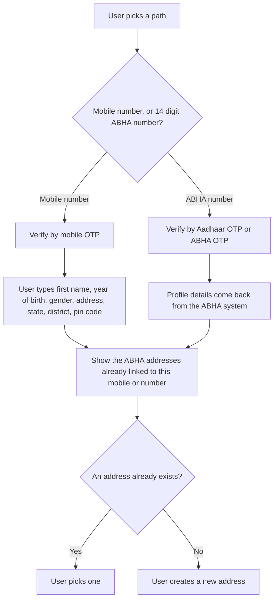

import ApiLinks from '@site/src/components/docs/ApiLinks';

# P1 Identity and profile

P1 is the patient side of [M1 Identity](./m1). M1 is how a hospital system
creates an [ABHA](/docs/hiecm/v3/getting-started/glossary#abha). P1 is how the
patient's own [PHR](/docs/hiecm/v3/getting-started/glossary#phr) app does it,
and how it maintains the account afterwards.

<ApiLinks module="p1" />

## In short

- Every user needs an ABHA address, `username@abdm`. Consent, notifications and
  record sharing all hang off it.
- Build both creation paths: by mobile number, and by an existing 14 digit ABHA
  number.
- Every login route is mandatory except the two email OTP routes, which are
  optional.
- Fetch the PHR public key first. It is not the ABHA service's key.
- A user can hold several ABHA addresses but only one ABHA number.

## What you build

Registration and login. The profile the patient reads and edits is
[P2](./p2).

## Creating an ABHA address

A person does not need an [ABHA number](/docs/hiecm/v3/getting-started/glossary#abha-number),
and does not need Aadhaar, to get an ABHA address here. A mobile number and
the OTP sent to it are enough. What that buys is a Self-Declared profile: an
address the network can route to, with no
[KYC](/docs/hiecm/v3/getting-started/glossary#kyc) behind it and no ABHA
number until the person links one later.

| Path | Validated by | Profile details | Result |
| --- | --- | --- | --- |
| Mobile number | Mobile [OTP](/docs/hiecm/v3/getting-started/glossary#otp) | The user types them | Self-Declared, no [KYC](/docs/hiecm/v3/getting-started/glossary#kyc) |
| 14 digit ABHA number | Aadhaar OTP or ABHA OTP | Returned by the ABHA system | KYC Verified |

After validation on either path, show the ABHA addresses already linked to that
mobile number or ABHA number. The user then picks one instead of creating a
duplicate.

A Self-Declared profile needs a "Link ABHA number" action. The user enters the
14 digit number and validates by Aadhaar OTP or ABHA OTP. Profile details
then follow the ABHA number, and the status changes to KYC Verified.

## Login

Sign a user in to a PHR application by any of these routes. Every route is
mandatory except login by email OTP, which is optional.

| Route | Validated by |
| --- | --- |
| Mobile number | Mobile OTP |
| An address such as `name@abdm` | Password, mobile OTP or email OTP (optional), by the auth methods the address supports |
| The 14 digit ABHA number | ABHA OTP or Aadhaar OTP |
| The Aadhaar number | Aadhaar OTP |

Every OTP route returns the ABHA addresses linked to that identifier. The user
picks the one to sign in as, and you confirm the choice with the verify user
call.

Resend OTP unlocks after 60 seconds in every flow. You also need a reset
password screen behind login, secure storage of the refresh token, and more
than one user profile per install with sign in and sign out.

## Tokens and base URLs

| Token or URL | Value |
| --- | --- |
| Gateway session token | Valid for 20 minutes |
| User token from login | Valid for 30 minutes |
| Refresh token | Valid for 15 days |
| PHR APIs, sandbox | `https://abhasbx.abdm.gov.in/abha/api/v3/phr/app/` |
| PHR APIs, production | `https://apis.abdm.gov.in/phr/api/phr/app/v3/` |
| ABHA address verification, sandbox | `https://abhasbx.abdm.gov.in/abha/api/v3/phr/web` |
| ABHA address verification, production | `https://phr.abdm.gov.in/api/phr/web/v3` |

Encrypt the Aadhaar number, mobile number, OTP and password with the PHR
public key from `GET /abha/api/v3/phr/app/login/public/certificate`. It is a
different key from the ABHA service's, so fetch it before any other PHR call.

## Next

- The calls and base URLs: [P1 API reference](/reference/hiecm-p1).
- The profile, card and QR code the signed in user manages: [P2](./p2).
- The next milestone: [P2 Linking and records](./p2).
