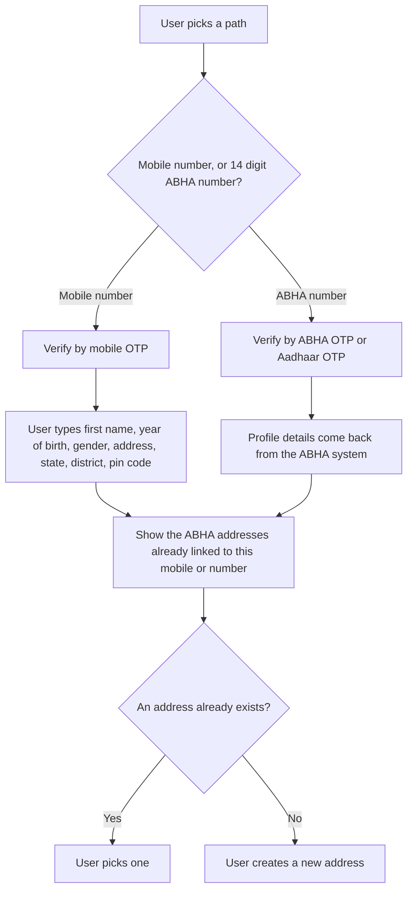

import ApiLinks from '@site/src/components/docs/ApiLinks';

# P1 Identity and profile

P1 is the patient side of [M1 Create](./m1). M1 is how a hospital system
creates an [ABHA](/docs/hiecm/v3/getting-started/glossary#abha). P1 is how the
patient's own [PHR](/docs/hiecm/v3/getting-started/glossary#phr) app does it,
and how it maintains the account afterwards.

<ApiLinks module="p1" />

## In short

- Every user needs an ABHA address, `username@abdm`. Consent, notifications and
  record sharing all hang off it.
- There are two creation paths: by mobile number, and by an existing 14 digit
  ABHA number.
- Several ABHA addresses can share one ABHA number.

## What you build

Registration and login, and the profile the patient reads and edits.

## Creating an ABHA address

A person does not need an [ABHA number](/docs/hiecm/v3/getting-started/glossary#abha-number),
and does not need Aadhaar, to get an ABHA address here. A mobile number and
the OTP sent to it are enough. The result is an address with no ABHA number
until the person links one later.

| Path | Validated by | Profile details | Result |
| --- | --- | --- | --- |
| Mobile number | Mobile [OTP](/docs/hiecm/v3/getting-started/glossary#otp) | The user types them | No ABHA number linked |
| 14 digit ABHA number | ABHA OTP or Aadhaar OTP | Returned by the ABHA system | `kycStatus` `VERIFIED` |

After validation on either path, show the ABHA addresses already linked to that
mobile number or ABHA number. The user then picks one instead of creating a
duplicate.

An address without an ABHA number can link one. The user enters the 14 digit
number, validates by ABHA OTP or Aadhaar OTP, and the app sends the link
request.

## Login

Sign a user in to a PHR application by any of these routes.

| Route | Validated by |
| --- | --- |
| Mobile number | Mobile OTP, then the user picks which linked ABHA address to sign in as |
| An address such as `name@abdm` | Password, mobile OTP or email OTP, by the auth methods the address supports |
| The 14 digit ABHA number | ABHA OTP or Aadhaar OTP |

## Profile, card and QR code

| Element | What it holds |
| --- | --- |
| Profile screen | Demographics, edited through Update Profile. Mobile number and email change by OTP |
| ABHA address card | Returned by Get PHR Card |
| QR code | Returned by Get QR Code |

## Next

- The calls and base URLs: [P1 API reference](/reference/hiecm-p1).
- The next milestone: [P2 Linking and records](./p2).
