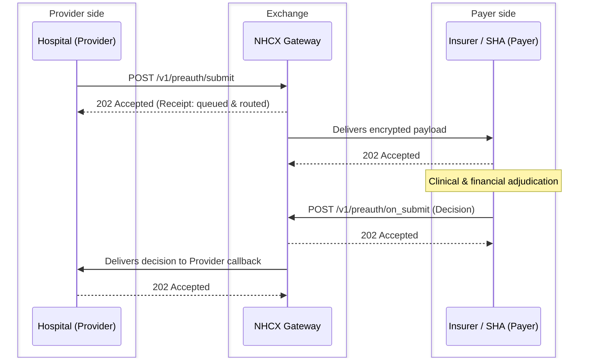
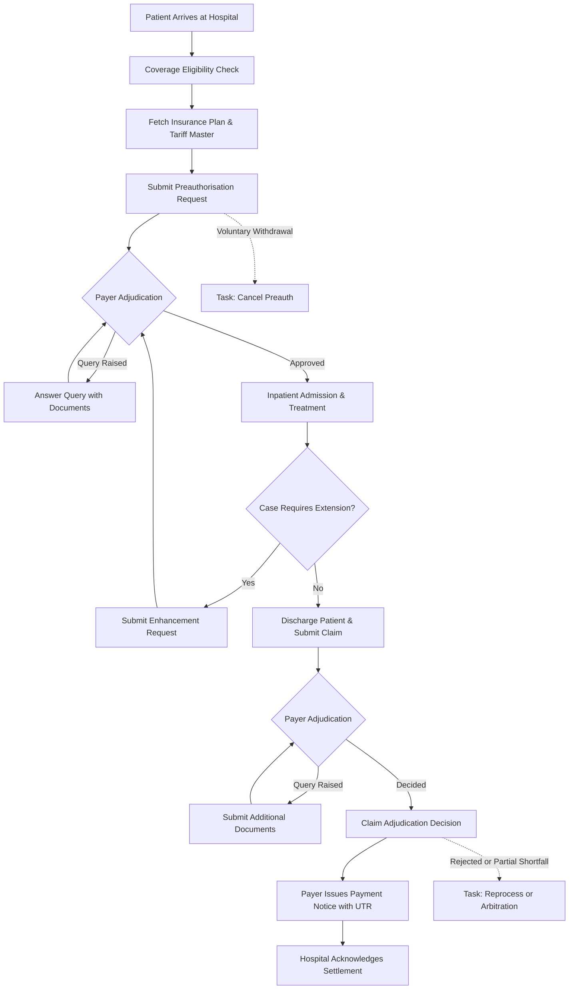

# How claims move on NHCX

This chapter describes how a health insurance claim moves from point of care to settlement, comparing traditional email-and-portal workflows with the National Health Claims Exchange (NHCX) paradigm.

---

## 1. What Is Claim Settlement?

Claim settlement is the end-to-end process by which a policyholder's or treating hospital's request for payment of medical expenses is evaluated, approved, and fulfilled by an insurer or State Health Agency (SHA):
- **Cashless Treatment**: The beneficiary receives inpatient care without paying out-of-pocket expenses up to policy limits or package rates, executed between an empanelled hospital (Provider) and the insurer/payer.
- **Reimbursement**: The beneficiary pays the hospital directly upon discharge and subsequently files for reimbursement from the insurer.
- **The Core Participants**:
  - **Provider**: The treating hospital and its Hospital Management Information System (HMIS).
  - **Payer**: The insurance company, SHA, or Third-Party Administrator (TPA) adjudicating and settling the claim.
  - **Exchange**: The NHCX gateway orchestrating routing, security envelopes, protocol audit, and asynchronous delivery.

---

## 2. From Fragmented Portals to a Unified Exchange

Historically, hospitals interacted with insurers through email correspondence or by logging into 30+ proprietary insurer and TPA portals:
- **Duplication & Cost**: Every insurer required distinct logins, document formats, and upload conventions, creating administrative bottlenecks.
- **Unstructured Scans**: Clinical summaries and bills were transmitted as scanned PDFs or image attachments, requiring manual scrutiny by claim processing doctors and preventing automated adjudication.

### The NHCX Solution
NHCX operates as a national clearinghouse (analogous to a financial securities exchange or UPI):
1. **Single Connection**: A hospital integrates once with the gateway and immediately reaches all registered insurance companies and state schemes.
2. **Structured FHIR Payloads**: Transactions travel as machine-readable HL7 FHIR Release 4 bundles. Diagnoses (ICD-10), procedures/packages (SNOMED / Scheme masters), observations (LOINC), and itemized tariffs are transmitted as structured data, enabling rules-based auto-adjudication.
3. **End-to-End Encryption**: Payloads are sealed inside JSON Web Encryption (JWE) containers using the recipient's public key; the gateway inspects only routing headers and never sees protected health data.

---

## 3. The Asynchronous Request and Callback Pattern

Claim decisions cannot be processed synchronously; medical pre-authorisation reviews may require minutes to hours, while complex claim scrutinies may take days. NHCX therefore implements a strict asynchronous two-step exchange for every substantive action:

1. **Action Request**: The initiator invokes an action endpoint (e.g., `POST /v1/preauth/submit`).
   - The exchange validates the envelope headers, verifies the sender, and responds immediately with an **HTTP 202 Accepted receipt**.
   - This initial receipt confirms message ingestion into the gateway queue. It is **not** an adjudication decision.
2. **Adjudication Callback**: The recipient decrypts the bundle, processes the business decision, and sends an asynchronous response to the matching callback endpoint (e.g., `POST /v1/preauth/on_submit`).
   - The exchange delivers the response to the initiator's registered webhook, which in turn returns an HTTP 202 receipt.

---

## 4. The 10 Steps of Claim Settlement on NHCX

The traditional ten stages of claim settlement map directly onto NHCX exchanges.

### Step 1: Intimation

Absorbed into eligibility and preauthorisation. There is no separate intimation call; the patient's arrival is declared in the eligibility check or in the preauthorisation.

### Step 2: Policy verification by the hospital

On `/v1/coverageeligibility/check`. The provider asks whether the beneficiary's policy is active, in force and within its limits.

### Step 3: Beneficiary and tie-up verification by the payer

On `/v1/coverageeligibility/on_check`. The payer confirms member validity, empanelment status and benefit limits in one round trip.

### Step 4: Treatment plan intimation

On `/v1/preauth/submit`. The admission and the planned package codes reach the payer.

### Step 5: Preauthorisation

On `/v1/preauth/on_submit`. The payer issues the authorisation with its financial limit, and its own case number in `preAuthRef`.

### Step 6: Enhancement

On `/v1/preauth/submit` again, with the header `x-hcx-use_case: Enhancement`. The hospital asks for a longer stay or a further surgical package.

### Step 7: Discharge and document submission

On `/v1/claim/submit`. The structured discharge summary, operative notes, diagnostic reports and the itemised bill under category `MB`.

### Step 8: Payer query and resolution

On `/v1/communication/request` from a private insurer, or on the case's own thread under PMJAY. The payer asks for clinical clarification and the provider answers with supporting evidence.

### Step 9: Claim adjudication

On `/v1/claim/on_submit`. The final decision: approved, rejected, or approved with line-item deductions.

### Step 10: Payment and reconciliation

On `/v1/paymentnotice/request`. The settlement advice with the bank UTR, TDS and deductions, which the provider acknowledges.

---

## 5. End-to-End Claim Lifecycle Flow

---

## 6. What Every Participant Must Implement

- **The Provider (Hospital HMIS)**:
  - Initiates outbound API requests for eligibility, preauthorisation, claim submission, search, and tasks (cancellation, reprocess).
  - Hosts inbound callback webhooks for preauth decisions, claim verdicts, payer communications, and payment notices.
- **The Payer (Insurer, SHA, TPA)**:
  - Hosts inbound callback endpoints for eligibility checks, plan inquiries, preauthorisations, claims, and tasks.
  - Initiates outbound communications, adjudication responses, and payment notices.
