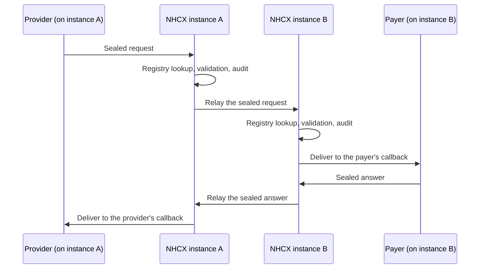
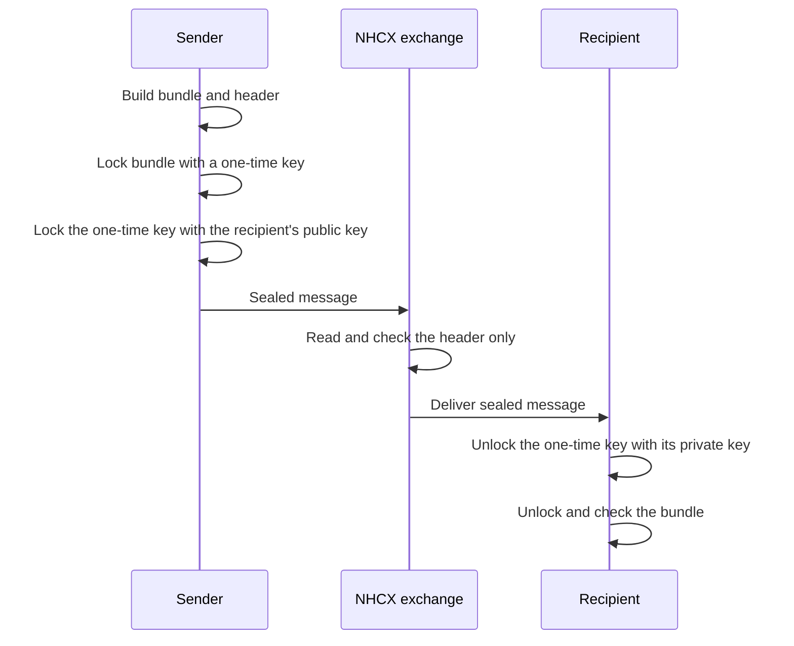

# JWE Secure Messaging

Every message on NHCX is sealed so that only the participant it is addressed to can read it. The exchange carries the message, reads its address, and never sees what is inside. This page explains that model in plain terms. The fields, algorithms and exact values are in [The JWE message format](/docs/nhcx/v1/getting-started/jwe-message-format).

## Envelope and letter

Picture a sealed letter inside an addressed envelope.

The envelope is what the exchange reads. It says who sent the message and who it is for. It carries a number for this call and a number for the whole conversation. It also says which step of the claim this is, when it was sent, and whether it is a request or an answer. The exchange uses these to route and to keep records.

The letter is the FHIR bundle. The sender seals it with the receiver's public key before it leaves, so the exchange can carry it but cannot read it. Only the receiver can open it.

A few facts can also be written on the outside of the envelope, for example the amount claimed. These are called domain headers. They let the exchange keep an audit trail without opening anything.

## One exchange or several

NHCX is designed so that more than one exchange instance can run, relaying messages between them. A participant's address carries the instance after the `@`, as in `1518@hcx`. When a hospital and its payer are on the same instance, that instance delivers the message. When they are on different instances, the hospital's instance relays it to the payer's. Each instance does its own registry lookup, validation, audit and routing. The relaying exchange is a participant with the role `HIE`, and it cannot read the letter either.

A relay is needed whenever the two participants in an exchange sit on different instances. Three cases lead to that:

- **Payer on another instance.** The hospital is on instance A. The payer that runs the policy's scheme is on instance B. Instance A passes the hospital's message to instance B, which delivers it to the payer.
- **Treatment in another state.** A beneficiary is treated at a network hospital in another state. That hospital is on instance A, and the beneficiary's payer is on instance B. The relay works as in the first case.
- **Top-up cover.** The patient has a primary and a secondary insurance. The primary payer is on instance A and the secondary payer is on instance B. A hospital on instance A reaches the primary payer directly, and its messages to the secondary payer are relayed to instance B.

In every case the answer travels back along the same path, from instance B to instance A and then to the hospital.

Neither instance can open the letter at any point on this path.

## Protected Headers

Think of the address written on the outside of an envelope. The postman and the post office can read it, and they use it to decide where the letter goes, but they never open the letter itself. Protected headers work the same way. They are written on the outside of every NHCX message so the exchange can read them, route the message and keep records, while the contents stay sealed. Every NHCX header name starts with `x-hcx-`

- **Sender Code** - Who is sending. Your participant ID
- **Recipient Code** - Who it is for. For a provider, the processor code from the policy lookup
- **Correlation Id** - A number for the whole conversation. The same on the request and on every answer to it.
- **Workflow Id** - Which step of the claim this is. The codes are listed in the Workflow Codes chapter
- **Timestamp** - When it was sent

There are a few other fields as well, such as the call and request IDs, the status and the beneficiary's ABHA number. The full list, with the rules for each, is in Envelope Fields in the Reference section.

Along with these, the message must meet a few requirements specific to JWE, the format used to seal it `A256GCM`. 

## How a message is sealed

Sealing uses two keys, each doing the job it is good at. The format that packages the result is JSON Web Encryption, or JWE.

1. **Write the letter.** The sender builds the FHIR bundle.
2. **Address the envelope.** The sender writes the protected header: sender, recipient, identifiers, step, status and time.
3. **Find the recipient's lock.** The sender fetches the recipient's public certificate from the registry. Anyone may hold a public key. Only its owner holds the matching private key.
4. **Make a one-time key.** The sender generates a fresh random key for this message alone.
5. **Lock the letter.** The bundle is encrypted with the one-time key. The envelope is bound into this step, so changing any header later breaks the seal.
6. **Lock the key.** The one-time key is encrypted with the recipient's public key.
7. **Package it.** The header, the locked key and the locked letter are joined into one string and posted to the exchange.

Why two keys? Public key encryption proves only one party can open something, but it is slow and handles small inputs. Shared key encryption is fast for a large bundle, but both sides would need the key in advance. Locking the letter with a one-time key, and locking only that small key with the public key, gives both properties.

## How a message is opened

The exchange reads the envelope, checks it, and delivers the whole message to the recipient's callback. It cannot unlock the one-time key, because it does not hold the recipient's private key.

1. **Check the address.** The recipient reads the header and confirms the message is for it.
2. **Unlock the key.** It uses its own private key to recover the one-time key.
3. **Unlock the letter.** It decrypts the bundle with the one-time key. The same step checks that neither the bundle nor the header changed on the way. Any change makes decryption fail.
4. **Read and check the bundle.** The recipient parses the FHIR and validates it.
5. **Answer the same way.** The reply is sealed with the original sender's public key, and the cycle runs in reverse.

The most common failure is sealing with the wrong public key: your own, or a stale one. The exchange accepts the message, because the envelope is fine, and the recipient cannot open it. [The recipient cannot decrypt](/docs/nhcx/v1/troubleshooting/the-recipient-cannot-decrypt) covers that case.

## Where a message stands

Every envelope carries a status word. The sender sets it to say whether this is a new request, an interim answer, a final answer or a refusal. The exchange tracks its own states too: queued, delivered, or stopped after delivery failed. The values and the rules for each are in [The JWE message format](/docs/nhcx/v1/getting-started/jwe-message-format).

## When a message is refused

A message can be refused for three kinds of reason. The first two follow the envelope and letter split. The third is a business decision on a message that was delivered and read correctly.

- **The exchange refuses the envelope.** A missing header, an unknown recipient or an expired token. The sender hears at once, in the response to its own call.
- **The receiver refuses the letter.** It could not decrypt the bundle, or the bundle failed validation. It answers on the callback with a short error in the envelope, and the sender hears later.
- **The payer refuses on business grounds.** The message arrived and was valid, but the payer will not accept the request. For example:
  - The patient is not covered by the policy
  - The beneficiary already has an active preauthorisation open
  - The coverage balance is not enough for the amount asked
  - The claim amount is more than the preauthorisation approved
  - The claim is a duplicate of one already sent

Each refusal carries a code. [Error codes](/docs/nhcx/v1/reference/error-codes) lists every code with its message and what to do. [Reading error codes](/docs/nhcx/v1/reference/error-code-guide) explains the code families.

## Everything is logged

The exchange records every call it receives: the envelope, the encryption details, sender and recipient, and whether validation passed. It never records the letter. Participants can query the audit trail for their own transactions, and NHA publishes reports from it for payers, providers, regulators and observers.

## Where to go next

- [The JWE message format](/docs/nhcx/v1/getting-started/jwe-message-format): every field, status value, receipt and error code.
- [Building and sending a JWE](/docs/nhcx/v1/getting-started/building-and-sending-a-jwe): seal and post your first message.
- [Envelope fields](/docs/nhcx/v1/reference/envelope-fields): each header checked against its sources.