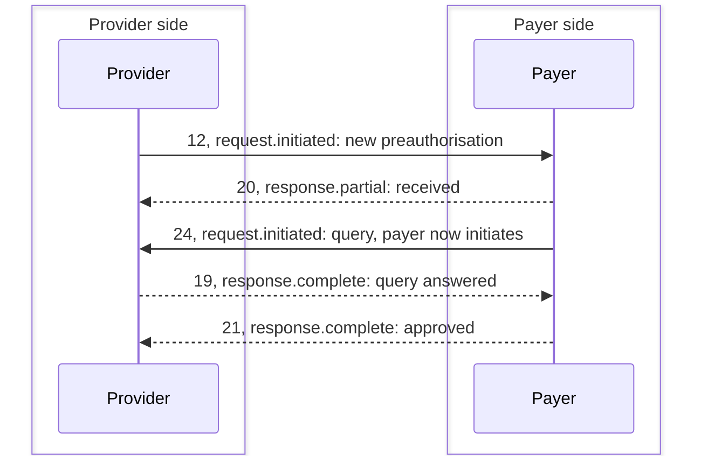

# JWE, status and errors

The previous chapter got you onto the network. This one is about what a message is, how to tell where it is in its life, and what to do when it is refused. None of it belongs to any single use case, and all of it applies to every one.

## Envelope and letter

Picture a sealed letter inside an addressed envelope.

The envelope is what the exchange reads. It carries who sent the message and who it is for, a number for this particular call and a number for the whole conversation it belongs to. It also carries which step of the claim it represents, the time, and a status word saying whether this is a request going out or an answer coming back. The exchange uses these to route and to keep records.

The letter is the FHIR bundle. It is sealed with the receiver's public key before it leaves the sender, so the exchange can carry it but cannot read it. Only the receiver can open it.

A few facts can be written on the outside of the envelope as well, for example the amount claimed. These are called domain headers. They let the exchange keep an audit trail without opening anything.

This split explains a pattern that runs through the rest of the documentation. If the envelope is wrong, the exchange rejects the message and the sender hears immediately. If the letter is wrong, the receiver rejects it and the sender hears later, on the callback. Two kinds of error, from two different places.

## One exchange or several

NHCX is designed so that more than one exchange instance can run, and messages can be relayed between them. A participant's address carries the instance after the `@`, as in `1518@hcx`. When a hospital and its payer are on the same instance, that instance delivers the message. When they are on different instances, the hospital's instance relays it to the payer's. Each instance does its own registry lookup, validation, audit and routing, and the answer, the payment notice and its acknowledgement come back the same way. An exchange that relays is a participant with the role `HIE/HIO.NHCX`, and it cannot see the payload.

The Technical Specifications appendix names three cases that need a relay:

1. The provider is on one instance and the payer for the policy's scheme is on another.
2. A beneficiary is treated in a network hospital in another state, and that hospital is on a different instance from the payer.
3. A top-up case, where the primary insurance is handled by a payer on one instance and the secondary insurance by a payer on another.

## Every field on the envelope

The format is JWE, and every NHCX field on it starts with `x-hcx-`.

| Field | In plain words |
| :---- | :---- |
| `sender_code` | Who is sending. Your participant ID. |
| `recipient_code` | Who it is for. For a provider, the processor code from the policy lookup. |
| `api_call_id` | A fresh number for this one call. |
| `request_id` | A number for this request. |
| `correlation_id` | A number for the whole conversation. The same on the request and on every answer to it. |
| `workflow_id` | Which step of the claim this is. The codes are listed in the Workflow Codes chapter. |
| `timestamp` | When it was sent. |
| `status` | Whether this is a request going out or an answer coming back, and how far along. |
| `ben-abha-id` | The beneficiary's ABHA number, without hyphens. Mandatory on every exchange, including those with no beneficiary in the payload. |
| `use_case` | Optional, and the field that distinguishes an enhancement from a resubmission at the protocol layer. The permitted values differ by exchange: `New`, `Enhancement` or `Resubmit` on preauthorisation and status, `New` or `Resubmit` on a claim. |
| `error_details`, `debug_details`, `debug_flag` | Used only when something has gone wrong. The specification gives `debug_flag` as `Error`, `Info` or `Debug`; the workbook and the samples send `INFO`. Envelope Fields says which to send. |

Two more fields, `alg` and `enc`, name the encryption used. The specification says `RSA-OAEP` with `A256GCM`; the handbook and the live samples use `RSA-OAEP-256`. Follow the samples.

The serialisation is contested too. The message-security page says to assemble the result in flattened JSON serialisation; the FAQ and the handbook both say compact serialisation, the five-part dot-separated string, and every sample is compact. Build compact.

**Domain headers** are a few facts written on the outside of the envelope for the exchange's records, such as the amount claimed, so it can keep an audit trail without opening the letter. Envelope Fields gives their naming convention and the ones the sources name.

## The same conversation

Three of the numbers above are unique identifiers in the UUID format. `api_call_id` is new every time. `request_id` is new per request. `correlation_id` is the thread that ties an entire transaction together.

The correlation ID rule is unified and consistent across the network:
1. **On an outbound request**: The initiator sets `correlation_id = api_call_id`.
2. **On an inbound response**: The responder echoes the request's `correlation_id` (which equals the request's `api_call_id`) while generating a brand-new `api_call_id` for the response itself.
3. **On a status query (`/v1/status`)**: The caller sets `correlation_id` to the specific `api_call_id` of the target transaction being checked.

If a request fails at the gateway layer, the exchange retires that correlation ID. Any subsequent retry must generate a fresh `api_call_id` and fresh `correlation_id`; reusing a failed correlation ID causes silent drops.

The timestamp is contested on two axes. Format: the protocol page defines it as a Unix timestamp, and the sample header in Common Mistakes carries epoch milliseconds, while the handbook and FAQ both use ISO 8601. Zone: the FAQ says UTC with a trailing `Z`, the handbook says Indian time with `+05:30` and that UTC will fail validation. The sample bundles use ISO with `+05:30`. It is a validated field; establish the form with the payer before building.

## Status words

The `status` field says how far along a message is. Only a few values exist, and they pair with the workflow code: the code says which step, the status says where that step stands.

- `request.initiated` is what an initiator sends. It means "I am starting this".
- `response.partial` is what a responder sends to say "received, working on it", or to give an interim answer.
- `response.complete` is a final answer.
- `response.error` means the message was refused.

Three more are the exchange's internal lifecycle statuses:
- `request.queued`: The message passed gateway schema and protected header validation and sits in the exchange's dispatch queue.
- `request.dispatched`: The exchange successfully delivered the JWE payload to the recipient's registered callback URL.
- `request.stopped`: The exchange permanently terminated message delivery after exhausting its internal retry schedule (due to recipient timeout, connection drop, or HTTP 5xx failures). A transition to `request.stopped` retires that `correlation_id` forever. Senders must never retry a message with a stopped correlation ID; any subsequent attempt must generate a brand-new `api_call_id` and fresh `correlation_id`.

The Open Protocol page carries a different seven-value set entirely, `request.initiate`, `request.retry`, `response.success`, `response.fail` and three more. None appears in the workflow sheet, in any sample or in the gateway's validation. It is a superseded draft.

Put together, a preauthorisation's life reads like this.

| Who sends | Workflow code | Status | Meaning |
| :---- | :---- | :---- | :---- |
| Provider | 12 | `request.initiated` | New preauthorisation |
| Payer | 20 | `response.partial` | Received, under review |
| Payer | 24 | `request.initiated` | Query raised. The payer is now the initiator. |
| Provider | 19 | `response.complete` | Query answered |
| Payer | 21 | `response.complete` | Approved |

Using the wrong status is the first item on the portal's list of common mistakes. The full table of which status goes with which code is in the Workflow Codes chapter.

## The receipt

When a message reaches the exchange, or reaches your callback, the receiver answers straight away with `202 Accepted` and a short receipt. The receipt repeats the call and correlation numbers, names sender and recipient, says what kind of message it was, and gives a protocol status of `request.queued`, `request.dispatched` or `request.error`. It is not the decision. It says only that the message was taken in.

Your own callback endpoint must send exactly this receipt, within 30 seconds. Anything else, including a slow `200`, is read as a failed delivery.

## When a message is refused

Refusals come from two places, and the envelope-and-letter split above says which.

**The exchange refuses the envelope.** A missing header, an unknown recipient, an expired token, a bad status value. The sender hears at once, in the response to its own call.

**The receiver refuses the letter.** It could not decrypt the bundle, or the bundle failed validation. The receiver sends back a **protocol response** on the callback: the same envelope fields, `status` set to `response.error`, and a short code, message and trace in `error_details`. The exchange logs the header part for audit. Business reasons, such as "this patient is not covered", travel inside a sealed response instead, so the exchange never sees them.

Error codes come in families. `PAYR-` codes are the payer's, and read like plain sentences: not registered with this payer for this policy, policy does not exist, coverage balance insufficient, claim amount exceeds the preauthorisation, duplicate claim. Gateway and bridge codes cover the envelope side. The full sheet, updated 11 August 2026, is on the portal.

**Retries and the error API.** If your callback does not send a proper receipt, the exchange tries five times and then drops the request, retiring its correlation ID. It then reports the failure to the original sender on a separate endpoint, `/v1/error`, which every participant must host. A system without it never learns that its request died.

## Codes met live

The error table reads like a list of code lookups, and several of the codes mean something else in the running sandbox. From the September 2026 run:

| Code | The message | What it turned out to mean |
| :---- | :---- | :---- |
| `PAYR-1027` | Invalid item id found for item in claim component | `Claim.item` has no FHIR element `id` (`Item/1`). Nothing to do with the package code |
| `PAYR-1083` | No HPR details found for the practitioner … category code as HPIN | The `Practitioner` carries no identifier typed `HPIN` |
| `PAYR-1238` | Beneficiary is having an active preauthorization request at this hospital with reference number … | Scheme rule, not a bundle fault: one live preauthorisation per beneficiary per hospital. The reference number ends in the SHA's case id |
| `PAYR-1401` | Policy not allowed for the hospital | The plan was asked for under a policy the hospital is not empanelled under; ask under the beneficiary's own |
| `PAYR-1019` | Invalid sequence received in supporting info element | A `supportingInfo` entry with no `sequence`; number the whole list once it is assembled |
| `PAYR-1256`, `PAYR-1363` | Response for Authentication Consent Questionnaire is missing | The plan's consent questionnaire, unanswered, where no biometric token was taken |
| `PAYR-1008` | Invalid content type … / Invalid input, code and reason code | Two different faults on one code: a document outside pdf, jpg, jpeg, png and fhir+json; or a Task code paired with a reason the scheme does not accept |
| `PAYR-1245` | Only one conservative procedure can be booked for a case | The master's `ProcedureType`; an enhancement on a conservative case must add a medical package |
| `ERR-PYR-CLM-007` | No prior preauthorization or claim record found for case number | The claim was sent under a number of its own instead of the pre-authorisation's |
| `PAYR-1322` | Active instance found for case number | A request is already open on that case; the scheme takes one at a time |

`NHCX-1010`, *no data with given correlation id for call back request*, belongs beside them and is the exchange's own. It is what a payer hears when it answers a submission it left silent. NHCX redelivers an unanswered request, drops it after a few tries and retires the correlation, so a verdict taken minutes later has nowhere to land. The remedy is the one the live PMJAY payer uses: acknowledge the submission at once with a `ClaimResponse` whose `outcome` is `queued`, and send the decision later on the same thread.

Two things follow. A refusal in the `PAYR-102x` block is structural, so check ids and sequences before values. And the refusals arrive in order: the SHA validates the bundle first and applies the scheme's rules only to a bundle that passed, so `PAYR-1238` is, perversely, the first sign the bundle is right.

## The mistakes everyone makes

The portal keeps a list. In plain words:

1. Wrong status word for the leg of the message.
2. No `/v1/error` endpoint, so failures go unnoticed.
3. Answering a callback with something other than `202` and the receipt.
4. Missing or malformed envelope headers.
5. In production, the wrong registry ID: providers send the HFR ID, payers the IRDAI ID without leading zeros.
6. Forgetting the `Accept: application/json` header.
7. Addressing the insurer's code instead of the processor's.
8. Reusing a correlation ID, especially after an error.
9. Retrying on a `401` with the same expired token instead of fetching a new one.
10. Trying to de-link a policy from a participant that did not link it.

## Everything is logged

The exchange records every call it receives: the envelope, the encryption details, sender and recipient, and whether validation passed. It never records the letter. Participants can query the audit trail for their own transactions, and NHA publishes reports from it for payers, providers, regulators and observers.

## What to send when the sources disagree

This chapter and the ones after it flag every place the published documents contradict each other, which is the honest thing to do but leaves you with a decision to make on each one. This section makes those decisions once. Every value here is what the published sample payloads actually carry, and where no sample settles it the entry says so rather than inventing a ruling.

Send these. If a payer rejects one, that rejection is better evidence than anything here, and you should follow it.

### Key wrapping algorithm

Send `RSA-OAEP-256`. The handbook, the samples and the Postman collection agree. One protocol page says `RSA-OAEP`; it is outnumbered.

### Content encryption

Send `A256GCM`. Uncontested in the samples.

### Serialisation

Send the compact serialisation, five parts. The message-security page says flattened JSON. The FAQ, the handbook and every sample use compact.

### Timestamp format

Send ISO 8601 with `+05:30`. The samples use it throughout. Accept a Unix epoch on the way in.

### Correlation ID on a response

Copy the request's `correlation_id`. Settled. On a **request** set it to that message's own `api_call_id`; on a **response** echo the request's `correlation_id`. The workbook has 25 correlation rows: 8 state the request half, 16 the response half, and 1 gives the status enquiry its own rule. The two halves are one rule, not a clash. Envelope Fields has the table.

### api_call_id

Send a fresh UUID on every message, including responses. So a response and its request never share one.

### Identifier type for an ABHA number

Send `ABHA`. From the NRCeS identifier-type code system, not the HL7 `JHN`.

### Cancellation Task input name

Send `intimationNumber`, on the cancel Task as on the reprocess.

### entity_type in a receipt

Derive it from the path. The second-to-last segment, or the last where that is `v1`, with `on_` stripped.

Two points looked unanswerable in earlier versions of this documentation. Both are answered in the sources, and the answers are recorded here.

**The workflow code for eligibility, insurance plan, search, predetermination and status.** The workflow sheet lists none because the header is optional. `x-hcx-workflow_id` is marked Optional on all twenty-five rows on which it appears, across all ten sheets of the NHCX Requests and Responses workbook, including the CoverageEligibility and Insurance Plan sheets. Send the step code where the sheet gives one. Send nothing where it does not. There is nothing to negotiate.

The field also carries two readings, which is why it looks unresolved. The Workflow Status Sheet treats it as a step code; the protocol pages define it as an identifier that "may span over a series of message exchanges" for one case. Envelope Fields sets both out.

**Domain headers.** These are named, and they have a convention. The format is `x-hcx-<use_case_name>-<parameter_name>`, with the use case under sixteen characters and the parameter under thirty-two. The Notification Integration document names four in use: `x-hcx-amount_submitted`, `x-hcx-benefit-category_type`, `x-hcx-benefit_code` and `x-hcx-action`. The eObjects page adds a `Usage` header on the Claim carrying `preauthorization` or `claim`. And the access-control policy requires an insurance marketplace to carry the beneficiary's consent in a domain header before it may be given individual claim data.

Send none to a payer that has not asked for one. But they exist, and Envelope Fields collects them.

The full field table, with the obligation of every header and the rules that govern it, is Envelope Fields in the Reference section. Every error code either side can send is Error Codes in the same section.
