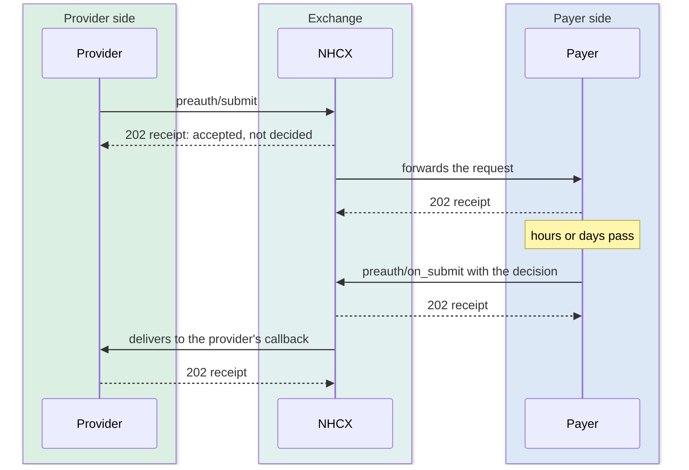
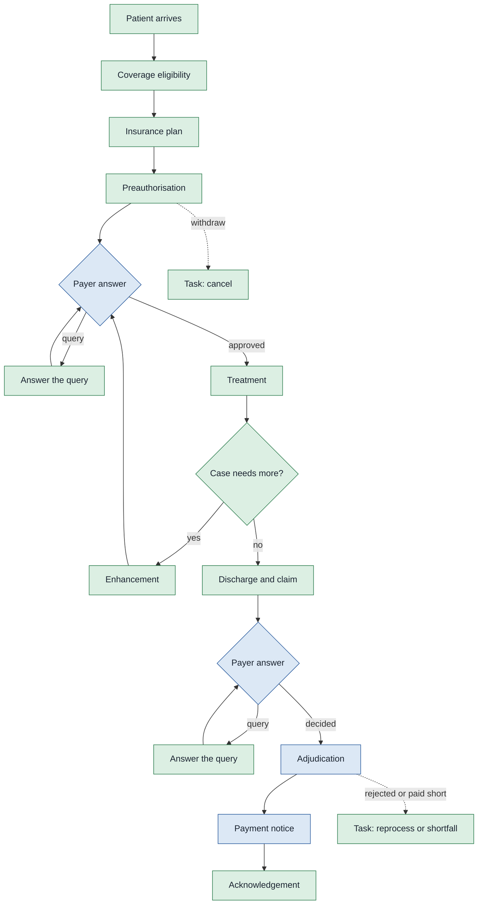

# NHCX way of claim settlement

The ten steps of claim settlement do not change under NHCX. The same parties make the same decisions about the same case. What changes is the medium: instead of email threads and some 30-odd insurer portals, each step becomes a structured exchange over a single gateway, carrying FHIR resources rather than PDFs and scans.

## In short

- The ten steps do not change. The medium does: structured exchanges over one gateway, carrying FHIR rather than PDFs.
- Every substantive use case is an asynchronous pair: an action endpoint, then a matching `on_` callback.
- There are two acknowledgements. The first says only "accepted and passed on".
- Six exchanges carry the claim; Task, search, ABHA linking and predetermination sit off the main path.
- Both sides host endpoints, so no participant is purely an API caller.

## From portals to an exchange

Today a hospital integrates separately with every insurer. Each new payer means another portal, another login, another upload convention. The cost grows with the number of payers, which is why smaller hospitals often stay out of cashless arrangements altogether.

On NHCX, a Provider integrates once and a Payer integrates once, each with the exchange. Every Provider can then reach every Payer, and the reverse, without either side building anything specific to the other. As on a securities exchange, participants connect to the platform rather than to each other.

## What travels over the exchange

Every exchange carries a FHIR bundle, and this is what makes the rest possible.

A discharge summary sent as a PDF can be stored and read by a person, but nothing downstream can act on its contents. The same information as FHIR resources lets the payer's system read the diagnosis, the procedure codes, the line items and the amounts as data. That is the precondition for auto-adjudication and for the parameter-by-parameter reporting described in the introduction. Standard terminologies are used alongside FHIR so that a code written by the Provider means the same thing when read by the Payer. SNOMED CT for clinical concepts, ICD for diagnoses, LOINC for laboratory observations, and the value sets NRCeS publishes for claim-specific codes such as packages, benefit categories and supporting-information types.

## The request and callback pattern

Claim decisions take time. A preauthorisation may sit with a medical officer for hours, an adjudication for days. NHCX therefore models every substantive use case as an asynchronous pair:

1. The initiator calls an action endpoint, for example `/v1/preauth/submit`. The exchange validates the request, acknowledges it, and routes it onward.
2. The responder does its work, then calls the matching `on_` endpoint, `/v1/preauth/on_submit`, to deliver the outcome back through the exchange.

There are two acknowledgements, not one, and the difference matters. When the initiator sends a request, the exchange answers straight away with a receipt that says only "accepted and passed on". That receipt is not the decision. The decision arrives later, on the callback, when the responder has actually done the work. The exchange never answers a claim question on the spot; anyone waiting for a synchronous yes or no will wait forever.

Two consequences follow. Participation is never purely a matter of calling APIs, because in one half of every exchange each side is the responder and must host endpoints. And every request has an acknowledgement and a matching response, which is what makes the process auditable.

## What every exchange needs

Four things are common to all traffic, before any claim-specific call is made.

- **Identity.** Participants are registered on the exchange and addressed by participant ID. The registry can be queried by role to find them.
- **Authentication.** Calls carry a token obtained from the ABDM gateway's sessions endpoint, with the same login a hospital already has from Milestone 1.
- **Confidentiality.** Payloads are encrypted for the receiver, using the receiver's public key, fetched from the exchange against their participant ID.
- **Traceability.** A status call returns the state of any request already triggered, so neither side has to infer what happened from silence.

Both Providers and Payers implement these. They are the shared use cases, and the next chapter takes each in turn: how a participant is registered and found, how a session is obtained, and how a receiver's key is fetched and used.

## The exchanges in a claim

Each stage of the journey becomes an exchange on the network. Six carry the claim, and a handful sit off the main path.

### Coverage eligibility

A patient arrives and presents a policy, or is found against one by mobile number or ABHA. Both sides now need the same assurance from opposite directions. The hospital needs to know the policy is live and covers the ailment. The insurer needs to know a genuine beneficiary has turned up at a hospital it has a tie-up with.

*Policy verification by the hospital* and *beneficiary and tie-up verification by the insurer* are therefore not two conversations on the network. They are one exchange. The Provider asks whether coverage is in force, valid at a date, and what benefits and plan details attach to it. The Payer answers through the callback. What used to take a phone call and a portal login is settled in one round trip. The answer is a machine-readable set of limits the hospital's system can act on rather than a screenshot someone reads.

This exchange is also the gate on registration. A patient is registered for treatment only once coverage is confirmed, and repeat the check whenever an additional treatment is added, so the remaining limit is known before anything is submitted.

### Insurance plan

Eligibility answers whether a patient is covered. The insurance plan answers what the policy itself contains: the covered services and their limits, the conditions and exclusions, the documents required, and the clinical guidelines that apply.

It is a separate exchange because it changes on a different clock. Eligibility is asked per patient, per visit. The plan belongs to the policy and can be fetched once and kept, refreshed when the payer amends or renews it. Holding it locally is what lets a hospital system populate a form with the right benefits and check a treatment against the policy before anyone submits anything.

### Preauthorisation

With coverage established, the hospital sets out what it intends to do: the line of treatment, the procedures, the expected length of stay. *Treatment plan intimation* and *preauthorisation* are the two halves of one exchange. The Provider submits the request, the Payer adjudicates it and returns the decision through the callback, and the patient is admitted on that decision.

The same exchange carries the whole preauthorisation cycle, not just the first request. An *enhancement*, where the case needs an additional procedure or a longer stay, is raised against the cycle already open. A resubmission revises a request that was rejected or approved for the wrong amount. A cancellation withdraws it. All of these reuse the same bundle, which is why the exchange is best thought of as a conversation about one authorisation rather than a single call.

### Query

*Query* is the one stage where the direction reverses. Everywhere else the Provider initiates and the Payer responds. Here the Payer asks for something it needs before it can decide, and the Provider answers.

That reversal is why the same query endpoints appear on both sides of the NHCX Use Cases chapter: once as the Payer raising the request, once as the Provider answering it. A query is also not a rejection. The case stays open, and answering it continues the original submission rather than starting a new one.

### Claim

At discharge, everything that was previously printed, scanned and emailed becomes the claim. *Discharge and document submission* is a single submission carrying the consultation notes, diagnostic reports, medication record, discharge summary and bills as FHIR resources. That is what lets the Payer read the values rather than look at pictures of them.

On the general network there is also a step before the claim. A hospital can send a provisional discharge submission while the patient is still on the ward, so the payer can check the treatment against the preauthorisation and raise anything it needs before the patient leaves. Under PMJAY this step does not exist and discharge is folded into the claim.

*Adjudication* is not a separate exchange. It is the Payer's response to the claim already submitted, carrying whether the amount is granted, denied or partially granted, and the reasons. So the claim and its decision are two halves of one exchange, in the same way as the preauthorisation and its decision.

### Payment

*Payment* arrives as a notice from the Payer carrying the bank reference details and the status of the transfer, which the Provider acknowledges. Reconciliation gives the breakup for the case.

The acknowledgement closes the claim on both books at the same moment, which the current email-and-portal mechanism cannot do, so neither side has to chase the other for confirmation that a payment landed.

### Off the main path

Four more exchanges exist without belonging to a single admission.

**Task.** Where a Provider wants a rejected or partly paid claim looked at again, or wants an approved preauthorisation cancelled, it does not reopen the original exchange. It raises a **Task**, a general-purpose request that names the case it concerns and what is being asked of it, answered by the Payer through the corresponding callback. Reprocess, cancel and arbitration are all carried this way, which is why one exchange covers what look like three unrelated actions.

**Search.** Providers and regulatory bodies can look up claim information, which is a read rather than part of any claim's progress.

**ABHA linking.** A Payer links an ABHA number to a policy when the policy is created, and can de-link it later. This is what makes the beneficiary findable by ABHA at the point of care, and it is covered in the next chapter.

**Predetermination.** Before treatment is planned in detail, a hospital can ask the payer what it would pay for a proposed course of treatment. The payer answers from the policy and the beneficiary's history. It uses the same shape as a preauthorisation but commits nobody to anything.

One stage of the journey has no exchange of its own. *Intimation* is absorbed into the eligibility and preauthorisation exchanges rather than carried separately.

## What a participant must build

- **A Provider application** calls the exchange for eligibility, preauthorisation, claim submission, search, reprocessing and cancellation, and hosts callbacks for the Payer's communication requests and payment notices.
- **A Payer application** hosts callbacks for eligibility, plan details, preauthorisation and claim submissions, and calls the exchange to raise communication requests, send payment notices and manage ABHA-to-policy links.

Both implement the shared use cases.

## Where the detail lives

Three chapters follow, and they divide the work between them.

The next chapter, Participants and Policies, covers the groundwork every exchange depends on. How a participant joins the network and is found on it, how a session is obtained, how keys are made and fetched, and how a beneficiary is matched to a policy. None of it is a claim exchange, and all of it has to be in place before one can be attempted.

JWE, Status and Errors then describes the message itself. The envelope and the sealed letter inside it, every field on the envelope, the status words, what the exchange's receipt looks like, and what happens when something is refused.

The NHCX Use Cases chapter then takes each exchange named here and gives its endpoints. The action endpoint the initiator calls, the callback the responder implements, and the workflow code that tells one transaction from another where several share an endpoint. The codes themselves are collected in the Workflow Codes chapter that follows it. The exchanges are grouped there by who drives them: shared by both sides, driven by the Provider, or driven by the Payer. That grouping tells an integrator which half of each exchange it has to build.
