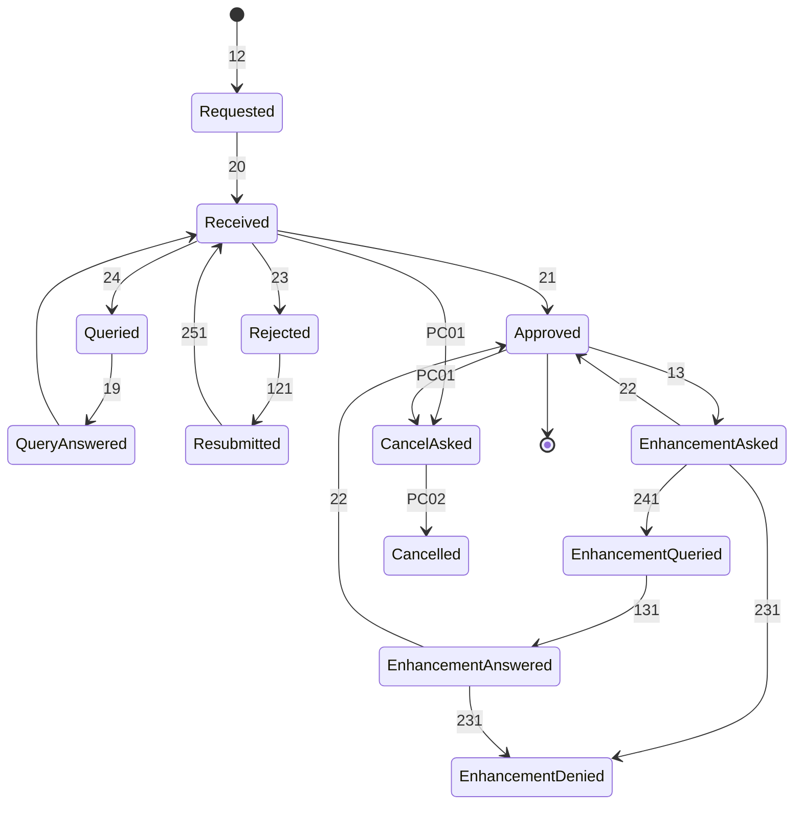
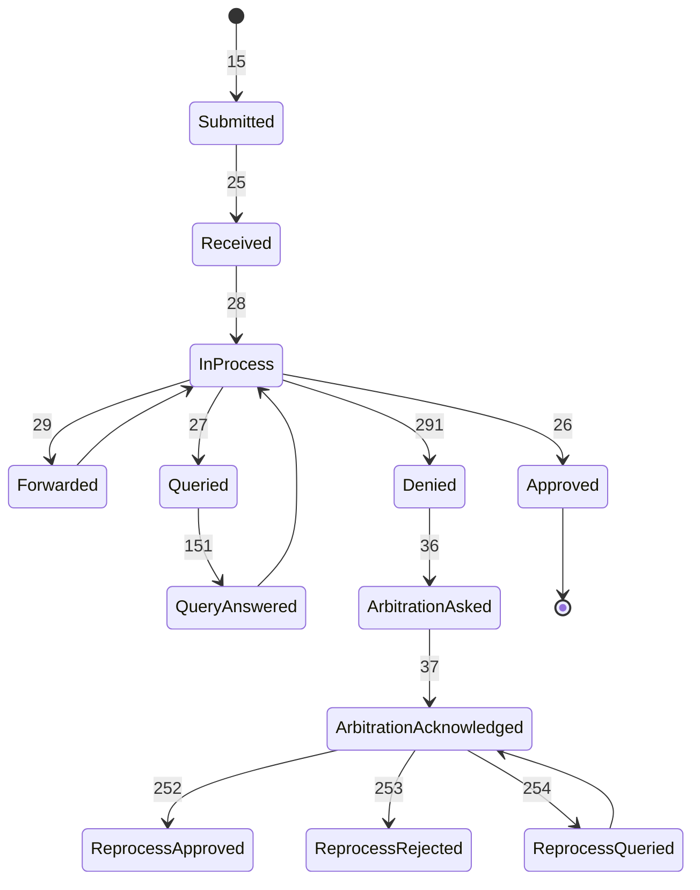
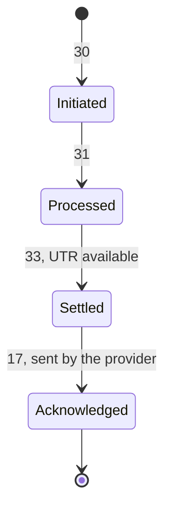

# Workflow Codes

Endpoints alone do not identify an NHCX transaction. A new preauthorisation, a resubmission, an enhancement and a query response all travel on `/v1/preauth/submit` carrying the same bundle. What separates them is the workflow code in the `x-hcx-workflow_id` header. Each code also expects a particular status word, given here beside it. The source is the official Workflow Status Sheet on the portal, updated 18 August 2026, which remains the authority as codes are added.

The A-series registry and session calls carry no workflow code because they are infrastructure calls rather than claim transactions.

## Workflow Code Prefix Families

NHA organizes workflow codes into numeric mainline cashless codes and alphanumeric families:

| Prefix | Family Name | Scope & Operational Coverage |
| :---: | :--- | :--- |
| **`R`** | **Reimbursement** | Mirrors the numeric cashless codes for the reimbursement route - the patient paid, and is claiming it back. |
| **`G`** | **Grievance** | Raising a grievance, its acknowledgement, and its failure path. |
| **`RP`** | **Return payment** | Money going back the other way. |
| **`N`** | **Notifications** | Push notifications addressed to payer, provider or beneficiary. |
| **`DC`** | **Discharge correction** | Correcting a discharge already submitted. |
| **`PC`** | **Preauth cancellation** | Withdrawing a pre-authorisation. Raised on /v1/task/submit with code `cancel`, not on the preauth endpoint. |

---

## Mainline Cashless State Machines

In the diagrams below, each arrow carries the workflow code of the message that moves the case.

### Preauthorisation Lifecycle

### Claim Lifecycle

### Payment & Settlement Lifecycle

---

## Master Catalog of All 74 Workflow Codes

Complete index of all published codes:

| Code | Meaning / Name | Sent By | Permitted Statuses | Stages / Outcomes | Reused |
| :--- | :--- | :--- | :--- | :--- | :---: |
| **`10`** | Patient Registered | Provider | `request.initiated` | Patient Registered | No |
| **`11`** | Patient Admitted | Provider | `request.initiated` | Patient Admitted | No |
| **`12`** | Preauth Request Initiated | Provider | `request.initiated` | Preauth  Request Initiated | No |
| **`121`** | Preauth Request Resubmitted | Provider | `request.initiated` | PreAuth Reprocess(Resubmission) Initimation | No |
| **`PC01`** | Preauth Cancel Initiated | Provider | `request.initiated` | Preauthorization Cancellation | No |
| **`19`** | Preauth Query Response Submitted | Provider | `response.complete` | PreAuth Query Response Submitted | No |
| **`13`** | Enhancement Request Initiated | Provider | `request.initiated` | Enhancement Request Initiated | No |
| **`131`** | Enhancement Query Response Submitted | Provider | `response.partial`, `response.error`, `response.complete` | Enhancement Query Ack Success, Enhancement Query Ack Failed, Enhancement Query Response Submitted | Yes |
| **`14`** | Discharge Submitted | Provider | `request.initiated` | Discharge Submitted | No |
| **`141`** | Discharge Query Response Submitted | Provider | `response.complete` | Discharge Query Response Submitted | No |
| **`15`** | Claim Request Initiated | Provider | `request.initiated` | Claim Request Initiated | No |
| **`151`** | Claim Query Response Submitted | Provider | `response.complete` | Claim Query Response Submitted | No |
| **`17`** | Payment Received | Provider | `response.complete` | Payment Notice Recived | No |
| **`36`** | Claim Arbitration Request Submitted | Provider | `request.initiated` | Claim Arbitration Intimation | No |
| **`20`** | Preauth Request Received | Payer | `response.partial`, `response.error` | PreAuth Ack Success, PreAuth Ack Failed | Yes |
| **`21`** | Preauth Request Approved | Payer | `response.complete` | Preauth Request Approved | No |
| **`22`** | Enhancement Request Approved | Payer | `response.complete` | Enhancement Request Approved | No |
| **`23`** | Preauth Request Rejected | Payer | `response.complete` | PreAuth Request Rejected | No |
| **`24`** | Preauth Request Queried | Payer | `request.initiated` | PreAuth Request Queried | No |
| **`241`** | Enhancement Request Queried | Payer | `request.initiated` | Enhancement Query Raise | No |
| **`25`** | Claim Request Received | Payer | `response.partial`, `response.error` | Claim Doc Ack Success, Claim Doc Ack Failed | Yes |
| **`26`** | Claim Request Approved | Payer | `response.complete` | Claim Request Approved | No |
| **`27`** | Claim Request Queried | Payer | `request.initiated`, `response.partial/complete` | Claim Request Queried, Claim Request Queried | Yes |
| **`28`** | Claim Request In Process | Payer | `response.partial` | Claim Request in process | No |
| **`29`** | Claim Forwarded | Payer | `response.partial` | Claim Forwarded | No |
| **`251`** | Reprocess Request Received | Payer | `response.complete` | PreAuth Reprocess Ack | No |
| **`252`** | Reprocess Request Approved | Payer | `response.complete` | Reprocess Request Approved | No |
| **`253`** | Reprocess Request Rejected | Payer | `response.complete` | Reprocess Request Rejected | No |
| **`254`** | Reprocess Request Queried | Payer | `request.initiated` | Reprocess Request Queried | No |
| **`261`** | Discharge Request Approved | Payer | `response.partial` | Discharge Request Approved | No |
| **`262`** | Discharge Request Rejected | Payer | `response.complete` | Discharge Request Rejected | No |
| **`263`** | Discharge Request Queried | Payer | `request.initiated` | Discharge Request Queried | No |
| **`30`** | Payment Initiated | Payer | `request.initiated`, `response.partial`, `response.error` | Payment Notice Initmation, Payment Notice Ack Success, Payment Notice Ack Failed | Yes |
| **`31`** | Payment Processed | Payer | `request.initiated` | Payment Processed | No |
| **`33`** | Payment Settled | Payer | `request.initiated` | Payment Settled | No |
| **`45`** | Final Bill Initimation |  | `request.initiated`, `response.partial`, `response.error` | Final Bill Initimation, Final Bill Ack Success, Final Bill Ack Failed | Yes |
| **`181`** | Final Bill Query Response |  | `response.complete` | Final Bill Query Response | No |
| **`161`** | Claim Doc Query Response |  | `response.complete` | Claim Doc Query Response | No |
| **`18`** | Preauth Query Ack Success |  | `response.partial`, `response.error` | PreAuth Query Ack Success, PreAuth Query Ack Failed | Yes |
| **`231`** | Enhancement Deny |  | `response.complete` | Enhancement Deny | No |
| **`46`** | Final Bill Approve |  | `response.complete` | Final Bill Approve | No |
| **`47`** | Final Bill Query Raise |  | `request.initiated`, `response.partial`, `response.error` | Final Bill Query Raise, Final Bill Query Ack Success, Final Bill Query Ack Failed | Yes |
| **`491`** | Final Bill Deny |  | `response.complete` | Final Bill Deny | No |
| **`291`** | Claim Doc Deny |  | `response.complete` | Claim Doc Deny | No |
| **`R122`** | Reimburstment Claim Reprocess Requested |  | `request.initiated` | Reimburstment Claim Reprocess Requested | No |
| **`R15`** | Reimburstment Claim Submitted |  | `request.initiated` | Reimburstment Claim Submitted | No |
| **`R151`** | Reimburstment Claim Query Response Submitted |  | `response.complete` | Reimburstment Claim Query Response Submitted | No |
| **`R252`** | Reimburstment Claim Reprocess Request Approved |  | `response.complete` | Reimburstment Claim Reprocess Request Approved | No |
| **`R253`** | Reimburstment Claim Reprocess Request Rejected |  | `response.complete` | Reimburstment Claim Reprocess Request Rejected | No |
| **`R254`** | Reimburstment Claim Reprocess Request Queried |  | `request.initiated` | Reimburstment Claim Reprocess Request Queried | No |
| **`R26`** | Reimburstment Claim Approved |  | `response.complete` | Reimburstment Claim Approved | No |
| **`R27`** | Reimburstment Claim Queried |  | `request.initiated` | Reimburstment Claim Queried | No |
| **`R28`** | Reimburstment Claim Evaluation In Process |  | `response.partial` | Reimburstment Claim evaluation in process | No |
| **`R291`** | Reimburstment Claim Rejected |  | `response.complete` | Reimburstment Claim Rejected | No |
| **`34`** | Wallet Upgrade Intimation |  | `request.initiated` | Wallet Upgrade Intimation | No |
| **`38`** | Fraud Alert |  | `request.initiated` | Fraud Alert | No |
| **`35`** | Wallet Upgrade Acknowledgement |  | `response.complete` | Wallet Upgrade Acknowledgement | No |
| **`37`** | Claim Arbitration Acknowledgement |  | `response.complete` | Claim Arbitration Acknowledgement | No |
| **`39`** | Fraud Alert Acknowledgement |  | `response.complete` | Fraud Alert Acknowledgement | No |
| **`G11`** | Grievance Intimation |  | `request.initiated` | Grievance Intimation | No |
| **`G12`** | Grievance Acknowledment |  | `response.complete` | Grievance Acknowledment | No |
| **`G13`** | Grievance Intimation Failure |  | `response.error` | Grievance Intimation Failure | No |
| **`41`** | Preauth Arbitration Intimation |  | `request.initiated` | Preauth Arbitration Intimation | No |
| **`42`** | Preauth Arbitration Acknowledgement |  | `response.complete` | Preauth Arbitration Acknowledgement | No |
| **`RP1`** | Return Payment Intimation |  | `request.initiated` | Return Payment Intimation | No |
| **`RP2`** | Return Payment Acknowledgement |  | `response.complete` | Return Payment Acknowledgement | No |
| **`RP3`** | Return Payment Failure |  | `response.error` | Return Payment Failure | No |
| **`N01`** | Notifications Intended To Payer |  | `request.initiated` | Notifications Intended to Payer | No |
| **`N02`** | Notifications Intended To Provider |  | `request.initiated` | Notifications Intended to Provider | No |
| **`N03`** | Notifications Intended To Beneficiary |  | `request.initiated` | Notifications Intended to Beneficiary | No |
| **`N04`** | Acknowledgement Of The Notificaion |  | `response.complete` | Acknowledgement of the Notificaion | No |
| **`DC01`** | Discharge Correction Intimation |  | `request.initiated` | Discharge Correction Intimation | No |
| **`DC02`** | Acknowledgement For Discharge Correction |  | `response.complete` | Acknowledgement for Discharge Correction | No |
| **`PC02`** | Preauthorization Cancellation Accomplished |  | `response.complete` | Preauthorization Cancellation Accomplished | No |

---

## Reconciled Discrepancies and Authority Rules

Seven codes are published differently in the PMJAY Handbook and the Workflow Status Sheet, resolved here by taking the Workflow Status Sheet as the definitive authority:

| Code | PMJAY Handbook | Workflow Status Sheet |
| :--- | :--- | :--- |
| **`17`** | PAYMENT_RECEIVED, provider-side - "Payment received acknowledgment" | "Payment Notice Recived", response.complete |
| **`24`** | Payer-side response code, PREAUTH_REQUEST_QUERIED | "PreAuth Request Queried", header request.initiated |
| **`27`** | Payer-side response code, CLAIM_REQUEST_QUERIED | "Claim Request Queried", header request.initiated |
| **`30`** | Payer-side, PAYMENT_INITIATED | "Payment Notice Initmation", request.initiated |
| **`31 / 33`** | Payer-side response codes | header request.initiated |
| **`251`** | REPROCESS_REQUEST_RECEIVED | "PreAuth Reprocess Ack" |
| **`36`** | CLAIM_ARBITRATION_REQUEST_SUBMITTED, use case "Reprocess/Erroneous request" | "Claim Arbitration Intimation" |

The same authority settles these conflicts across official NHA publications (Workflow Status Sheet vs PMJAY Handbook vs Value Sets):

1. **251**: Reconciled as Preauthorisation Resubmission acknowledgement in the sheet; the PMJAY handbook uses it in its claim reprocess section.
2. **Cancellation (PC01 vs 122)**: The sheet and handbook code table prescribe `PC01` (request) and `PC02` (completion). The handbook prose mentions `122`, which clashes with `R122` (reimbursement claim reprocess). Integrators should strictly use `PC01` and `PC02` on `/v1/task/submit`.
3. **18**: Defined as Preauthorisation Query Acknowledgement in the sheet; the handbook repurposes it for claim reprocess.
4. **Reprocess (36 vs 18)**: Section 11 gives `18` for reprocess, while Section 12 gives `36` (Claim Arbitration). Integrators should use `36` with task code `reprocess` and reason `claimrejected`.
5. **Shortfall**: Rides on `36` as a Task with code `reprocess` and reason `partialpayment`, raised only after payment notice `33` has arrived and been acknowledged with `17`.
6. **25 and 291**: Named as Claim *Document* acknowledgement and denial in the sheet, and Claim request received and denied in the value sets. Both refer to the same transition.

### Protocol Fault Flags

The source sheet's audit flags mark certain code-and-status pairs as protocol errors rather than normal traffic:
- For `131`, `45`, `47`, and `30`, sending **either** `response.partial` or `response.error` is flagged as an invalid state transition.
- `18` sent with `response.error` is flagged as an invalid terminal state.
- Query `27` sent as `response.partial` or `response.complete` is invalid (must be `request.initiated`).
