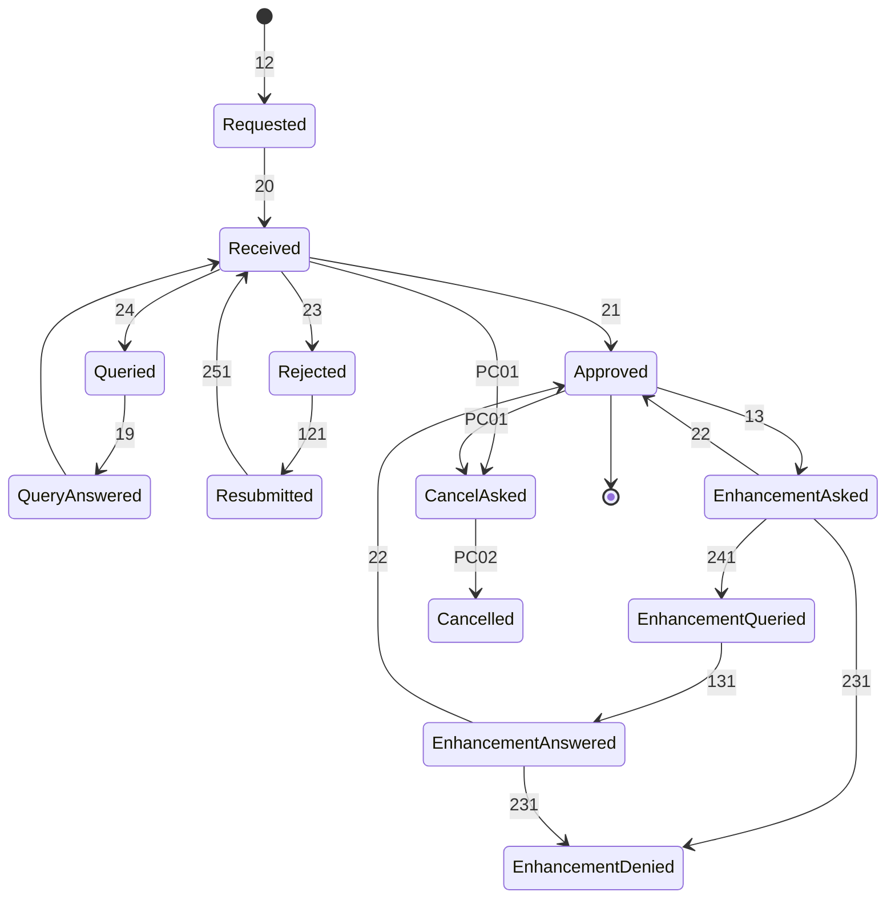
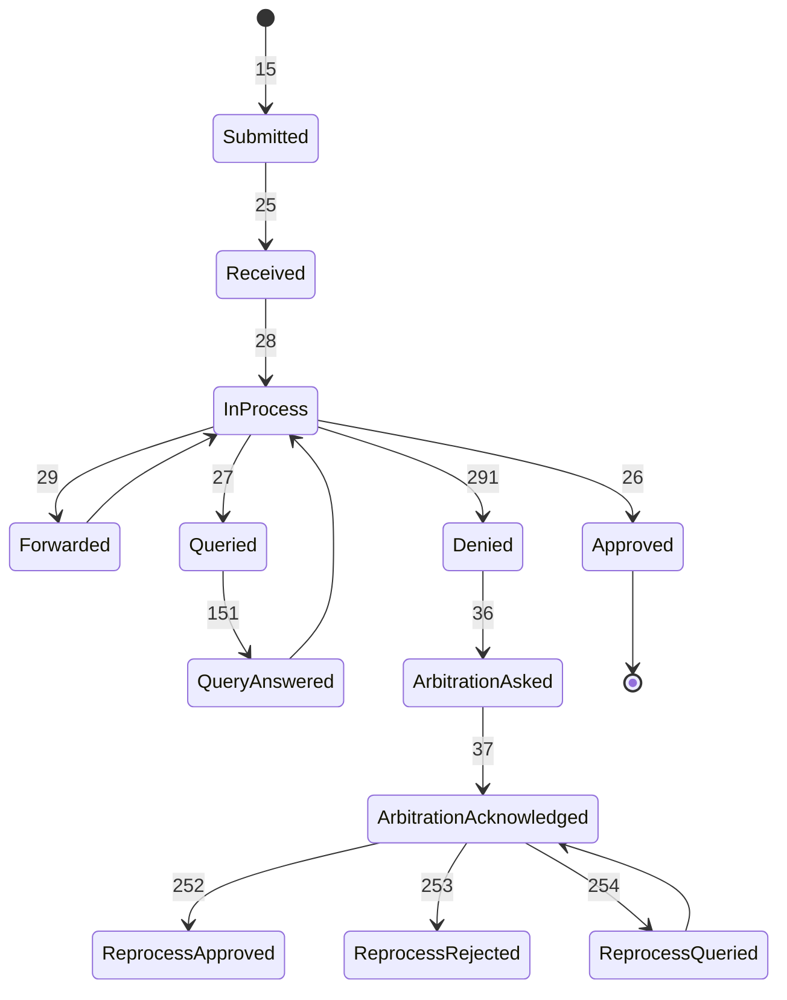
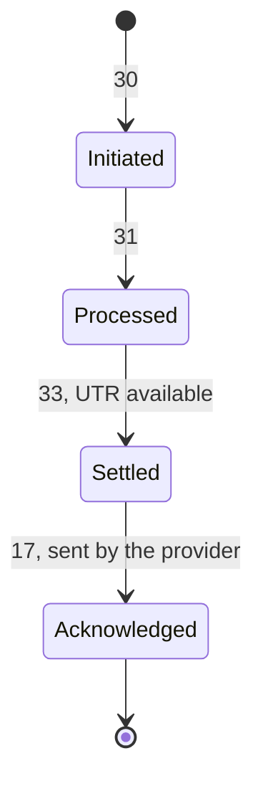

import WorkflowCodeExplorer from '@site/src/components/mdx/WorkflowCodeExplorer';

# Workflow Codes

The address a message is sent to does not say which step of a claim it is. A new preauthorisation, a resubmission, an enhancement and an answer to a query all go to the same place, in the same kind of bundle. The workflow code in the message header is what tells them apart. Each code also comes with a status that says whether the message starts a request, answers one, or refuses it. The official Workflow Status Sheet is the authority, and new codes appear there first.

## Every workflow code

Search by code, name or status, and switch between the codes a provider sends, the codes a payer sends, every row of the Workflow Status Sheet, and the lettered families.

<WorkflowCodeExplorer />

## Mainline Cashless State Machines

In the diagrams below, each arrow carries the workflow code of the message that moves the case.

### Preauthorisation Lifecycle

### Claim Lifecycle

### Payment & Settlement Lifecycle

