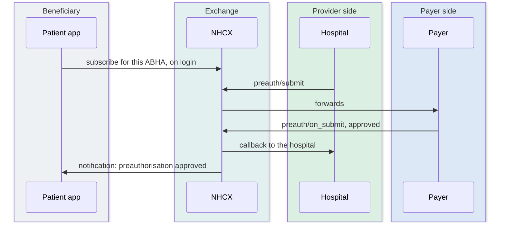

# NHCX use cases

A use case covers each stage of the claims lifecycle: onboarding providers and payers onto the network, verifying coverage, seeking preauthorisation, submitting claims, exchanging supporting information, and reconciling payments. Between them they deliver the five objectives set out in the introduction. Each use case is an API interaction between the Provider and the Payer, routed through the NHCX gateway, so every request is traceable, standardised and answered in a predictable way.

## In short

- Every exchange with its action endpoint, its callback, and the workflow code that separates transactions sharing one endpoint.
- The A-series is shared, the B-series is the provider's, the C-series the payer's, and E1 is for patient apps.
- Several use cases have no workflow code listed anywhere in the sources.
- The sandbox dummy payer answers six exchanges and takes two test hooks that drive its decisions.

## Key use cases overview

- **Onboarding Providers and Payers**
  Onboard providers and payers onto NHCX to validate and route requests to target applications.
- **Check Coverage Eligibility**
  Called by providers to check the eligibility of a beneficiary with payers via NHCX.
- **Preauth Request Submission**
  Called by providers to submit Preauthorisation Requests to payers via NHCX. The payer responds via the `on_submit` callback API.
- **Predetermination Request**
  Called by providers to ask what a payer would approve for a planned treatment. The payer responds with auto-adjudication details against the policy and past history.
- **Claim Request Submission**
  Called by providers to submit Claim Requests to payers via NHCX. The payer responds using the `on_submit` callback API.
- **Communication Request**
  Called by payers to communicate with providers about a case: to ask for more information, to flag a turnaround-time breach, or to pass on a grievance or a policy change.
- **Payment Notice**
  Called by payers to submit the payment status of a claim with bank reference numbers such as scroll status and UTR numbers.
- **Reprocess / Cancel Request**
  Called by providers to request payers to reprocess a claim when partially paid or rejected, or to cancel an approved preauth.
- **Notifications**
  Called by patient apps to receive updates on a beneficiary's claims as they happen.

## Shared use cases (payer and provider)

The following use cases are common to both Payer and Provider participants on the NHCX platform. None of them carries a workflow code, because they are registry and session calls rather than claim transactions.

### A1: get participant list

**API Called:** `/fetch/participants/list`

Retrieve the list of participants in the registry based on the role.

### A2: get policy

**API Called:** `/participant/get/policies`

Get the list of policies for the beneficiary based on mobile number or ABHA. The response names both the insurer and the processor for each policy; the processor is the recipient for every claim-side call.

### A3: get public key

**API Called:** `/fetch/certs`

Retrieve the public key of the receiver, used to encrypt the payload. Participant ID must be mandatorily provided.

### A4: get auth token

**API Called:** `/get/session`

Generate the authentication token for NHCX API calls. This is the ABDM gateway's sessions endpoint, reached with the Milestone 1 client ID and secret.

### A5: get status

**API Called:** `/v1/status`
**Callback API:** `/v1/on_status`

Retrieve the status of any request triggered to NHCX.

### A6: receive errors

**Callback API:** `/v1/error`

Hosted by every participant. The exchange calls it to report a request that could not be delivered after five attempts, with the rejection details. Without it a sender never learns that a request died.

## Provider use cases

The following use cases are specific to Provider participants, describing the APIs providers must call and the callbacks they must implement.

### B1: check coverage eligibility

**API Called:** `/v1/coverageeligibility/check`
**Callback API:** `/v1/coverageeligibility/on_check`
**Workflow ID:** none listed. The check sits alongside registration, code 10, and admission, code 11

Check the eligibility of a beneficiary with payers via NHCX. Requests whether patient coverage is in force, valid at a date, and the associated benefits and plan details. The request carries a purpose: discovery, validation, benefits or auth-requirements.

### B2: request insurance plan details

**API Called:** `/v1/insuranceplan/request`
**Callback API:** `/v1/insuranceplan/on_request`
**Workflow ID:** none listed

Request insurance plan details from the Payer via NHCX. The request is a Task with code `poll`, keyed on policy number and provider ID.

### B3: preauthorisation submission

**API Called:** `/v1/preauth/submit`
**Callback API:** `/v1/preauth/on_submit`
**Workflow ID:** 12 for a new request, 121 for a resubmission, 13 for an enhancement; 19 to answer a query on this endpoint under PMJAY, where other payers take the answer on the communication endpoint

Submit the Preauthorisation request from the Provider end. A query answer, an enhancement and a resubmission all reuse the same bundle with a new correlation ID and the original reference.

### B4: respond to communication request

**API Called:** `/v1/communication/on_request`
**Callback API:** `/v1/communication/request`
**Workflow ID:** as carried on the payer's request

Acknowledge or answer a communication from the Payer. The payer's reason code says what kind it is; see C6.

### B5: claim submission

**API Called:** `/v1/claim/submit`
**Callback API:** `/v1/claim/on_submit`
**Workflow ID:** 15 for the claim, 151 to answer a query, 14 for a provisional discharge submission where the payer supports one

Submit the Claim from the Provider end to NHCX. The claim amount may not exceed the preauthorisation's approved amount.

### B6: claim search

**API Called:** `/v1/search/submit`
**Callback API:** `/v1/search/on_submit`
**Workflow ID:** none listed

Search claim-related information by an authorised entity. The protocol also defines per-resource searches, `/preauth/search`, `/claim/search` and `/paymentnotice/search`, each with an `on_search` callback, for a provider looking up its own requests.

### B7: acknowledge payment notice

**API Called:** `/v1/paymentnotice/on_request`
**Callback API:** `/v1/paymentnotice/request`
**Workflow ID:** 17

Acknowledge the payment notification sent by the Payer. The portal's Payment document has the acknowledgement on this endpoint; the PMJAY handbook has it as a Task on `/v1/task/submit` with output `paymentack`. Both are current. Confirm which the payer expects.

### B8: request for reprocess / cancel

**API Called:** `/v1/task/submit`
**Callback API:** `/v1/task/on_submit`
**Workflow ID:** PC01 to cancel a preauthorisation, 36 to reprocess a rejected claim or to claim a shortfall on a partly paid one

One endpoint, several jobs, told apart by the Task's code and reason. Task codes: `reprocess`, `cancel`, `nullify`, `suspend`, `approve`, `search`, `poll`. For a reprocess the reason is `claimrejected`; for a shortfall it is `partialpayment`. The Task names the case by claim number or intimation number. A supporting document is mandatory on a reprocess.

### B9: predetermination submission

**API Called:** `/v1/predetermination/submit`
**Callback API:** `/v1/predetermination/on_submit`
**Workflow ID:** none listed

Ask the payer what it would approve for a proposed treatment before committing to a preauthorisation. Same bundle shape as a preauthorisation.

## Payer use cases

The following use cases are specific to Payer participants, describing the APIs payers must call and the callbacks they must implement.

### C1: link ABHA with policy

**API Called:** `/participant/link/abha/policy`
**Workflow ID:** none listed

Link the ABHA number, mobile and member ID to the policy's products at the time of policy creation, naming the payer and the processor.

### C2: de-link ABHA from policy

**API Called:** `/participant/delink/abha/policy`
**Workflow ID:** none listed

De-link the policy from the ABHA profile. Only the party named as payer or processor on the link may do this.

### C3: respond to coverage eligibility request

**API Called:** `/v1/coverageeligibility/on_check`
**Callback API:** `/v1/coverageeligibility/check`
**Workflow ID:** none listed

Respond with the eligibility and plan details of the beneficiary for whom details are requested. The payer may instead answer with a forward instruction, asking the exchange to pass the same request to another payer.

### C4: respond to insurance plan request

**API Called:** `/v1/insuranceplan/on_request`
**Callback API:** `/v1/insuranceplan/request`
**Workflow ID:** none listed

Respond with the insurance plan details requested via NHCX.

### C5: respond to preauthorisation submitted

**API Called:** `/v1/preauth/on_submit`
**Callback API:** `/v1/preauth/submit`
**Workflow ID:** 20 received, 21 approved, 23 rejected, 24 queried, 22 enhancement approved, 231 enhancement denied, 241 enhancement queried

Respond with adjudicated Preauthorisation details.

### C6: raise communication request

**API Called:** `/v1/communication/request`
**Callback API:** `/v1/communication/on_request`
**Workflow ID:** 24 preauth queried, 241 enhancement queried, 27 claim queried, 263 discharge queried, and the intimation codes for grievances, wallet updates and arbitration

Send the Provider a message about a case. The Task's reason code says which. `additionalinfo` to ask for documents, `tatquery` when a case has breached its turnaround time, `grievance` to pass on a complaint. Then `walletupdate` when the beneficiary's balance has changed, `policychange` when a package or rate has changed, and `claimArbitration` to acknowledge a reprocess request.

### C7: respond to claim submitted

**API Called:** `/v1/claim/on_submit`
**Callback API:** `/v1/claim/submit`
**Workflow ID:** 25 received, 26 approved, 27 queried, 28 in process, 29 forwarded, 291 denied

Respond with adjudicated Claim details.

### C8: respond to search request

**API Called:** `/v1/search/on_submit`
**Callback API:** `/v1/search/submit`
**Workflow ID:** none listed

Respond to search requests, providing the ClaimResponse objects matching the input criteria.

### C9: send payment notice

**API Called:** `/v1/paymentnotice/request`
**Callback API:** `/v1/paymentnotice/on_request`
**Workflow ID:** 30 initiated, 31 processed, 33 settled

Send payment notification and reconciliation objects to Providers via the NHCX gateway. The reconciliation itemises the money by type: `approvedamount`, `claimedamount`, `tds`, `servicetax`, `advance`, `recovered`, `penality`. The bank's UTR number rides on the reconciliation.

### C10: respond to Task request

**API Called:** `/v1/task/on_submit`
**Callback API:** `/v1/task/submit`
**Workflow ID:** 251 acknowledged, 252 approved, 253 rejected, 254 queried, PC02 cancellation done, 37 arbitration acknowledged

Return the response for task requests such as reprocess or cancel.

### C11: respond to predetermination

**API Called:** `/v1/predetermination/on_submit`
**Callback API:** `/v1/predetermination/submit`
**Workflow ID:** none listed

Respond with what the payer would approve for the proposed treatment.

## Patient app use cases

Personal health record apps can register as participants and receive notifications on a beneficiary's behalf. This is how a patient learns on their phone that a preauthorisation was approved.

### E1: subscribe to notifications

**API Called:** `/v1/notification/subscribe`
**Callback API:** `/v1/notification/on_subscribe`
**Workflow ID:** N01 to a payer, N02 to a provider, N03 to a beneficiary, N04 acknowledgement

The app subscribes when the beneficiary logs in with their ABHA. The most recent app to subscribe for an ABHA is the one that receives notifications; any earlier subscription is replaced. Topics are `workflow_events` for claim progress, `network_events` for exchange maintenance, and `participant_events` for changes to payers and providers. Each notification carries a human-readable message the app can show as-is, plus the envelope headers for apps that want more.

## Testing against the dummy payer

The sandbox hosts a payer that answers back, participant ID `1000003538@hcx`. It handles insurance plan, coverage eligibility, preauthorisation, claim, payment notice and communication. For the plan call use provider ID `32722` and policy `100217`.

Two test hooks drive its decisions. `dummyhcxpayer/process/request` makes it approve, reject or query a preauthorisation or claim you have submitted, by correlation ID. `dummyhcxpayer/paymentNotice/init` makes it send you a payment notice. A query from the dummy payer arrives as a communication request, which you answer on `/v1/communication/on_request` before the final decision comes back on `on_submit`.

## Workflow codes

Endpoints alone do not identify a transaction. A new preauthorisation, a resubmission, an enhancement and a query response all travel on `/v1/preauth/submit` with the same bundle. The workflow code in the header is what tells them apart, and each code expects a particular status word. The full list, grouped by stage with the lifecycle diagrams, is the next chapter.
