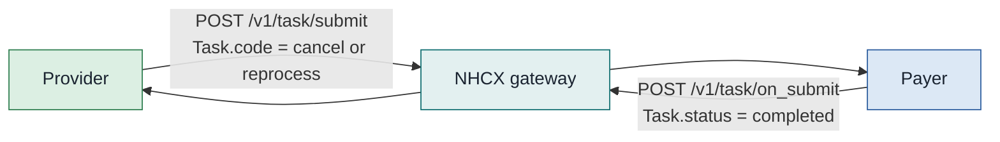

# Cancel, reprocess and shortfall

Three post-decision exchanges share one endpoint pair, `/v1/task/submit` outbound and `/v1/task/on_submit` inbound. All three are `Task` bundles. `Task.code` is the only thing that separates them, so the code has to be right or the payer routes the message to the wrong queue. Cancellation has samples on both sides. Reprocess is specified element by element and has no sample. Shortfall is barely specified at all.

## In short

- Three post-decision exchanges share `/v1/task/submit` and `/v1/task/on_submit`.
- `Task.code` is the only thing separating them, so it has to be right or the payer routes to the wrong queue.
- Cancellation has samples on both sides. Reprocess is specified but unsampled. Shortfall is barely specified.
- The word "shortfall" appears once in the whole published corpus.

## Cancel: the request bundle

The provider withdraws a preauthorisation it has already submitted. The bundle is small. There is no `Claim` in it and no `Patient`.

| # | Resource | What it is for |
| :---- | :---- | :---- |
| 1 | `Task` | The cancellation instruction. Carries the reason and the two case identifiers |
| 2 | `Organization` | The provider, `NPI` `IN1910000151`, named "Usha Kiron" |
| 3 | `Organization` | The payer, `NIIP` `1518`, named "SHA HP" |

Entry 1 uses a `urn:uuid:` `fullUrl`. Entries 2 and 3 use absolute URLs, and `Task.requester` and `Task.owner` point at those URLs. Both styles appear in one bundle.

### The fields that matter

| Path | Value in the sample |
| :---- | :---- |
| `Task.status` | `requested` |
| `Task.intent` | `order` |
| `Task.code.coding.system` | `http://terminology.hl7.org/CodeSystem/financialtaskcode` |
| `Task.code.coding.code` | `cancel`, with no `display` |
| `Task.reasonCode.coding.system` | `https://nrces.in/ndhm/fhir/r4/CodeSystem/ndhm-reason-code` |
| `Task.reasonCode.coding.code` | `treatmentplanchanged` |
| `Task.input[0].type.coding.code` | `claimNumber`, system `.../ndhm-task-input-type-code` |
| `Task.input[0].valueString` | `VB26AA2600001` |
| `Task.input[1].type.coding.code` | `initimationNumber` |
| `Task.input[1].valueString` | `VB26AA2600001` |

**Send `initimationNumber`, not `intimationNumber`.** The misspelling is in the live payload and in the NHCX value set, which lists the input type as `InitimationNumber`. The PMJAY handbook writes `intimationNumber` correctly in its cancellation table, then flags in its reprocess table that the real payload uses `initimationNumber`. Match the payer, not the prose. Both inputs carry the same value in the sample, so the sandbox does not distinguish the case number from the intimation number.

### Cancellation reasons

All from `https://nrces.in/ndhm/fhir/r4/CodeSystem/ndhm-reason-code`.

| Code | Meaning |
| :---- | :---- |
| `treatmentplanchanged` | The clinician changed the approach during hospitalisation |
| `patientrequest` | The patient left or moved to another hospital |
| `financialconstraints` | The patient cannot meet the uncovered cost |
| `alternativetreatment` | A different procedure was chosen |
| `duplicateclaim` | The preauthorisation was submitted twice |
| `administrativeerror` | The original submission carried wrong data |
| `other` | Anything else; explain in `Task.description` |

## Cancel: the response bundle

The payer answers on `/v1/task/on_submit`. Every resource carries a `SUBSETTED` meta tag, so treat the bundle as a summary and not as a full record.

| # | Resource | What it is for |
| :---- | :---- | :---- |
| 1 | `Task` | The outcome wrapper. `output[0]` is a reference to the `ClaimResponse` |
| 2 | `ClaimResponse` | The adjudication result for the cancelled case |
| 3 | `Patient` | Identifier only, PMJAY ID `MD5SLS4X5` |
| 4 | `Organization` | The payer, `1518` |
| 5 | `Organization` | The provider, bare numeric `1652`, named "CITY SUPERSPECIALITY HOSPITAL" |
| 6 | `Coverage` | Policy `PMJAY/HP/S/G`, class `PMJAY/HP/S/2024/R2` |

| Path | Value in the sample |
| :---- | :---- |
| `Task.status` | `completed` |
| `Task.code.coding.system` | `http://hl7.org/fhir/CodeSystem/task-code` |
| `Task.code.coding.code` | `approve`, display "Activate/approve the focal resource" |
| `Task.output[0].type.coding` | `include`, system `.../financialtaskinputtype` |
| `Task.output[0].valueReference` | The `ClaimResponse` in entry 2 |
| `ClaimResponse.outcome` | `complete` |
| `ClaimResponse.adjudication[0].category` | `status`, with `reason` `cancelled` |
| `ClaimResponse.total[0]` | `benefit`, `2700.00` |

Read the cancellation outcome from `ClaimResponse.adjudication[0].reason.coding.code`, which is `cancelled`. Do not read it from `outcome`, which is `complete` because the request was fully processed, and do not read it from `Task.code`.

## What the samples show

`preauth/cancel/preauth_cancel_req.txt`, 3,242 bytes, three entries. `preauth/cancel/preauth_cancel_response.txt`, 6,603 bytes, six entries. Both cover preauthorisation `VB26AA2600001` on 26 February 2026. There is no claim cancellation sample and none where the payer refuses a cancellation.

## Reprocess: specified, not sampled

The archive carries an empty `reprocess/` directory. A sample was scoped and never produced. Everything below comes from the PMJAY handbook section 10 and the NHCX Reprocess sheet, and none of it has been observed on the wire.

Reprocess is the appeal. The provider uses it when a claim was rejected or approved for less than the claimed amount, and has new evidence or a disputed reading of policy.

| Path | Specified value |
| :---- | :---- |
| `Task.status`, `Task.intent` | `requested`, `order` |
| `Task.code` | `reprocess`, system `.../financialtaskcode`, display "Reprocess" |
| `Task.reasonCode.coding.code` | `rejectiondisputed` in the handbook's table. The value set instead defines `claimrejected`, `partialpayment`, `erroneousclaim`, `referred`, `erroneousregistration` and `wrongdiagnosis`. `rejectiondisputed` is not in the value set |
| `Task.basedOn[0].reference` | The original `Claim`, for example `Claim/VB26AA2600001` |
| `Task.for.reference` | The `Patient` |
| `Task.input[0]` | `claimNumber` with the case number |
| `Task.input[1]` | `intimationNumber`, which the handbook itself annotates as `initimationNumber` in the real payload |
| `Task.input[2]` | Optional `supportingDocument`, free text or a document reference |

Workflow codes: **18** on submission, **251** when the payer acknowledges receipt, **252** approved, **253** rejected, **254** queried. The handbook's provider-side table gives **36**, CLAIM_ARBITRATION_REQUEST_SUBMITTED, for the same act, and the workflow sheet lists 36 as "Claim Arbitration Intimation". Two codes for one submission. Confirm which the payer accepts before you build.

The answer arrives as a `Task` with `status = completed` whose `output[].valueReference` resolves to a `ClaimResponse` inside the same bundle. Parse that `ClaimResponse` with the parser you already use for a claim response. The cancel response above proves the shape works, since it uses the same `output` and `include` mechanism.

## Shortfall

The word "shortfall" appears exactly once in the whole documentation mirror. It is in the FAQs, describing the cap on an Erroneous claim. The amount claimed cannot exceed the difference between the claimed and the approved figure, so a case claimed at 10,000 and paid at 6,000 supports a further request of at most 4,000. There is no shortfall `Task.code`, no shortfall reason code, and no shortfall sample.

What is real is the mechanism the provider chapters describe. A shortfall is raised as a reprocess with `reasonCode` `partialpayment`, only after the payment cycle completes on workflow 33, and the supporting evidence rides as a `Task.input` attachment. Treat "shortfall" as an operational word for a reprocess, not as a distinct exchange.

## Traps

- **Three `Task` code systems across four `Task` exchanges.** The cancel request uses `financialtaskcode|cancel`, the cancel response `task-code|approve` from a third system and saying "approve" about a cancellation, the payment notice `ndhm-task-codes|deliver`. Switch on system and code together, never on the code alone.
- **`Claim.type` flips inpatient to outpatient.** The preauthorisation request for `VB26AA2600001` carries `737481003` "Inpatient care management (procedure)". The cancel response for the same case number carries `737492002` "Outpatient care management (procedure)". Nothing in the case changed. Do not use the payer's `Claim.type` to update your record.
- **The payer identifier system is misspelled.** The cancel response bundle identifier uses `https://payer.pmajy.nha.gov.in`, with `pmajy` for `pmjay`. The request uses the correct spelling. Match on the identifier value, never on the system string.
- **Provider identity changes shape.** The request names the provider `IN1910000151`; the response names it `1652` with a different organisation name. Both are the same hospital.
- **The cancelled case still reports money.** `total[benefit]` remains `2700.00` on a cancelled preauthorisation. Zero the figure yourself once the adjudication reason reads `cancelled`.
- **Workflow codes for cancellation disagree.** The workflow sheet gives `PC01` for the request and `PC02` for the answer. The handbook gives `122` in its lifecycle prose, section 8.6 and Appendix B, while the same sheet uses `R122` for a reimbursement claim reprocess. Make the code configurable per payer.
