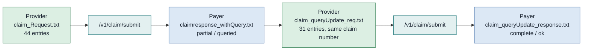

# Claim query and answer

A query is the payer asking for something before it will adjudicate. Under PMJAY it is not a distinct message. The question arrives as an ordinary `ClaimResponse` with `outcome` `partial` and `disposition` `queried`, and the answer goes back as a wholly re-submitted claim bundle on the same claim number. Two exchanges in one chapter, because neither makes sense without the other.



## In short

- Under PMJAY a query is not a distinct message: it is a `ClaimResponse` with `outcome` `partial`.
- The answer is a wholly re-submitted claim bundle on the same claim number.
- Two exchanges in one page, because neither makes sense without the other.
- Zero benefit on a query means undetermined, not refused.

## The query has no resource of its own

This is the thing to understand before anything else. The NHCX protocol layer and the PMJAY handbook both specify a `Task` and `Communication` pair for exactly this purpose: the payer raises a `Task`, the provider answers with a `Communication` carrying the requested payload. Nothing in the sample set uses it. There is no `Communication` bundle anywhere in the archive.

What PMJAY does instead is carry the question as free text inside `ClaimResponse.item.adjudication` where `category.coding.code` is `reason`, in `reason.coding.display`. There is no `code`, only a `display`. The answer is a fresh claim submission with no marker saying what it answers. Build for the ad-hoc form, because that is the only form with samples, and keep the `Task` and `Communication` path behind a flag until a payer asks for it.

## The payer's query

`claimresponse_withQuery.txt`, 6,799 bytes, five entries, structurally identical to the approval in chapter 11. What differs:

| Path | Query | Final approval |
| :---- | :---- | :---- |
| `outcome` | `partial` | `complete` |
| `disposition` | `queried` | `ok` |
| claim-level `adjudication[0].reason.coding` | `queried` | `approved` |
| `item[0].adjudication[status].reason.coding` | `Queried` | `Approved` |
| `item[0].adjudication[eligible].amount` | 2700.00 | 2430.00 |
| `total[benefit]` | 0 | 2430.00 |
| `total[submitted]` | 2700.00 | 2700.00 |
| `total[PMJAY-T eligible]` | 2700.00 | 2430.00 |

`total[benefit]` is zero on a query while the submitted and eligible totals stay at 2700. That zero is not a rejection and not a reduction to nil. It means no benefit has been determined yet. A reader that treats `benefit` of zero as a refusal will close a claim that is merely waiting for a document.

Note also that `payeeType` is already `provider` on the query, and the claim-level `adjudication` reason code is the only place the word `queried` appears in a coded field. Everything else is prose.

## Where the question is

In `claimresponse_withQuery.txt` the question is:

```
"reason": { "coding": [ { "display": "Other queried 1st attempt" } ] }
```

That is the whole of it. No code, no system, no structure, no named document.

The final response for the same claim replays the history in a different shape:

```
 Auto approved by system.|null|USER1000099~02/27/2026, 03:02 ~Other~queried 1st attempt~CPD-Trust|System~27/02/2026, 03:20~NA~null~CITY SUPERSPECIALITY HOSPITAL|Approved
```

Segments are pipe-delimited, fields inside a segment tilde-delimited, and the field order is user, timestamp, query type, comment, trust. The literal string `null` appears as a segment and again as a field. The same run's preauthorisation query response uses the full pipe and tilde form from the start:

```
other Request acknowledged and accepted for further processing.|USER1000099~02/26/2026, 08:47 ~other~testing query with souvik~PPD-Trust|null|USER1000099~02/26/2026, 09:13 ~other~Testing query 2 with souvik~PPD-Trust
```

So the same payer, in the same sandbox run, sends a bare sentence on one query and a delimited audit trail on another. The format is not stable and there is no schema for it. Parse defensively: split on `|`, split each segment on `~`, and fall back to displaying the raw string whenever the field count is not five. Show it to a human. Do not branch on it.

## The provider's answer

`claim_queryUpdate_req.txt`, 376,270 bytes, 31 entries. It is a complete claim bundle, not a delta, submitted on the same claim number `EO26AA2700001`.

| | Original request | Answer |
| :---- | :---- | :---- |
| Entries | 44 | 31 |
| `Bundle.timestamp` | `2026-02-27T08:40:11+05:30` | `2026-02-27T09:34:11+05:30` |
| `Claim.created` | `2026-02-27T08:40:02+05:30` | `2026-02-27T09:34:10+05:30` |
| `Claim.identifier.value` | `EO26AA2700001` | `EO26AA2700001` |
| `supportingInfo` | 9 entries, sequences `1, 2, 23, 24, 25, 26, 27, 8, 9` | Identical |
| Embedded documents | Invoice record and wellness record | Two diagnostic report records |
| `item`, `total`, `diagnosis`, `procedure` | Unchanged | Unchanged |

Everything the payer might have queried about the money is byte-identical. What changed is the clinical evidence: the invoice and wellness compositions are replaced by two `DiagnosticReportRecord` compositions, each with a `DiagnosticReport`, four `Observation`s and a `DocumentReference` holding a surgical pathology report.

Nothing in the answer says it is an answer. There is no supporting-info entry under category `NMI` with code `CQD` carrying query remarks, which is what the handbook's field tables describe for this case. There is no reference to the query, no attempt number, no changed status. The only thing joining the two messages is the claim number and the correlation ID at the protocol layer. Keep your own record of which submission answers which query, because the bundle will not tell you.

## The attachment swap

The two inline attachments on supporting-info sequences 1 and 2 are the same two files in both submissions, moved between document codes.

| Sequence | Document code | Original request | Answer |
| :---- | :---- | :---- | :---- |
| 1 | `MAND0062` Detailed ICPs | `application/pdf`, 3,079 bytes | `image/jpeg`, 147,232 bytes |
| 2 | `MAND0063` Treatment details | `image/jpeg`, 147,232 bytes | `application/pdf`, 3,079 bytes |

The two blobs are byte-for-byte identical to their counterparts in the first submission. Only the pairing flipped. So the second submission tells the payer that the detailed ICPs are now the file that was previously the treatment details, and vice versa. The `contentType` values follow the bytes, so nothing is technically mislabelled; the document code to file mapping is simply reversed. Both blobs are also base64-encoded twice in both submissions, as described in chapter 10.

This is a defect in the sample, not a pattern to copy. Treat it as a warning about how easy it is to reorder attachments when rebuilding a bundle from scratch to answer a query. Key your attachments to their document code at the point you assemble them, and assert the pairing before you submit.

## Traps

- A query is `partial` plus `queried`, not `partial` alone. An interim approval is also `partial`.
- Zero benefit on a query is undetermined, not refused.
- The answer reuses the claim number. Do not allocate a new one.
- The answer is a full bundle. Rebuild it from your stored submission, not from the payer's response.
- There is no rejected claim sample and no `Communication` sample anywhere in the archive, so the escalation path past a repeated query is specified but unverified.
