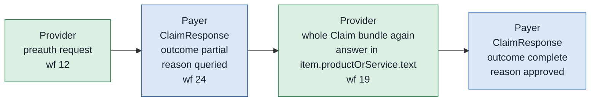

# Preauthorisation query and answer

When a PMJAY payer wants more before it decides, it raises a query. The provider answers, and the payer then approves or rejects. This is the most common non-happy path in preauthorisation, and it is the exchange whose FHIR representation departs furthest from what the specifications describe.

There is no query resource. The payer's question travels as free text inside a `ClaimResponse` adjudication, and the provider's answer travels as an entire resubmitted `Claim` bundle. Both directions reuse the preauthorisation endpoints: the query arrives on `/v1/preauth/on_submit` under workflow 24, and the answer goes back to `/v1/preauth/submit` under workflow 19, quoting the original reference with a new correlation ID.



## In short

- There is no query resource. The question is free text inside a `ClaimResponse` adjudication.
- The answer is an entire resubmitted `Claim` bundle, on the preauthorisation endpoint under workflow 19.
- Two sources specify a `Task` and `CommunicationRequest` pair instead, which PMJAY does not use.
- The query text is a pipe-delimited audit trail in the preauthorisation, and a bare sentence on the claim side.

## The query

The queried response is an ordinary five-entry preauthorisation response bundle. `ClaimResponse.outcome` is `partial`, the claim-level `adjudication[0].reason.coding.code` is `queried`, `item[0]` status is `Queried`, `eligpercent` and `eligquant` are `0`, and both totals are `0`. `disposition` is the string `main query 2 ` with a trailing space. None of that tells you what the payer wants.

The question itself is in `item[0].adjudication[reason].reason.coding[0].display`. That coding has no `system` and no `code`, only a `display`. Here is the real value, verbatim:

```
other Request acknowledged and accepted for further processing.|USER1000099~02/26/2026, 08:47 ~other~testing query with souvik~PPD-Trust|null|USER1000099~02/26/2026, 09:13 ~other~Testing query 2 with souvik~PPD-Trust
```

It is a two-level delimited audit log. Split on `|` first.

| Segment | Value | Meaning |
| :---- | :---- | :---- |
| 0 | `other Request acknowledged and accepted for further processing.` | Preamble. A reason category, `other`, run together with a canned acknowledgement sentence, with no separator between them |
| 1 | `USER1000099~02/26/2026, 08:47 ~other~testing query with souvik~PPD-Trust` | First query |
| 2 | `null` | The answer slot for the first query, unfilled, as the literal four-character string `null` |
| 3 | `USER1000099~02/26/2026, 09:13 ~other~Testing query 2 with souvik~PPD-Trust` | Second query |

After the preamble the segments alternate: query, answer, query, answer, and finally the decision. Now split a query segment on `~`.

| Field | Value | Meaning |
| :---- | :---- | :---- |
| 0 | `USER1000099` | The payer desk operator's user ID |
| 1 | `02/26/2026, 08:47 ` | Timestamp, `MM/DD/YYYY`, a comma, `HH:MM`, and a trailing space |
| 2 | `other` | Query type, from the payer's own list |
| 3 | `testing query with souvik` | **The question. This is the only field a human needs.** |
| 4 | `PPD-Trust` | The adjudicating desk |

Parsing rules. Split on `|` first, then on `~`, and never assume a fixed segment count, because the log grows with each exchange. Segment 0 is never a query. Treat the literal `null` as an empty answer. Trim every field, because the timestamps carry trailing spaces. Never put `~` or `|` in anything you send back, or you will corrupt the payer's log.

The timestamps are unreliable. `ClaimResponse.created` on this bundle is `2026-02-26T21:15:00+05:30`, yet the two entries claim 08:47 and 09:13 on the same day, in American date order, with no timezone and no meridiem marker. Display them as the payer's own strings. Do not parse them into your timeline.

The format is not stable across the corpus either. The claim-side query for the same case carries a bare sentence in the same field, with no delimiters at all. The delimited form appears in the preauthorisation query, and again in the replayed audit trails. Same payer, same sandbox run, two formats. A parser must tolerate a segment count of one.

## Watching the log grow

The string is cumulative and is replayed on every later response for the case. The enhancement approval carries the same field with two more segments appended, `…~PPD-Trust|Query response for Testing|Approved`. Segment 4 is the provider's answer text and segment 5 is the final decision, which confirms the alternating structure. It also gives you a free reconciliation: the answer you sent should reappear in the payer's log on the next response, and that is the only acknowledgement that your reply was read.

## The answer

The provider's answer is a whole preauthorisation bundle, resubmitted. It is not a delta, not a `Communication`, and not a `Task`. The sample carries 96 entries.

| Entry | Resource | What it is for |
| :---- | :---- | :---- |
| 0 to 5 | `Claim`, `Patient`, two `Organization`, `Coverage`, `Practitioner` | The request core, identical in shape to the first submission |
| 6 to 30 | 25 resources headed by a `Composition` | ABDM `DischargeSummaryRecord`, "Discharge Summary for Dengue" |
| 31 to 55 | 25 resources headed by a `Composition` | ABDM `WellnessRecord`, "Wellness Report" |
| 56 to 67 | 12 resources headed by a `Composition`, including three `ChargeItem`, a `Medication` and an `Invoice` | ABDM `InvoiceRecord`, "Invoice" |
| 68 to 92 | 25 resources headed by a `Composition` | A second ABDM `WellnessRecord` |
| 93 | `Questionnaire` | The policy questionnaire |
| 94 | `QuestionnaireResponse` | Its answers |
| 95 | `Procedure` | The planned procedure |

The `Claim` is unchanged where it matters. Same case number `VB26AA2600001`, same `use` of `preauthorization`, one item, `total` still 3300, and `Claim.related` absent. **The reply text is in `Claim.item[0].productOrService.text`**, where it is `Sample Message`. That field is a `CodeableConcept.text` sitting beside the package coding. It is the free-text label of a service, being used as a message channel.

`productOrService.text` is populated on every preauthorisation item in the corpus, including first submissions, with values such as `Testing ABC` and `Query response for Testing`. So the field's presence does not mark a bundle as an answer. Only the workflow ID does.

## Supporting information

Eight entries. This is the only preauthorisation bundle in the corpus that carries the date categories, and it is the only one that gets the category system right on any entry.

| Seq | Category | Code | Meaning | Value |
| :---- | :---- | :---- | :---- | :---- |
| 1 | `INV` | `MAND0408` | Clinical notes and admission notes | `valueReference` to entry 6 |
| 2 | `INV` | `MAND0455` | CXR PA view or CECT | `valueReference` to entry 31 |
| 3 | `INV` | `MAND0409` | Any investigations done | `valueReference` to entry 56 |
| 4 | `INV` | `MAND0570` | Planned line of management | `valueReference` to entry 68 |
| 5 | `OTH` | `EDT` | Encounter date and time | `valueString` `2026-02-22T00:00:00+00:00` |
| 6 | `ADMD` | `ADDD` | Admission date | `valueString` `2026-02-22T00:00:00+00:00` |
| 7 | `OTH` | `EDT` | Encounter date and time | `valueString` `2026-02-22T00:00:00+00:00` |
| 8 | `INF` | `ODN` | Other document | `valueReference` to the `Questionnaire` |

Entries 1 to 4 take their category from `…/CodeSystem/ndhm-supportinginfo-code`, the same defect as every other request. Entries 5 to 7 take it from `…/CodeSystem/ndhm-supportinginfo-category`, correctly. Entry 8 takes its code from `…/ValueSet/ndhm-supportinginfo-code`, a ValueSet URL where a CodeSystem URL belongs.

## Traps

**Sequence 6 has `category` and `code` swapped, and both are drawn from the category system.** `code` holds `ADDD`, "Admission Date - Discharge Date"; `category` holds `ADMD`, "Admission Date". Both cite `…/CodeSystem/ndhm-supportinginfo-category`, while the handbook puts `ADDD` in `code` under category `ONS`. Three shapes for one date. Read defensively: check both `category` and `code` before concluding the admission date is missing.

**Sequences 5 and 7 are byte-identical duplicates.** Same category, same code, same value. Deduplicate on read.

**The date strings carry the wrong offset.** `Claim.created` is `2026-02-26T13:13:55+05:30`, but the supporting-info dates are `2026-02-22T00:00:00+00:00`. The same wall-clock convention with a UTC offset. Chapter 01's third rule and the handbook both say `+05:30` is required and UTC fails validation. Send `+05:30`.

**Sequence 8 references the blank `Questionnaire`, not the `QuestionnaireResponse`.** The reference is `https://payer.gov.in/policy/questionnaire/119/0`, the `fullUrl` of entry 93. Entry 94, the `QuestionnaireResponse`, is in the bundle but nothing points at it, so the payer receives the form rather than the answers. Both are empty shells anyway: the `Questionnaire` has `item` set to `null`, the title `Questioneris`, and an `id` that is the JSON number `0` rather than a string, which is invalid FHIR. Send the response, and fill it in.

**There are no query remarks under `NMI` and `CQD`.** The provider flow chapter states that a query answer adds the overall case remarks as a `valueString` under category `NMI` with code `CQD`. An answer without it is rejected. This answer, which the payer accepted and then approved, carries no such entry. The remark went into `productOrService.text` instead. Send both until a payer tells you otherwise.

**Two capture artefacts, not rules.** The answer is stamped `2026-02-26T13:14:14+05:30` while the query it replies to is stamped `21:15`, so the archive is a set of shape captures rather than an ordered replay. And the referenced documents do not match their codes: `MAND0408` points at a discharge summary, `MAND0455` at a wellness report, `MAND0409` at an invoice.

## The exchange that was specified instead

Two sources specify a completely different mechanism for exactly this purpose.

The NHCX protocol layer and the PMJAY handbook section 12 both define a `Task` and `CommunicationRequest` pair. The payer builds a collection bundle whose `Task` carries `intent` `proposal` and `code` `poll` from `http://terminology.hl7.org/CodeSystem/financialtaskcode`. It also carries a `reasonCode` from `…/CodeSystem/ndhm-reason-code`: `tatquery`, `grievance`, `walletupdate`, `policychange`, `additionalinfo` or `claimArbitration`. Its `input[0].valueReference` points at a `Communication` resource holding the message. The provider acknowledges on `/v1/communication/on_request`. The question is a first-class resource with a status, a category, a topic and a priority.

PMJAY does not use it, and the integration guide says so twice in the same words:

> The PMJAY payer does not use the Communication API for queries. Instead, a query is raised by the payer with the relevant workflow ID for preauth/claim which has to be responded to by the provider with the relevant workflow ID.

The handbook's own section 12 table concedes the point. It describes `additionalinfo` as being for information "not covered by the original ClaimResponse query mechanism".

So the specified exchange has no samples and the sampled exchange has no specification beyond one element table and a note. Build the string parser for PMJAY, build the `Task` and `Communication` handler for the general network where chapter 15 covers it, and expect neither to help with the other.
