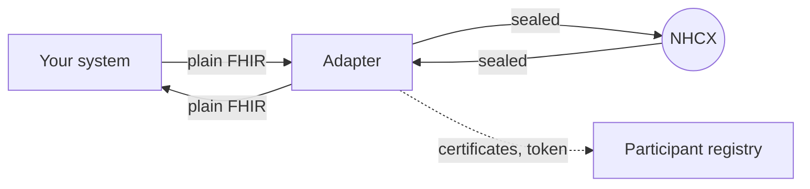

# NHCX adapter (Optional)

Everything in the nine chapters before this one is work you do once and then maintain for ever:

- Minting a token and refreshing it.
- Fetching the recipient's certificate and caching it.
- Filling in nine envelope headers correctly, and sealing the bundle.
- Hosting a dozen or more callback paths, and answering each one with a receipt in the right shape inside thirty seconds.
- Noticing when the same message arrives twice.

The NHCX Adapter does all of it for you. It is a single binary that sits between your hospital or payer system and the exchange. Your system speaks plain JSON and plain FHIR to it over your own network; it speaks the protocol to NHCX. Nothing else about your system has to change.

Read this chapter after the rest of Getting Started rather than instead of it. The adapter hides the protocol, it does not abolish it, and when something goes wrong the error you get back is a protocol error.

## What it does

Three jobs, and they map onto the three hard parts of the protocol.

**Send.** You post a FHIR bundle and the recipient's code. It completes the envelope headers, fetches the recipient's certificate, encrypts, posts to NHCX, and hands you back the exchange's answer on the same call.

**Deliver.** NHCX posts a sealed message to it. It decrypts with your private key, posts the plain bundle to a URL of yours, and only then answers NHCX with the receipt the protocol requires.

**Certificates.** It fetches and caches the certificates of everyone you talk to, and can generate and register your own.



## What it does not do

Worth knowing before you plan around it.

- **It does not queue or retry.** Both directions are synchronous. If your callback is down, NHCX is told, and NHCX redelivers up to five times before dropping the correlation ID. The only retry inside the adapter is a single token refresh after a `401`.
- **It does not build or validate bundles.** It checks that what you sent is valid JSON and nothing more. Everything in the FHIR Reference section is still yours to get right.
- **It has no business logic.** No adjudication, no policy modelling, no screens for claims work. The participant and policy calls are passed straight through.
- **It does not verify who sent an inbound message** beyond the fact that it decrypts with your key.

## Onboarding

### Before you start

You need what Milestone 1 gave you: a participant code such as `1000003463@hcx`, a client ID and a client secret. If you want to receive callbacks, you also need a public HTTPS address that reaches the machine you will run this on.

### Build it

```bash
make build     # produces ./nhcx-adapter
make check     # what the project's own CI runs: vet plus tests with the race detector
```

It is a Go program with no C dependencies, so the binary is self-contained. Released archives exist for Linux, macOS, Windows and FreeBSD if you would rather not build.

### Make a key and a certificate

```bash
./nhcx-adapter config init          # writes config.json; refuses to overwrite one
./nhcx-adapter cert generate        # after setting participantId in the config
```

This writes a 2048-bit RSA private key to `private_key.pem` with owner-only permissions and a self-signed certificate to `certificate.pem`. The certificate's common name is your participant code, which is why the code has to be in the config first. It refuses to overwrite an existing pair, so add `--force` when you mean to replace one, which renames the old files rather than deleting them. It dates the certificate five minutes in the past so a registry with a slightly different clock still accepts it.

### Register the certificate and your address

Register `certificate.pem` as the participant's encryption certificate, and your public address as its endpoint, exactly as described in Creating and Updating a Participant. The adapter can do both itself from its startup repair menu, but only if the client ID you are using is the one that created the participant record. If it is not, the registry answers that you are not authorised to modify the details, and the fix is out of band.

Register the address with `/in` on the end, or the host root. The adapter answers its health check under both.

### Fill in the configuration

```bash
./nhcx-adapter config edit
```

An arrow-key form over the whole file. It edits the JSON document in place, so environment-variable references and file references survive editing, and it validates as you type, including checking that your key file exists and parses. Arrow keys move and cycle values, Enter edits, Backspace resets a field to its default, Ctrl+S saves.

Two conveniences make it safe to keep the file in version control. A value written as `${NAME}` is read from the environment, and a missing variable is a startup error naming every one that is missing. A value written as `@filename` is read from that file, relative to the config. That works for the private key. Elsewhere the string is used exactly as written, so an `@` in the API key or the console password is part of the password. So the key is normally `"@private_key.pem"` and the secret is normally `"${NHCX_CLIENT_SECRET}"`.

Unknown keys are rejected outright, so a typo in a field name stops the adapter rather than being silently ignored.

### Check it

```bash
./nhcx-adapter check
```

Five checks, in order, with a line each:

1. **Session token.** Your credentials mint a token at the sessions endpoint.
2. **Participant record.** Your code exists in the registry, with the name and endpoint it holds.
3. **Encryption certificate.** The certificate the registry holds for you matches the private key in your config. This is the check that catches the single most common cause of the other side being unable to read anything you send.
4. **Local listener.** The adapter's own port accepts connections.
5. **Registered endpoint.** This one is worth understanding. It starts the listener, then calls your registered public address from the outside and asks it to sign a random number. Only this adapter, running with this configuration, can produce the right answer. So it distinguishes three different failures: nothing is forwarding to the adapter at all, something is forwarding to a different adapter, and the address answers but not with a success.

Only the token failure is fatal. A certificate mismatch opens a menu offering to generate a new pair and upload it, upload the certificate for the key you already have, or continue anyway. An endpoint failure offers to register the address from your config, or one you type.

`nhcx-adapter serve` runs the same checks and then listens, so in normal use you never run `check` separately.

### Prove it works

```bash
./nhcx-adapter token                                    # a fresh session token
./nhcx-adapter cert 1000004805@hcx                      # someone else's certificate
./nhcx-adapter send --path v1/coverageeligibility/check \
                    --recipient 1000004805@hcx --file bundle.json
```

The command line send and the server share one code path, so a send that works means the server will work.

## The configuration file

The fields you will actually set. Everything has a working default except the four marked required.

| Field | Meaning |
| :---- | :---- |
| `env` | `sandbox` or `production`. Chooses the gateway, registry and sessions addresses, and flips several security defaults |
| `listen` | Address and port to listen on. Defaults to loopback only |
| `publicUrl` | How NHCX reaches you from outside. Offered to the registry as your endpoint |
| `apiKey` | The key your own system must present. Required in production; off by default in sandbox |
| `participant.participantId` | **Required.** Your participant code |
| `participant.clientId` | **Required.** From onboarding |
| `participant.clientSecret` | **Required.** From onboarding |
| `participant.privateKey` | **Required.** The key matching your registered certificate, normally `@private_key.pem` |
| `callback.url` | Where decrypted messages are posted in your system |
| `callback.appendPath` | Whether the NHCX path is added to that URL. On by default |
| `callback.timeoutSeconds` | How long one delivery may take. Twenty by default, against the protocol's thirty-second limit |
| `callback.routes` | Per-path overrides, used exactly as written |
| `callback.also` | Extra destinations that all receive the same message |
| `auth.mode` | `sessions` or `get-session`. See the warning below |
| `ledger.storeBodies` | Set false to record headers and outcomes but keep no patient data on disk |
| `panel.password` | Enables the browser console. At least eight characters |

A second block, `participants`, holds additional identities on the same adapter, each with its own code, credentials, key and callback. Inbound, the recipient code on the envelope picks which one receives. Outbound, the sender code picks which one sends. It is edited by hand; the form preserves it but does not edit it.

### Two settings to get right before production

**`auth.mode`.** The two ways of getting a token, described in Session Token, are both implemented, and the project's own README says the NHA documents disagree about which applies. There is no autodetection. Confirm with your onboarding contact, because the wrong choice fails at the first call with a token error.

**The production addresses.** The sandbox addresses are verified. The production ones follow the documented pattern of swapping the sandbox hostnames, and the code says as much in a comment. Check all four against your onboarding letter and override them in the config if they differ.

## Sending

One route, and the NHCX path is the exchange.

```bash
curl -s http://127.0.0.1:8090/out/v1/preauth/submit \
  -H "Authorization: Bearer $NHCX_ADAPTER_API_KEY" \
  -H 'Content-Type: application/json' \
  -d '{"recipient": "1000004805@hcx", "fhir": { "resourceType": "Bundle", "...": "..." }}'
```

Response:

```json
{ "ok": true,
  "path": "v1/preauth/submit",
  "headers": { "x-hcx-correlation_id": "...", "x-hcx-api_call_id": "..." },
  "gateway_status": 202,
  "response": { "...": "the exchange's receipt" },
  "correlation_id": "...",
  "ledger_id": "7UMV0007" }
```

Keep the correlation ID. It is how you will recognise the answer when it arrives.

**Sending a response** rather than a request means posting to the matching `on_` path. The status word defaults correctly and the message type is set for you. The one thing the adapter cannot infer is which request you are answering, so a response should carry the original correlation ID. As a convenience, a response sent without one is threaded onto the most recent inbound request of the same kind from that participant, but do not rely on that when you can pass it.

If a failure happens the answer says so plainly, with the exchange's own status and body underneath, and a code that tells you whether retrying is worthwhile.

## Receiving

NHCX posts to `/in/` plus the path, or to `/v1/` plus the path, so a registry entry pointing at your host root works. These routes are not protected by your API key, because NHCX is the caller.

The adapter decrypts and posts this to your callback:

```json
{ "meta": { "type": "in", "payloadType": "fhir", "path": "v1/preauth/on_submit",
            "redelivery": false, "participant": "1000003463@hcx" },
  "jwe_headers": { "x-hcx-sender_code": "...", "x-hcx-correlation_id": "...", "x-hcx-status": "..." },
  "fhir": { "resourceType": "Bundle", "...": "..." } }
```

Useful facts about that delivery, all of which affect how you write the receiving end.

- **Your answer is what NHCX is told.** The adapter waits for your 2xx and only then sends the receipt. A non-2xx from you becomes a failure to NHCX, which retries.
- **Your callback must be idempotent.** The retry means the same message can arrive several times. The call identifier stays the same across those attempts, and a repeat is flagged both in the body and in a header, so you can recognise one.
- **A protocol message arrives on the same routes** with no sealed payload, marked as a protocol message rather than a bundle. That is how a refusal or a delivery failure reaches you.
- **A message addressed to a code you do not hold is refused** with an error naming every code this adapter does hold, which is usually enough to spot the misconfiguration.

A callback address is not optional: the adapter refuses to start without one. What the ledger gives you instead is a way to poll for what has already arrived, including the whole thread for one correlation ID. That is useful when your receiving end is down and you are catching up.

## Watching what happens

Every message in both directions is written to a file ledger, one file per message plus a daily index. No database. Identifiers sort chronologically as plain strings, so `7UMV0007` came before `7UMV0008`.

```bash
nhcx-adapter ledger follow                      # live, one coloured line per message
nhcx-adapter ledger list --since 24h --entity preauth --status rejected
nhcx-adapter ledger show 7UMV0007
nhcx-adapter ledger thread <correlation-id>     # the whole conversation
nhcx-adapter ledger stats
```

The live view reads the files directly, so it works from another terminal, another shell, or a machine with the directory mounted, and it needs nothing running locally. Each line carries the identifier, the direction, the path, the counterparty, the outcome, the other side's status code and how long it took.

A thread view is the thing to reach for when a case has gone quiet. It states plainly whether you are waiting for them or they are waiting for you.

Setting `ledger.retentionDays` prunes old days hourly. Note that the field defaults to keeping everything if you leave it out of a hand-written config, which is not what the sample file implies.

There is also a browser console, off unless you set a password, with a live view, the ledger, a send form and a participant lookup.

## Running it

One port carries everything. Timeouts are set conservatively: thirty seconds on requests, twenty on a callback delivery against the protocol's thirty-second budget, thirty on calls out to the exchange.

Put it behind a reverse proxy for TLS, forwarding your public path to the adapter's port, and set `publicUrl` to match. If you expose the console, proxy it on the same path, because its session cookie is scoped to that path, and turn response buffering off so the live view streams.

It refreshes every session token a minute before expiry in the background, prunes the ledger hourly, and drains for thirty seconds on shutdown. Bodies and tokens are never written to the log.

## Before you expose it

Three things to settle, because the defaults are tuned for a sandbox on a laptop.

**The compatibility routes under `/internal/` have no authentication at all.** Among them are routes that list recent traffic and return a full decrypted bundle for any record. Others proxy to the participant service using your session token. On an adapter bound only to loopback this does not matter. On one bound to all interfaces it is patient data and a credentialed proxy, readable by anyone who can reach the port. Bind to loopback, or keep the port off any network you do not control.

**In sandbox the API key is not demanded by default.** Anything that can reach the port can send messages as you. Setting `requireApiKey` to true turns the check on regardless of environment, and production turns it on anyway.

**Readiness reflects the first identity only.** If you host several participants, a broken credential on a second one still reports ready.

## What this chapter does not replace

The adapter removes the protocol work. It does not remove the need to understand what you are sending. Which bundle, which workflow code, which supporting information, which status word, and what the payer's answer means are all still yours, and they are the subject of the rest of this documentation.
