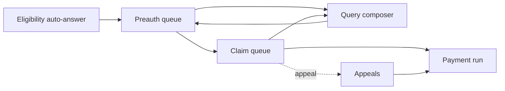

# Payer overview

A payer system is the insurer's, TPA's or scheme's side of the exchange. Where a provider mostly calls and waits, a payer mostly hosts and answers: it receives eligibility checks, plan requests, preauthorisations and claims, decides, and sends the decision back. It initiates only three things of its own: policy links, payment notices, and communications.

This section assumes the base framework from Getting Started: token, participant record with the payer role, own key, and a callback endpoint that opens messages. A payer's "callback" endpoints are the `check`, `request` and `submit` sides that providers call.

## What the payer's staff see

Under PMJAY the decisions are taken by named roles: the Preauthorisation Processing Doctor at admission, the Claim Processing Doctor at settlement, the Claim Review Committee on appeal, and accounts on payment. A payer UI is a set of work queues for those roles.

| Screen | Who | What they do | Exchange behind it |
| :---- | :---- | :---- | :---- |
| Policy admin | Operations | Link and de-link beneficiaries to products; name the processor | Link and de-link ABHA |
| Plan configuration | Scheme team | Maintain specialties, packages, rates, add-ons, flags, documents, questionnaires | Insurance plan response |
| Eligibility | System | Answer automatically from policy and wallet data | Coverage eligibility response |
| Preauth queue | PPD | Open a case, see items and documents, approve, reduce, query or reject | Preauthorisation response |
| Claim queue | CPD | Same, against the approved preauthorisation and the discharge evidence | Claim response |
| Query composer | PPD, CPD | Write the query the provider will see | Queried response |
| Appeals | CRC | Reprocess and shortfall requests | Task response |
| Payment run | Accounts | Initiate, process and settle; record UTR and deductions | Payment notice |
| Communications | Any | TAT alerts, grievances, wallet and policy changes | Communication request |



## What the system hosts and calls

From the Overview's catalogue, a payer hosts the C-series callbacks and calls the shared A-series plus three of its own.

Hosts, as the receiving half of each exchange:

```
/v1/coverageeligibility/check      answer on /v1/coverageeligibility/on_check
/v1/insuranceplan/request          answer on /v1/insuranceplan/on_request
/v1/preauth/submit                 answer on /v1/preauth/on_submit
/v1/claim/submit                   answer on /v1/claim/on_submit
/v1/task/submit                    answer on /v1/task/on_submit
/v1/search/submit                  answer on /v1/search/on_submit
/v1/communication/on_request       the provider's acknowledgement
/v1/paymentnotice/on_request       the provider's acknowledgement
/v1/on_status, /v1/error
```

Calls of its own:

```
/participant/link/abha/policy, /participant/delink/abha/policy
/v1/paymentnotice/request
/v1/communication/request
```

## The rules for every answer

The payer exit checklist states four validations on every response a payer sends, and the sandbox certification checks them:

1. The payload validates against the NRCeS profiles.
2. `api_call_id` and `correlation_id` on the response are different values.
3. `correlation_id` on the response is the request's `correlation_id`, echoed. The checklist words it as the request's `api_call_id`, which is the same value, because a request sets its `correlation_id` to its own `api_call_id`.
4. `recipient_code` on the response equals the `sender_code` of the request.

The correlation rule is the same everywhere. On a request you initiate, such as a payment notice or a communication, set `correlation_id` to that message's own `api_call_id`. On a response, echo the request's `correlation_id` and give the response a fresh `api_call_id`. On a status enquiry, set `correlation_id` to the `api_call_id` of the message you are asking about. Envelope Fields has the full rule.

And the status word: `response.complete` for a final answer, `response.partial` for an interim one or a query, `response.error` with a protocol response when the request could not be opened or failed validation. The exit checklist names the type field on a good answer `JWEPayloadResponse`; the sandbox collection uses `JWEPayload`. Accept both when reading, and confirm which to send.

## Build it in this order

A payer's work is mostly hosting, and the hosting has a dependency order of its own.

| Order | Build | Because |
| :---- | :---- | :---- |
| 1 | The base framework, and the four validations on every response | Nothing you send is accepted without them, and certification checks them on every use case |
| 2 | Policy linking | Until a policy is linked, no provider can find the beneficiary and nothing else is reachable |
| 3 | The eligibility answer, by rule | Asked at every registration. A provider waiting on it is a front desk waiting |
| 4 | The insurance plan response | It drives every provider screen, so its correctness decides how many malformed requests you receive |
| 5 | The preauthorisation queue and its response | The first exchange needing a human |
| 6 | The claim queue and its response | Reuses the same `ClaimResponse` shape |
| 7 | Payment notices, all three | The provider cannot close a case without 33 |
| 8 | Communication, and the Task answer for appeals | Needed for sandbox exit |

Getting 4 right early pays for itself. Most of what a provider sends wrong, it sends wrong because your plan did not tell it otherwise.

## What the system must keep

- The policy master: beneficiaries, products, wallets, family limits, and which participant processes each policy.
- The plan master, versioned, because a rate change with no version bump looks like tampering from the provider's side.
- Every case as a state machine driven by what the payer itself sent: received, queried, approved, rejected, claimed, in process, settled, appealed.
- Every raw message received and sent, with its correlation ID, because arbitration is settled on the record.
- Adjudication detail per item: submitted, eligible, co-pay, benefit, and the reason, because that is what a `ClaimResponse` is made of.

The chapters that follow take each queue in turn, the payer UI Guide turns them into the screens each desk works from, and Payer Checklist is the checklist you have to demonstrate to leave the sandbox.
