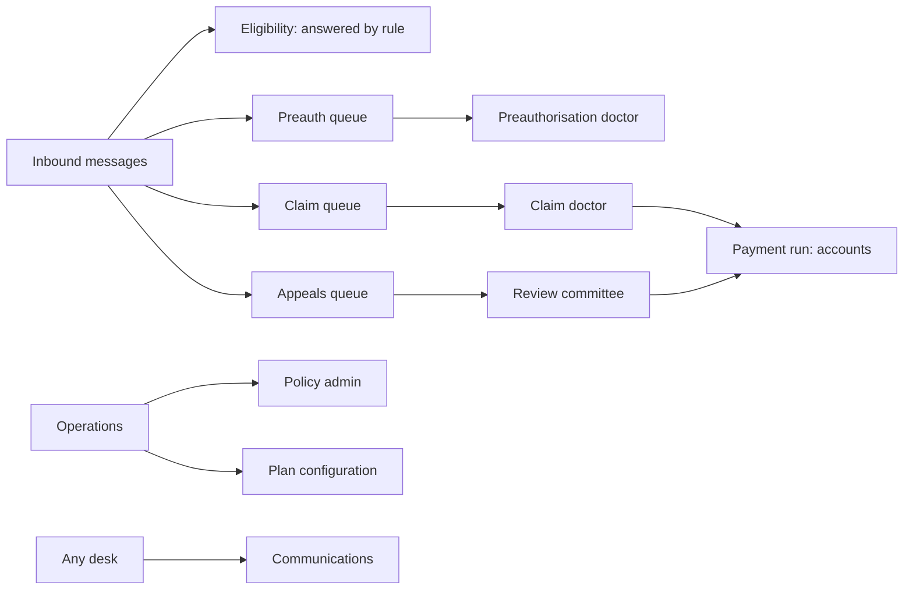
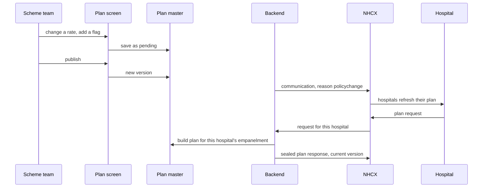
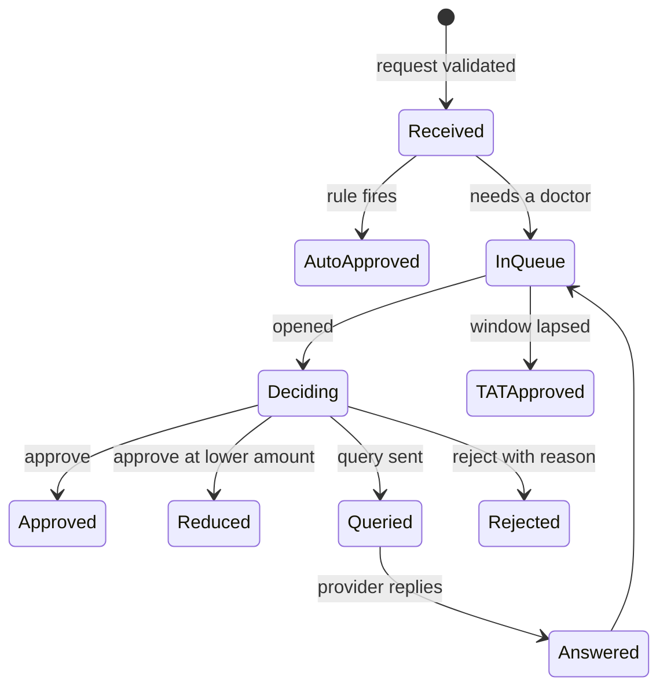
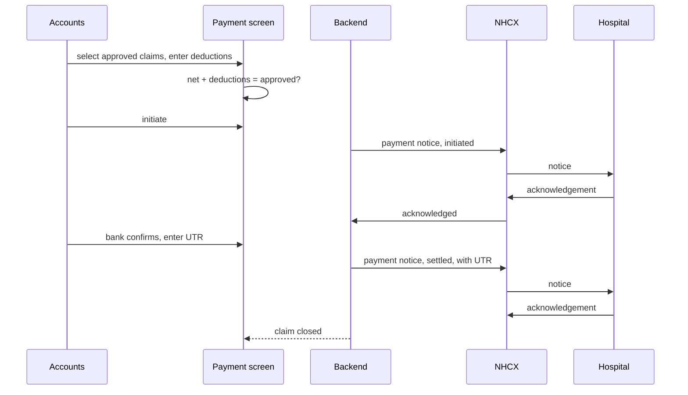

# Payer UI guide

A payer system is operated from queues. Cases arrive, sit until a person or a rule acts on them, and leave with a decision. This chapter describes those queues and the screens around them, who works each one, what they see, what they decide, and how the decision becomes a message. It follows the same order as the rest of the section.

Two rules run through every screen.

**A decision is not made until it is sent.** The adjudicator's action on screen produces a response that goes to the exchange. The case state changes when the receipt comes back, not when the button is clicked. The screen shows the difference.

**The payer never types what the provider sent.** Amounts submitted, items, documents, dates and biometric evidence are shown as received and are not editable. What the payer adds is the decision, the eligible and approved amounts, the reason, and the note.

## Who works which queue

| Screen | Role | Input | Output message |
| :---- | :---- | :---- | :---- |
| Policy admin | Operations | Holder identifiers, products, processor | Link, de-link |
| Plan configuration | Scheme team | Specialties, packages, rates, flags, documents, questionnaires, version | Insurance plan response |
| Eligibility monitor | System, watched by support | None | Eligibility response |
| Preauth queue | Preauthorisation doctor | Decision per item, note, query text | Preauthorisation response |
| Claim queue | Claim doctor | Decision per item, note, query text | Claim response |
| Appeals | Review committee | Decision | Task response |
| Payment run | Accounts | Claims to pay, deductions, bank confirmation | Payment notices |
| Communications | Any desk | Reason, message, priority | Communication request |
| Case audit | Anyone | None | None |

## Policy admin

**Screen.** A search by member, ABHA or mobile, showing the holder's linked products and who processes each. Link and de-link actions, and a bulk tool for moving every policy from one processor to another.

**What the UI enforces.** The processor field is a pick from the payer's own participants, never typed. A de-link names only products already on the link. A change of processor is a batch with a preview of how many policies it will touch. Because only the two participants on a link may change it, the screen must run under the credentials that created the participant, and should say so when a change is refused.

**Data flow.** Policy system writes a policy; a job links it on the exchange; the screen shows the exchange's record, not the policy system's, so a link that failed is visible.

## Plan configuration

**Screen.** A tree: policy, specialty, package. Per package: the rate, the add-ons allowed with their maximums, the flags, the documents required at preauthorisation and at claim, and the questionnaires attached. A version stamp on the plan with a publish action that bumps it. A per-hospital view showing what an empanelled hospital will receive.

**What the UI enforces.** A rate change without publishing is shown as pending, because an unpublished rate is exactly what makes a provider's next claim look tampered with. Every flag is a control, not a text field. The per-hospital preview is what the plan response will actually contain, generated from the same master.

## Eligibility

No screen for the decision; it is answered by rule from the policy master and the wallet. What operations needs is a monitor: volume by hospital, refusals by reason, and the requests that failed validation with the payer's own error code. That is how a hospital sending a malformed request gets told which field. The monitor should also show the requests answered with "not a covered member" by hospital, because a spike there is a linking problem on the payer's side, not the hospital's.

## The preauthorisation queue

**Screen.** A queue ordered by turnaround time remaining, with cases that a rule will auto-approve marked so the doctor can skip them. Opening a case shows, in the payer's order: beneficiary and wallet before and after, diagnosis, and packages with rate, add-ons and the plan's flags. Then care team and dates, documents rendered as records with questionnaires beside the package they belong to, and the case history.

**The decision panel.** Per item: approve, approve at a lower amount with a note, query, reject with a reason picked from the scheme's preauthorisation denial list. Then a claim-level decision that the system derives from the items and the doctor confirms.

**What the UI enforces.** A reduction needs a note. A rejection needs a reason code. A query needs text and names the item. The eligible and approved amounts are computed from the items and shown, not typed. Under PMJAY the biometric or consent evidence is shown as a badge on the case before anything else.

The doctor sees InQueue cases ordered by how long until TATApproved fires. Get that ordering wrong and the window lapses on cases nobody has looked at.

## Writing a query

**Screen.** A composer opened from an item or from the whole case. Under PMJAY the text becomes the pipe-delimited audit trail the provider will see, so the composer shows the comment field prominently and fills user, time and type itself. A picker of the documents the plan lists, so the doctor asks for a named document rather than "more documents".

**What the UI enforces.** A query cannot be sent empty. On the general network the query goes out as a communication with reason additional information; under PMJAY as a queried response on the case. The composer knows which and the doctor does not have to.

## The claim queue

**Screen.** The claim opened side by side with the approved preauthorisation, differences highlighted: items added, quantities changed, amounts above approval. Discharge type and stage, dates, discharge summary as a record, bill, post-operative evidence. The four checks the handbook names shown as a checklist the doctor ticks: within cover and limits, clinically appropriate, documents complete and consistent, within package rates.

**The decision panel.** As for preauthorisation, with two interim actions that are not decisions: mark in process, forward to another entity. And the claim denial list rather than the preauthorisation one.

**What the UI enforces.** Nothing above the approved amount is approvable without a reduction note. A rejection shows the doctor that it closes the case permanently and that the provider's only route is appeal. Under PMJAY a LAMA or DAMA claim before surgery is shown with the stay line only and the approved packages struck through.

## Appeals

**Screen.** A committee queue of reprocess and shortfall requests, each opened against the original claim, its decision, its payment, and the document the provider attached. Decision: uphold, revise with amounts, reject. A note that the decision is final and closes the case to further appeal.

**What the UI enforces.** A shortfall request that arrived before the settlement notice was acknowledged is shown as premature and is not adjudicated. A second appeal on a case already decided is shown as refused. The decision goes out as a Task carrying a claim response, and the screen shows it as sent only on receipt.

## The payment run

**Screen.** Approved claims not yet paid, selectable into a run. Per claim: approved amount, deductions itemised (tax deducted at source and any scheme adjustment), net. Actions: initiate, then record the bank's confirmation and UTR. Each action becomes a notice to the provider; the screen shows the three notices per claim and whether the provider acknowledged each.

**What the UI enforces.** Net plus deductions equals the approved amount, or the run does not proceed. The settlement notice is sent only when the bank confirmation is entered, because under PMJAY that notice opens the provider's shortfall window. A failed transfer is recorded as a rejected notice, not left silent.

## Communications

**Screen.** A composer with a reason picker: information request, turnaround alert, grievance, wallet change, policy change, arbitration acknowledgement. Message, priority, and the case it concerns. Most of these should be generated by the system rather than a person. A turnaround alert when a query has gone unanswered past the window, a wallet change when a balance moves, a policy change on every plan publish, an arbitration acknowledgement when an appeal arrives.

**What the UI enforces.** A message about a case carries the case number. Priority is a pick, and only a fraud or safety message may be marked as the highest. The acknowledgement from the provider is shown against each message; it means received, and the screen says so.

## The case audit trail

**Screen.** Every case, every message in and out, in order, with the correlation ID, the workflow code, the status word, the raw message and its decrypted content, and who acted on the payer's side. Read only. Exportable.

This is the screen arbitration is settled on, and every other screen is a view over the same record. Build it early.

## Errors the adjudicator should see

A request refused by validation never reaches the queue. It should still reach a support view with the payer's own error code and the hospital that sent it, so that a hospital repeatedly sending a wrong package code can be told. The queues themselves show only cases that passed validation; the doctor's time is for decisions, not for malformed messages.
