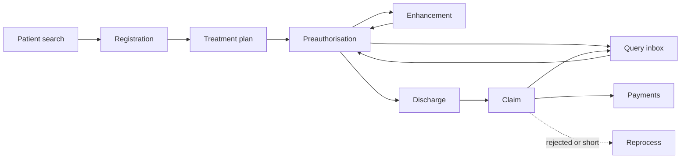

# Provider overview

A provider system is the hospital's side of the exchange. It takes a patient from the front desk to a settled claim without anyone leaving the HMIS. It does that by making a fixed set of calls to the exchange and hosting a fixed set of callbacks for the payer's answers.

This section assumes the base framework from Getting Started is working: you have a token, a participant record, your own key, and a callback endpoint that opens messages. Everything here is what goes on top.

Registration and Eligibility, Insurance Plan, Preauthorisation, Discharge and Claim, and Payment and Communication describe the flow as NHCX defines it for any payer. PMJAY runs the same endpoints with different rules around them; those rules are collected in PMJAY Provider so the generic flow stays readable and the scheme's additions are in one place, and Biometric Authentication covers the scheme's proof that the beneficiary was present. UI Guide turns all of it into screens, for whoever is designing the hospital's interface rather than its integration. Provider Checklist is the checklist you have to demonstrate to leave the sandbox.

## What the hospital sees

The user-facing shape is a handful of screens that map one-to-one onto exchange calls. The mapping is worth fixing early, because it decides where each API is called from.

| Screen | What the user does | Exchange call behind it |
| :---- | :---- | :---- |
| Patient search | Finds the beneficiary by ABHA, member ID or mobile; picks the payer | Participant list, policy lookup |
| Registration | Confirms cover and sees the remaining limit | Coverage eligibility, purpose validation |
| Treatment plan | Picks the service or package, sees what is covered and what documents are required | Insurance plan (cached), eligibility with purpose benefits and auth-requirements |
| Preauthorisation | Fills clinical and financial sections, attaches documents, submits | Preauthorisation submit |
| Enhancement | Adds procedures or days against an approved case | Preauthorisation submit, enhancement code |
| Query inbox | Reads a payer request for more, attaches what was asked, replies | Communication request and response |
| Discharge | Records discharge and sends a provisional claim before the patient leaves | Claim submit, discharge code |
| Claim | Confirms the final bill, submits | Claim submit |
| Reprocess | Appeals a rejection or a reduced approval | Task submit |
| Payments | Sees notices, UTR and deductions; acknowledges | Payment notice callback, acknowledgement |
| Case status | One line per case with its current state | Driven by callbacks and status check |

## What the system calls

From the Overview's use-case catalogue, a provider calls the B-series and the shared A-series, and hosts the callbacks for each. In sequence for one admission:

1. `/fetch/participants/list` and `/participant/get/policies`, to find the payer and the policy.
2. `/v1/insuranceplan/request`, once per policy, refreshed on a schedule.
3. `/v1/coverageeligibility/check`, at registration and again before each submission.
4. `/v1/preauth/submit`, for the first request and every follow-up on it.
5. `/v1/claim/submit`, for the provisional discharge submission, the final claim, and query answers.
6. `/v1/task/submit`, to cancel a preauthorisation or appeal a claim.
7. `/v1/status`, whenever a case has gone quiet.

And hosts `on_check`, `on_request`, `on_submit` for each of those, plus `/v1/communication/request`, `/v1/paymentnotice/request`, `/v1/on_status` and `/v1/error`.

## What the system must keep

A provider integration is as much a data model as an API client. Persist, per case:

- The payer's participant code, the processor code, member ID, product and policy number from the lookups.
- Every correlation ID sent, with the workflow code and what it was for, so callbacks can be matched.
- Every raw callback as received, before it is interpreted.
- The case state, derived from callbacks. The handbook's mapping is a good starting point: approved, partially approved, pending on a query, rejected, cancelled, and then settled once payment code 33 arrives.
- The insurance plan, versioned, with the version used on each submission.

## Build it in this order

The exchanges depend on each other, and building them out of order means testing against answers you cannot yet get.

| Order | Build | Because |
| :---- | :---- | :---- |
| 1 | The base framework from Getting Started | Nothing below works without a token, a key, a participant record and a callback that answers |
| 2 | Participant list and policy lookup | They produce the processor code every later message is addressed to |
| 3 | Coverage eligibility, purpose validation | The cheapest exchange to get right, and the one that proves the whole round trip |
| 4 | Insurance plan, cached | The treatment screen is built from it, and preauthorisation validation depends on it |
| 5 | Preauthorisation, then its query answer | The first bundle with clinical content, and the one payers scrutinise hardest |
| 6 | Claim, then its query answer | Reuses the preauthorisation bundle with one field changed |
| 7 | Payment notice and acknowledgement | Closes the case, and under PMJAY gates the shortfall |
| 8 | Task: cancel and reprocess | Needed for sandbox exit, rarely needed on day one |

Provider Checklist is the checklist you demonstrate to leave the sandbox, and it names all thirteen use cases NHA asks for.

## Error families, and which desk they belong to

Errors arrive from two places and they go to two different people.

| Family | Where it arrives | Who acts |
| :---- | :---- | :---- |
| `PAYR-10xx`, `PAYR-11xx` | Inside the sealed response | The desk. Show the payer's own sentence |
| `PAYR-102x` structural block | Inside the sealed response | The integration team. It means an id or sequence is missing, not a wrong value |
| `ClaimError-n`, `PreauthError-n` | Inside the sealed response, on a denial | The desk, on the appeal screen, so the user sees why before deciding to appeal |
| `ERR-PYR-CLM-007` | Inside the sealed response | The integration team. The claim was sent under the wrong case number |
| Protocol response, `response.error` | On the callback, in the clear | The integration team. The message could not be opened |
| `NHCX-1010` | From the exchange | The integration team. A verdict was sent after the correlation was retired |

A protocol response is never a claims-desk problem. Route it away from the queue and toward whoever owns the integration.

## Where the rules live

Two rulebooks shape what a provider may send, consulted in this order:

1. **The insurance plan** says what the policy covers, at what limits, with which documents required.
2. **The eligibility response** says whether this patient is covered right now, how much remains, and which of the plan's requirements apply to the services chosen.

A scheme adds a third: its own rules for how a case is built. For PMJAY those are in PMJAY Provider.
