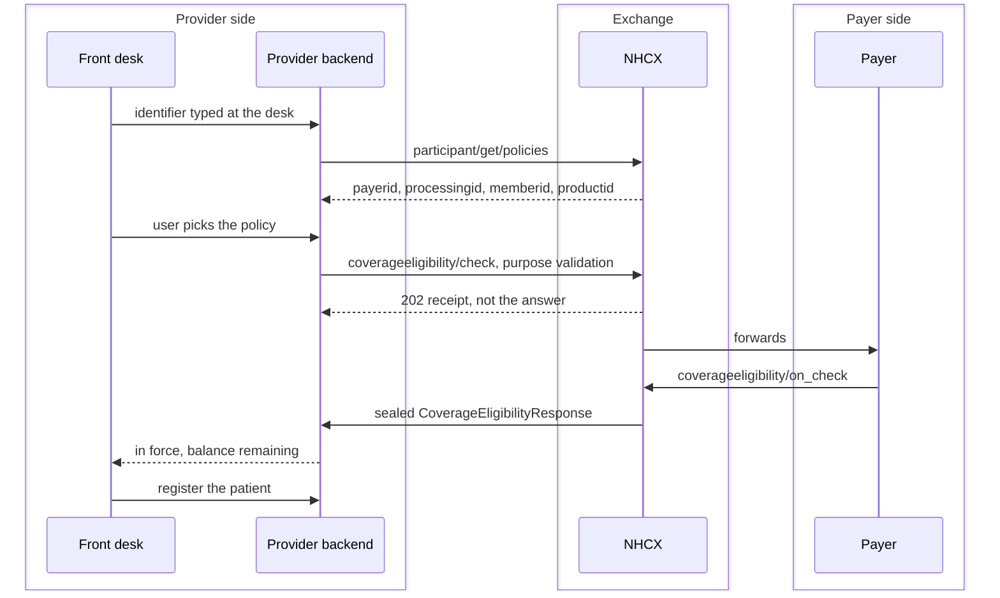

# Registration and eligibility

This chapter comes before the Insurance Plan chapter because registration comes first at the desk. The calls do not run in that order. The plan is fetched at registration or admission and cached, so by the time a treatment is planned it is already there, and the next chapter covers it. Read the two together.

The first screen decides whether the rest of the journey can happen. A patient who is registered without a confirmed policy and a confirmed processor code will fail at preauthorisation with errors that look like FHIR problems and are not.

## What the user does

**Search.** The front desk enters one identifier: ABHA number, member or policy number, or mobile. The system tries them in that order of strength and shows the matching policies with the insurer's name. The user picks the payer.

**Beneficiary Verification & KYC.**
Before checking eligibility, the patient's identity is established:
- **Commercial / Private Insurance**: Uses the **Aadhaar Digital eKYC API**. The desk triggers an Aadhaar OTP or demographic validation, retrieving the beneficiary's verified ABHA profile (Name, DOB, Gender, Address, Photo) and unhyphenated ABHA ID for the envelope (`x-hcx-ben-abha-id`).
- **PMJAY Scheme**: Gated by **Mandatory Biometric Authentication**. The patient performs a live biometric verification (Fingerprint, Iris, or FaceAuth) via the ABDM biometric gateway (see Biometric Authentication), returning a user auth token (valid 1,800s). If the patient cannot be biometrically authenticated due to physical trauma, burns, or amputation, the hospital executes the signed **Aadhaar Exemption Consent Form** and submits the Authentication Consent Questionnaire.

**Confirm cover.** The screen calls eligibility with purpose validation and shows the result in words the desk can act on: policy in force or not, and what remains against the sum insured. Register the patient only once this comes back positive. If the limit is exhausted or the policy is not in force, say so and stop; do not let a registration proceed on a promise.

**Capture the rest.** Communication address, attendant details, and whatever the payer's plan lists as required at registration.

## What the system calls

Two lookups from Getting Started, then one exchange:

```
POST participant/get/policies          identifiertype + identifiervalue
POST /v1/coverageeligibility/check     purpose: validation
```

The eligibility request needs the beneficiary's identifiers, the coverage or plan code, the payer ID and the provider ID. Send it to the processor code from the policy lookup. Cache the policy result against the patient.

Call eligibility again, still with purpose validation, whenever a treatment is added later. The handbook's fallback: if the policy lookup returns nothing, call eligibility with purpose discovery first to learn the active policy code, then validation with it.



## The four purposes

One `CoverageEligibilityRequest` carries four different questions, and `purpose` decides which. Only `validation` is asked at the desk; the other three belong to the treatment screen in the next chapter.

| Purpose | The question | When you send it | What comes back |
| :---- | :---- | :---- | :---- |
| `validation` | Is this coverage in force, and what is left? | At registration, and again whenever a treatment is added | `inforce`, and one benefit entry per wallet with allowed and used money |
| `discovery` | What coverages does this beneficiary have with you? | Only as a fallback, when the policy lookup returned nothing | Every active coverage, so you can pick a policy code |
| `benefits` | For these packages, what is covered? | On the treatment screen, once packages are chosen | Per item: excluded or not, benefit type, allowed money |
| `auth-requirements` | Is preauthorisation required, and what must come with it? | Before submitting a preauthorisation | Per item: `authorizationRequired`, and the mandatory document and questionnaire codes |

`discovery` is defined in the specification and appears in no published sample. The other three do.

## What goes in the bundle

A `CoverageEligibilityRequest` in a collection bundle, alongside the `Patient`, the provider and insurer `Organization`s, the `Coverage`, and the `Practitioner` who made the check.

| Element | Set it to |
| :---- | :---- |
| `purpose` | `validation` at registration; `discovery` as the fallback |
| `patient` | Reference to the Patient, who carries the member ID and ABHA number as identifiers |
| `insurer`, `provider` | References to the two Organizations |
| `insurance.coverage` | Reference to the Coverage carrying the policy code |
| `servicedDate` | Today |
| `enterer` | The desk user. The samples send a `Practitioner`; the handbook asks for a `PractitionerRole`. FHIR allows either and the published bundles use `Practitioner`, so send that |

Element tables and a worked example are in the FHIR Reference. Two details from the samples save a day each. The `Patient` carries a `PI` identifier that is the hospital's own MRN, and a hospital with none yet sends the literal string `NA`. And `servicedDate` is the date of service, not the date of asking.

## Reading the answer

The response comes back on `/v1/coverageeligibility/on_check`. It is not a small message: the payer echoes your entire request back before answering it, so the bundle has eleven entries where you sent six.

| What you want | Where it is |
| :---- | :---- |
| The yes or no | `insurance[0].inforce` |
| The payer's own sentence for the desk | `disposition`, for example `Policy is currently in-force` |
| Money allowed on the wallet | `insurance[0].item[].benefit[].allowedMoney` |
| Money already used | `insurance[0].item[].benefit[].usedMoney` |
| Whether preauthorisation is needed | `item.authorizationRequired` |
| The match back to your request | `CoverageEligibilityResponse.request.reference` |

Three traps in that bundle, all of them real in the published sample.

**Index by `fullUrl`, not by resource type.** Entries 8 to 11 are the payer's own `Patient`, `Coverage` and `Organization`s, and they duplicate the resource types in your echoed request. A parser that finds the first `Patient` reads your own data back and reports it as the payer's answer.

**Do not match on the request id.** The payer splits `CoverageEligibilityRequest.id` on the last slash and returns only the tail, so an id you sent as `PMJAY/HP/S/G` comes back as `G`. Match on `request.reference`, which is intact.

**The balance is a subtraction.** `allowedMoney` alone reads as more cover than the patient has. Show allowed less used, and group the digits the Indian way.

## The forward instruction

The coverage eligibility specification gives it one sentence: a payer might respond with a forward instruction asking NHCX to submit the same request to another payer. No fields or flow are published for it, so there is nothing to build against. Ask about it at onboarding; Governance and Audit lists the question.

## Errors you will meet

Business refusals travel inside the sealed response as a `PAYR-` code; protocol refusals arrive on the envelope. Map each to something the desk can act on.

| Code | What it means | What the desk should see |
| :---- | :---- | :---- |
| `PAYR-1401` | Policy not allowed for the hospital | The hospital is not empanelled under that policy. Ask again with the beneficiary's own policy from the lookup |
| `PAYR-10xx` family | Not a covered member, policy not found, policy expired | The payer's own sentence, verbatim, and a stop on registration |
| `PAYR-11xx` family | The reference payer's eligibility-specific set | The payer's sentence, plus which field it names |
| `401` on the call itself | Token expired | Nothing. Fetch a new token and retry once |

A refusal on this exchange is cheap. The same fault met at preauthorisation costs a round trip and a day, which is the argument for calling eligibility again whenever a treatment is added rather than trusting the answer from admission.

## What to show and store

- Show `disposition` verbatim; it is the payer's own sentence about the policy.
- Store the response with the case, because the auth-requirements version of this same call is what tells you which documents are mandatory later.
- Store the wallet figures and the moment they were read. When a claim is adjudicated against them months later, the adjudicator needs to see what was promised.
- Store the raw sealed message before you interpret it. Disputes are settled on what was actually received.
- Map the payer's error codes to desk-readable messages: not a covered member, policy not found, policy expired. The `PAYR-10xx` family covers these; the reference payer adds a `PAYR-11xx` set for eligibility specifically.
