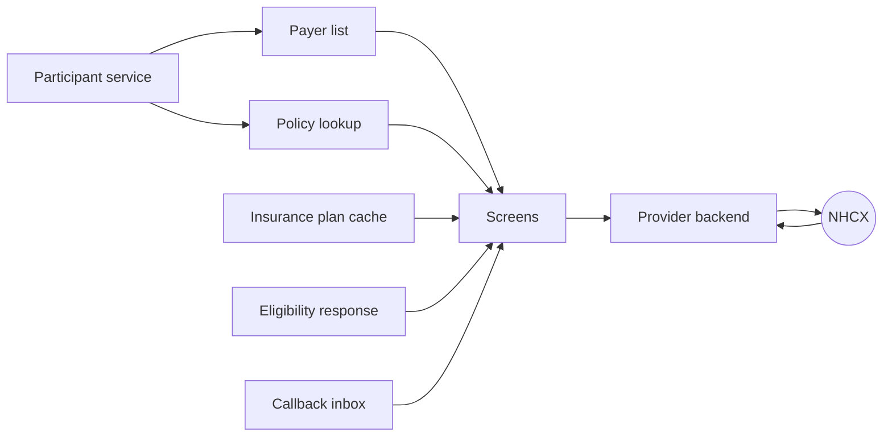
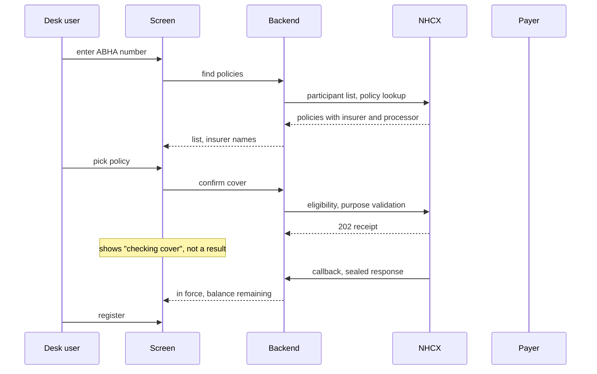
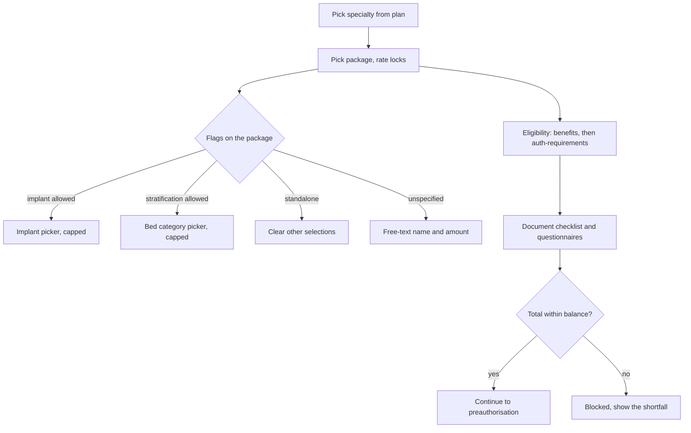
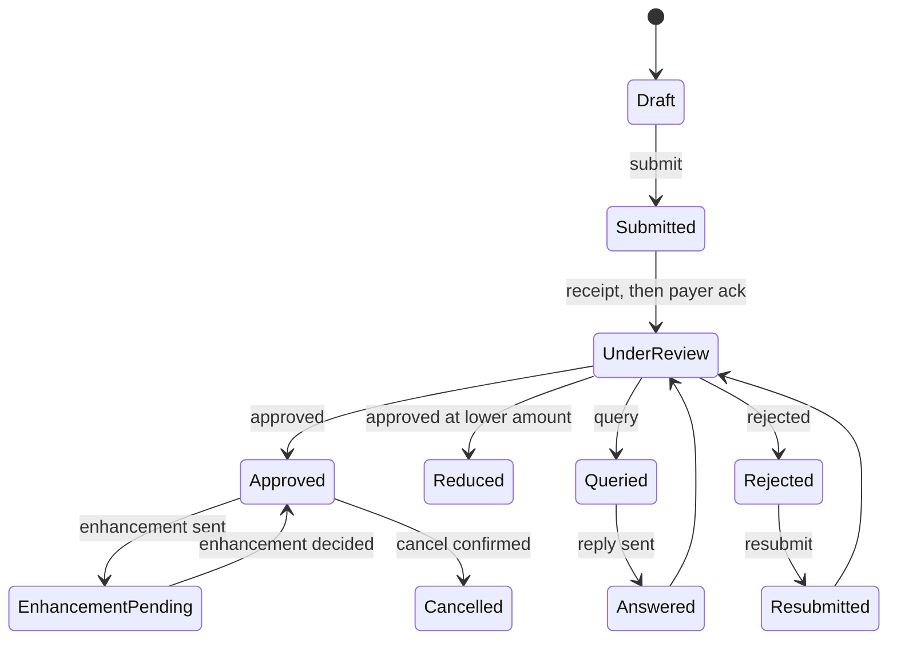
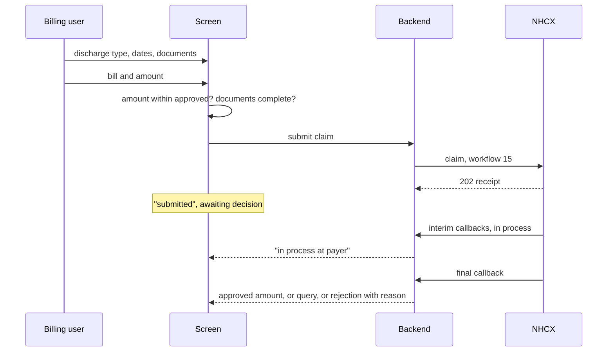
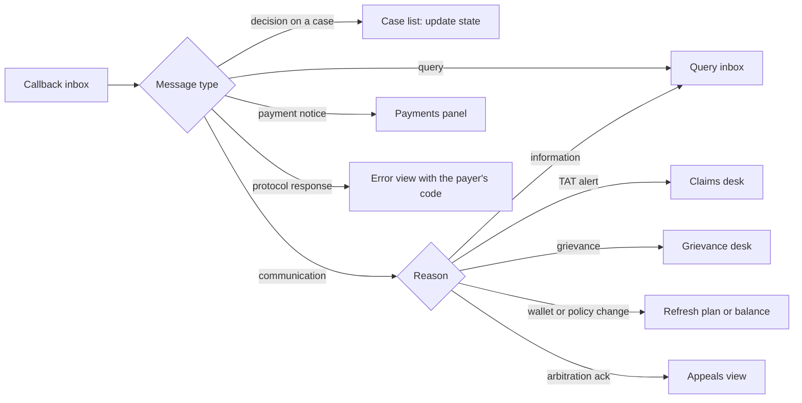

# Provider UI guide

This chapter is about the screens. Everything before it said what the provider system calls and what goes in the bundle. This says what the person at the desk sees, what they type, what they must not be allowed to type, and where each piece of data on the screen comes from. It is written for the product owner and the front-end engineer, and it is organised as seven flows across the same ground the rest of the section covers.

Two rules run through every screen.

**Nothing the exchange already knows is typed.** Payer names, policy numbers, package names, rates, add-on codes, document lists and questionnaire text all come from elsewhere. From the participant service, the policy lookup, the insurance plan or the eligibility response. A field the user can edit is a field the payer can reject.

**The screen never shows a decision the exchange has not sent.** Submitting is not approval. Every status on every screen is derived from a callback that was received, decrypted and stored, never from the fact that a request went out.

That rule has a consequence which is easy to miss. A case the payer has not answered yet exists nowhere in the callback inbox, because nothing has come back. So a system that builds its case list only from received callbacks cannot show a waiting case. The case vanishes between submission and answer, which is the one moment the user most needs to see it. **Keep a record of what you sent as well as what came back.** Store, per request, the action, the protected header, the bundle and the exchange's receipt. Build every case screen from the two halves together. Sent with nothing back is the waiting state, and it is a state you have to be able to render.

A case is keyed by its correlation ID, which the provider generates and which stays fixed for the whole conversation, so it is the only identifier available at the moment of submission. The payer's own case or preauthorisation number arrives later, on the answer. Show the payer's number to the user, since that is the number they will quote on the phone, but address the case internally by the correlation ID. Screen addresses are yours to choose; the chapter does not prescribe them.

## Where the data comes from

| On screen | Comes from | Editable |
| :---- | :---- | :---- |
| Payer name | Participant list, filtered by role | Pick from list |
| Policy, member ID, product | Policy lookup | Pick from list |
| Cover in force, balance remaining | Eligibility response, purpose validation | No |
| Approved amount, reduction note | Claim response on the answer | No |
| Specialty, package, rate | Insurance plan | Pick from list; rate fixed |
| Add-ons allowed and their limits | Insurance plan flags | Pick within limits |
| Required documents, questionnaires | Eligibility response, purpose auth-requirements; plan | No; answer, do not edit |
| Case status | What was sent, plus the callback inbox | No |
| Payer's query text, decision, reason | Callback inbox | No |
| UTR, deductions, net paid | Payment notice callback | No |
| Clinical findings, history, diagnosis, care team | The HMIS record | Yes, in the HMIS |
| Bill number, date, amount claimed | Hospital billing | Yes, within the approved amount |

## Flow 1: find the patient and register

**Screen.** One search box with a type selector: ABHA number, member ID, mobile. A results list showing the insurer name for each policy found. A confirm-cover panel that fills after the user picks a policy: in force or not, balance remaining, and the payer's own sentence about the policy shown verbatim. A register button that is disabled until cover is confirmed.

**What the UI enforces.** Try identifiers in order of strength and tell the user which one matched. The balance remaining is the allowed amount less the amount already used, both of which the eligibility answer carries as money values on the benefit. Show that subtraction, not the allowed amount on its own: the allowed amount alone reads as more cover than the patient has. Group digits the Indian way, so four hundred and fifty thousand reads as 4,50,000, and give the figure a word beside it rather than a bare number. Disable registration when the policy is not in force or the limit is exhausted, and say why in the payer's words.

**What the backend does behind it.** Resolves the processor code from the policy and stores it against the admission. The screen never shows the difference between insurer and processor, but every later call depends on it.

**States the screen shows.** Searching, policies found, checking cover, cover confirmed, cover refused, registered.

## Flow 2: plan the treatment

**Screen.** A specialty picker limited to what the plan says this hospital may use, read from the cached insurance plan. A package picker under it, with the rate shown and locked. Add-on controls that appear only when the package's flags allow them, each capped at the plan's maximum. A live total against the balance remaining, turning red when it would exceed it. A document checklist and questionnaire panel that populate once the packages are chosen.

**What the UI enforces.** Rate not editable. Quantity capped. A standalone package clears any other selection and says so. A package flagged as needing a parent will not stay selected without one. A government-reserved package is not shown to a private hospital. When the total exceeds the balance, the submit path is closed, not merely warned.

**What the backend does behind it.** Reads the cached plan and derives the document checklist and questionnaires from the selected packages. Calls eligibility with purpose benefits to confirm the balance. Refreshes the plan if a policy-change communication has arrived since the cache was filled.

Everything this screen offers comes from the insurance plan. The specialties, the packages, the rates, the add-on allowances, the flags that govern them, the documents each package demands and the questionnaires attached to it are all in the plan. Fetch it and cache it as the Insurance Plan chapter describes.

The auth-requirements exchange is specified to return the required documents, and the rest of this section says so. The one published sample does not: it carries no benefit detail and no supporting-information requirements, and is indistinguishable from the plain benefits answer. So build the checklist from the plan, which certainly carries the requirements, and use the auth-requirements answer to confirm that authorisation is needed and to add anything it does return. A screen that depends on that answer alone will be empty against the only payer whose response has been published.

## Flow 3: preauthorisation, query, enhancement, cancel

**Screen.** Four tabs in the payer's own order: medical information, admission information, treatment, finance. A documents panel driven by the checklist from flow 2, with each mandatory item shown as missing until attached and the submit button disabled until none are. After submission, a case panel with one status line and a timeline of everything sent and received.

**What the UI enforces.** Every mandatory document attached. Every questionnaire the plan demands answered. Registration and admission dates present. Total within balance. Under PMJAY, a biometric token or a consent response, and admission not more than one day ahead.

**The query inbox.** A queried case shows the payer's text, with the item it concerns highlighted, and a reply form that attaches documents and carries the case remarks. Reply goes out as a query answer, never as a new preauthorisation; the screen should make that impossible to confuse.

**Enhancement.** Opens only on an approved case with no request in flight, offers only packages the plan marks enhanceable, and shows the already-approved items greyed alongside the new ones.

**Cancel.** A reason picker with the seven documented reasons and a free-text field that is required when the reason is Other. Hidden once a claim has been raised.

What each state shows the user: Submitted means "sent, no word yet", not approval. UnderReview appears only when the payer's receipt has come back. Approved shows the preauthorisation reference, the approved amount, and any reduction note verbatim.

Three fields on the answer are worth naming, because the response carries several amounts and picking the wrong one misstates the decision. The **approved amount** for the case as a whole is the benefit total on the response, and the same category per line gives the approved amount for each item. The submitted category alongside it is what you asked for, not what you were granted. Showing it as the decision is the classic error. The **preauthorisation reference** is the payer's own number for the case. The **reduction note**, and any other sentence the adjudicator wrote, arrives as process notes and is shown verbatim. The Preauthorisation Response chapter in the FHIR Reference gives the full shape.

## Flow 4: discharge and claim

**Screen.** A discharge form: type (home, death, left against advice, discharged against advice), dates, and the documents that type requires. Then the claim form: bill number, date, bill attachment, amount claimed with the approved amount shown beside it, post-operative evidence. A single submit for the claim; under PMJAY the discharge is not a separate submission.

**What the UI enforces.** Amount claimed not above the approved amount. Discharge type chosen before the claim opens. Under PMJAY: a fresh biometric or the discharge consent; for a LAMA or DAMA leaving before surgery, the line items replaced by the stay line with the user told the approved packages are voided.

**States.** Draft, submitted, in process, forwarded, queried, approved, reduced, rejected. Rejected is final; the only action offered is appeal.

## Flow 5: appeal a decision

**Screen.** From a rejected or short-paid case, one appeal form: the payer's reason shown at the top, a document attachment that is required, and for a shortfall an amount field capped at the difference. A notice of how many appeals remain, and, once the Committee has decided, a closed state with the decision.

**What the UI enforces.** No appeal without a document. Shortfall amount never above the difference. Under PMJAY, the shortfall form stays disabled until the settlement notice has arrived and been acknowledged, and neither form reopens after a Committee decision.

## Flow 6: payments

**Screen.** Per case, a payment panel listing each notice as it arrives, and on settlement the UTR as text on the page, gross, deductions itemised, and net. Reconciliation staff copy the UTR, so a copy control beside it earns its place. The value still has to be readable without one: a UTR that exists only inside the `value` attribute of an input box is not on the screen. The same goes for every other figure the payer sent. An acknowledge button per notice. A reconciliation view across cases for accounts, filterable by date and payer, exportable.

**What the UI enforces.** There are two different acknowledgements here and the screen should not confuse them. The 202 receipt your callback returns is a transport acknowledgement, sent automatically the moment the notice arrives. Separately, the provider sends a real acknowledgement message back to the payer, a Task on workflow 17, and the Payment and Communication chapter gives its shape. That one is a business act, so it belongs on the screen: one button per notice, and a clear indication once it has gone. Send it whether or not the user clicks, and show that it went. A rejected payment notice shows as not paid, in red, with the case kept open.

## Flow 7: the case list and the inbox

**Screen.** Every case in one list with its current state and the time of the last callback, sortable by what needs action: queries waiting for an answer, turnaround alerts, payment notices unacknowledged. A separate inbox for payer communications by reason: information requests, turnaround alerts, grievances, wallet changes, policy changes, arbitration acknowledgements, each routed to the desk that owns it.

**What the UI enforces.** Nothing on this screen is entered. It is a view over what was sent and what came back, and it is honest about silence. A case with no answer for longer than expected shows as waiting, with how long it has been waiting, and never as any decision. Do not offer a refresh or chase button unless you have implemented the status exchange behind it, because a control that does nothing is worse than no control.

## Two things that will break a naive screen

**A delivery failure arriving on a case that already has an answer.** A report on the error endpoint, or a protocol response saying a message could not be opened, is about one message. It is not about the case. A screen that simply shows the most recent thing that arrived will turn an approved preauthorisation into an error, which is wrong and alarming. Show the failure as a flag beside the state, not as the state.

**The same answer delivered twice.** The exchange retries, so a callback can arrive more than once with the same call ID. A timeline built by appending everything received will show the payer approving the case twice. Treat a repeated call ID as the message you already have, and if the timeline mentions it at all, mention it as a repeat.

## Errors the user should see

Show the payer's error as the payer wrote it, with the code, and add one line saying what the user can do. The reference payer's messages already name the field: "Invalid procedure code received as X", "Insufficient wallet balance", "Existing case in progress for case number Y". Do not translate them into a generic failure. A protocol response, meaning the message could not be opened, is a system problem and goes to the integration team, not to the desk.
