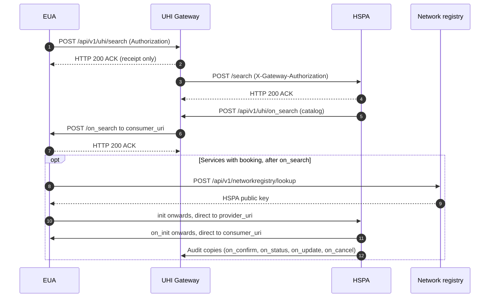

# Routes through the UHI network

A [UHI](/docs/uhi/v1/getting-started/glossary#uhi) call takes one of two routes. Discovery goes through the [UHI Gateway](/docs/uhi/v1/getting-started/glossary#uhi-gateway). Booking goes [direct](/docs/uhi/v1/getting-started/glossary#direct-call-p2p) between the [EUA](/docs/uhi/v1/getting-started/glossary#eua) and the [HSPA](/docs/uhi/v1/getting-started/glossary#hspa). After this page you will know which route each call takes, and which Gateway endpoint to call.

## In short

- `search` goes to the Gateway, which broadcasts it to every HSPA registered for the `context.domain`.
- Each HSPA sends `on_search` back to the Gateway, which relays it to the EUA's `consumer_uri`.
- From `init` onwards, the EUA and the HSPA call each other directly. The Gateway never sees these calls.
- A Physical Consultation HSPA sends the Gateway an [audit copy](/docs/uhi/v1/getting-started/glossary#audit-copy) of each direct callback that changes an order.

## The whole exchange {/* #the-whole-exchange */}

Steps 1 to 7 apply to every service. The optional block applies to Physical Consultation, with audit copies, and to Ambulance Booking, for `init` and `on_init` only.

## Through the Gateway {/* #through-the-gateway */}

Discovery is the only stage the Gateway routes.

1. The EUA signs a `search` and sends it to `POST /api/v1/uhi/search`.
2. The Gateway checks the signature and replies with an `ACK`.
3. The Gateway adds its own `X-Gateway-Authorization` signature and sends the search to every HSPA registered for the `context.domain`.
4. Each HSPA sends its catalog to `POST /api/v1/uhi/on_search`.
5. The Gateway relays each `on_search` to the EUA's `consumer_uri`.

Several HSPAs can answer one search. See [Messages and callbacks](/docs/uhi/v1/concepts/messages#timeouts) for how long to wait.

<AgentOnly>
**What happens.** An EUA sends `search` to `POST /api/v1/uhi/search` and receives every `on_search` on its `consumer_uri`. An HSPA answers a forwarded `search` with an `ACK`, then sends its catalog to `POST /api/v1/uhi/on_search`, never to the EUA.

**When it goes wrong.** An HSPA that checks `Authorization` on a forwarded search finds the Gateway's `X-Gateway-Authorization` instead. Check the header the route carries.
</AgentOnly>

## Direct between EUA and HSPA {/* #direct-between-eua-and-hspa */}

From `init` onwards, the EUA and the HSPA talk directly.

- **The EUA** sends to the HSPA's `provider_uri`, which arrives in the `context` of the HSPA's `on_search`.
- **The HSPA** sends its callbacks to the EUA's `consumer_uri`.
- **Each side** signs with its own `Authorization` header. The receiver fetches the sender's key with the [network registry lookup](/docs/uhi/v1/concepts/registry-lookup).

Physical Consultation's second search, for a chosen doctor's slots, also goes direct to the HSPA. Its `on_search` comes back with the HSPA's `Authorization` header, not the Gateway's.

<AgentOnly>
**Before you start.** The HSPA's `provider_uri` from the `context` of the `on_search` the patient chose, and the HSPA's key from the network registry lookup.

**What happens.** Send `init` and every later call to `provider_uri`, signed with your own `Authorization`. The Gateway has no endpoint for these calls.

**When it goes wrong.** A booking call sent to the Gateway base URL has no endpoint to reach. A direct callback checked against the Gateway's key fails: check it against the sender's key.
</AgentOnly>

## Audit copies {/* #audit-copies */}

The Gateway does not see a direct call. A Physical Consultation HSPA therefore sends the Gateway an exact copy of four callbacks, as well as sending each one to the EUA.

| Callback to the EUA | Audit copy to the Gateway |
| --- | --- |
| `on_confirm` | `POST /api/v1/uhi/on_confirm_audit` |
| `on_status` | `POST /api/v1/uhi/on_status_audit` |
| `on_update` | `POST /api/v1/uhi/on_update_audit`, including the care context ID |
| `on_cancel` | `POST /api/v1/uhi/on_cancel_audit` |

<AgentOnly>
**Before you start.** Your system is a Physical Consultation HSPA. No other service sends audit copies.

**What happens.** After each `on_confirm`, `on_status`, `on_update` or `on_cancel` to the EUA, send the same body to the matching audit endpoint. Sign it as you sign every outbound call.

**How you know it worked.** Every one of the four callbacks your HSPA sends has a matching audit call with an identical body.

**When it goes wrong.** A body edited between the callback and its copy is not an exact copy. An `on_update` copy without the care context ID is incomplete.
</AgentOnly>

## Gateway endpoints

| Endpoint | Called by | What it does |
| --- | --- | --- |
| `POST /api/v1/uhi/search` | EUA | Broadcasts your search to every HSPA in the domain, adding the Gateway's signature |
| `POST /api/v1/uhi/on_search` | HSPA | Forwards the catalog to the originating EUA's `consumer_uri` |
| `POST /api/v1/uhi/on_confirm_audit` | HSPA, Physical Consultation | Receives an exact copy of `on_confirm` |
| `POST /api/v1/uhi/on_status_audit` | HSPA, Physical Consultation | Receives an exact copy of `on_status` |
| `POST /api/v1/uhi/on_update_audit` | HSPA, Physical Consultation | Receives an exact copy of `on_update`, including the care context ID |
| `POST /api/v1/uhi/on_cancel_audit` | HSPA, Physical Consultation | Receives an exact copy of `on_cancel` |
| `POST /api/v1/networkregistry/lookup` | EUA or HSPA | Returns another participant's public key and details, so you can check its signature |

## Base URLs

| Environment | Gateway base URL |
| --- | --- |
| Sandbox | `https://uhigatewaysandbox.abdm.gov.in` |
| Production | `https://uhigateway.abdm.gov.in` |

A third host, `https://uhigatewaybeta.abdm.gov.in`, is for use only when asked at onboarding.

The sandbox also runs a reference EUA at `http://uhieuasandbox.abdm.gov.in/api/v1/euaService` and a reference HSPA at `https://hspasbx.abdm.gov.in/api/v1/hspa`. In production you use your own endpoints.

## Next steps

- [Messages and callbacks](/docs/uhi/v1/concepts/messages): the `context` block and the `ACK`.
- [Signing](/docs/uhi/v1/concepts/signing): the headers on each route.
- [UHI API reference](/docs/uhi/v1/api): every call, by service, one page each.
- [Physical Consultation reference](/docs/uhi/v1/api/consultation): the direct calls and audit copies.
