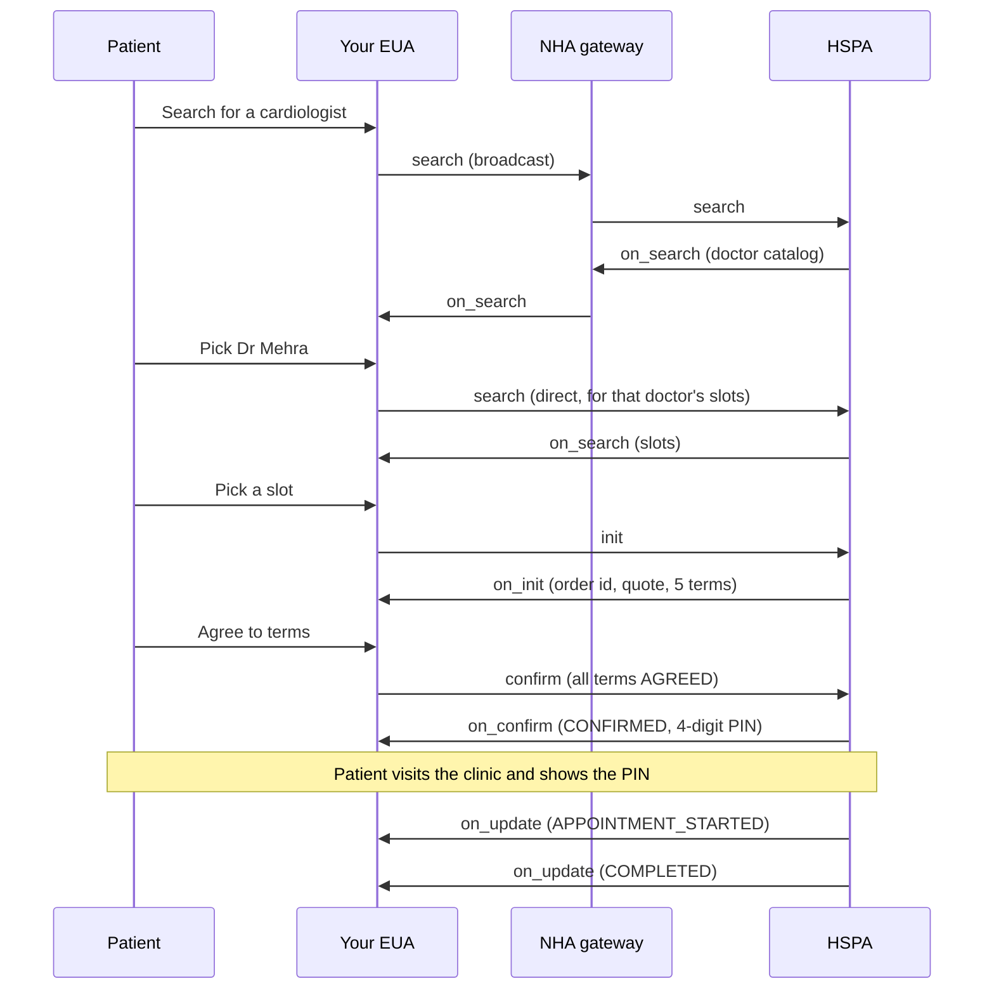

# Physical consultation

Physical consultation is the fullest service on [UHI](/docs/uhi/v1/getting-started/glossary#uhi). A patient searches for a doctor, then sees real slots and fees from clinics they have no prior relationship with. They book one, and receive a 4-digit PIN to present at the clinic. After this page you will know the four stages, the endpoints each role exposes, and the fields on every call, as [NHA](/docs/uhi/v1/getting-started/glossary#nha) documents them.

Read [UHI services](/docs/uhi/v1) first, for the `context` block, the acknowledgement model, signing and the two transports.

## Where this service stands

NHA describes the full consultation lifecycle as the first phase, live and open for onboarding. Online payment and refunds are the second phase, described as in ideation. Today the only payment model is pay on visit.

## Service identity

Every call in this service carries these fixed values.

| Field | Value |
| --- | --- |
| `context.domain` | `nic2004:85111` |
| `context.core_version` | `0.7.1` |
| `message.intent.fulfillment.type` | `Physical` (case sensitive) |
| `message.intent.item.descriptor.code` | `Consultation` |
| `message.intent.item.descriptor.name` | `Consultation` |

## Who is involved

| Actor | Role here |
| --- | --- |
| [EUA](/docs/uhi/v1/getting-started/glossary#eua) | The patient facing app. Searches, books, shows the PIN and the status. |
| [HSPA](/docs/uhi/v1/getting-started/glossary#hspa) | The provider platform. Holds doctor profiles and slots, confirms bookings, generates the PIN, drives the lifecycle. |
| HSP | The hospital, clinic or doctor. The HSPA is its digital interface. |
| [Gateway](/docs/uhi/v1/getting-started/glossary#gateway) | NHA's routing layer. Involved in discovery only. |
| NHA | Network operator. Governs onboarding, compliance and the protocol. |

## The flow end to end



## Stage by stage

| Stage | Calls | Transport |
| --- | --- | --- |
| 1. Discovery | `search` and `on_search`, twice | First pair via the gateway, second pair direct |
| 2. Booking | `init`, `on_init`, `confirm`, `on_confirm` | Direct |
| 3. Fulfilment | `status`, `on_status`, `on_update` | Direct |
| 4. Post-fulfilment | `cancel`, `on_cancel`, `on_message` | Direct |

## Endpoints you expose

An HSPA exposes these. Everything except the first `search` is called by an EUA directly.

| Endpoint | Called by | What you do |
| --- | --- | --- |
| `/search` (first) | Gateway broadcast, with `X-Gateway-Authorization` | Query your doctor catalog, answer via `on_search` |
| `/search` (second) | EUA, direct | Return slots for the selected doctor |
| `/init` | EUA, direct | Hold the slot, answer with terms via `on_init` |
| `/confirm` | EUA, direct | Confirm the appointment, return the PIN via `on_confirm` |
| `/status` | EUA, direct | Return the current order state via `on_status` |
| `/cancel` | EUA, direct | Process the cancellation, answer via `on_cancel` |
| `/on_update` | EUA, direct | Receive a `DOCTOR_NO_SHOW` state from the EUA |
| `/on_message` | EUA, direct | Receive a chat message or file from the patient |

An EUA exposes these. Everything except the first `on_search` is called by the HSPA directly.

| Endpoint | Called by | What you do |
| --- | --- | --- |
| `/on_search` (first) | Gateway, with `X-Gateway-Authorization` | Aggregate catalogs, store each `provider_uri` |
| `/on_search` (second) | HSPA, direct | Show the slots for the chosen doctor |
| `/on_init` | HSPA, direct | Show all terms to the patient, store `order.id` |
| `/on_confirm` | HSPA, direct | Show the PIN, store the order |
| `/on_status` | HSPA, direct | Replace your stored order state |
| `/on_update` | HSPA, direct | Update state and notify the patient |
| `/on_cancel` | HSPA, direct | Mark the appointment cancelled |
| `/on_message` | HSPA, direct | Show the message from the provider. NHA marks this mandatory for an EUA |

## Stage 1: discovery

### First search, broadcast

Your EUA posts to the gateway. The gateway validates your signature and the domain, then forwards to every registered HSPA in that domain. Search filters go in `message.intent`.

```http
POST https://uhigatewaysandbox.abdm.gov.in/api/v1/uhi/search
```


| Field | Type | Required | What it is |
| --- | --- | --- | --- |
| `fulfillment.type` | string | Yes | `Physical`. Case sensitive |
| `fulfillment.agent.name` | string | No | Doctor name, for a name search |
| `fulfillment.agent.id` | string | No | Doctor [HPR](/docs/uhi/v1/getting-started/glossary#hpr) address, for example `drmehra@hpr.ndhm` |
| `fulfillment.start.time.timestamp` | datetime | Yes | Start of the search window |
| `fulfillment.end.time.timestamp` | datetime | Yes | End of the search window |
| `item.descriptor.code` | string | Yes | `Consultation` |
| `item.descriptor.name` | string | Yes | `Consultation` |
| `category.descriptor.code` | string | No | Speciality code, for example `CARDIOLOGY` |
| `category.descriptor.name` | string | No | Speciality name, for example `Cardiology` |
| `location.gps` | string | Conditional | `latitude,longitude` for a proximity search |
| `location.radius.type` | string | Conditional | `CONSTANT` when using GPS |
| `location.radius.value` | string | Conditional | Radius in km, for example `"10"` |
| `location.radius.unit` | string | Conditional | `km` |
| `location.city.name` | string | No | City name |
| `location.city.code` | string | No | City STD code |
| `address.area_code` | string | No | 6-digit pincode |
| `provider.descriptor.name` | string | No | Facility name |
| `provider.id` | string | No | Provider ID, used in the second search |

A search by state and district, from NHA's document:

```json
{
  "context": {
    "action": "search",
    "city": "std:011",
    "consumer_id": "<YOUR_EUA_ID_FROM_NHA_ONBOARDING>",
    "consumer_uri": "<YOUR_HTTPS_CALLBACK_URL>",
    "core_version": "0.7.1",
    "country": "IND",
    "domain": "nic2004:85111",
    "message_id": "e9a19230-f951-11ec-b135-53aea776f66b",
    "timestamp": "2026-06-18T06:52:13.969464Z",
    "transaction_id": "e9a19230-f951-11ec-b135-53aea776f66b"
  },
  "message": {
    "intent": {
      "fulfillment": {
        "type": "Physical",
        "start": { "time": { "timestamp": "2026-06-18T10:37:32" } },
        "end": { "time": { "timestamp": "2026-06-18T23:59:59" } }
      },
      "item": {
        "descriptor": { "code": "Consultation", "name": "Consultation" }
      },
      "location": {
        "state": { "name": "MAHARASHTRA", "code": "27" },
        "district": { "name": "PUNE", "code": "490" }
      }
    }
  }
}
```

Three warnings NHA prints against this call:

- A GPS search needs all three radius fields. Omit any one and the GPS filter is ignored without an error.
- The `transaction_id` in `search` must match the one in the `on_search` that answers it, or you cannot correlate the response.
- More filter combinations exist. NHA's Swagger spec is the list.

### First on_search, the catalog

Each matching HSPA answers independently, so you receive several. Aggregate them on `transaction_id`.

| Field | Required | What it is |
| --- | --- | --- |
| `context.provider_uri` | Yes | The HSPA base URL. Store this. Every later call goes here |
| `message.catalog.descriptor.name` | Yes | HSPA name |
| `catalog.providers[].id` | Yes | Provider or hospital ID within this HSPA |
| `catalog.providers[].descriptor.name` | Yes | Hospital or clinic name |
| `catalog.providers[].categories[].descriptor.name` | Yes | Speciality name |
| `catalog.providers[].categories[].descriptor.code` | Yes | Speciality code |
| `catalog.providers[].fulfillments[].id` | Yes | Slot UUID. This becomes `fulfillment.id` in `init` |
| `catalog.providers[].fulfillments[].type` | Yes | `Physical` |
| `catalog.providers[].fulfillments[].agent.id` | Yes | Doctor HPR ID |
| `catalog.providers[].fulfillments[].agent.name` | Yes | Doctor's registered name |
| `catalog.providers[].fulfillments[].agent.gender` | No | `M` or `F` |
| `catalog.providers[].fulfillments[].agent.tags` | No | `@abdm/gov.in/experience`, `/languages`, `/education`, `/hpr_id`, `/hfr_id`, `/hip_id` |
| `catalog.providers[].fulfillments[].start.time.timestamp` | Yes | Slot start |
| `catalog.providers[].fulfillments[].end.time.timestamp` | Yes | Slot end |
| `catalog.providers[].items[].id` | Yes | Item ID. This becomes `order.item.id` in `init` |
| `catalog.providers[].items[].price.value` | Yes | Fee in INR, as a decimal string |
| `catalog.providers[].items[].fulfillment_id` | Yes | Links the item to its slot |
| `catalog.providers[].location.gps` | No | Provider coordinates |
| `catalog.providers[].location.address` | No | Provider street address |

Trimmed to one provider, from NHA's document:

```json
{
  "context": {
    "domain": "nic2004:85111",
    "action": "on_search",
    "consumer_id": "<YOUR_EUA_ID_FROM_NHA_ONBOARDING>",
    "provider_id": "hspa-nha",
    "provider_uri": "https://hspasbx.abdm.gov.in/api/v1/hspa",
    "transaction_id": "a1b2c3d4-f951-11ec-b135-53aea776f66b",
    "message_id": "b2c3d4e5-f951-11ec-b135-53aea776f66b"
  },
  "message": {
    "catalog": {
      "descriptor": { "name": "ABDM Reference HSPA" },
      "providers": [
        {
          "id": "1",
          "descriptor": { "name": "Safdarjung Medical Centre" },
          "categories": [
            { "id": "201", "parent_category_id": "101", "descriptor": { "name": "Cardiology", "code": "CARDIOLOGY" } },
            { "id": "101", "descriptor": { "name": "Allopathy", "code": "ALLOPATHY" } }
          ],
          "fulfillments": [
            {
              "id": "slot-uuid-a1b2c3d4-abcd-1234-efgh-567890abcdef",
              "type": "Physical",
              "agent": {
                "id": "priyamehra@hpr.ndhm",
                "name": "Dr. Priya Mehra",
                "gender": "F",
                "tags": {
                  "@abdm/gov.in/experience": "8.0",
                  "@abdm/gov.in/languages": "Hindi, English",
                  "@abdm/gov.in/education": "MBBS, MD Cardiology",
                  "@abdm/gov.in/hpr_id": "73-5232-1888-8686"
                }
              },
              "start": { "time": { "timestamp": "2026-04-16T10:00:00" } },
              "end": { "time": { "timestamp": "2026-04-16T10:20:00" } }
            }
          ],
          "items": [
            {
              "id": "0",
              "descriptor": { "name": "Consultation", "code": "CONSULTATION" },
              "price": { "currency": "INR", "value": "500.0" },
              "fulfillment_id": "slot-uuid-a1b2c3d4-abcd-1234-efgh-567890abcdef"
            }
          ],
          "location": {
            "gps": "28.635308,77.224960",
            "address": "Safdarjung Enclave, New Delhi 110029",
            "city": { "name": "Delhi", "code": "011" }
          }
        }
      ]
    }
  }
}
```

NHA asks HSPAs to send the full `agent.tags` set including `@abdm/gov.in/hip_id`. That ID is what lets records generated at the visit be pulled later.

### Second search, direct

After the patient picks a doctor, your EUA sends a second `search` straight to the HSPA's `provider_uri`, asking for that doctor's slots in a time window. It carries `provider_id` and `provider_uri` in the context, and echoes the `provider`, `fulfillments` and `items` blocks from the first `on_search`. The HSPA answers with a second `on_search` scoped to that doctor.

## Stage 2: booking

### init

Direct to the HSPA. You send the patient's details and the chosen slot. The HSPA holds the slot temporarily.

| Field | Required | What it is |
| --- | --- | --- |
| `order.provider.id` | Yes | Provider ID from the catalog |
| `order.item.id` | Yes | Item ID from the catalog |
| `order.item.descriptor.code` | Yes | `Consultation` |
| `order.item.descriptor.name` | Yes | `Consultation` |
| `order.item.price.currency` | No | `INR` |
| `order.item.price.value` | No | Fee as a decimal string |
| `order.item.fulfillment_id` | Yes | Slot UUID from the catalog |
| `order.fulfillment.id` | Yes | The same slot UUID |
| `order.fulfillment.type` | Yes | `Physical` |
| `order.fulfillment.agent.id` | Yes | Doctor HPR ID |
| `order.fulfillment.agent.name` | Yes | Doctor's registered name |
| `order.fulfillment.start.time.timestamp` | Yes | Slot start |
| `order.fulfillment.end.time.timestamp` | Yes | Slot end |
| `order.fulfillment.tags` | Conditional | `@abdm/gov.in/slot_id` is mandatory and holds the slot UUID |
| `order.billing.name` | Yes | Patient billing name |
| `order.billing.address` | Yes | Object with `door`, `name`, `locality`, `city`, `state`, `country`, `area_code` |
| `order.billing.phone` | Yes | 10-digit contact number |
| `order.billing.email` | No | Patient email |
| `order.customer.id` | Yes | Patient [ABHA](/docs/uhi/v1/getting-started/glossary#abha) address, for example `rahul.k001@sbx` |
| `order.customer.person.gender` | No | `M` or `F` |
| `order.customer.person.dob` | No | `YYYY-MM-DD` |
| `order.payment.type` | Yes | `ON-ORDER` for pay on visit. Other values: `PRE-FULFILLMENT`, `ON-FULFILLMENT` |
| `order.payment.params.redirect_url` | No | Payment callback URL |

```json
{
  "context": {
    "domain": "nic2004:85111",
    "country": "IND",
    "city": "std:011",
    "action": "init",
    "core_version": "0.7.1",
    "consumer_id": "<YOUR_EUA_ID_FROM_NHA_ONBOARDING>",
    "consumer_uri": "<YOUR_HTTPS_CALLBACK_URL>",
    "provider_id": "hspa-nha",
    "provider_uri": "https://hspasbx.abdm.gov.in/api/v1/hspa",
    "transaction_id": "a1b2c3d4-f951-11ec-b135-53aea776f66b",
    "message_id": "d4e5f6a7-32af-11ef-bcbe-590b07ce8c90",
    "timestamp": "2026-04-15T09:10:00Z"
  },
  "message": {
    "order": {
      "provider": { "id": "1" },
      "item": {
        "id": "0",
        "descriptor": { "name": "Consultation", "code": "CONSULTATION" },
        "price": { "currency": "INR", "value": "500.0" },
        "fulfillment_id": "slot-uuid-a1b2c3d4-abcd-1234-efgh-567890abcdef"
      },
      "fulfillment": {
        "id": "slot-uuid-a1b2c3d4-abcd-1234-efgh-567890abcdef",
        "type": "Physical",
        "agent": { "id": "priyamehra@hpr.ndhm", "name": "Dr. Priya Mehra" },
        "start": { "time": { "timestamp": "2026-04-16T10:00:00" } },
        "end": { "time": { "timestamp": "2026-04-16T10:20:00" } }
      },
      "billing": {
        "name": "Rahul Kumar Sharma",
        "address": {
          "door": "B-204",
          "name": "Rahul Kumar Sharma",
          "locality": "Rohini Sector 14",
          "city": "Delhi",
          "state": "Delhi",
          "country": "INDIA",
          "area_code": "110085"
        },
        "phone": "9876543210",
        "email": "rahul.sharma@email.com"
      },
      "customer": {
        "id": "rahul.k001@sbx",
        "person": { "gender": "M", "dob": "1990-05-15", "dayOfBirth": 15, "monthOfBirth": 5, "yearOfBirth": 1990 }
      },
      "payment": {
        "type": "ON-ORDER",
        "params": { "redirect_url": "<YOUR_PAYMENT_REDIRECT_URL>" }
      }
    }
  }
}
```

Two things NHA warns about:

- `fulfillment.id` must be exactly the slot UUID from `on_search`. A mismatch makes the HSPA reject the call or fail to hold the slot without telling you.
- The hold is short. NHA gives 15 minutes as a typical window. If `confirm` does not arrive in time the slot is released and you start again at `init`.

### on_init, the terms

The HSPA answers with the order ID, an itemised quote, and five term objects the patient has to accept.

| Field added by the HSPA | What it is |
| --- | --- |
| `order.id` | The HSPA's order ID, generated here. Send it in every later call. NHA recommends an alphanumeric string, for example `AHS12345` |
| `order.terms[]` | Five term objects, each with `termsState: "INITIATED"` |
| `order.quote` | Price breakup: consultation, SGST, CGST, registration |
| `order.payment.type` | `ON-ORDER`, `FREE` or `PRE-ORDER` |
| `order.payment.status` | `NOT_PAID` or `FREE` |

Each term object:

| Field | Required | What it is |
| --- | --- | --- |
| `terms[].type` | Yes | `Commercial`, `Settlement`, `Cancellation`, `Refund` or `Payment` |
| `terms[].descriptor.name` | Yes | Term title |
| `terms[].descriptor.short_desc` | No | Brief description |
| `terms[].descriptor.long_desc` | No | Full text. Show this to the patient |
| `terms[].reasonRequired` | Yes | If true, a reason is needed when this term is actioned |
| `terms[].timePeriod` | Yes | Validity. Copy unchanged into `confirm` |
| `terms[].reason` | Conditional | Required in `confirm` when `reasonRequired` is true |
| `terms[].termsState` | Yes | `INITIATED` here. You set `AGREED` in `confirm` |

Store every term object exactly as received. Change only `termsState`, and `reason` where it is required.

### confirm

Send the whole order back with every term at `AGREED`. Any term still at `INITIATED` and the HSPA rejects the call. Use the `order.id` the HSPA assigned in `on_init`, not any ID you generated.

### on_confirm, the PIN

The HSPA sets `order.state` to `CONFIRMED` and returns a 4-digit PIN.

| Field | What it is |
| --- | --- |
| `order.state` | `CONFIRMED`, or `FAILED` on a payment or system error |
| `order.id` | The HSPA's order ID |
| `order.authorization.type` | `PIN` |
| `order.authorization.token` | The 4-digit PIN |
| `order.authorization.valid_from` | PIN validity start |
| `order.authorization.valid_to` | PIN validity end, usually end of the appointment day |
| `order.authorization.status` | `GENERATED` here |
| `order.fulfillment.tags.@abdm/gov.in/slot_id` | The confirmed slot UUID |

```json
{
  "authorization": {
    "type": "PIN",
    "token": "3774",
    "valid_from": "2026-06-18T00:00:00",
    "valid_to": "2026-06-18T23:59:00",
    "status": "GENERATED"
  }
}
```

NHA treats the PIN as security-sensitive. Hold it in memory or secure session storage on the EUA. Do not write it to a database or to application logs.

The HSPA has two more obligations here. It sends an exact copy of the `on_confirm` payload to the gateway audit endpoint listed under [gateway endpoints](#gateway-endpoints), and it sets the communication tags on the fulfilment:

```json
{
  "tags": {
    "@abdm/gov.in/slot_id": "79db6b5b-afe4-4297-b9b1-5148ed45372c",
    "@abdm/gov.in/messaging_support": "true",
    "@abdm/gov.in/deep_link": "",
    "@abdm/gov.in/helpline_number": "",
    "@abdm/gov.in/chatbot_link": ""
  }
}
```

NHA marks `messaging_support` and a helpline number as mandatory in `on_confirm`.

## Stage 3: fulfilment

### status and on_status

`status` carries only `order.id`. The HSPA answers with the full order object, and you replace your stored state with it. NHA describes this as reconciliation, not a polling loop.

### Order states

| State | Set by | Meaning |
| --- | --- | --- |
| `CONFIRMED` | HSPA, in `on_confirm` | Booked. PIN generated |
| `APPOINTMENT_STARTED` | HSPA, in `on_update` | The doctor has begun the consultation |
| `COMPLETED` | HSPA, in `on_update` | The doctor has marked the consultation complete |
| `CANCELLED` | HSPA or EUA | Cancelled under the agreed terms |
| `NO_SHOW` | HSPA, in `on_update` | The patient did not appear |
| `DOCTOR_NO_SHOW` | EUA, in `on_update` to the HSPA | The doctor did not appear |
| `FAILED` | HSPA, in `on_confirm` | Payment or system failure at confirmation |

`DOCTOR_NO_SHOW` is the only state an EUA may set. Everything else is the HSPA's.

### PIN states

| State | Meaning |
| --- | --- |
| `GENERATED` | Set when the PIN is created at confirmation |
| `VERIFIED` | The provider checked the PIN before the consultation |
| `HSPA_OVERRIDE` | The PIN was not checked and the HSPA overrode the check |

### on_update

The HSPA pushes state changes to your `/on_update` as they happen. This is the main real-time channel, not `status`. Update your local state and notify the patient.

## Stage 4: post-fulfilment

### cancel and on_cancel

| Field | Required | What it is |
| --- | --- | --- |
| `order.id` | Yes | The order to cancel |
| `order.state` | Yes | `CANCELLED` |
| `order.fulfillment.tags.@abdm/gov.in/cancelledby` | Yes | `patient` or `doctor` |

```json
{
  "message": {
    "order": {
      "id": "0415-234567-8901",
      "state": "CANCELLED",
      "fulfillment": {
        "tags": { "@abdm/gov.in/cancelledby": "patient" }
      }
    }
  }
}
```

The `cancelledby` tag is mandatory. Without it the HSPA cannot tell which set of cancellation terms applies.

Your `/on_cancel` handler has to cope with both directions: the HSPA's acknowledgement of a patient cancellation, and an HSPA-initiated cancellation when a doctor cancels. Read the `cancelledby` tag to tell them apart.

### on_message

Optional for an HSPA, mandatory for an EUA. Both sides consume the same shape. Content sits under `message.intent.chat`.

| Field | Required | What it is |
| --- | --- | --- |
| `chat.sender.person.id` | Yes | ABHA address of the sender, or HPR ID when the doctor sends |
| `chat.sender.person.name` | Yes | Sender's name |
| `chat.receiver.person.id` | Yes | HPR ID of the doctor, or ABHA address of the patient |
| `chat.receiver.person.name` | Yes | Receiver's name |
| `chat.content.content_id` | Yes | UUID for this message |
| `chat.content.content_value` | Yes | Base64-encoded text or file |
| `chat.content.content_type` | Yes | `text` or `media` |
| `chat.content.content_mimeType` | Conditional | MIME type when `content_type` is `media` |
| `chat.content.content_fileName` | Conditional | File name when `content_type` is `media` |
| `chat.content.hiType` | Conditional | Health information type, for example `prescription`, `labReport` |
| `chat.time.timestamp` | Yes | Message time |

## Gateway endpoints

You do not build these. NHA operates them.

| Endpoint | Called by | Purpose |
| --- | --- | --- |
| `POST /api/v1/uhi/search` | EUA | Broadcast a search to all registered HSPAs |
| `POST /api/v1/uhi/on_search` | HSPA | Deliver a catalog, which the gateway forwards to the EUA |
| `POST /api/v1/uhi/on_confirm_audit` | HSPA | Exact copy of every `on_confirm` |
| `POST /api/v1/uhi/on_update_audit` | HSPA | Exact copy of every `on_update`. The care context ID goes here |
| `POST /api/v1/uhi/on_cancel_audit` | HSPA | Exact copy of every `on_cancel` |
| `POST /api/v1/uhi/on_status_audit` | HSPA | Exact copy of every `on_status` |
| `POST /api/v1/networkregistry/lookup` | Either | Look up a counterparty's public key |

The audit copies are an HSPA obligation for compliance traceability, not optional.

## Cancellation reason codes

NHA fixes the reason codes. You choose the labels your users see.

### Patient-initiated, sent in `cancel` with `cancelledby: patient`

| Code | Meaning |
| --- | --- |
| `PATIENT_PERSONAL_EMERGENCY` | Patient or family emergency |
| `PATIENT_HEALTH_IMPROVED` | Condition resolved, consultation no longer needed |
| `PATIENT_UNABLE_TO_VISIT_PHYSICALLY` | Scheduling conflict or inability to reach the facility |
| `DOCTOR_ASKED_TO_CANCEL` | The doctor asked the patient to cancel |
| `PATIENT_BOOKED_IN_ERROR` | Wrong doctor, speciality, date or time |
| `PATIENT_SEEKING_ALTERNATIVE` | Patient has decided to see someone else |
| `PATIENT_OTHER` | Anything else. Your EUA must capture free text |

### Doctor or facility-initiated, sent in `on_cancel` with `cancelledby: doctor`

| Code | Meaning |
| --- | --- |
| `DOCTOR_PERSONAL_EMERGENCY` | Unplanned personal or medical emergency |
| `DOCTOR_UNAVAILABLE` | Unexpected surgery, patient emergency or high footfall |
| `DOCTOR_SCHEDULE_CHANGE` | Session timings changed |
| `FACILITY_CLOSURE` | Facility temporarily closed |
| `TECHNICAL_SYSTEM_ISSUE` | HSPA platform failure or downtime |
| `DOCTOR_OTHER` | Anything else. The HSPA must provide free text |

### PIN override, used by facility staff

| Code | When it applies |
| --- | --- |
| `OVERRIDE_EMERGENCY_CONSULTATION` | Patient arrives in acute distress |
| `OVERRIDE_PIN_TECH_FAILURE` | The app cannot show the PIN. Identity verified another way |
| `OVERRIDE_PIN_DELIVERY_FAILURE` | The PIN never reached the patient |
| `OVERRIDE_VULNERABLE_PATIENT` | Elderly, differently-abled or low digital literacy patient |
| `OVERRIDE_EUA_OUTAGE` | The EUA platform is down |
| `OVERRIDE_MISMATCH` | PIN could not be validated after three attempts |
| `OVERRIDE_OTHER` | Anything else. The HSPA must provide free text |

## Terms and conditions text

The `on_init` terms array carries the text the patient reads before confirming. NHA publishes sample clauses in section 9 of its document. Two points carry through all of them.

- UHI is a technology gateway. It does not supervise providers, does not guarantee outcomes, and does not collect, hold or route any payment.
- Every payment, refund, cancellation charge and pricing dispute is between the patient and the facility.

## What is missing here

- NHA's document contains architecture and sequence diagrams as images. Those did not convert and are not reproduced.
- The complete order field reference in NHA's document is longer than the tables here. Use NHA's [Swagger spec](https://uhigatewaysandbox.abdm.gov.in/swagger-ui/index.html?urls.primaryName=v2.0.2#/) for the full list.
- Error codes for this service are not enumerated in NHA's document. It gives only the shape of the error object: `type` and `code` are mandatory, `path` and `message` are optional. No code list is published, so we do not print one.

## Next

- [UHI services](/docs/uhi/v1) for the shared protocol
- [Ambulance booking](/docs/uhi/v1/concepts/services/ambulance-booking)
- [Blood bank](/docs/uhi/v1/concepts/services/blood-bank)
- [M2](/docs/hiecm/v3/api/m2), the prerequisite
- [Support](/docs/support)
